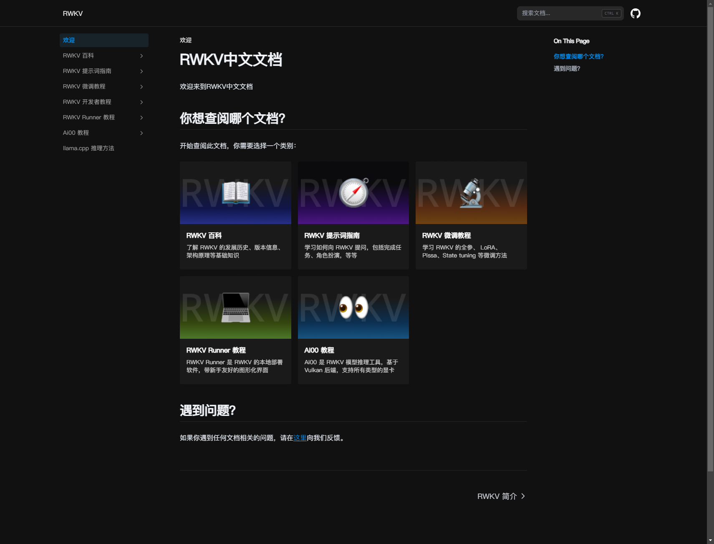

# RWKV.CN 文档

## 背景

- **Web 框架**：[Next.js](https://nextjs.org/) 14，用于构建 RWKV.CN 的前端架构。
- **文档框架**：[Nextra](https://nextra.site/docs/docs-theme/start)，快速搭建文档的解决方案。

## 本地启动

### 1. 克隆仓库

```bash
git clone https://xxxxsxx.git
cd rwkvcn-docs
```

### 2. 安装依赖

```bash
npm install
```

### 3. 启动服务

```bash
npm run dev
```

在浏览器中打开 `http://localhost:3000/docs`。

> [!IMPORTANT]
> 请注意访问 `http://localhost:3000/docs`，而不是 `http://localhost:3000/`。

## 修改文档

### 文档编辑

所有文档文件都保存在 `pages` 目录下。你可以直接前往该目录进行内容修改。

### 添加自定义组件

我们支持在 MDX 文件中引入自定义的 React 组件。你可以在 `components/docs/` 目录下创建新的组件，并在文档中引用它们。

> [!IMPORTANT]
> 所有新建组件请使用 TypeScript 编写。

### 添加新的首页卡片

如需修改或添加首页的卡片，请前往 `components/docs/card.tsx` 进行修改。卡片的封面图片请放置在 `public/images/` 目录下。

## 贡献指南

**❤️ 感谢并欢迎社区的贡献！❤️**

在提交 Pull Request (PR) 之前，请确保遵循以下规则：

### PR 规则

1. **提前创建 Issue**
   - 在提交 PR 之前，请务必创建一个相应的 Issue，说明你的问题或建议。
   - 在 PR 描述中引用 Issue 编号，如 `Fixes #123`，以关联相关问题。

2. **保持 PR 简洁**
   - 请保持每个 PR 聚焦于一个问题或功能。避免在一个 PR 中提交过多不相关的更改，以减少审查的复杂度。

3. **避免引入不必要的依赖**
   - 除非绝对必要，否则请不要引入新的依赖。如果你认为新的依赖是必需的，请在 PR 中详细说明原因，并在 Issue 中讨论可行性。

4. **同步更新文档**
   - 如果你的 PR 涉及功能变更或接口更新，请确保文档（如 `README.md` 或项目中的文档文件）也进行了相应的更新。

5. **确保构建通过**
   - 提交 PR 前，请确保项目通过了 Next.js 的 `build` 检查：
     ```bash
     npm run build
     ```

### 审查流程

- 提交 PR 后，维护者将进行审查，请及时响应审查意见。
- 审查通过后，PR 会合并到主分支。
- 主分支的更新将会自动同步至 [RWKV.CN/Docs](https://rwkv.cn/Docs)。

## 常见问题

- **Q: 修改文档后，左侧导航标签出现异常，点击后显示错误的文档**
  - 这通常发生在你修改了文档结构（如添加/删除文件）后。原因是 Nextra 没有正确处理 Next.js 的缓存机制。解决方法是删除 `.next` 文件夹，然后重新运行 `npm run dev`。

- **Q: 我可以安装新的依赖吗？**
  - 通常我们不会接受引入新依赖的 PR。如果你认为新依赖是必要的，请在 PR 中详细描述其必要性。
