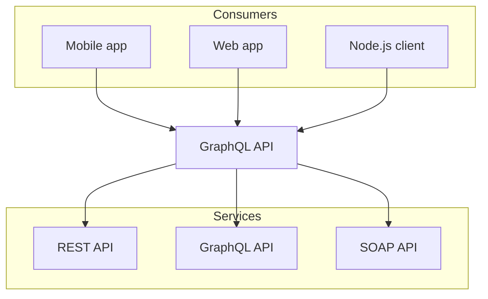
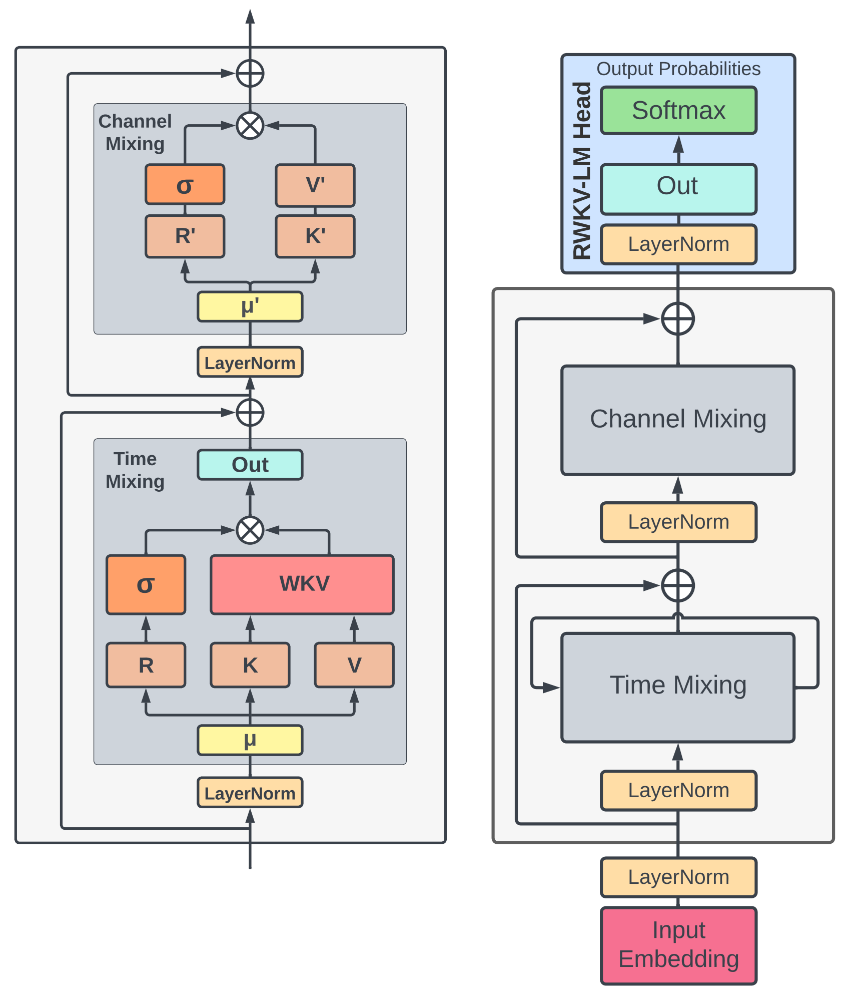

import React from 'react';
import { Accordion, Accordions } from 'fumadocs-ui/components/accordion';
import { File, Folder, Files } from 'fumadocs-ui/components/files';
import { Step, Steps } from 'fumadocs-ui/components/steps';
import { Tab, Tabs } from 'fumadocs-ui/components/tabs';
import { CardContainer } from '../../components-docs/card/card-container.tsx'
import { Card } from '../../components-docs/card/card.tsx'
import { PanelBottomDashed } from "lucide-react";
import { CallOut } from '../../components-docs/call-out/call-out.tsx'
import { TabsCN, TabsContentCN, TabsListCN, TabsTriggerCN } from "../../components-docs/tabs/tabs.tsx"
import { LinkCard, LinkCardContainer } from '../../components-docs/link-card/link-card.tsx'

# MDX

### Code

#### 代码块支持的语言高亮以及语言关键字

请在[fumadocs](https://fumadocs.vercel.app/docs/ui/components/dynamic-codeblock)查看支持的语言和关键字

点击第一个下拉框就可以看见支持的语言和关键字
<CallOut type="info" >
注意一些语言可能与你想想的不同

例如`Javascript`应该写为`js`
</CallOut>

#### 复制(copy)

代码块默认支持copy,你不需要,也不应该在语言关键字后面加`copy`


````mdx
```js 
const x = 1
function name(params) {
  x ++
}
```
````
```js 
const x = 1
function name(params) {
  x ++
}
```


### Math

````mdx
```math
c = \pm\sqrt{a^2 + b^2}
```
````

```math
c = \pm\sqrt{a^2 + b^2}
```

---

**Long equations example**

```math
\displaystyle {\begin{aligned}T_{f}(z)&=\sum _{k=0}^{\infty }{\frac {(z-c)^{k}}{2\pi i}}\int _{\gamma }{\frac {f(w)}{(w-c)^{k+1}}}\,dw\\&={\frac {1}{2\pi i}}\int _{\gamma }{\frac {f(w)}{w-c}}\sum _{k=0}^{\infty }\left({\frac {z-c}{w-c}}\right)^{k}\,dw\\&={\frac {1}{2\pi i}}\int _{\gamma }{\frac {f(w)}{w-c}}\left({\frac {1}{1-{\frac {z-c}{w-c}}}}\right)\,dw\\&={\frac {1}{2\pi i}}\int _{\gamma }{\frac {f(w)}{w-z}}\,dw=f(z),\end{aligned}}
```


### Mermaid

````mdx

````


# 组件

### Accordion

````mdx
import React from 'react';
import { Accordion, Accordions } from 'fumadocs-ui/components/accordion';


<Accordions type="single">
  <Accordion title="My Title">My Content</Accordion>
</Accordions>;

````

<Accordions type="single">
  <Accordion title="My Title">My Content</Accordion>
</Accordions>


### Files

````mdx
import { File, Folder, Files } from 'fumadocs-ui/components/files';

<Files>
  <Folder name="app" defaultOpen>
    <File name="layout.tsx" />
    <File name="page.tsx" />
    <File name="global.css" />
  </Folder>
  <Folder name="components">
    <File name="button.tsx" />
    <File name="tabs.tsx" />
    <File name="dialog.tsx" />
  </Folder>
  <File name="package.json" />
</Files>
````

<Files>
  <Folder name="app" defaultOpen>
    <File name="layout.tsx" />
    <File name="page.tsx" />
    <File name="global.css" />
  </Folder>
  <Folder name="components">
    <File name="button.tsx" />
    <File name="tabs.tsx" />
    <File name="dialog.tsx" />
  </Folder>
  <File name="package.json" />
</Files>


### Image Zoom

<Callout type="info">
图片放大已全局引用，正常使用图片md即可
</Callout>

````mdx


````


### Steps

````mdx
import { Step, Steps } from 'fumadocs-ui/components/steps';

<Steps>
<Step>
 
### Read the docs
 
</Step>
 
<Step>
 
### Make sure you had read the docs
 
</Step>
</Steps>
````


<Steps>
<Step>
 
### Read the docs
 
</Step>
 
<Step>
 
### Make sure you had read the docs
 
</Step>
</Steps>


### Tabs

````mdx
import { Tab, Tabs } from 'fumadocs-ui/components/tabs';

<Tabs items={['Javascript', 'Rust']}>
  <Tab value="Javascript">Javascript is weird</Tab>
  <Tab value="Rust">Rust is fast</Tab>
</Tabs>
````

<Tabs items={['Javascript', 'Rust']}>
  <Tab value="Javascript">Javascript is weird</Tab>
  <Tab value="Rust">Rust is fast</Tab>
</Tabs>


# 高级组件

### 卡片

````mdx
import { CardContainer } from '../../components-docs/card/card-container.tsx'
import { Card } from '../../components-docs/card/card.tsx'
import { PanelBottomDashed } from "lucide-react";

<CardContainer>
<Card image="color-1.png" icon={PanelBottomDashed} iconColor='text-red-500' title="关于 RWKV" description="了解 RWKV 的主要版本、模型和论文发布情况" link="/RWKV-Wiki/Introduction" />
<Card image="color-2.png" icon={PanelBottomDashed} iconColor='text-blue-500' title="关于 RWKV" description="了解 RWKV 的主要版本、模型和论文发布情况" link="/RWKV-Wiki/Introduction" />
<Card image="color-3.png" icon={PanelBottomDashed} iconColor='text-green-500' title="关于 RWKV" description="了解 RWKV 的主要版本、模型和论文发布情况" link="/RWKV-Wiki/Introduction" />
<Card image="color-4.png" icon={PanelBottomDashed} iconColor='text-yellow-500' title="关于 RWKV" description="了解 RWKV 的主要版本、模型和论文发布情况 的主要版本、模型和论文发布情况的主要版本、模型和论文发布情况" link="/RWKV-Wiki/Introduction" />
</CardContainer>
````


<CardContainer>
<Card image="color-1.png" icon={PanelBottomDashed} iconColor='text-red-500' title="关于 RWKV" description="了解 RWKV 的主要版本、模型和论文发布情况" link="/RWKV-Wiki/Introduction" />
<Card image="color-2.png" icon={PanelBottomDashed} iconColor='text-blue-500' title="关于 RWKV" description="了解 RWKV 的主要版本、模型和论文发布情况" link="/RWKV-Wiki/Introduction" />
<Card image="color-3.png" icon={PanelBottomDashed} iconColor='text-green-500' title="关于 RWKV" description="了解 RWKV 的主要版本、模型和论文发布情况" link="/RWKV-Wiki/Introduction" />
<Card image="color-4.png" icon={PanelBottomDashed} iconColor='text-yellow-500' title="关于 RWKV" description="了解 RWKV 的主要版本、模型和论文发布情况 的主要版本、模型和论文发布情况的主要版本、模型和论文发布情况" link="/RWKV-Wiki/Introduction" />
</CardContainer>


### 提示框

````mdx
import { CallOut } from '../../components-docs/call-out/call-out.tsx'

<CallOut type="info" >
this is a info callout

support markdown
</CallOut>
<CallOut type="warning" >
this is a warning callout

同样**支持 markdown**

字体为 15px
</CallOut>
<CallOut type="alert" >
this is a alert callout
</CallOut>
<CallOut type="error" >
this is a error callout
</CallOut>
````
<CallOut type="tips" >
this is a tips callout

support markdown
</CallOut>
<CallOut type="info" >
this is a info callout

support markdown
</CallOut>
<CallOut type="warning" >
this is a warning callout

同样**支持 markdown**

字体为 15px
</CallOut>
<CallOut type="alert" >
this is a alert callout
</CallOut>
<CallOut type="error" >
this is a error callout
</CallOut>


#### 内容嵌套

````mdx
import { CallOut } from '../../components-docs/call-out/call-out.tsx'

<CallOut type="info" >
**微调是什么?**

[this is a info callout](#)(Dimension-Sharding Adaptation)是一种新颖的参数高效微调方法(PEFT - Parameter-Efhcient Fine-Tuning)，旨在进一步降低可训练参数数量，同时加速收敛。

</CallOut>
````
<CallOut type="info" >
**微调是什么?**

[this is a info callout](#)(Dimension-Sharding Adaptation)是一种新颖的参数高效微调方法(PEFT - Parameter-Efhcient Fine-Tuning)，旨在进一步降低可训练参数数量，同时加速收敛。

</CallOut>


### Tabs
高级tabs，你可以在 `TabsContentCN` 中嵌套任何组件，例如 `CallOut` 和 `image`：

````mdx
import { TabsCN, TabsContentCN, TabsListCN, TabsTriggerCN } from "../../components-docs/tabs/tabs.tsx"

<TabsCN defaultValue="rwkv-4" className="">
  <TabsListCN>
    <TabsTriggerCN value="rwkv-4">RWKV-4</TabsTriggerCN>
    <TabsTriggerCN value="rwkv-3">RWKV-3</TabsTriggerCN>
  </TabsListCN>
  <TabsContentCN value="rwkv-4" >
  ### RWKV-4
  - fast
  - efficient
  - scalable
  </TabsContentCN>
  <TabsContentCN value="rwkv-3" >
  You can import any thing inside this `TabsContentCN`

  like `callout`:
 <CallOut type="info" >
this is a info callout
</CallOut>

  or images:

  

  </TabsContentCN>
</TabsCN>
````

<TabsCN defaultValue="rwkv-4" className="">
  <TabsListCN>
    <TabsTriggerCN value="rwkv-4">RWKV-4</TabsTriggerCN>
    <TabsTriggerCN value="rwkv-3">RWKV-3</TabsTriggerCN>
  </TabsListCN>
  <TabsContentCN value="rwkv-4" >

  - fast
  - efficient
  - scalable
  </TabsContentCN>
  <TabsContentCN value="rwkv-3" >
  You can import any thing inside this `TabsContentCN`

  like `callout`:
  <CallOut type="info" >
this is a info callout
</CallOut>

  or images:

  

  </TabsContentCN>
</TabsCN>


### Link Card


````mdx
import { LinkCard, LinkCardContainer } from '../../components-docs/link-card/link-card.tsx'

<LinkCardContainer>
  <LinkCard content="RWKV-4 模型 很长 很长的标题 很长 很长的 标题" link="/RWKV-Wiki/Introduction" />
  <LinkCard content="RWKV-4 模型" link="/RWKV-Wiki/Introduction" />
  <LinkCard content="RWKV-4 模型" link="/RWKV-Wiki/Introduction" />
  <LinkCard content="RWKV-4 模型" link="/RWKV-Wiki/Introduction" />
</LinkCardContainer>
````

<LinkCardContainer>
  <LinkCard content="RWKV-4 模型 很长 很长的标题 很长 很长的 标题" link="/RWKV-Wiki/Introduction" />
  <LinkCard content="RWKV-4 模型" link="/RWKV-Wiki/Introduction" />
  <LinkCard content="RWKV-4 模型" link="/RWKV-Wiki/Introduction" />
  <LinkCard content="RWKV-4 模型" link="/RWKV-Wiki/Introduction" />
</LinkCardContainer>