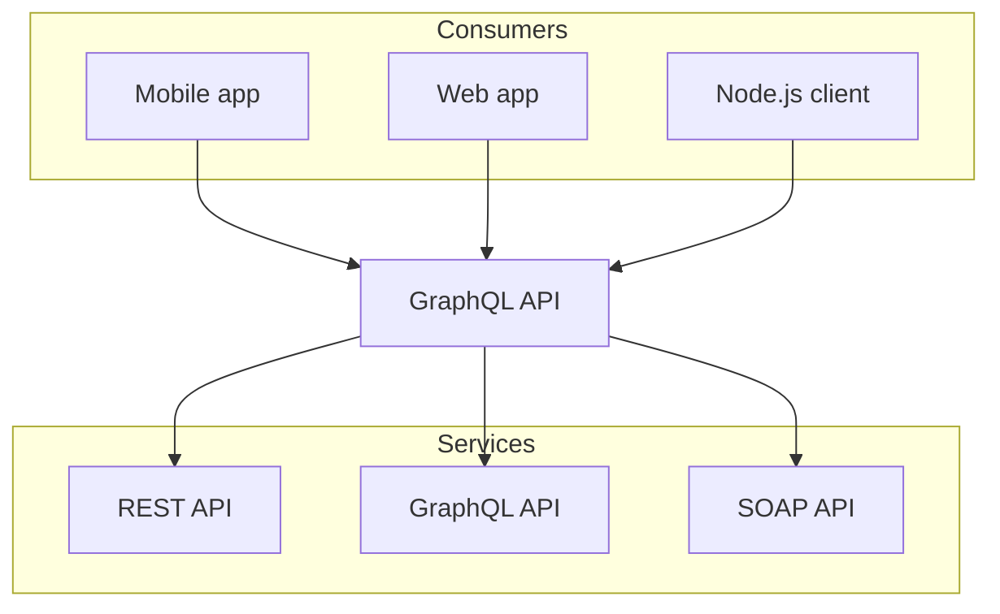
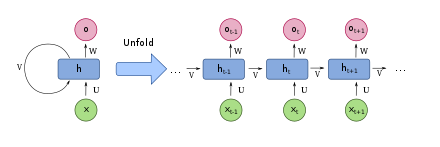
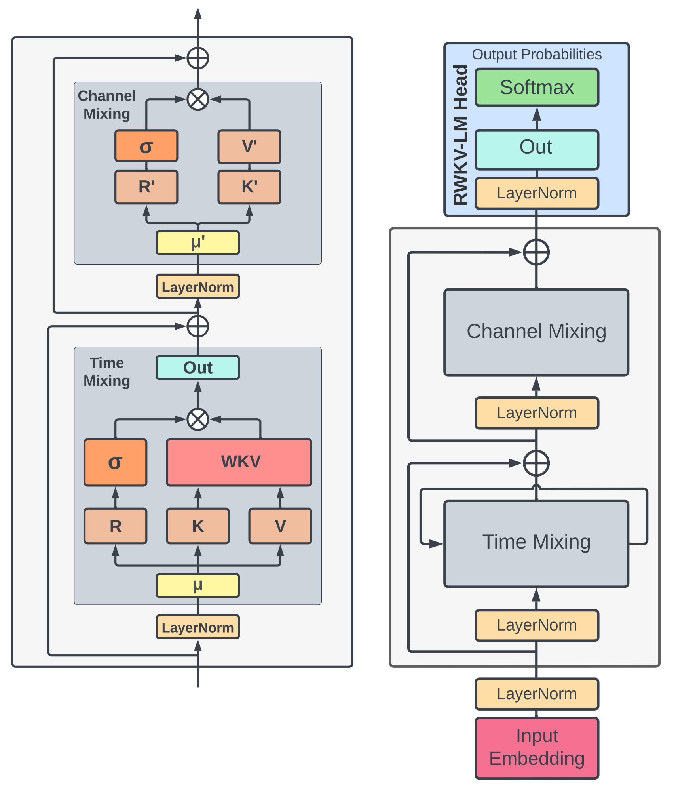

import React from 'react';
import { Accordion, Accordions } from 'fumadocs-ui/components/accordion';
import { LearnMore } from 'components-docs/learn-more/learn-more.tsx';
import { File, Folder, Files } from 'fumadocs-ui/components/files';
import { Step, Steps } from 'fumadocs-ui/components/steps';
import { Tab, Tabs } from 'fumadocs-ui/components/tabs';
import { CardContainer } from '../../components-docs/card/card-container.tsx'
import { Card } from '../../components-docs/card/card.tsx'
import { PanelBottomDashed } from "lucide-react";
import { CallOut } from '../../components-docs/call-out/call-out.tsx'
import { TabsCN, TabsContentCN, TabsListCN, TabsTriggerCN } from "../../components-docs/tabs/tabs.tsx"
import { LinkCard, LinkCardContainer } from '../../components-docs/link-card/link-card.tsx'
import { TerminalWindow } from '../../components-docs/terminal-docs/terminal-docs.tsx'
import { ApiReference, ApiSchemaSection, ApiField } from '../../components-docs/api-reference/api-reference.tsx'

# MDX

### Code

#### 代码块支持的语言高亮以及语言关键字

请在[fumadocs](https://fumadocs.vercel.app/docs/ui/components/dynamic-codeblock)查看支持的语言和关键字

点击第一个下拉框就可以看见支持的语言和关键字
<CallOut type="info" >
注意一些语言可能与你想想的不同

例如`Javascript`应该写为`js`
</CallOut>

#### 复制(copy)

代码块默认支持copy,你不需要,也不应该在语言关键字后面加`copy`


````mdx
```js 
const x = 1
function name(params) {
  x ++
}
```
````
```js 
const x = 1
function name(params) {
  x ++
}
```


### Math

````mdx
```math
c = \pm\sqrt{a^2 + b^2}
```
````

```math
c = \pm\sqrt{a^2 + b^2}
```

---

**Long equations example**

```math
\displaystyle {\begin{aligned}T_{f}(z)&=\sum _{k=0}^{\infty }{\frac {(z-c)^{k}}{2\pi i}}\int _{\gamma }{\frac {f(w)}{(w-c)^{k+1}}}\,dw\\&={\frac {1}{2\pi i}}\int _{\gamma }{\frac {f(w)}{w-c}}\sum _{k=0}^{\infty }\left({\frac {z-c}{w-c}}\right)^{k}\,dw\\&={\frac {1}{2\pi i}}\int _{\gamma }{\frac {f(w)}{w-c}}\left({\frac {1}{1-{\frac {z-c}{w-c}}}}\right)\,dw\\&={\frac {1}{2\pi i}}\int _{\gamma }{\frac {f(w)}{w-z}}\,dw=f(z),\end{aligned}}
```


### Mermaid

````mdx

```mermaid
graph TD;
subgraph AA [Consumers]
A[Mobile app];
B[Web app];
C[Node.js client];
end
subgraph BB [Services]
E[REST API];
F[GraphQL API];
G[SOAP API];
end
Z[GraphQL API];
A --> Z;
B --> Z;
C --> Z;
Z --> E;
Z --> F;
Z --> G;
```
````


```mermaid
graph TD;
subgraph AA [Consumers]
A[Mobile app];
B[Web app];
C[Node.js client];
end
subgraph BB [Services]
E[REST API];
F[GraphQL API];
G[SOAP API];
end
Z[GraphQL API];
A --> Z;
B --> Z;
C --> Z;
Z --> E;
Z --> F;
Z --> G;
```

# 组件

### Accordion

````mdx
import React from 'react';
import { Accordion, Accordions } from 'fumadocs-ui/components/accordion';


<Accordions type="single">
  <Accordion title="My Title">My Content</Accordion>
</Accordions>;

````

<Accordions type="single">
  <Accordion title="My Title">My Content</Accordion>
</Accordions>

### 了解更多

用于收纳不影响主线操作的原理、实现细节和兼容性说明。默认保持收起，不要把必须执行的步骤或关键风险放入其中。

````mdx
import { LearnMore } from 'components-docs/learn-more/learn-more.tsx';

<LearnMore title="了解更多：为什么需要选择推理后端？">
推理后端决定由哪套程序加载并运行模型。普通用户使用 Runner 预设即可。
</LearnMore>
````

<LearnMore title="了解更多：为什么需要选择推理后端？">
推理后端决定由哪套程序加载并运行模型。普通用户使用 Runner 预设即可。
</LearnMore>


### Files

````mdx
import { File, Folder, Files } from 'fumadocs-ui/components/files';

<Files>
  <Folder name="app" defaultOpen>
    <File name="layout.tsx" />
    <File name="page.tsx" />
    <File name="global.css" />
  </Folder>
  <Folder name="components">
    <File name="button.tsx" />
    <File name="tabs.tsx" />
    <File name="dialog.tsx" />
  </Folder>
  <File name="package.json" />
</Files>
````

<Files>
  <Folder name="app" defaultOpen>
    <File name="layout.tsx" />
    <File name="page.tsx" />
    <File name="global.css" />
  </Folder>
  <Folder name="components">
    <File name="button.tsx" />
    <File name="tabs.tsx" />
    <File name="dialog.tsx" />
  </Folder>
  <File name="package.json" />
</Files>


### Image Zoom

<Callout type="info">
图片放大已全局引用，正常使用图片md即可
</Callout>

````mdx


````


### Steps

````mdx
import { Step, Steps } from 'fumadocs-ui/components/steps';

<Steps>
<Step>
 
### Read the docs
 
</Step>
 
<Step>
 
### Make sure you had read the docs
 
</Step>
</Steps>
````


<Steps>
<Step>
 
### Read the docs
 
</Step>
 
<Step>
 
### Make sure you had read the docs
 
</Step>
</Steps>


### Tabs

````mdx
import { Tab, Tabs } from 'fumadocs-ui/components/tabs';

<Tabs items={['Javascript', 'Rust']}>
  <Tab value="Javascript">Javascript is weird</Tab>
  <Tab value="Rust">Rust is fast</Tab>
</Tabs>
````

<Tabs items={['Javascript', 'Rust']}>
  <Tab value="Javascript">Javascript is weird</Tab>
  <Tab value="Rust">Rust is fast</Tab>
</Tabs>


# 高级组件

### 卡片

````mdx
import { CardContainer } from '../../components-docs/card/card-container.tsx'
import { Card } from '../../components-docs/card/card.tsx'
import { PanelBottomDashed } from "lucide-react";

<CardContainer>
<Card image="color-1.png" icon={PanelBottomDashed} iconColor='text-red-500' title="关于 RWKV" description="了解 RWKV 的主要版本、模型和论文发布情况" link="/docs/RWKV-Wiki/Introduction" />
<Card image="color-2.png" icon={PanelBottomDashed} iconColor='text-blue-500' title="关于 RWKV" description="了解 RWKV 的主要版本、模型和论文发布情况" link="/docs/RWKV-Wiki/Introduction" />
<Card image="color-3.png" icon={PanelBottomDashed} iconColor='text-green-500' title="关于 RWKV" description="了解 RWKV 的主要版本、模型和论文发布情况" link="/docs/RWKV-Wiki/Introduction" />
<Card image="color-4.png" icon={PanelBottomDashed} iconColor='text-yellow-500' title="关于 RWKV" description="了解 RWKV 的主要版本、模型和论文发布情况 的主要版本、模型和论文发布情况的主要版本、模型和论文发布情况" link="/docs/RWKV-Wiki/Introduction" />
</CardContainer>
````


<CardContainer>
<Card image="color-1.png" icon={PanelBottomDashed} iconColor='text-red-500' title="关于 RWKV" description="了解 RWKV 的主要版本、模型和论文发布情况" link="/docs/RWKV-Wiki/Introduction" />
<Card image="color-2.png" icon={PanelBottomDashed} iconColor='text-blue-500' title="关于 RWKV" description="了解 RWKV 的主要版本、模型和论文发布情况" link="/docs/RWKV-Wiki/Introduction" />
<Card image="color-3.png" icon={PanelBottomDashed} iconColor='text-green-500' title="关于 RWKV" description="了解 RWKV 的主要版本、模型和论文发布情况" link="/docs/RWKV-Wiki/Introduction" />
<Card image="color-4.png" icon={PanelBottomDashed} iconColor='text-yellow-500' title="关于 RWKV" description="了解 RWKV 的主要版本、模型和论文发布情况 的主要版本、模型和论文发布情况的主要版本、模型和论文发布情况" link="/docs/RWKV-Wiki/Introduction" />
</CardContainer>


### 提示框

````mdx
import { CallOut } from '../../components-docs/call-out/call-out.tsx'

<CallOut type="info" >
this is a info callout

support markdown
</CallOut>
<CallOut type="warning" >
this is a warning callout

同样**支持 markdown**

字体为 15px
</CallOut>
<CallOut type="alert" >
this is a alert callout
</CallOut>
<CallOut type="error" >
this is a error callout
</CallOut>
````
<CallOut type="tips" >
this is a tips callout

support markdown
</CallOut>
<CallOut type="info" >
this is a info callout

support markdown
</CallOut>
<CallOut type="warning" >
this is a warning callout

同样**支持 markdown**

字体为 15px
</CallOut>
<CallOut type="alert" >
this is a alert callout
</CallOut>
<CallOut type="error" >
this is a error callout
</CallOut>


#### 内容嵌套

````mdx
import { CallOut } from '../../components-docs/call-out/call-out.tsx'

<CallOut type="info" >
**微调是什么?**

[this is a info callout](#)(Dimension-Sharding Adaptation)是一种新颖的参数高效微调方法(PEFT - Parameter-Efhcient Fine-Tuning)，旨在进一步降低可训练参数数量，同时加速收敛。

</CallOut>
````
<CallOut type="info" >
**微调是什么?**

[this is a info callout](#)(Dimension-Sharding Adaptation)是一种新颖的参数高效微调方法(PEFT - Parameter-Efhcient Fine-Tuning)，旨在进一步降低可训练参数数量，同时加速收敛。

</CallOut>


### Tabs
高级tabs，你可以在 `TabsContentCN` 中嵌套任何组件，例如 `CallOut` 和 `image`：

````mdx
import { TabsCN, TabsContentCN, TabsListCN, TabsTriggerCN } from "../../components-docs/tabs/tabs.tsx"

<TabsCN defaultValue="rwkv-4" className="">
  <TabsListCN>
    <TabsTriggerCN value="rwkv-4">RWKV-4</TabsTriggerCN>
    <TabsTriggerCN value="rwkv-3">RWKV-3</TabsTriggerCN>
  </TabsListCN>
  <TabsContentCN value="rwkv-4" >
  ### RWKV-4
  - fast
  - efficient
  - scalable
  </TabsContentCN>
  <TabsContentCN value="rwkv-3" >
  You can import any thing inside this `TabsContentCN`

  like `callout`:
 <CallOut type="info" >
this is a info callout
</CallOut>

  or images:

  

  </TabsContentCN>
</TabsCN>
````

<TabsCN defaultValue="rwkv-4" className="">
  <TabsListCN>
    <TabsTriggerCN value="rwkv-4">RWKV-4</TabsTriggerCN>
    <TabsTriggerCN value="rwkv-3">RWKV-3</TabsTriggerCN>
  </TabsListCN>
  <TabsContentCN value="rwkv-4" >

  - fast
  - efficient
  - scalable
  </TabsContentCN>
  <TabsContentCN value="rwkv-3" >
  You can import any thing inside this `TabsContentCN`

  like `callout`:
  <CallOut type="info" >
this is a info callout
</CallOut>

  or images:

  

  </TabsContentCN>
</TabsCN>


### Link Card


````mdx
import { LinkCard, LinkCardContainer } from '../../components-docs/link-card/link-card.tsx'

<LinkCardContainer>
  <LinkCard content="RWKV-4 模型 很长 很长的标题 很长 很长的 标题" link="/docs/RWKV-Wiki/Introduction" />
  <LinkCard content="RWKV-4 模型" link="/docs/RWKV-Wiki/Introduction" />
  <LinkCard content="RWKV-4 模型" link="/docs/RWKV-Wiki/Introduction" />
  <LinkCard content="RWKV-4 模型" link="/docs/RWKV-Wiki/Introduction" />
</LinkCardContainer>
````


## 终端文档组件

`TerminalWindow` 是独立的全宽模拟终端，用于替代命令行截图。操作说明仍使用普通 MDX 编写；命令和输出通过 `commands` 维护。

````mdx
import { TerminalWindow } from 'components-docs/terminal-docs/terminal-docs.tsx'

## 启动推理服务

安装依赖后运行服务。终端用于展示命令与模拟输出，不提供整段复制按钮。

<TerminalWindow
  title="PowerShell"
  shell="powershell"
  commands={[
    { command: 'pip install rwkv' },
    {
      command: 'python app.py --model-path ./models/rwkv.pth --port 8000',
      output: 'INFO  Server listening on http://127.0.0.1:8000',
    },
  ]}
/>
````

安装依赖后运行服务。终端用于展示命令与模拟输出，不提供整段复制按钮。

- 支持多条命令和逐条输出
- 全宽展示，较长命令无需挤在半栏中
- 自动适配亮色、暗色和移动端
- `shell` 可设为 `bash`、`zsh`、`fish`、`powershell` 或 `cmd`，用于选择提示符、强调色和 Shiki 语法高亮；默认值 `auto` 会根据 `title` 推断，无法识别时使用 Bash
- 单条命令可用 `language` 覆盖终端默认的高亮语言，用 `prompt` 覆盖默认提示符

<TerminalWindow
  title="PowerShell"
  shell="powershell"
  commands={[
    { command: 'pip install rwkv' },
    {
      command: 'python app.py --model-path ./models/rwkv.pth --port 8000',
      output: 'INFO  Model loaded\nINFO  Server listening on http://127.0.0.1:8000',
    },
  ]}
/>


## API 参考组件

`ApiReference` 是独立的双栏 API 组件：左侧展示端点说明与可展开 schema，右侧是轻量代码面板，支持切换请求、响应和 cURL 并复制。它不使用模拟终端组件。

- `kind="request"` 使用“必填 / 可选”，`kind="response"` 使用“始终返回 / 可能返回”，避免把响应 schema 写成需要调用者填写的表单。
- `statusCode` 与 `contentType` 分别描述 HTTP 状态和媒体类型；流式响应可使用 `text/event-stream`。
- 字段还支持 `location`、`format`、`enumValues`、`example`、`nullable` 和 `deprecated`，用于表达参数位置与 schema 约束。
- 带子字段的 `ApiField` 默认展开；可设置 `defaultOpen={false}` 默认收起，或设置 `collapsible={false}` 始终展示。

````mdx
import { ApiReference, ApiSchemaSection, ApiField } from 'components-docs/api-reference/api-reference.tsx'

<ApiReference
  method="POST"
  path="/v1/chat/completions"
  title="创建聊天补全"
  showTitle
  description="向当前加载的 RWKV 模型发送一组消息。"
  examples={[
    { label: 'cURL', language: 'bash', code: 'curl ...' },
    { label: '请求主体', language: 'json', code: '{ ... }' },
    { label: '响应', language: 'json', code: '{ ... }' },
  ]}
>
  <ApiSchemaSection title="请求主体" kind="request" contentType="application/json">
    <ApiField name="messages" type="array<object>" required description="对话消息列表。">
      <ApiField name="role" type="string" required description="消息角色。" />
      <ApiField name="content" type="string" required description="消息内容。" />
    </ApiField>
  </ApiSchemaSection>
  <ApiSchemaSection title="响应主体" kind="response" statusCode="200" contentType="application/json">
    <ApiField name="choices" type="array<object>" required description="生成结果。" />
  </ApiSchemaSection>
</ApiReference>
````

<ApiReference
  method="POST"
  path="/v1/chat/completions"
  title="创建聊天补全"
  showTitle
  description="向当前加载的 RWKV 模型发送一组消息，并返回模型生成的回复。"
  examples={[
    {
      label: 'cURL',
      language: 'bash',
      code: `curl http://127.0.0.1:8000/v1/chat/completions \\
  -H "Content-Type: application/json" \\
  -d '{"messages":[{"role":"user","content":"你好"}],"stream":false}'`,
    },
    {
      label: '请求主体',
      language: 'json',
      code: `{
  "messages": [
    {
      "role": "user",
      "content": "你好"
    }
  ],
  "temperature": 1,
  "top_p": 0.3,
  "stream": false
}`,
    },
    {
      label: '响应',
      language: 'json',
      code: `{
  "object": "chat.completion",
  "choices": [
    {
      "index": 0,
      "message": {
        "role": "assistant",
        "content": "你好！有什么可以帮你？"
      },
      "finish_reason": "stop"
    }
  ]
}`,
    },
  ]}
>
  <ApiSchemaSection
    title="请求主体"
    kind="request"
    contentType="application/json"
    description="发送给聊天补全端点的 JSON 对象。"
  >
    <ApiField
      name="messages"
      type="array<object>"
      required
      description="按时间排序的对话消息列表。"
    >
      <ApiField name="role" type="string" required description="消息角色：system、user 或 assistant。" />
      <ApiField name="content" type="string" required description="发送给模型的文本内容。" />
    </ApiField>
    <ApiField name="temperature" type="number" defaultValue="1" description="采样温度，数值越高输出越随机。" />
    <ApiField name="top_p" type="number" defaultValue="0.3" description="核采样的累计概率阈值。" />
    <ApiField name="stream" type="boolean" defaultValue="false" description="是否以流式事件返回生成结果。" />
  </ApiSchemaSection>
  <ApiSchemaSection
    title="响应主体"
    kind="response"
    statusCode="200"
    contentType="application/json"
    description="非流式请求成功时返回的聊天补全对象。"
  >
    <ApiField name="object" type="string" required description="固定为 chat.completion。" />
    <ApiField name="choices" type="array<object>" required description="模型生成的候选结果。">
      <ApiField name="index" type="integer" required description="候选结果序号。" />
      <ApiField name="message" type="object" required description="模型生成的助手消息。" />
      <ApiField name="finish_reason" type="string" required description="生成停止的原因。" />
    </ApiField>
  </ApiSchemaSection>
</ApiReference>

<LinkCardContainer>
  <LinkCard content="RWKV-4 模型 很长 很长的标题 很长 很长的 标题" link="/docs/RWKV-Wiki/Introduction" />
  <LinkCard content="RWKV-4 模型" link="/docs/RWKV-Wiki/Introduction" />
  <LinkCard content="RWKV-4 模型" link="/docs/RWKV-Wiki/Introduction" />
  <LinkCard content="RWKV-4 模型" link="/docs/RWKV-Wiki/Introduction" />
</LinkCardContainer>
