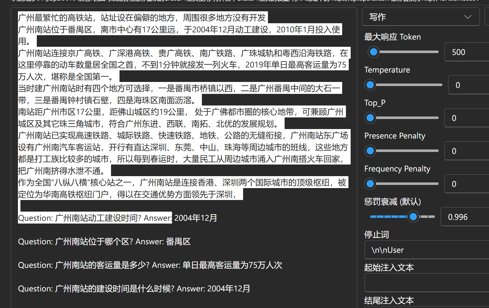
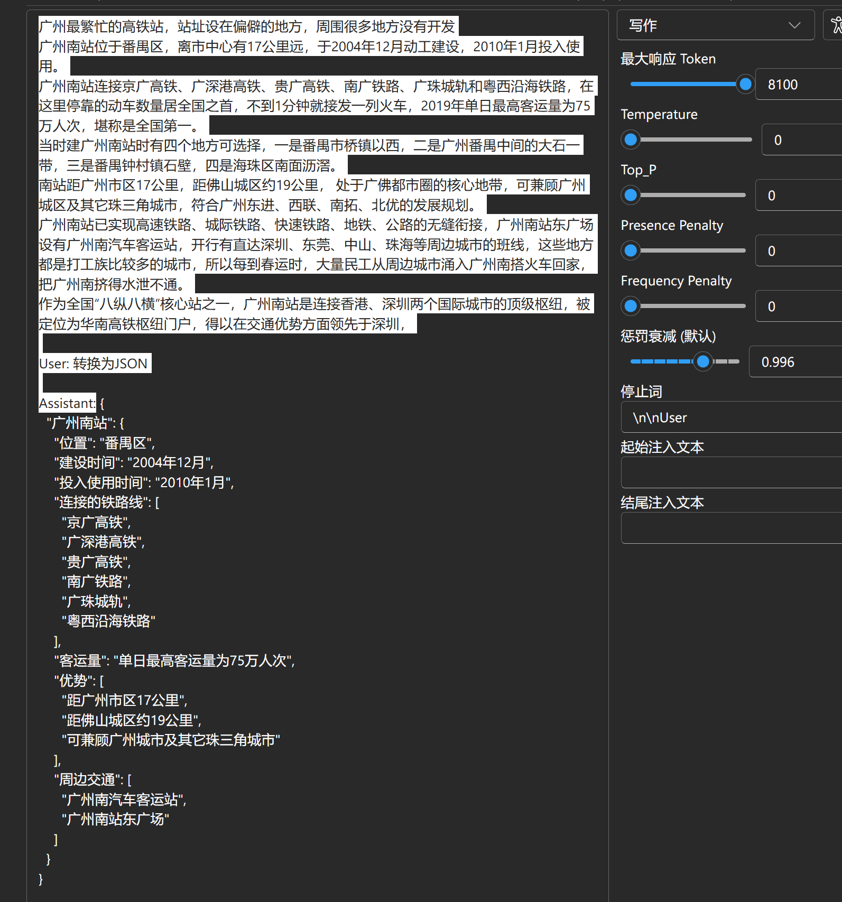

import { CallOut } from 'components-docs/call-out/call-out.tsx'

import { Tab, Tabs } from 'fumadocs-ui/components/tabs'

## 视频介绍[#video-introduction]

<div className="iframe-container">
 <iframe 
 src="https://player.bilibili.com/player.html?isOutside=true&aid=114159593195042&bvid=BV1XXQ3YoEXW&cid=28857797453&poster=1&p=0&high_quality=1&autoplay=0"
 scrolling="no"
 frameBorder="0"
 allowFullScreen={true}
 sandbox="allow-top-navigation allow-same-origin allow-forms allow-scripts"
>
</iframe>
</div>
<CallOut type="info">
高画质视频请[跳转到 B 站](https://www.bilibili.com/video/BV1XXQ3YoEXW/)观看。
</CallOut>

---

**RWKV 是 RNN 的变体。出于架构原理，RWKV 对提示词的格式比 Transformer 更敏感。**

RWKV 更适合 QA 和指令问答两种提示格式：

## QA 格式 prompt[#QA-Format-Prompt]

```bash copy
User: 请将下列瑞典语 hur l?ng tid tog det att bygga twin towers 翻译成中文

Assistant:
```
<CallOut type="info">
QA（问答）格式是 RWKV 的默认训练格式。

其中 `User:` 是用户提问的问题，`Assistant:` 是模型的回答。因此我们需要在**最后一个** `Assistant:` 后面留空，让模型进行续写。
</CallOut>

## 指令问答格式 prompt[#Instruction-Format-Prompt]

```bash copy
Instruction: 请将下列瑞典语翻译成中文

Input: hur l?ng tid tog det att bygga twin towers

Response:
```
<CallOut type="info">
指令问答是 RWKV 另一种训练格式。其中 `Instruction:` 是用户给模型的指令，`Input:` 是用户给模型的输入，`Response:` 是模型的回答。

`Response:` 后面留空，让模型进行续写。
</CallOut>

注意不要调换 `Instruction:` 和 `Input:` 的位置，由于架构设计，RWKV 在“回顾”能力上较弱。如果 RWKV 模型先接收了材料内容（Input）再接收指令（Instruction），它在执行指令时可能会漏掉内容中的重要信息。

但如果你先告诉模型**要执行什么指令**，然后再给模型**输入材料内容**。模型就会先理解指令，然后基于指令处理材料内容。就像这样:

```bash copy
Instruction: 用一句话总结下面的材料文本

Input: 2025 年 2 月 22 日，RWKV project 在中国上海漕河泾举办了主题为《RWKV-7 与未来趋势》的开发者大会。来自全国各地的开发者、行业专家和技术创新者齐聚一堂 —— 从知名高校实验室到前沿创业团队，现场涌动的创新能量印证了 RWKV-7 的优秀性能和深远意义。
在 RWKV 开发者大会期间，有 10 位来自学界、企业及 RWKV 开源社区的嘉宾为开发者带来深度分享，现场观众与嘉宾热烈互动。例如，格林深瞳杨铠成的《RWKV-CLIP：一个鲁棒的视觉 - 语言表征学习器》、光明实验室侯皓文的《VisualRWKV：基于 RWKV 的视觉语言模型》、上海交通大学程正雪的《L3TC：基于 RWKV 的高效多模态数据压缩》、浙江大学蒋峻涛的《RWKV-Unet：利用长距离协作提高医学图像分割效果》等等。
大会期间，其它 AI 企业也对 RWKV-7 给予高度评价，认为其重新定义了 AI 基础设施的经济学公式，与会者对 RWKV 应用成果的展现亦深感触动。同时，RWKV 元始智能也在 2025 全球开发者先锋大会（Global Developer Conference 2025）上为数千开发者分享了 RWKV-7 及相关 demo 演示。

Response:
```

参考的回复：
``` text copy
RWKV-7 在中国上海漕河泾举办的开发者大会上，来自不同领域的专家、企业和开源社区的人士齐聚一堂，分享了 RWKV-7 及其应用成果。RWKV-7 被认为是 AI 基础设施经济学公式的重新定义，并且在 2025 全球开发者先锋大会上也得到了展示。
```

## RWKV7-G1 专用 RAG 格式

RWKV-7-G1 模型专用的提示词格式如下：

```bash copy
材料文本

Question: 问题? Answer:
```
<CallOut type="info">
这是 RWKV7-G1 系列的 RAG 专用 Prompt 格式。其中 `Question: ` 后面是用户给模型的问题，`Answer:` 后面留空，让模型进行回答。
</CallOut>



也可以把 `Question:` 和 `Answer:` 换成 `User:` 和 `Assistant:`:

```bash copy
材料文本

User: 问题

Assistant:
```



<CallOut type="info">
RAG Prompt 是 RWKV-7-G1 模型的专用格式，推荐把 Temperature、Top-p、Penalty 等**解码参数调整为 0**。
</CallOut>

## few-shot[#Few-Shot]

对于一些带上下文的问答任务，我们建议在 prompt 前后重复几个同类的问题（few-shot），为模型作示范。如下所示：

```bash copy
User: 把“hello，I love you.”翻译成中文

Assistant: 你好，我爱你。

User: 把“how are you?”翻译成中文

Assistant: 你好吗？

User: 把“I am fine, thank you.”翻译成中文

Assistant:
```
<CallOut type="info">
可以在 [RWKV 提示词指南板块](./Chat-Prompts) 找到一些开箱即用的 RWKV prompt 示例。
</CallOut>
