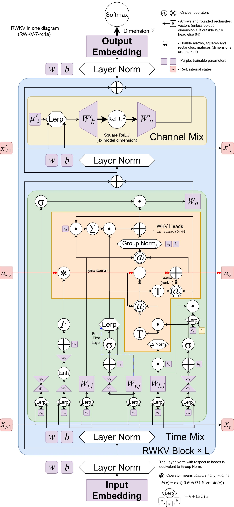

import { CallOut } from 'components-docs/call-out/call-out.tsx'
import { Tab, Tabs } from 'fumadocs-ui/components/tabs'
import { Accordion, Accordions } from 'fumadocs-ui/components/accordion';

RWKV（读作 RWaKuV）是一种具有 GPT 级大型语言模型（LLM）性能的 RNN，也可以像 GPT Transformer 一样直接训练（可并行化）。

RWKV 结合了 RNN 和 Transformer 的最佳特性：出色的性能、恒定的显存占用、恒定的推理生成速度、"无限" ctxlen 和免费的句嵌入，而且 100% 不含自注意力机制。

RWKV 项目最初由彭博（Bo Peng ，BlinkDL）提出，随着项目被外界关注，RWKV 项目逐渐发展成一个开源社区。

2023 年 9 月 20 日，RWKV 开源项目正式加入 Linux 开源基金会。如今的 RWKV 项目是一个开源的非盈利组织，隶属于 Linux 基金会，部分算力曾由赞助商支持。

## RWKV 架构和论文

RWKV 模型架构有 RWKV-4（Dove）、RWKV-5（Eagle）、RWKV-6（Finch）、RWKV-7（Goose） **四个正式版本**，更早以前的 RWKV 1/2/3 为实验版本。

<CallOut type="info">
截至 2026 年 1 月，RWKV-8 架构仍处于实验阶段。RWKV-8 已公开的特性：
- [RWKV-8 预览之 DeepEmbed：对端侧友好的稀疏设计，解决 MoE 显存占用](./RWKV-Architecture.mdx#rwkv-8-de)
- [RWKV-8 系列之 DeepEmbedAttention：精简 KV 缓存，尤其适合混合模型（RWKV-7s）](https://rwkv.cn/news/read?id=20250630)
- [RWKV-8 系列之 ROSA（RWKV Online Suffix Automaton） 机制：开启未来之路](./RWKV-Architecture.mdx#rwkv-8-rosa-mechanism)
</CallOut>

<Tabs items={['RWKV-7 架构', 'RWKV-6 架构', 'RWKV-4 架构']}>
  <Tab>

RWKV-7 架构是 RWKV 的最新版本，架构论文于 2025 年 3 月 18 日正式发布。

- **RWKV-7 论文**：RWKV-7 "Goose" with Expressive Dynamic State Evolution
- **论文地址**：[arXiv:2503.14456](https://arxiv.org/abs/2503.14456)

通过一系列创新（例如广义 Delta Rule），RWKV-7 在计算效率、任务表现和模型表达力全面超越 Transformer 和过去的 RWKV-6 架构。

在训练数据远低于 Qwen2.5、Llama3.2 等开源模型的前提下，RWKV-7-World 模型的**语言建模能力**在所有开源 3B 规模模型中达到 SoTA 水平。

通过引入广义 Delta Rule，RWKV-7 使用 **2 层即可实现 $NC^1$ 复杂度的 $S_5$ 状态跟踪问题**，**使用 4 层即可识别所有正则语言**，表达力显著超越了 Transformers 的 $TC^0$ 限制。

<CallOut type="info">
有关 RWKV-7 论文的解读，可以参考[此文章](https://rwkv.cn/news/read?id=20250320)。
</CallOut>

<Accordions type="single">
  <Accordion title="点击查看 RWKV-7 完整架构图">
  
   </Accordion>
</Accordions>

</Tab>
  <Tab>
RWKV-5/6 两个架构在 RWKV-4 架构的基础上进行了若干改进。因此，这两个架构在同一篇论文中发布。

- **RWKV 5/6 论文**：《Eagle and Finch: RWKV with Matrix-Valued States and Dynamic Recurrence》
- **论文地址**：[arXiv:2404.05892](https://arxiv.org/abs/2404.05892)

<CallOut type="info">
有关 RWKV-5/6 论文的解读，可以参考[此文章](https://rwkv.cn/news/read?id=382345)。
</CallOut>

<Accordions type="single">
  <Accordion title="点击查看 RWKV-6 完整架构图">

<CallOut type="info">
RWKV-6 架构图由 RWKV 社区开发者按照 CC-BY-SA 许可发布，可以在 [rwkv-wiki.fandom](https://rwkv.fandom.com/zh/wiki/RWKV-6%E6%9E%B6%E6%9E%84) 上找到原始版本。
</CallOut>
   </Accordion>
</Accordions>

</Tab>
<Tab>
RWKV-4 是 RWKV 模型的首个正式版本，论文由 RWKV 作者彭博和 RWKV 社区共同完成，初次发表于 2023 年 5 月 22 日。同年 10 月，RWKV-4 架构论文被顶级会议 [EMNLP 2023](https://2023.emnlp.org/program/accepted_findings/) 收录。

- **RWKV-4 论文**：《RWKV: Reinventing RNNs for the Transformer Era》
- **论文地址**：[arXiv:2305.13048](https://arxiv.org/abs/2305.13048)
</Tab>
</Tabs>
## RWKV 模型的版本状态

<CallOut type="info">
从 RWKV-4 架构开始，RWKV 在每个架构版本都发布了多种参数规模的开源模型。

截至 2025 年 6 月，RWKV-4/5 模型的生命周期已结束，RWKV-6 模型已停止更新。推荐使用**最新的 RWKV7-G1 模型**。
</CallOut>

| 版本 | RWKV-V4 | RWKV-v5-Eagle | RWKV-v6-Finch | RWKV-v7-World | RWKV7-G1 |
| --- | --- | --- | --- | --- | --- |
| 论文 | 🎓[论文已发布](https://arxiv.org/abs/2305.13048) | 🎓[论文已发布](https://arxiv.org/abs/2404.05892) | 🎓[论文已发布](https://arxiv.org/abs/2404.05892) | 🎓[论文已发布](https://arxiv.org/abs/2503.14456) | 🎓[论文已发布](https://arxiv.org/abs/2503.14456) |
| 总体状态 | **⚠ EOL** | **⚠ EOL**| **⚠ EOL** | **⚠ EOL** | **⚙️ 模型训练中** |
| 0.1B 模型 | ✅ 已发布 | ✅ 已发布 | ❌ 无计划 |✅ [已发布](https://modelscope.cn/models/Blink_DL/rwkv-7-world/files) | ✅ [已发布](https://modelscope.cn/models/Blink_DL/rwkv7-g1/file/view/master/rwkv7-g1a-0.1b-20250728-ctx4096.pth?status=2) |
| 0.4B 模型 | ✅ 已发布 | ✅ 已发布 | ❌ 无计划 |✅ [已发布](https://modelscope.cn/models/Blink_DL/rwkv-7-world/files) | ✅ [已发布](https://modelscope.cn/models/Blink_DL/rwkv7-g1/file/view/master/rwkv7-g1a-0.4b-20250905-ctx4096.pth?status=2) |
| 1.5B 模型 | ✅ 已发布 | ✅ 已发布| ✅ [已发布](https://modelscope.cn/models/Blink_DL/rwkv-6-world/file/view/master/RWKV-x060-World-1B6-v2.1-20240328-ctx4096.pth) |✅ [已发布](https://modelscope.cn/models/Blink_DL/rwkv-7-world/files) | ✅ [已发布](https://modelscope.cn/models/Blink_DL/rwkv7-g1/files) |
| 3B 模型 | ✅ 已发布 | ✅ 已发布 | ✅ [已发布](https://modelscope.cn/models/Blink_DL/rwkv-6-world/file/view/master/RWKV-x060-World-1B6-v2.1-20240328-ctx4096.pth) |✅ [已发布](https://modelscope.cn/models/Blink_DL/rwkv-7-world/files) | ✅ [已发布](https://modelscope.cn/models/Blink_DL/rwkv7-g1/files) |
| 7B 模型 | ✅ 已发布 | ✅ 已发布| ✅ [已发布](https://modelscope.cn/models/Blink_DL/rwkv-6-world/file/view/master/RWKV-x060-World-7B-v3-20241112-ctx4096.pth) |**❌ 无计划** | ✅ [已发布](https://modelscope.cn/models/Blink_DL/rwkv7-g1/files) |
| 14B 模型 | ✅ 已发布 | ❌ 无计划 | ✅ [已发布](https://modelscope.cn/models/Blink_DL/rwkv-6-world/file/view/master/RWKV-x060-World-14B-v2.1-20240719-ctx4096.pth) |**❌ 无计划** | ✅ [已发布](https://modelscope.cn/models/Blink_DL/rwkv7-g1/files) |

## RWKV 模型的命名规则

RWKV 模型通常有两种命名规则，一种是 World 模型，另一种是自 RWKV 7 架构时期推出的 RWKV G1 系列模型（支持 think 推理）。

<Tabs items={['RWKV G1 模型', 'RWKV World 模型']}>
  <Tab>

G1 模型的命名格式：
- rwkv7a-g1b-0.1b-20250819-ctx4096.pth
- rwkv7-g0a2-7.2b-20251005-ctx4096.pth
- rwkv7-g1a3-1.5b-20251015-ctx8192.pth

G1 模型名称中每个字段的含义：

| 字段 | 含义 |
| --- | --- |
| **rwkv7a / rwkv7** | 模型架构版本，[rwkv7](https://rwkv.cn/news/read?id=20250320) 是最新的 RWKV 基础架构，rwkv7a 是在 rwkv7 的基础上加了 [DE](https://rwkv.cn/news/read?id=20250527) 机制，rwkv7b 在 rwkv7 的基础上加了 [DE](https://rwkv.cn/news/read?id=20250527) 和 [DEA](https://rwkv.cn/news/read?id=20250630) |
| **0.1b / 7.2b** | 模型的参数规模，"B"代表"Billions"（十亿） |
| **g1b / g0a2 / g1a3** | **训练数据的版本**，数据质量排序：G1b > G1a3 > G1a2 > G1a > G1 > G0a2 > G0 。RWKV7-G1a 模型是在 RWKV7-G1 模型的基础上继续训练优质数据，RWKV7-G1a2 则是在 RWKV7-G1a 模型的基础上继续添加数据训练，以此类推 |
| **20250819 / 20251005** | 模型的发布日期 |
| **ctx4096/ctx8192** | 预训练的上下文长度 |  
</Tab>
  <Tab>

World 模型的命名格式：
- RWKV-x060-World-3B-v2.1-20240208-ctx4096.pth
- RWKV-x070-World-0.1B-v2.8-20241210-ctx4096.pth

World 模型名称中每个字段的含义：

| 字段 | 含义 |
| --- | --- |
| **RWKV** | 模型名称 |
| **x060 / X070** | RWKV 模型的架构，X060 = RWKV6，X070 = RWKV7|
| **World** | 数据集类型，World 数据集包含一百多种全球语言，World 模型支持多语言任务 |
| **3B / 0.1B** | 模型的参数规模，"B"代表"Billions"（十亿） |
| **v2.1 / v2.8** | 模型的训练集版本，v2 ≈ 1.1 T , v2.1 ≈ 2.5T ,v3 ≈ 5.6T  |
| **20240208 / 20231113** | 模型的发布日期 |
| **ctx4096** | 预训练的上下文长度 |

</Tab>
</Tabs>

## 我应该使用哪些 RWKV 模型？

<CallOut type="warning">
由于老旧架构导致的性能问题， RWKV-6、RWKV-5、RWKV-4 全系列（Raven / World / Pile ...）和更早的 RWKV 版本均已结束生命周期，现有模型仅作为存档。
</CallOut>

得益于最新的架构设计和最新数据集，RWKV7-G1 系列模型有较强的**推理、代码和数学能力**，在所有任务上的表现都比过去的模型更好

- 如果您的显存大于 16GB ，推荐使用**最新的** [RWKV7 13.3B 模型](https://modelscope.cn/models/RWKV/rwkv7-g1/files)，这是目前最强大的 RWKV 模型，拥有最强的推理、代码和数学能力
- 如果您的显存位于 8GB 到 16GB 之间，请使用**最新的** [RWKV7 7.2B 模型](https://modelscope.cn/models/RWKV/rwkv7-g1/files) 
- 如果您的显存小于 8GB ，请使用**最新的** [RWKV7 2.9B 模型](https://modelscope.cn/models/RWKV/rwkv7-g1/files)

请查看[本地部署 RWKV 模型的显存需求](./Vram)，以确认**你的显卡可以使用哪一款 RWKV 模型**。

## RWKV 与 Transformer 的差异[]

### 优势

- 与 Transformer 相比，消耗的算力和显存更低，尤其适合端侧部署
- 无论多长的上下文长度，保持速度恒定，显存恒定
- 作为 RNN，原生支持任意上下文长度
- 泛化能力超越 Transformer 模型

### 不足

- RWKV-7 的长文本能力仍然弱于 Transformer
- RWKV-7 对提示词（prompt）的格式更敏感，提示词的格式对生成结果影响更大
- RWKV-7s 作为混合模型，解决了 RWKV-7 的这些不足

## RWKV 社区的基本术语

| 概念 | 描述 |
| --- | --- |
| **RWKV** | 模型架构本身，训练代码可于[此处](https://github.com/BlinkDL/RWKV-LM)获取 |
| **state** | RWKV 是 RNN 架构的变种，state 是 RWKV 在推理过程中跨时间步（time step）传递的隐藏状态（hidden state），用于保留历史上下文信息 |
| **ChatRWKV** | RWKV 的官方聊天机器人（类似 ChatGPT，但基于 RWKV），代码可于[此处](https://github.com/BlinkDL/ChatRWKV)获取 |
| **RWKV-4/5/6/7** | RWKV 的不同架构版本。注意，推荐使用最新的 RWKV-7 系列模型 |
| **RWKV World** | 使用全球 100 多种语言的数据训练而来的基底 RWKV 模型，这类模型涵盖了更广泛、更多样化的数据集，包括 100 多种语言的训练数据，以及部分指令训练 |
| **Raven** | RWKV-4 基础模型的官方微调版，包含指令训练。但由于 RWKV-4 系列已停止更新，不建议继续使用 |
| **RWKV ABC/MIDI** | 基于 ABC/MIDI 格式的 RWKV 音乐模型 |
| **RWKV CHNtuned / one-state-chat / role_play / novel ...** | RWKV 社区提供的微调模型，针对特定任务或数据类型优化。请优先考虑使用 RWKV-7 系列的微调模型 |
| **RWKV7-G1（Goose One）** | 基于 RWKV-7 架构和 World v3.5 数据集训练的基底模型，支持**思考推理**（Think），性能更强 |

## RWKV 社区成员如何交流？

我们拥有 [Discord 频道](https://discord.gg/bDSBUMeFpc) 和 [QQ 频道](https://pd.qq.com/s/f2iep06ms) ，同时也有 QQ 交流群：

<Tabs items={['RWKV 官方 QQ 群', 'RWKV 社区 QQ 群']}>
  <Tab>
以下是 RWKV 官方的 QQ 交流群：
| 群名称 | QQ 群号 |
| --- | --- |
| RWKV 技术研发群 | 325154699 |
| RWKV 用户交流群 | 224287095 |
| RWKV 应用内测群 | 332381861 |
| ChatRWKV 水和机器人群 | 597996773 |
</Tab>
<Tab>
以下是 RWKV 社区组建的 QQ 交流群：
| 群名称 | QQ 群号 |
| --- | --- |
| RWKV 第三方微调/训练/lora 综合群 | 439087067 |
| AI00_Server for RWKV 群 | 30920262 |
| rwkv runner 懒人包交流群 | 818930736 |
</Tab>
</Tabs>

## RWKV 的赞助与贡献者

作为一个开源项目，RWKV 曾接受 [Stability AI](https://stability.ai/)、[EleutherAI](https://www.eleuther.ai/) 提供的大量 GPU 资源和研究支持。

此外，我们还要感谢以下组织或团队：

- [alpin @ pygmalionAI](https://pygmalion.chat/)
- [AutoMeta @ AlignmentLab](https://twitter.com/alignment_lab)
- [Recursal.AI](https://recursal.ai)
- 以及其他提供 GPU 资源的匿名支持者

同时，我们也感谢 RWKV 社区成员的辛苦付出，包括参与 RWKV 架构改进、使用 RWKV 进行学术研究、协助建设 RWKV 内容、测试最新模型，以及其他任何有帮助的工作。