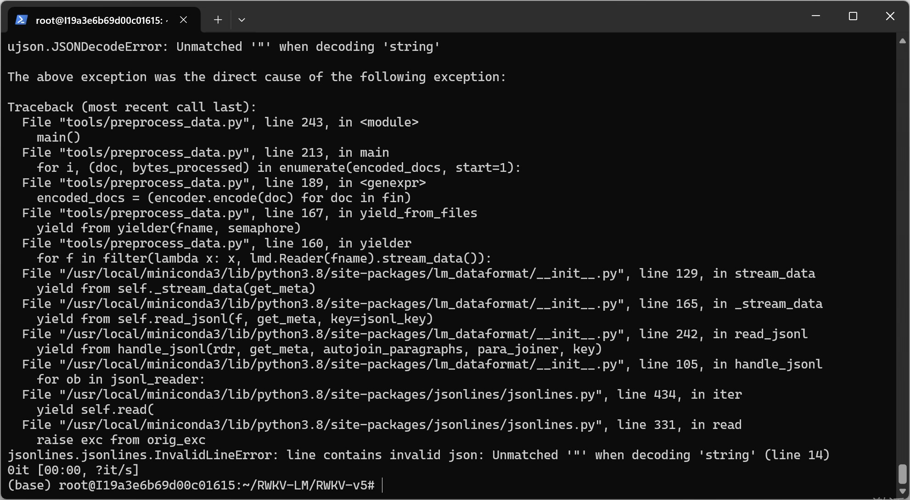
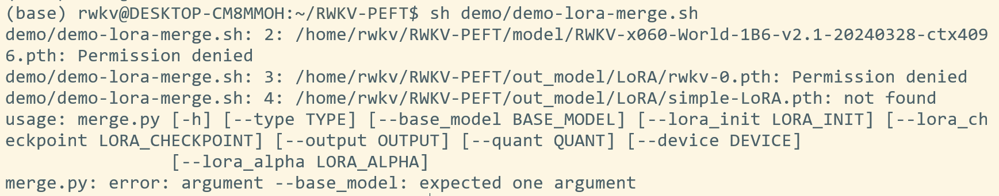
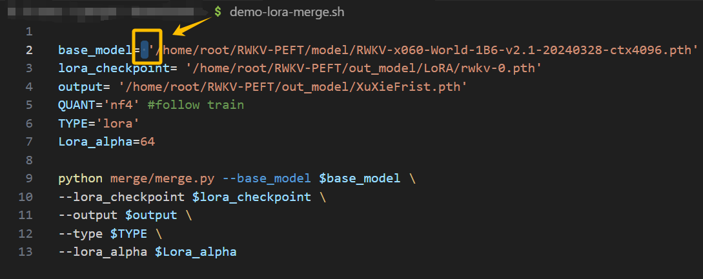

## jsonl 转 binidx 时出现 ModuleNotFoundError: No module named 'xxx' 错误


解决方法：这是因为缺少了对应的软件包，请运行命令 pip install xxx 进行安装。

## jsonl 转 binidx 时报错

```
报错信息：JSONDecodeError:Unmatched '"' when decoding 'string'! 
```



解决方法：这是因为你的 jsonl 文件缺少引号，导致转换工具出现解析错误，请检查 jsonl 文件的所有行是否都符合以下引号格式：


## 克隆 GitHub 仓库时 “unable to access”

```
 fatal: unable to access 'https://github.com/shoumenchougou/RWKV-LM.git/': GnuTLS recv error (-110): The TLS connection was non-properly terminate
```

解决方法：这是你的设备出现了网络问题，请调整网络。

## 运行 sh 脚本时出现：train.py: error:unrecognized arguments:\ 

解决方法：请把 sh 脚本的所有 \ 去掉，每条参数之间用空格隔开。

## 运行脚本开始训练后，出现显存 （memory/VRAM） 不足相关报错

解决方法：显存不足，需要升级显卡设备。

## 合并 LoRA 文件时，出现：merge.py: error: argument 报错



解决方法：这可能是你的路径变量出现了一些空格，导致无法正常解析基底模型、输出文件夹等路径的参数，请认真检查空格问题！

