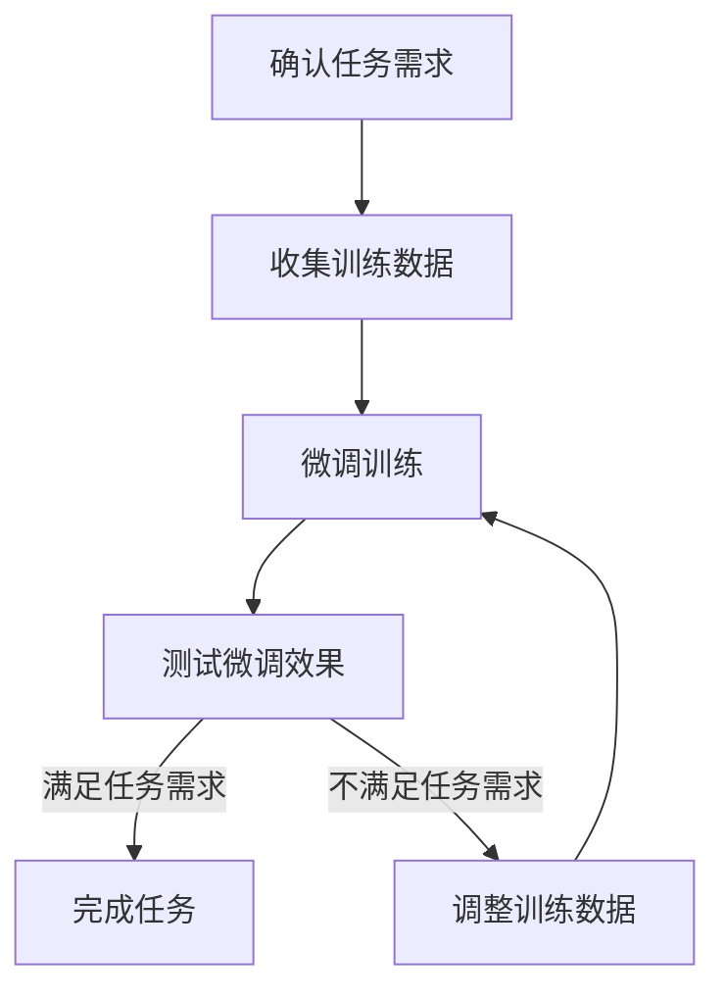
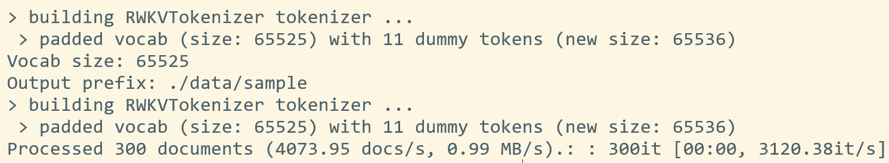
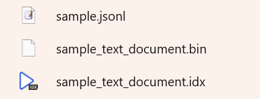

import { Step, Steps } from 'fumadocs-ui/components/steps'
import { CallOut } from 'components-docs/call-out/call-out.tsx'

遵循以下步骤，整理你的训练数据集。

## 视频教程

<div className="iframe-container">
 <iframe 
 src="https://player.bilibili.com/player.html?isOutside=true&aid=114080102877917&bvid=BV1Kn9gYUEWY&cid=28616166882&high_quality=1&autoplay=0"
 scrolling="no"
 frameBorder="0"
 allowFullScreen={true}
 sandbox="allow-top-navigation allow-same-origin allow-forms allow-scripts"
>
</iframe>
</div>
<CallOut type="info">
高画质视频请[跳转到 B 站](https://www.bilibili.com/video/BV1Kn9gYUEWY)观看。
</CallOut>

## 整理 jsonl 数据

首先确认**你希望 RWKV 模型学习哪些知识**。这里的知识可以是某一领域的资料，比如法律问答、金融知识等；也可以是某类任务的文本，如材料总结、角色扮演等。

总而言之，你需要根据具体的任务需求，收集对应的数据，并将其整理为 `jsonl` 格式的文件。

下面是不同内容类型/任务类型的 `jsonl` 格式参考：

### 单轮问答

单轮问答通常用于训练聊天机器人等下游任务，数据格式为：

``` jsonl copy
{"text": "User: 问题\n\nAssistant: 答案"}
```

一个单轮问答的例子：

``` jsonl copy filename="single-qa.jsonl"
{"text": "User: 水是什么？\n\nAssistant: 水是一种无色、无味、无臭的液体，是地球上最常见的物质之一。"}
```

在这个例子中，`User: ` 后面的内容通常是人类给模型的输入，而 `Assistant: ` 后面的内容则是模型给出的答案。

<CallOut type="info">
除了 `User` 和 `Assistant`  之外，还可以添加 `System` 角色，以提供背景设定，或强化模型对 `Assistant:` 的角色认知。
</CallOut>

``` jsonl copy filename="qa-with-system.jsonl"
{"text": "System: 你是一位精通广东历史和地理的优秀导游。\n\nUser: 导游，广东的省会是什么呀？\n\nAssistant: 广东的省会是广州，广州拥有非常悠久的历史。"}
{"text": "System: 此时是三国时期，天下大乱，群雄割据。你是一名与张飞对战的小兵\n\nUser: 小子，吃我张飞一刀！\n\nAssistant: 张飞大哥饶命啊！"}
```
`System` 角色同样适用于下文的多轮对话数据。

### 多轮对话

多轮对话数据适合连续对话和上下文理解的任务场景，如**客服机器人**和**角色扮演**。

多轮对话数据格式为：

``` jsonl copy
{"text": "User: 问题一\n\nAssistant: 答案一\n\nUser: 问题二\n\nAssistant: 答案二"}
``` 
一个多轮对话的例子：

``` jsonl copy filename="multi-qa.jsonl"
{"text": "User: 晚上好啊\n很高兴见到你！\n\nAssistant: 晚上好！\n我也很高兴见到你！\n\nUser: 我今年十岁了\n你今年几岁？\n\nAssistant: 我今年五岁。"}
```
<CallOut type="warning">
注意，`User:` 和 `Assistant:` 之间需要用 `\n\n` 隔开。但对话内容中的换行只能使用 `\n` 表示。
</CallOut>


### 指令问答

指令问答数据适合**信息提取**、**材料总结**、**会议纪要**等总结性任务，同时也是指令微调（Instruction Tuning）的推荐格式。

``` jsonl copy
{"text": "Instruction: 指令\n\nInput: 内容\n\nResponse: 答案"}
```
其中，`Instruction` 是给模型的指令，`Input` 是给模型的内容输入，`Response` 是模型给出的答案。

<CallOut type="warning">
注意：`Instruction:` 、 `Input:` 和 `Response:` 和文本内容之间要插入一个英文空格。

此外，`Instruction:` 、 `Input:` 和 `Response:` 之间需要用 `\n\n` 隔开。但对话内容中的换行只能使用 `\n` 表示。
</CallOut>

一个指令问答的例子：

``` jsonl copy filename="instruction-qa.jsonl"
{ "text": "Instruction: 请判断下面的句子属于哪个类别，类别包括文化、娱乐、体育、财经、房产、汽车、教育、科技、军事、旅游、国际、证券、农业、电竞、民生。请直接输出类别，不要额外输出多余内容。\n\nInput: RWKV大模型正式推出第七代架构RWKV-7。\n\nResponse: 科技"}
```

`Instruction: ` 和 `Input: ` 的内容会被拼接并作为模型的输入，`Response: ` 的内容则是模型给出的答案。

在这个例子中，模型会接收如下输入：

``` text copy
请判断下面的句子属于哪个类别，类别包括文化、娱乐、体育、财经、房产、汽车、教育、科技、军事、旅游、国际、证券、农业、电竞、民生。请直接输出类别，不要额外输出多余内容。
RWKV大模型正式推出第七代架构RWKV-7。
```

模型会给出如下输出：

``` text copy
科技
```

### 文章/小说等长文数据

文章、小说等长文本数据，通常用于训练**文本续写**、**文本扩写**等连贯的长文本生成任务。

对于整本小说、超长文章等长文本内容，数据格式为：

``` jsonl copy
{"text": "将每篇文章的内容变成 JSONL 的一行，即使是一百万字的小说也变成一行。"} 
```
对于新闻、通告等**带标题**的短篇内容，数据格式为：
``` jsonl copy 
{"text": "《标题》\n正文内容"}
```
对于小说、文章的**单段落续写**任务，数据格式为：

``` jsonl copy 
{"text": "User: 约 100 字的段落开头\n\nAssistant: 段落的后续文本"}
```

对于从小说大纲扩写小说段落的任务，数据格式为：

``` jsonl copy
{"text": "User: 章节的大纲\n\nAssistant: 章节的完整内容"}
```

## 训练数据的更多细节

### 微调需要多少数据

微调训练数据的数量并没有严格规范，可以是几百条，也可以是几千条，甚至更多。

通常是**数据量越多，微调训练的效果越好**。但优质数据需要大量的时间和人力成本，因此需要根据实际情况进行调整：

- 根据微调任务复杂度调整：简单的分类或总结任务，可能只需要几百条数据。复杂的角色扮演或文本生成任务，需要几千条或更多数据。
- 质量比数量更重要：高质量的数据应准确反映目标任务的特征，并涵盖多样的场景和表达方式。

训练数据的调整是一个逐步迭代的过程，通常需要经历以下步骤：


直到获得满意的微调效果。

### 复制并随机排序数据

在训练数据不充足的情况下，复制训练数据有助于增强模型对特定知识的理解和记忆，打乱数据排序则是为了降低过拟合的风险。

在 Linux 或 Mac 系统上，使用以下命令对数据文件进行重复和打乱：

``` bash copy
# 将 data.jsonl 文件重复三次，并将所有行输出到 repeated-data.jsonl 文件中
# 此命令也可用于合并多个 jsonl 数据文件
awk 'NF > 0 {print}' data.jsonl data.jsonl data.jsonl | head -c -1 > repeated-data.jsonl
# 将 repeated-data.jsonl 文件的所有行随机打乱，并将结果输出到 shuffled-data.jsonl 文件中
sort -R repeated-data.jsonl | head -c -1 > shuffled-data.jsonl
```
<CallOut type="warning">
`data.jsonl` 需要改成你准备好的 jsonl 数据文件名称。
</CallOut>
<CallOut type="info">
Windows 系统可以通过 [WSL](https://docs.microsoft.com/zh-cn/windows/wsl/install) (Windows Subsystem for Linux) 或安装 [Cygwin](https://www.cygwin.com/) 工具，以使用 `awk` 和 `shuf` 命令。
</CallOut>

### 添加常规数据

建议在微调数据集中添加一些常规数据，添加常规数据有助于增强模型泛化能力，同时可以降低过拟合的风险。

假设我们正在微调一个用于解答初阶数学问题的模型，数据样本类似这样：

``` jsonl copy
{"text": "User: 1 + 1 = ?\n\nAssistant: 2"}
{"text": "User: 1 + 2 = ?\n\nAssistant: 3"}
{"text": "User: 1 + 3 = ?\n\nAssistant: 4"}
```
此时，我们可以在数据集中添加一些其他表达形式的数学问题，以及非数学领域的常规对话数据，比如：

``` jsonl copy
{"text": "User: 1 + 1 = ?\n\nAssistant: 2"}
{"text": "User: 我有 5 个苹果，送小明 2 个，还剩多少？\n\nAssistant: 3 个"}
{"text": "User: 8 和 7 相加是多少？\n\nAssistant: 15"}
{"text": "User: 长方形的面积是 20 平方米，宽是 4 米，那么它的长度是多少？\n\nAssistant: 长度是 5 米。"}
{"text": "User: 今天天气怎么样？\n\nAssistant: 今天天气晴朗，适合外出游玩。"}
{"text": "User: 1 + 2 = ?\n\nAssistant: 3"}
```

## 将 jsonl 文件转化为 binidx 文件

得到 `jsonl` 格式的训练数据后，我们需要使用 [json2binidx](https://github.com/Abel2076/json2binidx_tool) 工具，将 `jsonl` 文件转成更适合 RWKV 训练的 `binidx` 文件。

<Steps>
<Step>
### 下载 json2binidx 工具

克隆仓库

``` bash copy
git clone https://github.com/Abel2076/json2binidx_tool.git
```
或直接[下载压缩包](https://github.com/Abel2076/json2binidx_tool/archive/refs/heads/main.zip)并解压。

<CallOut type='warning'>
如果 GitHub 无法链接，请使用以下国内仓库：

```  bash copy
git clone https://gitee.com/uniartisan2018/json2binidx_tool.git
```
</CallOut>


得到 `json2binidx` 文件夹后，使用 `cd json2binidx_tool` 命令进入 `json2binidx_tool` 目录。
</Step>
<Step>
### jsonl 文件转 binidx 文件

将准备好的 `jsonl` 数据集文件放在 `json2binidx/data` 文件夹中。

在 `json2binidx_tool` 目录下运行以下命令，可以将 `data` 文件夹中的 `jsonl` 文件转成 `binidx` 文件 ：

``` bash copy
python3 tools/preprocess_data.py --input ./data/sample.jsonl --output-prefix ./data/sample --vocab ./rwkv_vocab_v20230424.txt --dataset-impl mmap --tokenizer-type RWKVTokenizer --append-eod
```

这条命令有两个需要修改的参数：

``` bash copy
--input ./data/sample.jsonl # 输入 jsonl 文件的路径，需要改成你准备好的 jsonl 文件名
--output-prefix ./data/sample # 输出的 bin / idx 文件路径，需要改成你想要的文件名
```
</Step>
</Steps>

出现以下提示，意味着转换已经完成：



你应该能在 `data `文件夹中找到转换完成的 bin / idx 文件：



此时我们的准备工作已经结束了，接下来需要**选择一种微调方法**，并阅读对应的文档。
