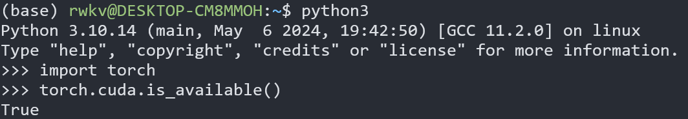
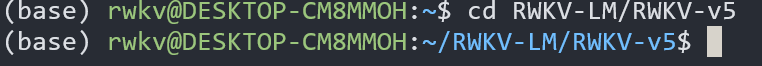
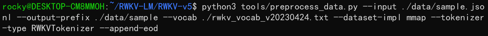
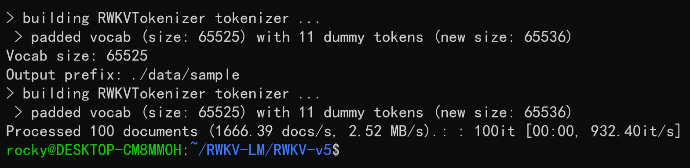

import { CallOut } from 'components-docs/call-out/call-out.tsx'
import { Step, Steps } from 'fumadocs-ui/components/steps'

##  RWKV 模型全参微调教程（入门版）

<CallOut type="info">
本文旨在为刚接触 RWKV 模型的用户提供开箱即用的全量微调方法，文中使用的仓库为 RWKV 开源社区成员整理的“微调懒人包”，和官方 [RWKV-LM 仓库](https://github.com/BlinkDL/RWKV-LM.git)中的微调方法**不兼容**。
</CallOut>

首先，准备一个 Linux 环境（可以是 WSL）和支持 CUDA 的 NVIDIA 显卡，然后往下阅读本文。

## 配置训练环境

要训练 RWKV 模型，首先要配置训练环境。

<Steps>
<Step>
### 配置虚拟环境（conda）

RWKV 默认训练虚拟环境为 conda ，如果不知道如何配置 Linux 系统的 conda ，请参考[**此文章**](https://zhuanlan.zhihu.com/p/166102942)。
</Step>
<Step>
### 安装微调训练所需的软件

要获得 RWKV 模型的最佳训练性能，请使用 `python 3.10`、`torch 2.1.2+cu121`（或最新版本）、`cuda 12.3+`、最新的 `deepspeed`，但保持 `pytorch-lightning ==1.9.5` 。

在 Linux 环境中依次运行以下命令：
``` bash copy
pip install torch --upgrade --extra-index-url https://download.pytorch.org/whl/cu121
```
``` bash copy
pip install pytorch-lightning==1.9.5 transformers ninja einops tqdm gpustat nvitop bitsandbytes wandb datasets triton==2.2.0 --upgrade
```
第一条命令通过指定 url 安装 cu121 版本的 torch ,第二条命令安装 RWKV State tuning 所需的其他软件包，并指定安装 1.9.5 版本的 `PyTorch Lightning`、2.2.0 版本的 `triton`。

`-- upgrade` 参数意味着如果环境中已经安装了对应的软件包，则将其升级到最新版本。
</Step>
<Step>
### 检查 CUDA 环境

依次运行以下命令，检查 CUDA 库是否可用：
```  bash copy
python3 # 启动 python

import torch # 导入 torch 包

torch.cuda.is_available() # 检查 CUDA 是否可用
```


如果返回值为 True ，证明 CUDA 环境可用。如果返回 False ，请重新安装 CUDA 环境（cuda 12.3+）。
</Step>
</Steps>

## 克隆 RWKV-LM 仓库

在 Linux 或 WSL 中，使用 git 命令克隆 RWKV-LM 仓库​：
``` bash copy
git clone https://github.com/shoumenchougou/RWKV-LM.git
```

克隆完成后，使用 `cd RWKV-LM/RWKV-v5` 命令进入 RWKV-v5 文件夹。



## 下载基底 RWKV 模型

你需要选择一个 RWKV 基底模型作为微调训练的起点，[下载 RWKV 模型](https://huggingface.co/BlinkDL/rwkv-6-world/tree/main) 并将其放在 RWKV-v5/model 文件夹（推荐下载最新的 RWKV-6 架构模型）：

<CallOut type="warning">
由于本文介绍的是 RWKV 全参微调方法，如果你在使用消费级显卡（4090 或更低级），对 1.5B 或更大参数的 RWKV 模型进行微调训练可能会失败。
</CallOut>

如果你正在使用消费级显卡，建议尝试微调 [RWKV-5-World-0.4B 模型](https://huggingface.co/BlinkDL/rwkv-5-world/blob/main/RWKV-5-World-0.4B-v2-20231113-ctx4096.pth) 以跑通训练流程

如果你无法访问上述 HF 链接，请访问 HF 镜像链接： https://hf-mirror.com/BlinkDL  。


## 收集训练语料（数据集）

请遵循以下步骤，收集你的训练数据集，并将其放在 `RWKV-v5/data` 文件夹里面。

<Steps>

### 整理 jsonl 语料

首先确认“你希望 RWKV 模型学习哪些知识”。这里的知识可以是某一领域的资料，比如法律问答、金融知识等；也可以是某类任务的文本，如材料总结、角色扮演等。总而言之，你需要收集此类数据，并将其转化为特定的 jsonl 格式。

下面是各类内容的 jsonl 格式参考：

``` json copy
单轮问答： {"text": "User: 问题\n\nAssistant: 答案"}

多轮对话例子：{"text": "User: 问题一\n\nAssistant: 答案一\n\nUser: 问题二\n\nAssistant: 答案二"}

材料问答：{"text": "Instruction: 问题\n\nInput: 材料\n\nResponse: 答案"}

内容生成/续写：{"text": "将每篇文章的内容变成 JSONL 的一行，即使是一百万字的小说也变成一行。"} 或者 {"text": "《标题》\n正文内容"}

小说扩写：{"text": "User: 段落的开头\n\nAssistant: 完整的段落"}
```
整理完成的 jsonl 文件应该是这样的：


### 将 jsonl 文件转化为 binidx 文件

在 RWKV-LM/RWKV-v5 目录中运行以下命令，可以将 data 文件夹中的 jsonl 文件转成 binidx 文件 ：

``` bash copy
python3 tools/preprocess_data.py --input ./data/sample.jsonl --output-prefix ./data/sample --vocab ./rwkv_vocab_v20230424.txt --dataset-impl mmap --tokenizer-type RWKVTokenizer --append-eod
```


如果你在使用自己的 jsonl 数据集，这条命令有两个需要修改的参数：

```
--input ./data/sample.jsonl # 作为输入的 jsonl 文件路径
--output-prefix ./data/sample # 输出的 bin 和 idx 文件路径
```

将 `sample.jsonl` 改成你自己的 jsonl 文件名称，其他参数保持默认即可。

</Steps>

出现以下提示，意味着转换已经完成：



## 修改训练参数 

使用任意文本编辑器（如 vscode）打开 `demo-training-run.sh` 文件，可以调整训练参数，进而控制微调的训练过程和训练效果。：


以下是一次调参过程的记录：

<Steps>

### 调整路径参数

 `demo-training-run.sh` 文件前三行是文件路径参数：
 
- load_model： 基底 RWKV 模型的路径
- proj_dir：训练日志和模型文件的输出路径
- data_file：训练数据集的路径，注意路径中不需要带 bin 和 idx 后缀，仅需文件名称。


### 调整 n_layer 和 n_embd 参数

基底 RWKV 模型的参数大小不同，训练时使用的 n_layer 和 n_embd 数值也不一样。以下是不同参数的 RWKV 模型和 n_layer 和 n_embd 数值的对照列表：

| 模型参数 | n_layer | n_embd |
|------------|---------|--------|
| 0.1B       | 12      | 768    |
| 0.4B       | 24      | 1024   |
| 1.5B       | 24      | 2048   |
| 3B         | 32      | 2560   |
| 7B         | 32      | 4096   |
| 14B        | 61      | 4096   |

### 调整重要训练参数

<CallOut type="info">
以下参数建议根据你的微调数据、设备性能进行调整。
</CallOut>

| 参数 | 描述 |
| --- | --- |
| `micro_bsz=1` | 根据显存大小调整，微调时从 1 开始尝试增大 |
| `epoch_save=5` | 每隔多少个训练轮次保存一次训练模型，调小需要注意存储空间是否充足 |
| `epoch_steps=1000` | 每个训练轮次的步数，增加会拉长单个epoch的训练时间 |
| `ctx_len=512` | 微调模型的上下文长度，根据你的需求而定 |


### 调整其他训练参数

下面列出了脚本中其他可修改的训练参数，及其修改的效果。

| 参数 | 描述 |
| --- | --- |
| `--data_type binidx` | 训练语料的文件格式，支持："utf-8", "utf-16le", "numpy", "binidx", "dummy", "wds_img", "uint16" |
| `--vocab_size 65536` | 词表大小，默认为 65536，设为 0 则模型自动确定词汇表大小 |
| `--epoch_count 1` | 总训练轮次 |
| `--epoch_begin 0` | 初始训练轮次，从第 N 个 epoch 开始加载 |
| `--pre_ffn 0` | 将第一个 att 层替换为 ffn，通常保持关闭 |
| `--head_qk 0` | 保持默认值 0（关闭状态） |
| `--lr_init 1e-5` | 初始学习率，微调建议 1e-5，可适当增加至不超过 5e-5 |
| `--lr_final 1e-5` | 最终学习率，微调同样建议 1e-5，熟练后可自定义 |
| `--warmup_steps 0` | 预热步骤，微调初学者建议 0；若加载模型，可尝试 50 |
| `--beta1 0.9` | Adam 优化器 beta1 参数 |
| `--beta2 0.99` | Adam 优化器 beta2 参数 |
| `--adam_eps 1e-8` | Adam 优化器的 epsilon 参数 |
| `--accelerator gpu` | 加速器类型，推荐使用 gpu |
| `--devices 1` | 单显卡填 1，多卡按实际数量 |
| `--precision bf16` | 训练精度，默认为 bf16，也支持 "fp32", "tf32", "fp16" |
| `--strategy deepspeed_stage_1` | 训练策略，微调推荐 deepspeed_stage_1 |
| `--grad_cp 1` | 梯度累积步数，0 加快训练但消耗更多显存，1 反之 |
| `--my_testing "x060"` | 训练的 RWKV 模型版本，v5 选 x052，v6 选 x060 |

参数调整完成后，请记得保存 `demo-training-run.sh` 文件。

</Steps>


## 开始训练

在 RWKV-V5 目录中，使用以下命令运行  demo-training-run.sh  脚本：
``` bash copy
sh demo-training-run.sh
```
成功运行后，应该可以看到类似于这样的效果：


