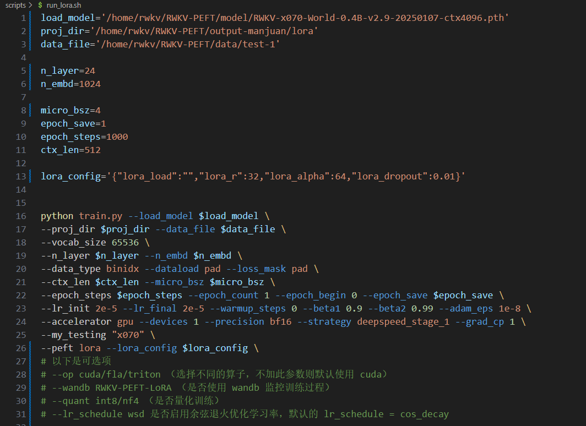
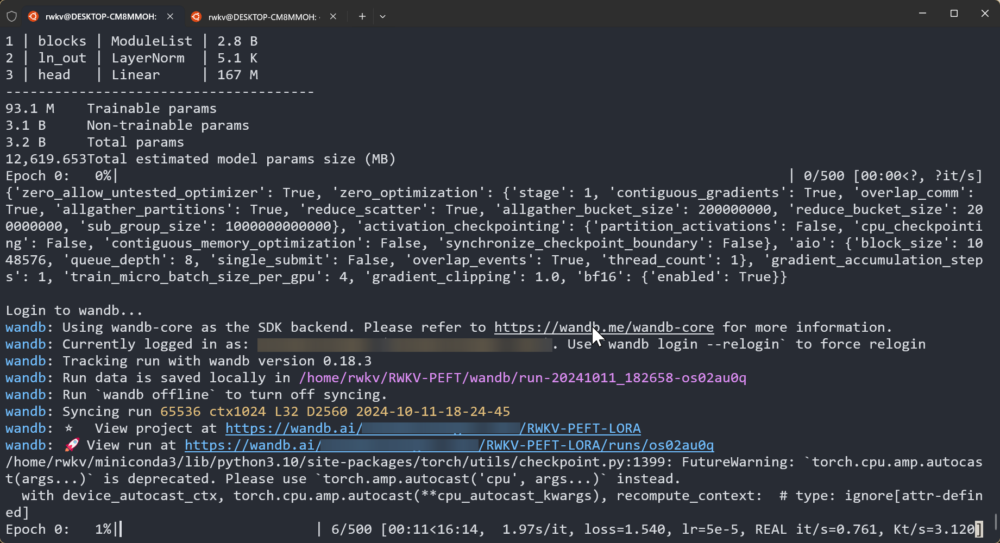
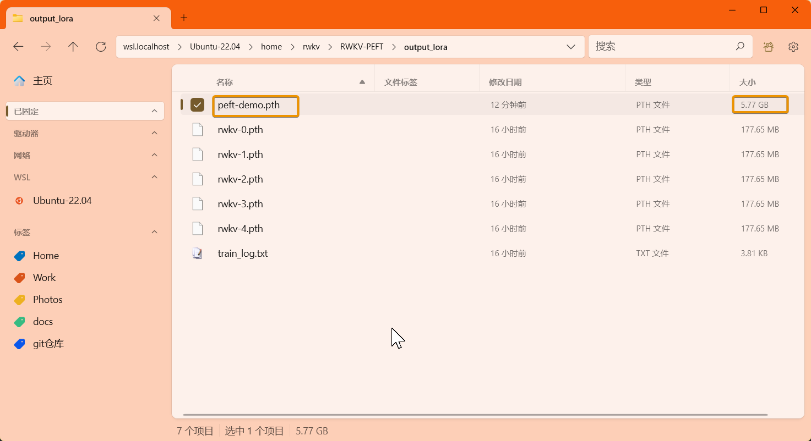
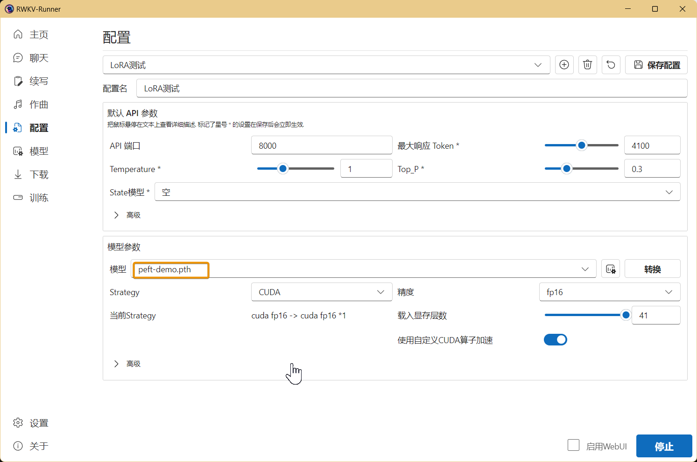

import { Tab, Tabs } from 'fumadocs-ui/components/tabs';
import { Step, Steps } from 'fumadocs-ui/components/steps'
import { CallOut } from 'components-docs/call-out/call-out.tsx'

<CallOut type="info">
**LoRA 微调是什么？**

LORA（Low-Rank Adaptation）是一种针对大型预训练模型的微调技术。它不改变原始模型大部分参数，而是调整模型的部分权重，以此实现对特定任务的优化。
</CallOut>
---

本文的 LoRA 微调方法来自 RWKV 社区微调项目 [RWKV-PEFT ](https://github.com/JL-er/RWKV-PEFT)。

在开始 LoRA 微调之前，请确保你拥有一个 Linux 工作区，以及支持 CUDA 的 NVIDIA 显卡。

## 视频教程[#video-tutorial]

<div className="iframe-container">
 <iframe 
 src="https://player.bilibili.com/player.html?isOutside=true&aid=114516377472842&bvid=BV12gExzjEPH&cid=29986850416&high_quality=1&autoplay=0"
 scrolling="no"
 frameBorder="0"
 allowFullScreen={true}
 sandbox="allow-top-navigation allow-same-origin allow-forms allow-scripts"
>
</iframe>
</div>
<CallOut type="info">
高画质视频请[跳转到 B 站](https://www.bilibili.com/video/BV12gExzjEPH/)观看。
</CallOut>

## LoRA 显存参考

RWKV LoRA 微调的显存（GPU VRAM）需求可参考下表：

<Tabs items={["RWKV7 模型", "RWKV6 模型"]}>
<Tab>
| 模型参数 | bf16  | int8 | nf4 |
| --------- | ---- | ---- | ---- |
| RWKV7-0.1B | 2.7GB GPU  | 2.5GB GPU  | 2.4GB GPU  |
| RWKV7-0.4B | 3.4GB GPU  | 2.9GB GPU  | 2.7GB GPU  |
| RWKV7-1.5B | 5.6GB GPU  | 4.6GB GPU  | 3.9GB GPU  |
| RWKV7-2.9B | 8.8GB GPU  | 6.7GB GPU  | 5.7GB GPU  |
</Tab>
<Tab>
| 模型参数 | bf16  | int8 | nf4 |
| --------- | ---- | ---- | ---- |
| RWKV6-1.6B | 7.3GB GPU  | 5.9GB GPU  | 5.4GB GPU  |
| RWKV6-3B  | 11.8GB GPU  | 9.4GB GPU  | 8.1GB GPU  |
| RWKV6-7B | 23.7GB GPU | 17.3GB GPU | 14.9GB GPU  |
</Tab>
</Tabs>

上表的数据基于以下训练参数：

- ctxlen=1024 
- micro_bsz=1
- strategy=deepspeed_stage_1
- peft_config=\'\{\"r\":64,\"lora_alpha\":32,\"lora_dropout\":0.05}\'

随着训练参数的变更，RWKV LoRA 微调所需显存会发生改变。

## 收集训练数据

你需要使用收集更适合训练 RWKV 的 binidx 数据，具体方法可参考[准备微调数据集](../FT-Dataset)。

## 配置训练环境

要训练 RWKV 模型，首先要配置 conda 等训练环境。具体过程请参考[RWKV 微调环境配置](../FT-Environment)板块。

## 克隆仓库并安装依赖

在 Linux 或 WSL 中，使用 git 命令克隆 RWKV-PEFT 仓库​：

```  bash copy
git clone https://github.com/JL-er/RWKV-PEFT.git
```

<CallOut type='warning'>
如果 GitHub 无法链接，请使用以下国内仓库：

```  bash copy
git clone https://gitee.com/rwkv-vibe/RWKV-PEFT.git
```
</CallOut>

克隆完成后，使用 `cd RWKV-PEFT` 命令进入 RWKV-PEFT 目录。并运行以下命令，安装项目所需依赖：

```  bash copy
pip install -r requirements.txt
```

## 修改训练参数 

使用任意文本编辑器（如 vscode）打开 `RWKV-PEFT/scripts` 目录下的 `run_lora.sh` 文件，可以修改训练参数，进而控制微调的训练过程和训练效果：



以下是一次 LoRA 微调的调参过程：

<Steps>
<Step>
### 调整路径参数

`run_lora.sh` 文件前三行是文件路径参数：
 
- load_model： 基底 RWKV 模型的路径
- proj_dir：训练日志和训练得到的 LoRA 文件输出路径
- data_file：训练数据集的路径，注意路径中不需要带 bin 和 idx 后缀，仅需文件名称。
</Step>
<Step>
### 调整 n_layer 和 n_embd 参数

<CallOut type="warning">
不同参数的 RWKV 模型，训练时使用的 n_layer 和 n_embd 数值不一样
</CallOut>

以下 RWKV 模型参数对应的 n_layer/n_embd 值：

| 模型参数 | n_layer | n_embd |
|------------|---------|--------|
| 0.1B       | 12      | 768    |
| 0.4B       | 24      | 1024   |
| 1.5B       | 24      | 2048   |
| 3B         | 32      | 2560   |
| 7B         | 32      | 4096   |
| 14B        | 61      | 4096   |
</Step>
<Step>
### 调整重要训练参数

| 参数 | 描述 |
| --- | --- |
| `micro_bsz=1` | 微批次大小，根据显存大小调整，微调时从 1 开始逐渐增大 |
| `epoch_save=5` | 每隔多少个训练轮次保存一次 LoRA 文件，注意存储空间是否充足 |
| `epoch_steps=1000` | 每个训练轮次的步数，增加会拉长单个 epoch 的训练时间 |
| `ctx_len=512` | 微调模型的上下文长度，建议根据语料长度修改 |
| `--my_testing "x070"` | 训练的 RWKV 模型版本，v7 选 `x070`，v6 选 `x060` ，v5 选 `x052`（已淘汰，不推荐）|
</Step>
<Step>
### 调整 LoRA 相关参数

<CallOut type="info">
`peft_config` 包含 LoRA 微调的参数，效果参考下表：
</CallOut>

| 参数 | 描述 |
| --- | --- |
| "r":32 | LoRA 微调的 rank 参数，值越大效果越好，但训练速度越慢/显存需求越高，一般训练使用 32 或者 64 即可 |
| "lora_alpha":32 | LoRA 微调的 alpha 参数（缩放因子），建议保持 lora_r 的两倍 |
| "lora_dropout":0.01 | LoRA 微调的丢弃率，建议使用 0.01 |
</Step>
<Step>

### 调整其他训练参数

下面列出了脚本中其他可修改的训练参数，及其修改的效果。

| 参数 | 描述 |
| --- | --- |
| `--vocab_size 65536` | 词表大小，默认为 65536，设置为 0 表示模型自动确定词汇表大小 |
| `--data_type binidx` | 训练语料的文件格式，支持：`utf-8`, `utf-16le`, `numpy`, `binidx`, `dummy`, `uint16`, `sft`, `jsonl`，建议使用 `jsonl` 或 `binidx` 格式 |
| `--epoch_count 5` | 总训练轮次 |
| `--lr_init 2e-5` | 初始学习率，DiSHA 建议 `2e-5` ，最大不超过 `1e-4` |
| `--lr_final 2e-5` | 最终学习率，建议和初始学习率保持一致 |
| `--accelerator gpu` | 使用的加速器类型，目前主要支持 `gpu`，`cpu` 基本不支持训练 |
| `--devices 1` | 显卡数量，单显卡填 `1`，多卡按实际数量填写 |
| `--precision bf16` | 训练精度，建议保持默认值 `bf16`，支持：`fp32`、`tf32`、`fp16`、`bf16` |
| `--strategy deepspeed_stage_1` | lightning 训练策略参数，微调推荐使用 `deepspeed_stage_1`，设备显存太小可将 `1` 改成 `2` |
| `--grad_cp 1` | 梯度累积步数，`0` 训练更快但需更多显存，`1` 训练较慢但节省显存 |
| `--peft lora` | 微调训练类型，LoRA 微调填 `lora` 即可 |
| `--op` | 选择算子，支持 `cuda`、`fla`、`triton`，默认设置为 `cuda` |
| `--wandb RWKV-PEFT-DiSHA` | **可选**，是否使用 wandb 可视化记录训练日志，需提前配置 [wandb](https://wandb.ai/) 账号 |
| `--lr_schedule wsd` | **可选**，学习率调度方法，默认使用 `cos_decay`，支持：`cos_decay`, `wsd` |
{/* 2025年11月更新后移除了部分训练参数，不支持量化训练 
| `--warmup_steps 0` | 预热步骤数，默认 `0`，加载模型微调时可尝试改成 `50` |
| `--beta1 0.9` | Adam 优化器的 beta1 参数，保持默认值 |
| `--beta2 0.99` | Adam 优化器的 beta2 参数，保持默认值 |
| `--adam_eps 1e-8` | Adam 优化器的 epsilon 参数，保持默认值 |
| `--epoch_begin 0` | 初始训练轮次，即从第 N 个训练轮次开始加载 |
| `--quant int8/nf4` | **可选**，RWKV 默认使用 `bf16` 训练精度，但也支持 `int8` 和 `nf4` 两种量化训练，推荐使用精度损失较小的 `int8` | 
| `--dataload pad` | 数据加载选项，`pad` 支持 `bsz>1`，`only` 则限制 `bsz=1` |
| `--loss_mask pad` | 在数据末尾进行 padding，可改成 `qa` 以对 QA 任务中的问题部分进行屏蔽，防止模型根据问题来记忆答案，从而增强模型的泛化能力。 |*/}

<CallOut type="warning">
参数调整完成后，请记得保存 `run_lora.sh` 文件。
</CallOut>
</Step>
</Steps>

### 附录：run_lora.sh 配置参考

``` bash copy filename="run_lora.sh"
load_model="/home/rwkv/model/rwkv7-g1-1.5b-20250429-ctx4096.pth"
proj_dir='/home/rwkv/JL/out_model/test'
data_file=/home/rwkv/JL/data/roleplay

n_layer=24
n_embd=2048

micro_bsz=8
epoch_save=1
epoch_steps=200
ctx_len=128
peft_config='{"r":8,"lora_alpha":32,"lora_dropout":0.05}'

python train.py --load_model $load_model \
--proj_dir $proj_dir --data_file $data_file \
--vocab_size 65536 \
--data_type jsonl \
--n_layer $n_layer --n_embd $n_embd \
--ctx_len $ctx_len --micro_bsz $micro_bsz \
--epoch_steps $epoch_steps --epoch_count 4 --epoch_save $epoch_save \
--lr_init 1e-5 --lr_final 1e-5 \
--accelerator gpu --precision bf16 \
--devices 1 --strategy deepspeed_stage_1 --grad_cp 1 \
--my_testing "x070" \
--peft lora --peft_config $peft_config
# 以下是可选项
# --op cuda/fla/triton （选择不同的算子，不加此参数则默认使用 cuda）
#  --wandb RWKV-PEFT-DiSHA （是否使用 wandb 监控训练过程）
# --lr_schedule wsd 是否启用余弦退火优化学习率，默认的 lr_schedule = cos_decay  

```

## 开始训练

在 RWKV-PEFT 目录，运行 `sh scripts/lora.sh` 命令，开启 LoRA 微调 。

正常开始训练后，应当是如下画面：




## 如何使用 LoRA 权重文件

训练完毕后，可以在输出路径中找到完整的 LoRA 微调模型文件（`.pth` 格式）和训练日志（`.txt` 文件）:



合并后的 LoRA 微调模型可以在 RWKV Runner 或者 Ai00 中正常使用。




详细用法请参考 [RWKV Runner 教程](../../../intermediate/RWKV-Runner/Introduction) 和 [Ai00 教程](../../../intermediate/ai00/Introduction)。


