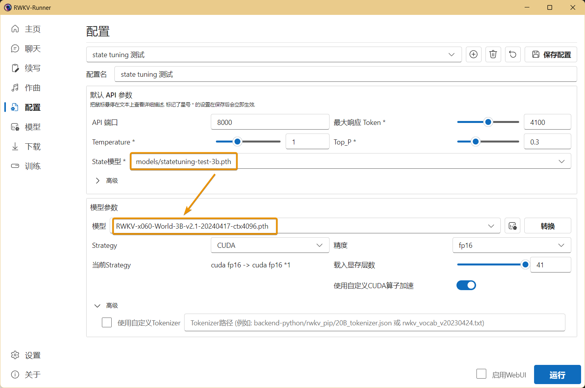
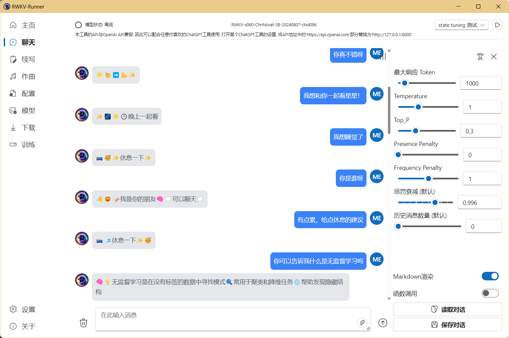

import { Tab, Tabs } from 'fumadocs-ui/components/tabs'
import { Step, Steps } from 'fumadocs-ui/components/steps'
import { CallOut } from 'components-docs/call-out/call-out.tsx'

<CallOut type="info">
**State Tuning 是什么？**

RWKV 是纯 RNN，因此可以做 transformer 难以做到的事情。例如，作为 RNN 有固定大小的 state，所以，微调 RWKV 的初始 state，就相当于最彻底的 prompt tuning，甚至可以用于 alignment，因为迁移能力很强。
</CallOut>
本文的 State tuning 方法来自 RWKV 社区微调项目 [RWKV-PEFT ](https://github.com/JL-er/RWKV-PEFT)。

开始之前，请确保你拥有一个 Linux 工作区，以及支持 CUDA 的 NVIDIA 显卡。

## State tuning  微调案例[#state-tuning-case]

<Cards>
  <Card  title="RWKV-7-G1 通用角色扮演 State" href="https://modelscope.cn/models/shoumenchougou/RWKV7_G1_RolePlay_State" /> 
</Cards>

## State tuning 的显存需求[#vram-of-state-tuning]

State tuning 的显存需求可参考下表：

<Tabs items={["RWKV7 模型", "RWKV6 模型"]}>
<Tab>
| 模型参数 | bf16  | int8  | nf4  |
|------------|---------|--------|--------|
| RWKV7-0.1B | 2.6GB GPU   | 2.4GB GPU  | 2.5GB GPU  | 
| RWKV7-0.4B      | 3.1GB GPU  | 2.9GB GPU  | 2.8GB GPU  | 
| RWKV7-1.5B      | 5.3GB GPU  | 4.1GB GPU  | 3.7GB GPU  | 
| RWKV7-2.9B      | 8.2GB GPU  | 5.7GB GPU  | 4.7GB GPU  | 
</Tab>
<Tab>
| 模型参数 | bf16  | int8  | nf4  |
|------------|---------|--------|--------|
| RWKV6-1.6B | 5.8GB GPU   | 4.5GB GPU  | 3.9GB GPU  | 
| RWKV6-3B      | 8.7GB GPU  | 6.2GB GPU  | 4.9GB GPU  | 
| RWKV6-7B      | 17.8GB GPU    | 11.9GB GPU  | 8.5GB GPU  | 
</Tab>
</Tabs>

上表的数据基于以下测试参数:

- ctx_len=1024 
- micro_bsz=1
- strategy=deepspeed_stage_1

## 整理训练数据

### 收集 jsonl 格式训练数据

要 state tuning 微调 RWKV 模型，需要使用收集适合训练 RWKV 的数据（jsonl 格式），具体方法可参考[准备微调数据集](../FT-Dataset)。

## 配置训练环境

请参考[RWKV 微调环境配置](../FT-Environment)板块，配置 Conda 等训练环境。

## 克隆仓库并安装依赖[#install-dependencies]

在 Linux 或 WSL 中，使用 git 命令克隆 RWKV-PEFT 仓库​：

```  bash copy
git clone https://github.com/JL-er/RWKV-PEFT.git
# 如果 GitHub 无法链接，请使用以下国内仓库：
git clone https://gitee.com/rwkv-vibe/RWKV-PEFT.git
```

克隆完成后，使用 `cd RWKV-PEFT` 命令进入 `RWKV-PEFT` 目录。并运行以下命令，安装项目所需依赖：

```  bash copy
pip install -r requirements.txt
```

## 修改训练参数[#modify-training-parameters]

使用任意文本编辑器（如 vscode）打开 `RWKV-PEFT/scripts` 目录的 `state tuning.sh` 文件，修改训练参数，进而控制微调的训练过程和训练效果：


以下是一次 state tuning 调参过程：

<Steps>
<Step>
### 调整路径参数[#adjust-path-parameters]

 `state tuning.sh` 文件前三行是文件路径参数：
 
- load_model： 基底 RWKV 模型的路径
- proj_dir：训练日志和训练得到的 state 文件输出路径
- data_file：训练数据集的路径，注意路径中不需要带 bin 和 idx 后缀，仅需文件名称。
</Step>
<Step>
### 调整 n_layer 和 n_embd 参数[#adjust-n-layer-and-n-embd-parameters]

基底 RWKV 模型的参数大小不同，训练时使用的 n_layer 和 n_embd 数值也不一样。以下是不同参数的 RWKV 模型和 n_layer 和 n_embd 数值的对照列表：

| 模型参数 | n_layer | n_embd |
|------------|---------|--------|
| 0.1B       | 12      | 768    |
| 0.4B       | 24      | 1024   |
| 1.5B       | 24      | 2048   |
| 3B         | 32      | 2560   |
| 7B         | 32      | 4096   |
| 14B        | 61      | 4096   |
</Step>
<Step>
### 调整重要训练参数[#adjust-important-training-parameters]

| 参数 | 描述 |
| --- | --- |
| `micro_bsz=1` | 微批次大小，根据显存大小调整，微调时从 1 开始逐渐增大 |
| `epoch_save=1` | 每隔多少个训练轮次保存一次 State 文件 |
| `epoch_steps=1000` | 每个训练轮次的步数，增加会拉长单个epoch的训练时间 |
| `ctx_len=512` | 微调模型的上下文长度，state tuning 建议从短开始尝试，如 512 |
</Step>
<Step>
### 调整其他训练参数[#adjust-other-training-parameters]

下面列出了脚本中其他可修改的训练参数，及其修改的效果。

<CallOut type="warning">
注意：微调 state 时，建议 `--lr_init 1e-2` 、`--lr_final 1e-4` ，以及尽可能短的 ctxlen 。
</CallOut>

| 参数 | 描述 |
| --- | --- |
| `--data_type binidx` | 训练语料的文件格式，支持：`utf-8`, `utf-16le`, `numpy`, `binidx`, `dummy`, `uint16`, `sft`, `jsonl`，建议使用 `jsonl` 或 `binidx` 格式 |
| `--vocab_size 65536` | 词表大小，默认为 65536，设置为 0 表示模型自动确定词汇表大小 |
| `--epoch_count 5` | 总训练轮次，可根据效果调整 |
| `--pre_ffn 0` | 用 ffn 替换第一个 att 层，有时可能有益 |
| `--lr_init 1e-2` | 初始学习率，state tuning 建议为 `1e-2`，其他微调建议不超过 `1e-4` |
| `--lr_final 1e-4` | 最终学习率，state tuning 建议为 `1e-4`，其他微调建议不超过 `1e-4`  |
| `--accelerator gpu` | 使用的加速器类型，目前主要支持 `gpu`， `cpu` 基本不支持训练 |
| `--devices 1` | 单显卡填 `1`，多卡按实际数量填写 |
| `--precision bf16` | 训练精度，默认为 `bf16`，支持：`fp32`、`tf32`、`fp16`、`bf16` |
| `--strategy deepspeed_stage_1` | lightning 训练策略参数，微调推荐使用 `deepspeed_stage_1` |
| `--grad_cp 1` | 梯度累积步数，`0` 训练更快但需更多显存，`1` 训练较慢但节省显存 |
| `--peft state` | 微调训练类型，state tuning 微调填 `state` 即可 |
| `--my_testing "x070"` | 训练的 RWKV 模型版本，v7 选 `x070`，v6 选 `x060` ，v5 选 `x052`（已淘汰，不推荐）|
| `--op fla` | 选择算子，state tuning 仅支持 fla 算子 |
| `--wandb PEFT-State-tuning` | **可选**，是否使用 wandb 可视化记录训练日志，需提前配置 [wandb](https://wandb.ai/) 账号 |
| `--lr_schedule wsd` | **可选**，学习率调度方法，默认使用 `cos_decay`，支持：`cos_decay`, `wsd` |


<CallOut type="warning">
参数调整完成后，请记得保存 `state tuning.sh` 文件。
</CallOut>
</Step>
<Step>
### 附录：state tuning 配置参考[#appendix-state-tuning-config]

``` bash copy filename="state tuning.sh"
load_model='/home/rwkv/RWKV-PEFT/models/rwkv7-g1a-0.1b-20250728-ctx4096.pth'
proj_dir='/home/rwkv/RWKV-PEFT/test-output'
data_file='/home/rwkv/RWKV-PEFT/data/test.jsonl'

n_layer=12
n_embd=768

micro_bsz=1
epoch_save=1
epoch_steps=300
ctx_len=1024

python train.py --load_model $load_model \
--proj_dir $proj_dir --data_file $data_file \
--vocab_size 65536 \
--data_type jsonl \
--n_layer $n_layer --n_embd $n_embd \
--ctx_len $ctx_len --micro_bsz $micro_bsz \
--epoch_steps $epoch_steps --epoch_count 4 --epoch_save $epoch_save \
--lr_init 1e-2 --lr_final 1e-4 \
--accelerator gpu --precision bf16 \
--devices 1 --strategy deepspeed_stage_1 --grad_cp 1 \
--my_testing "x070" \
--peft state --op fla

```
</Step>
</Steps>

## 开始训练[#start-training]

在 RWKV-PEFT 目录，运行 `sh scripts/state tuning.sh` 命令，开启 state tuning 。

正常开始训练后，应当是如下画面：


训练完毕后，应当可以在输出文件夹中找到训练好的 state 文件（`.pth` 格式）和训练日志（`.txt` 文件）:


## 如何使用 state 文件[#use-state-file]

获得 state 文件后，你可以如此使用：

- 使用 `merge/merge_state.py` 工具将 state 文件合并到基底 RWKV 模型中，获得一个完整的 state 微调模型。
- 在 RWKV Runner 或 Ai00 等工具中单独挂载 state 文件。（推荐用法）

<CallOut type="info">
由于 state 文件支持单独挂载，其他用户也可以通过挂载你训练出来的的 state 文件，增强 RWKV 模型的使用体验。 

挂载 state 文件的方法可以参考 [RWKV Runner](../../../intermediate/RWKV-Runner/Advanced-Usage#搭载-state-文件) |  [Ai00](../../../intermediate/ai00/Ai00-Features)
</CallOut>
<CallOut type="warning" >
注意：挂载 state 文件时，必须使用训练此 state 文件的同款 RWKV 模型。
</CallOut>

举个例子：这个 state 文件是基于 `RWKV-6-World-3B-v2.1` 模型微调而来，那么你在 RWKV Runner 或 Ai00 等工具中必须启动 `RWKV-6-World-3B-v2.1` 模型，挂载的 state 文件才会生效。



由于我们的示例数据基于大量 emoji 且 ctx 非常短，训练出来的 State 文件效果如下：



