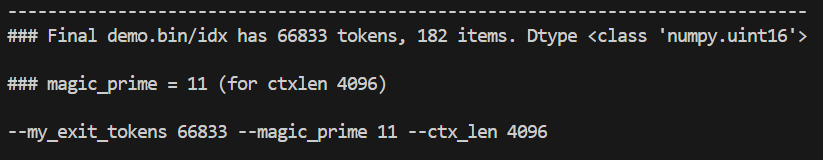
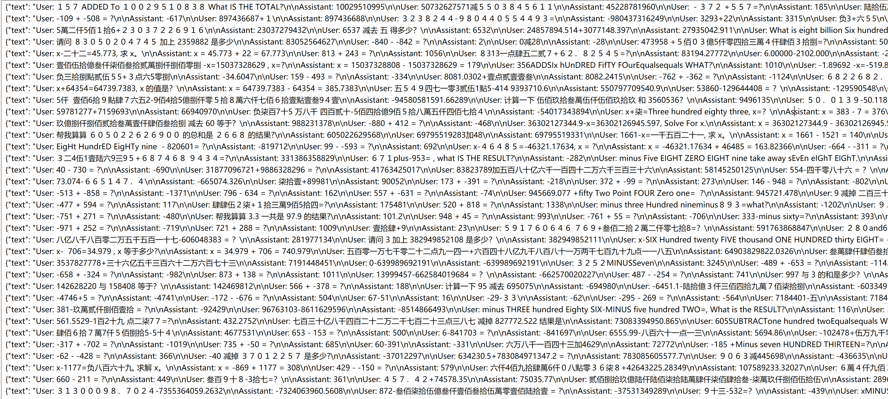
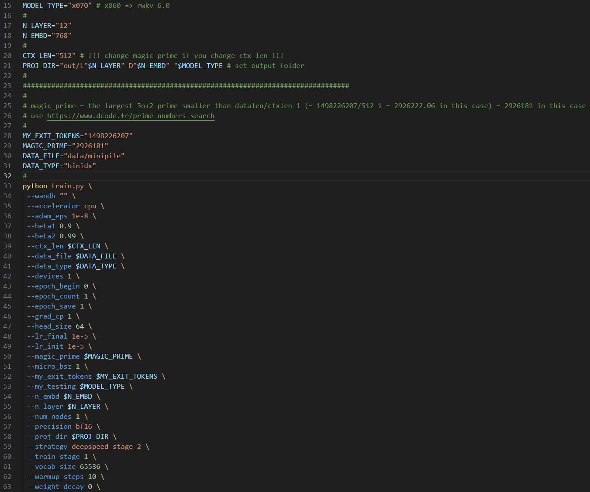
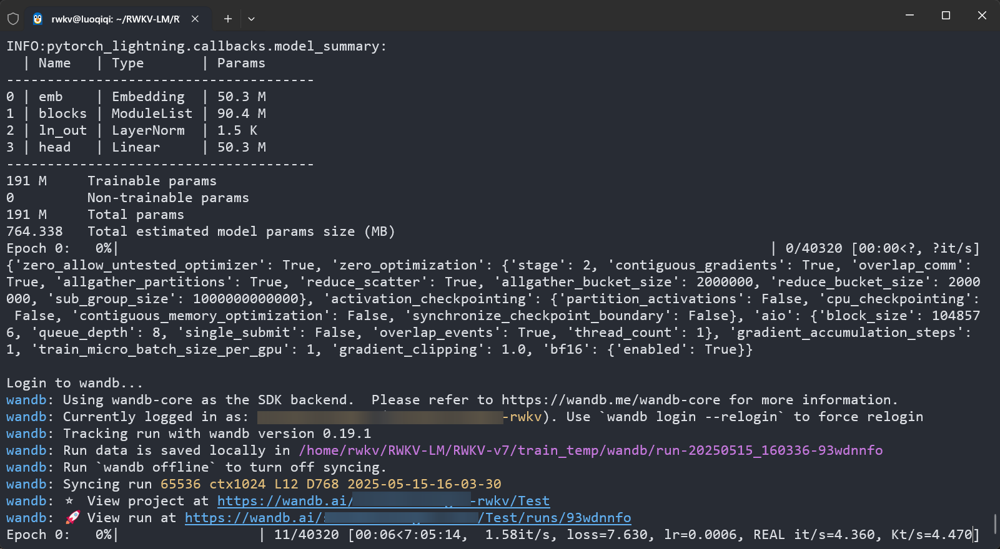
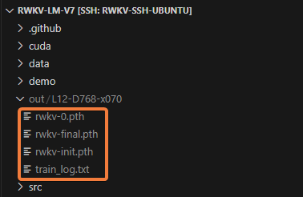
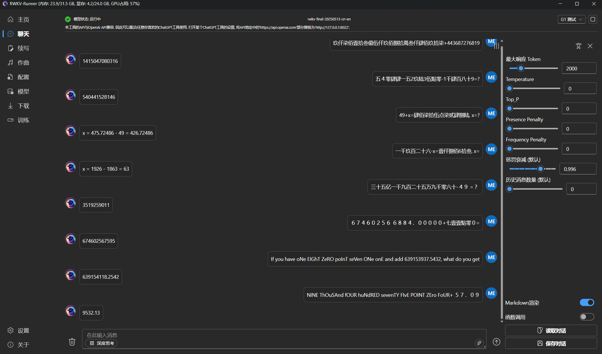
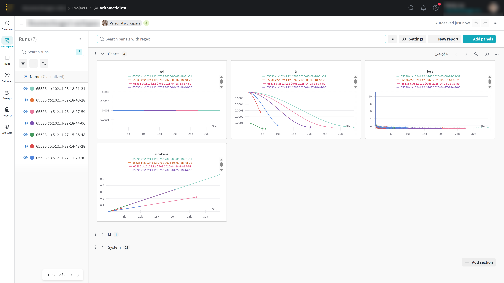

import React from 'react';
import { Accordion, Accordions } from 'fumadocs-ui/components/accordion';
import { CallOut } from 'components-docs/call-out/call-out.tsx'

预训练教程基于 [RWKV-LM-V7](https://github.com/RWKV-Vibe/RWKV-LM-V7) 仓库，训练流程和 RWKV 官方模型完全一致。

## 预训练案例[#showcase]

- [RWKV-7-Arithmetic-0.1B](https://huggingface.co/shoumenchougou/RWKV-7-Arithmetic-0.1B)：基于 RWKV-7 架构预训练的 0.1B 模型，实现基础加减法运算和加减法方程求解功能。

## 视频教程

<div className="iframe-container">
 <iframe 
 src="https://player.bilibili.com/player.html?isOutside=true&aid=115535358461762&bvid=BV1bNCjBKEb7&cid=33939328019&high_quality=1&autoplay=0"
 scrolling="no"
 frameBorder="0"
 allowFullScreen={true}
 sandbox="allow-top-navigation allow-same-origin allow-forms allow-scripts"
>
</iframe>
</div>
<CallOut type="info">
高画质视频请[跳转到 B 站](https://www.bilibili.com/video/BV1bNCjBKEb7?t=0.0)观看。
</CallOut>

## 硬件需求[#hardware-requirements]

预训练需要的显存**比微调训练要高得多**。

以下是 `micro_bsz="1"`，`CTX_LEN="4096"`，预训练不同参数的 RWKV 模型所需的显存：

| 模型参数 | 层数 | 维度 | 显存需求                                     |
| -------- | ---- | ---- | -------------------------------------------- |
| 0.1B     | 12   | 768  | 6540MB（6.39GB）  BSZ=8 23634MB（23.08GB）   |
| 0.4B     | 24   | 1024 | 12414MB（12.12GB）  BSZ=6 23046MB（22.51GB） |
| 1.5B     | 24   | 2048 | 42104MB（41.12GB）                           |
| 3B       | 32   | 2560 | 91354MB（89.21GB）                           |
| 7B       | 32   | 4096 | 4*4090 OOM                                   |
| 14B      | 61   | 4096 | 4*4090 OOM                                   |

## 克隆仓库[#clone-repo]

```bash
git clone https://github.com/RWKV-Vibe/RWKV-LM-V7.git
# 或者国内镜像仓库
git clone https://gitee.com/rwkv-vibe/RWKV-LM-V7.git
```
无法克隆？复制并依次运行以下命令，下载 RWKV-LM-V7 仓库压缩包并解压：

```bash
wget -O rwkv.zip https://github.com/RWKV-Vibe/RWKV-LM-V7/archive/refs/heads/main.zip && \
unzip -q rwkv.zip && \
rm rwkv.zip
```
<CallOut type="warning">
使用 zip 下载的代码仓库不含 git 信息，无法使用 `git pull` 更新仓库
</CallOut>

## 准备训练环境[#prepare-env]

1. 安装 CUDA Toolkit

请参考 [**CUDA Toolkit 安装文档**](https://developer.nvidia.com/cuda-downloads)，根据您的操作系统安装  CUDA Toolkit。

以下是 Ubuntu 24.04  x86_64 的安装示例：
```bash
# 下载 CUDA 仓库的 GPG 密钥包 
wget https://developer.download.nvidia.com/compute/cuda/repos/ubuntu2404/x86_64/cuda-keyring_1.1-1_all.deb
# 安装 GPG 密钥包，使系统信任 NVIDIA 的软件仓库
sudo dpkg -i cuda-keyring_1.1-1_all.deb
# 更新 apt 软件包列表，更新 NVIDIA CUDA 软件源
sudo apt-get update
# 安装 CUDA Toolkit 13.0（包含 nvcc 编译器、开发库、工具链等）
sudo apt-get -y install cuda-toolkit-13-0 
```

2. 使用 miniforge 等 conda 兼容包管理器，创建一个全新的虚拟环境

以下是 MiniConda-Linux x86_64 的安装和环境创建示例：

``` bash 
# 下载最新的 MiniConda 安装包
wget https://repo.anaconda.com/miniconda/Miniconda3-latest-Linux-x86_64.sh
# 运行 MiniConda 安装包的安装脚本，安装期间一定要注意进展，及时输入 yes  ！
sh Miniconda3-latest-Linux-x86_64.sh -u
# 重启环境变量，激活 Conda 环境
source ~/.bashrc
# 创建名为 rwkv-lm-v7 的 conda 环境, 并指定 python 版本为 3.12
conda create -n rwkv-lm-v7 python=3.12
# 激活 rwkv 环境
conda activate rwkv-lm-v7
```

3. 安装下列依赖，注意 `pytorch-lightning` 固定使用了 `1.9.5` 版本，此为本仓库特性，请不要升级此依赖包。

```bash
pip3 install torch torchvision torchaudio --index-url https://download.pytorch.org/whl/cu128
# 安装 CUDA 版本的 PyTorch，这里的 cu128 指的是 CUDA 12.8 版本，可以根据你自己的 CUDA 版本进行调整
pip3 install -r requirements.txt
```
<CallOut type="info">
下载缓慢？尝试在命令后添加 `-i https://mirrors.aliyun.com/pypi/simple` 参数，使用阿里源加快下载速度。
</CallOut>

安装完成后，使用以下命令验证 pytorch 和 CUDA 版本：

```bash
python -c "import torch; print(torch.__version__, torch.cuda.is_available())"
```
输出为 `2.7.1+cu128 True`，表示已安装 CUDA 12.8 版本的 pytorch 2.7.1， CUDA 12.8 工具包可用。

## 准备训练数据[#prepare-dataset]

请参考[准备训练数据](./Fine-Tune/FT-Dataset.mdx) 文档，准备一个 `jsonl` 格式的预训练数据集，并将其放在 `RWKV-LM-V7/data` 目录下。

<Accordions type="single">
  <Accordion title="已经有转换好的 binidx 数据，如何查看 my_exit_tokens 和 magic_prime？">
`data/compute_magic_prime.py` 脚本可为指定的 binidx 数据集和上下文长度（ctx_len）计算正确的 `--my_exit_tokens` 和 `--magic_prime` 值。

1. 在 `data/compute_magic_prime.py` 中修改你的训练数据集路径和上下文长度（`DATA_NAME` 和 `CTX_LEN`）

2. 打开终端， 在 `data` 目录下使用下列命令运行脚本
```
python compute_magic_prime.py
```

最终输出类似于：

```bash
### Loading /home/rwkv/RWKV-LM-V7/data/demo

### /home/rwkv/RWKV-LM-V7/data/demo.bin/idx has 200499 tokens, 546 items. Dtype <class 'numpy.uint16'>

### magic_prime = 47 (for ctxlen 4096)

--my_exit_tokens 200499 --magic_prime 47 --ctx_len 4096
```
  </Accordion>
</Accordions>

在 `RWKV-LM-V7/data` 目录中运行以下命令，将 `jsonl` 数据文件转成 `binidx` 格式：

``` bash 
python make_data.py demo.jsonl 30 4096
```
命令中的 `30` 表示复制次数，`4096` 表示上下文长度。`make_data.py` 将执行以下操作：

- 对 `demo.jsonl` 进行 30 次复制和打乱
- 加载复制后的 `demo.jsonl` 并基于 `rwkv_vocab_v20230424` 词表进行分词
- 把数据保存为 `binidx` 格式文件：`demo.bin` 和 `demo.idx`
- 针对 4096 上下文长度，计算出预训练所需的 `my_exit_tokens` 和 `magic_prime` 参数



<CallOut type="warning">
务必保存命令行输出的 `--my_exit_tokens`、`--magic_prime` 和 `--ctx_len` 参数，**这些参数会在后续的预训练步骤中频繁使用**。
</CallOut>

<CallOut type="info">
在此示例中，我们将使用一个混合了中文/大写中文、英文、半角/全角阿拉伯数字、正负数、小数的**加减法多轮对话数据集**，预训练一个 RWKV-7 0.1B 加减法模型。


</CallOut>

## 初始化 RWKV 模型[#init-model]

<CallOut type="info">
在开始预训练之前，我们需要初始化一个 RWKV 模型，作为预训练的起点。
</CallOut>

使用文本编辑器打开 `RWKV-LM-V7` 目录的 `demo-training-prepare.sh` 脚本，修改以下初始化参数：

| 参数                               | 参数解释                                                                                                       |
| ---------------------------------- | -------------------------------------------------------------------------------------------------------------- |
| `MODEL_TYPE="x070"`                | 训练的**模型版本**，建议使用 RWKV-7 架构，训练 RWKV-6 则填 x060                                                    |
| `N_LAYER="12"` `N_EMBD="768"`      | **模型层数和维度**，维度和层数决定预训练模型的参数大小，建议参考[硬件需求](#硬件需求)修改，N_EMBD 必须 64 的倍数 |
| `CTX_LEN="4096"`                   | 预训练的**上下文长度**，必须是 512 的倍数。必须和上面准备训练数据时输出的 `--ctx_len` 参数相同                                 |
| `data_file`                        | 预训练的**数据路径**，使用已转换的 bin 和 idx 数据，无需文件名后缀                                                 |
| `--my_exit_tokens`                 | 训练数据集的**总 token 数**，会在全部 token 训练完毕后退出，在 `make_data.py` 中计算得到                                    |
| `--magic_prime`                    | 训练数据集的**magic_prime 值**，在 `make_data.py` 中计算得到                                                        |

其余参数请**保持默认值**，修改完毕保存 `demo-training-prepare.sh` 文件，然后在 `RWKV-LM-V7` 目录打开终端，并在终端运行 `sh demo-training-prepare.sh` 命令初始化 RWKV 模型。



## 预训练阶段[#pretrain]

### 调整训练参数[#adjust-params]

初始化完成后，使用文本编辑器打开 `RWKV-LM-V7` 目录的 `demo-training-run.sh` 脚本，修改训练参数。

**这些训练参数必须和初始化阶段保持一致：**

| 参数                               | 参数解释                                                                                                       |
| ---------------------------------- | -------------------------------------------------------------------------------------------------------------- |
| `MODEL_TYPE="x070"`                | 训练的**模型版本**，建议使用 RWKV-7 架构，训练 RWKV-6 则填 x060                                                    |
| `N_LAYER="12"` `N_EMBD="768"`      | **模型层数和维度**，维度和层数决定预训练模型的参数大小，建议参考[硬件需求](#硬件需求)修改，N_EMBD 必须 64 的倍数 |
| `CTX_LEN="4096"`                   | 预训练的**上下文长度**，必须是 512 的倍数。                                  |
| `data_file`                        | 预训练的**数据路径**，使用已转换的 bin 和 idx 数据，无需文件名后缀                                                 |
| `--my_exit_tokens`                 | 训练数据集的**总 token 数**，会在全部 token 训练完毕后退出，在 `make_data.py` 中计算得到                                    |
| `--magic_prime`                    | 训练数据集的**magic_prime 值**，在 `make_data.py` 中计算得到                                                        |

**其他训练参数的解释和参考值如下：**
<CallOut type="warning">
部分参数会影响显存占用和训练速度，修改前请确保正确理解参数含义。
</CallOut>

| 参数                           | 参数解释                                                                                                                                                                          |
| ------------------------------ | ------------------------------------------------------------------------------------------------------------------------------------------------------------------------------ |
| `PROJ_DIR`                     | 模型输出目录，必须和预训练阶段保持一致，建议保持默认                                                                                                                           |
| `M_BSZ=16`                     | 建议为 2 的幂，越大越好，显存不够为止。                                                                                                                                        |
| `LR_INIT="6e-4"`               | **初始学习率，计算公式为 `0.45 / N_EMBD` 并适当取整。** 比如 L12-D768 0.1B 模型，初始学习率为 `0.45/768=0.0005859375`，取整为 `6e-4`。继续预训练的学习率和从头预训练稍有不同。 |
| `LR_FINAL="6e-5"`              | **最终学习率，计算公式为 `0.04 / N_EMBD` 并适当取整。**                                                                                                                        |
| `GRAD_CP=1`                    | 梯度累积步数，`GRAD_CP=1` 节省显存，`GRAD_CP=0` 加快训练但消耗更多显存                                                                                                         |
| `EPOCH_SAVE=10`                | 每隔多少个 "miniepochs" 保存一次训练模型（1 miniepoch = 40320 * ctx_len tokens）                                                                                               |
| `epoch_steps`                  | 不存在，会自动根据 M_BSZ 等参数进行计算，计算公式为 `epoch_steps = 40320 / M_BSZ / N_NODE / GPU_PER_NODE `。                                                                   |
| `N_NODE=1`                     | 节点数，通常保持默认值 `1`                                                                                                                                                     |
| `GPU_PER_NODE=1`               | 每个节点上的 GPU 数量，单显卡填 `1`，多卡则改为实际数量                                                                                                                        |
| `DS_BUCKET_MB=2`               | deepspeed bucket size（单位 MB），消费级 GPU 设置 `2`，A100 / H100 设置为 `200`                                                                                                |
| `--load_model "0"`             | 保持默认值 `0`。训练中断后，继续训练会自动检测最新检查点                                                                                                                       |
| `--wandb "Test"`               | **建议注册一个 WandB 账号并填写你的项目名称，以便观察和比较 loss。详情查看附录 [使用 WandB 监控训练过程](#使用-wandb-监控训练过程)**                                                             |
| `--train_stage 3`              | 预训练阶段，保持默认值 `3`。                                                                                                                                                   |
| `--epoch_count 999999`         | 总训练轮次，该参数不生效。训练进程会在达到 `--my_exit_tokens` 指定的 tokens 数量后自动退出                                                                                     |
| `--epoch_begin 0`              | 初始训练轮次，始终写 `0`，自动加载最新的检查点                                                                                                                                 |
| `--warmup_steps 10`            | 预热步骤，应当根据优化器和学习率的选取进行实验                                                                                                                                 |
| `--beta1 0.9`                  | Adam 优化器 beta1 参数，保持默认值                                                                                                                                             |
| `--beta2 0.99`                 | Adam 优化器 beta2 参数，保持默认值                                                                                                                                             |
| `--adam_eps 1e-18`             | Adam 优化器的 epsilon 参数，小的 epsilon 更稳定，保持默认值即可                                                                                                                |
| `--data_type binidx`           | 训练语料的文件格式，建议使用 `binidx` 格式的数据，其他格式的支持没有经过全面验证                                                                                               |
| `--vocab_size 65536`           | 词表大小，默认为 `65536`。设为 0 则模型自动确定词汇表大小，适用于 char-level LM 和 `.txt` 数据                                                                                 |
| `--weight_decay 0.001`         | 权重衰减，保持默认值 `0.001`                                                                                                                                                   |
| `--head_size 64`               | 头大小，保持默认值 `64`                                                                                                                                                        |
| `--accelerator gpu`            | 加速器类型，必须是 `gpu`                                                                                                                                                       |
| `--precision bf16`             | 训练精度，默认为 `bf16`，也支持 `fp32`, `tf32`                                                                                                                                 |
| `--strategy deepspeed_stage_2` | **训练策略，默认 deepspeed_stage_2**，更多训练策略请参考[DeepSpeed 训练策略](#deepspeed-训练策略)                                                                              |
| `--enable_progress_bar True`   | 是否在终端显示进度条，通常保持默认值 `True`                                                                                                                                    |


### 开始预训练[#start-pretrain]

训练参数调整完毕后，保存 `demo-training-run.sh` 文件，并在 `RWKV-LM-V7` 目录下运行 `sh demo-training-run.sh` 命令开启预训练。

如果你在训练参数中配置了 `--wandb "Test"`，开启训练后可访问终端中的 WandB 链接（`https://wandb.ai/xxx`），可视化查看当前训练的 loss 曲线等信息。



## 测试预训练模型[#test-pretrain-model]

预训练完成后，在 `RWKV-LM-V7/out` 目录中可以找到训练的中间检查点 `rwkv-0/1/2/...pth` 和最终模型文件 `rwkv-final.pth`。



可以使用 [RWKV Runner](../intermediate/RWKV-Runner/Introduction.md) 或者 [RWKV pip - API_DEMO_CHAT.py](../intermediate/RWKVpip.mdx) 脚本测试预训练模型。除了最终模型文件 `rwkv-final.pth`，也可以测试最后几个模型检查点。



## 基于官方 RWKV 模型继续预训练

初始化 RWKV 模型时会获得一个 `rwkv-init.pth` 初始化检查点。运行 `sh demo-training-run.sh` 命令时，训练程序会从这个初始化检查点开始训练。

利用这个原理，我们可以将 **RWKV 官方模型**改成 `rwkv-init.pth`，替换初始化目录中的检查点，以实现从 RWKV 官方模型继续预训练。

<CallOut type="tips">
从 RWKV 官方模型继续训练时，需要确保 `demo-training-run.sh` 脚本中的训练参数 `N_LAYER` / `N_EMBD` 和 RWKV 模型的层数、维度完全对齐。
</CallOut>
 
| RWKV 模型参数 | 层数 `N_LAYER` | 维度 `N_EMBD` | 
| -------- | ---- | ---- |
| 0.1B     | 12   | 768  |
| 0.4B     | 24   | 1024 | 
| 1.5/1.6B     | 24   | 2048 | 
| 2.9/3B       | 32   | 2560 | 
| 7/7.2B       | 32   | 4096 | 
| 13.3/14B      | 61   | 4096 |

<CallOut type="warning">
继续预训练 RWKV7-G1 模型时，请手动对齐 `src/model.py` 文件 [Line 126](https://github.com/BlinkDL/RWKV-LM/blob/main/RWKV-v7/train_temp/src/model.py#L126) 处的 LORA 维度，确保 LORA 维度与 RWKV 模型参数完全对齐。
</CallOut>

| | params | 0.1B | 0.4B | 1.5B | 2.9B | 7.2B | 13.3B |
| :--- | :--- | :--- | :--- | :--- | :--- | :--- | :--- |
| **D_DECAY_LORA** | w | 64 | 64 | 96 | 96 | 128 | 192 |
| **D_AAA_LORA** | a | 64 | 64 | 96 | 96 | 128 | 192 |
| **D_MV_LORA** | v | 32 | 32 | 64 | 64 | 96 | 128 |
| **D_GATE_LORA** | g | 128 | 128 | 256 | 320 | 480 | 384 |

## 附录[#appendix]

### DeepSpeed 训练策略[#deepspeed]

DeepSpeed 支持以下五种[训练策略](https://www.deepspeed.ai/tutorials/zero/#zero-overview)：

| 策略名称 | 显存占用 | CPU 占用 | 训练速度 | 适用场景 | 特点说明 |
|---|:---:|:---:|:---:|---|---|
| stage_1 | 较高 | 低 | 最快 | 显存较为充足的训练集群 | 仅分片优化器状态，稳定高效，吞吐最佳 |
| stage_2 | 中等 | 低 | 较快 | 消费级/科研机，显存不算充裕 | 分片优化器 + 梯度，显存更省，吞吐略受影响 |
| stage_2_offload | 较低 | 中 | 中等 | 显存有限但 CPU 较强 | 将优化器状态 offload 到 CPU/NVMe，显存大幅下降，但通信变多 |
| stage_3 | 很低 | 中 | 中等～偏慢 | 大模型（>7B）必需 | 分片参数本身，省显存，但通信复杂 |
| stage_3_offload | 最低 | 高 | 最慢 | 极小显存 + 强 CPU/NVMe | 显存最低，但训练速度依赖带宽，显著变慢 |

对于**多 GPU、大 Batch、全参数更新**的全参微调/预训练场景，**`deepspeed_stage_2` 是综合考虑了节约显存、保留训练性能、轻松部署的最佳折中点。**

<CallOut type="tips">
在 LoRA 等参数高效微调场景中，推荐 `deepspeed_stage_1` 。
</CallOut>

参考文档：
- [DeepSpeed Zero Redundancy Optimizer](https://www.deepspeed.ai/tutorials/zero/#zero-overview)
- [DeepSpeed ZeRO-Offload](https://www.deepspeed.ai/tutorials/zero-offload/)
- [DeepSpeed ZeRO-3 Offload](https://www.deepspeed.ai/2021/03/07/zero3-offload.html)

### 使用 WandB 监控训练过程[#wandb]
<CallOut type="info">
WandB 是一个用于实验跟踪和模型评估的工具，可以帮助我们更好地监控训练过程和 loss 数据。
</CallOut>

**使用 WandB 监控训练过程：**

1. 访问 [WandB 官网](https://wandb.ai)，点击 "Sign up" 按钮注册一个 WandB 账号（可以使用邮箱、GitHub、Google 等方式注册）
2. 注册成功后，点击右上角头像进入 “Settings” 页面，在 “API Keys” 栏中点击 “+ New Key” 创建一个新的 API Key，并复制下来
3. 在你的训练设备打开终端，运行 `wandb login` 命令，粘贴你复制的 API Key，按回车确认
4. 在训练脚本中添加 `--wandb "Test"` 参数，训练日志上传到你的 WandB 项目页面，项目名为 Test
5. 你可以在 WandB 主页中点击该项目，实时查看训练过程中的损失（loss）曲线、学习率变化等指标



### 常见问题[#faq]

<Accordions type="single">
  <Accordion title="训练中断了，如何继续训练？">
    重新运行 `sh demo-training-run.sh` 命令，训练程序会自动检测最新检查点并继续训练。

    注意，多次中断会造成 loss 的损失，每次中断损失约为 0.0008。
  </Accordion>
  <Accordion title="训练速度太慢，如何加快训练？">
    - 在显存允许的情况下，尽可能增大 `M_BSZ` 参数，增大 `M_BSZ` 会增大显存占用，但也会加快训练速度
    - 确保 `deepspeed_stage_2` 训练策略，该策略在显存和速度之间取得了最佳平衡
    - 确保打开了梯度累积 `GRAD_CP=1` 节省显存，`GRAD_CP=0` 虽然可加快训练，但消耗更多显存
  </Accordion>
  <Accordion title="出现 AssertionError 或者 IndexError: list index out of range 错误">
    - 确认已初始化一个 `rwkv-init` 模型
    - 检查 `data_file` 参数是否正确，确保数据文件路径存在且可访问
    - 检查 `CTX_LEN` 参数是否和 `make_data.py` 时使用的上下文长度一致
    - 检查 `my_exit_tokens` 和 `magic_prime` 参数是否和 `make_data.py` 时得到的参数一致
  </Accordion>
</Accordions>