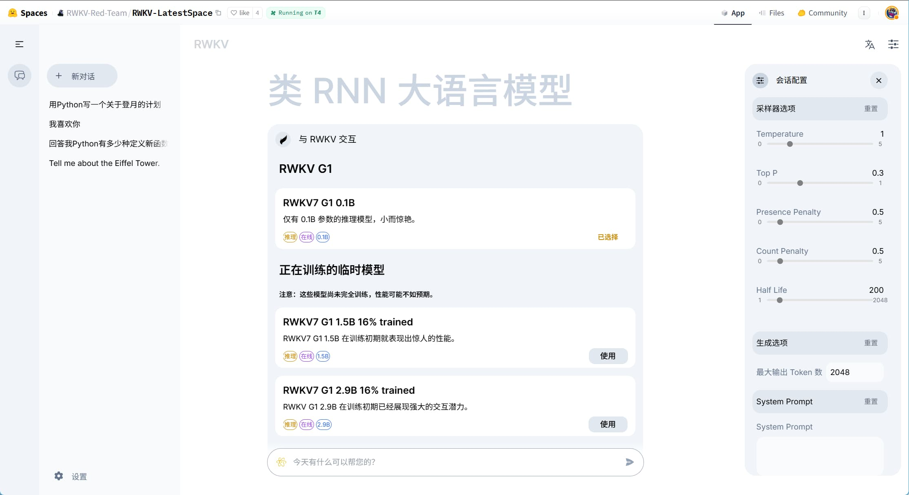
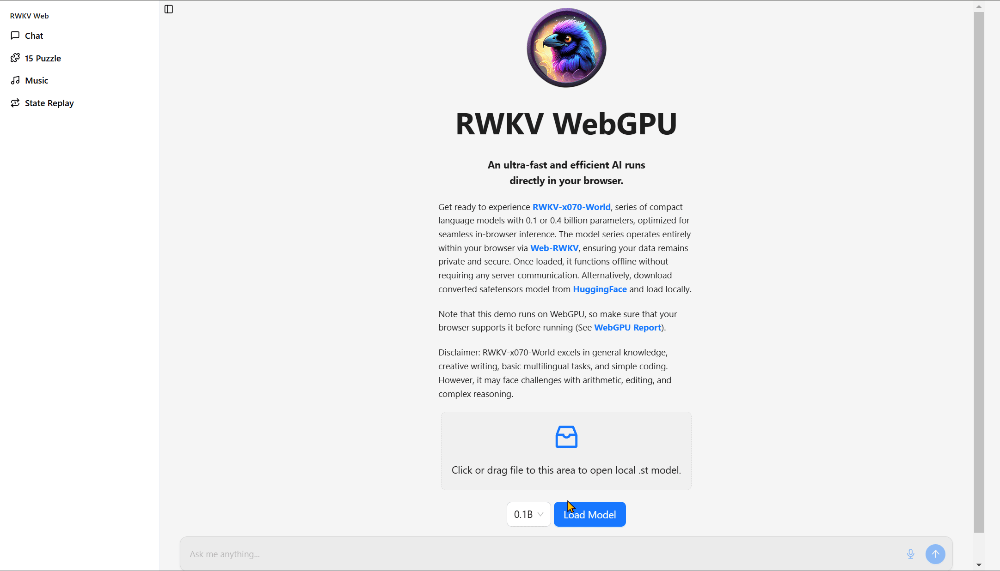
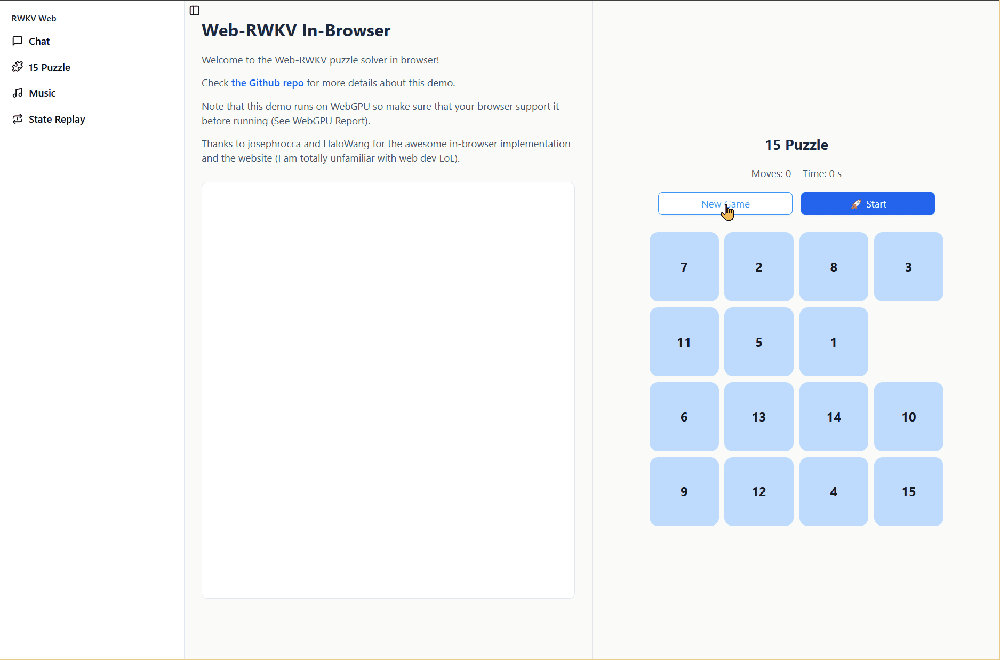
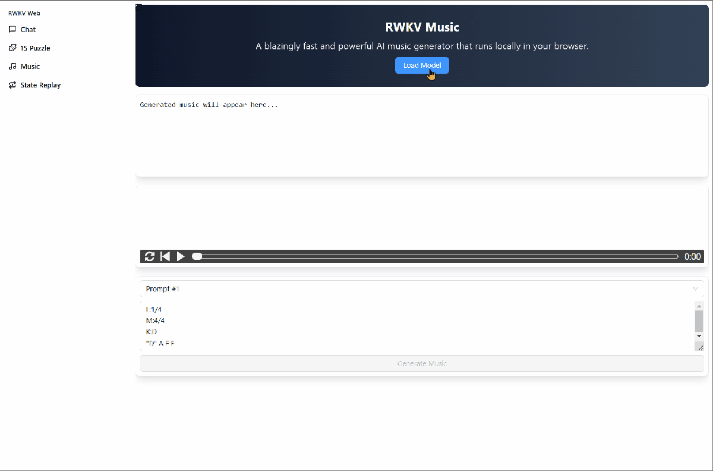
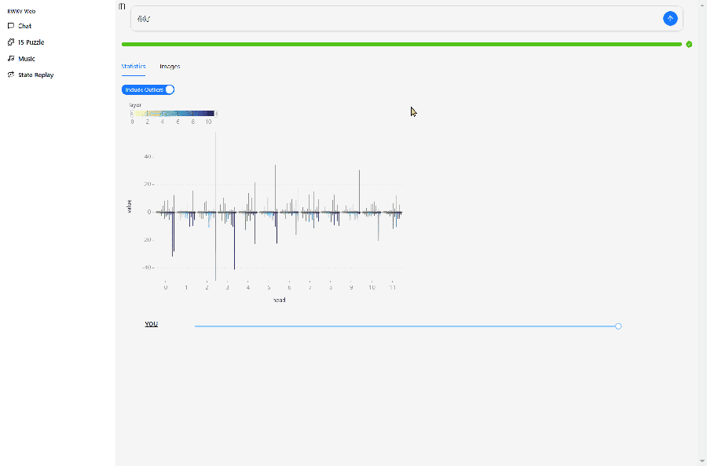

import { Tab, Tabs } from 'fumadocs-ui/components/tabs'
import { CallOut } from 'components-docs/call-out/call-out.tsx'

以下内容可指引你体验 RWKV 模型（在线服务或本地部署）：

在体验 RWKV 模型之前，推荐阅读以下两个章节：

<Cards>
  <Card  title="RWKV 的解码参数" href="./RWKV-Parameters" />
  <Card  title="RWKV 的提示词格式" href="./Prompt-Format" />
</Cards>

## RWKV 模型在线 DEMO[#RWKV-Online-Demo]

如果你只是想简单尝试一下 RWKV 模型，可以尝试由 RWKV 官方部署在各大模型平台的演示 Demo：

### 在线 DEMO 视频教程

<div className="iframe-container">
 <iframe 
 src="https://player.bilibili.com/player.html?isOutside=true&aid=114199304864645&bvid=BV1dhXrY7ELs&cid=28985331109&poster=1&p=0&high_quality=1&autoplay=0"
 scrolling="no"
 frameBorder="0"
 allowFullScreen={true}
 sandbox="allow-top-navigation allow-same-origin allow-forms allow-scripts"
>
</iframe>
</div>
<CallOut type="info">
高画质视频请[跳转到 B 站](https://www.bilibili.com/video/BV1dhXrY7ELs)观看。
</CallOut>

### 对话模式 Demo[#Chat-Mode]

我们也提供了 **RWKV-7 G1 系列推理模型**的在线对话 Demo：

<Cards>
  <Card  title="RWKV-7 G1 系列推理模型（Hugging Face 平台）" href="https://huggingface.co/spaces/RWKV-Red-Team/RWKV-LatestSpace" />
  <Card  title="RWKV-7 G1 系列推理模型（魔搭平台）" href="https://modelscope.cn/studios/RWKV-Red-Team/RWKV-LatestSpace/summarye" />
</Cards>

可在此 Demo 体验已完成训练的 RWKV-7 G1 0.1B 模型，也可以切换到其他**正在训练中的 G1 模型**，如训练中的 G1 1.5B/2.9B 模型。



<CallOut type="info">
这个精美的 RWKV 对话界面由 RWKV 社区成员 [@Leon](https://leoncat.top/) 开源，仓库地址：[web-rwkv-realweb](https://github.com/SolomonLeon/web-rwkv-realweb)。
</CallOut>


### Hugging Face 续写模式[#Hugging-Face-Online-Demo]

<Cards>
  <Card  title="RWKV-7 G1 2.9B 推理模型" href="https://huggingface.co/spaces/BlinkDL/RWKV-Gradio-2" /> 
  <Card  title="RWKV-7 G1 2.9B 推理模型" href="https://huggingface.co/spaces/BlinkDL/RWKV-Gradio-1" />
</Cards>

### ModelScope 续写模式[#ModelScope-Online-Demo]

<Cards>
  <Card  title="RWKV-6-World-7B-v3" href="https://modelscope.cn/studios/BlinkDL/RWKV-CHN-PRO" />
  <Card  title="RWKV-7-World-2.9B（推荐）" href="https://modelscope.cn/studios/Blink_DL/RWKV-Gradio-1" />
</Cards>

<CallOut type="warning">
上述公共 Demo 只能使用续写模式，不支持直接对话。
</CallOut>

如果你在公共 Demo 中体验 RWKV 模型，建议按 RWKV 的两种标准格式输入 prompts：

```bash copy
User: 请将下列瑞典语 hur l?ng tid tog det att bygga twin towers 翻译成中文

Assistant:
```

```bash copy
Instruction: 请将下列瑞典语翻译成中文

Input: hur l?ng tid tog det att bygga twin towers

Response:
```

对于 **RWKV-7 G1 系列推理模型**，可以在 QA prompt 中添加 **`<think>` 标签**开启模型的推理过程：

``` bash copy
User: simulate SpaceX mars landing using python
 
Assistant: <think
```


### RWKV WebGPU Demo[#RWKV-WebGPU-Demo]

基于 [web-rwkv](https://github.com/cryscan/web-rwkv "web-rwkv") 的 [RWKV WebGPU Demo](https://cryscan.github.io/web-rwkv-puzzles/#/chat "RWKV WebGPU Demo") 由社区开发。

**无需下载任何应用**，RWKV WebGPU Demo 在浏览器中**本地运行 RWKV-7 模型**，支持**聊天**、**解 15 谜题**、**音乐作曲**，以及**可视化查看 state 变化**等功能！

加载模型后，RWKV 模型将在浏览器中离线运行，不需要任何服务器通信。

**对话功能**

在 chat 界面选择一个 RWKV-7-World 模型（0.1B 或 0.4B），点击 Load Model 按钮，即可下载并运行模型进行对话。

也可以从**本地目录**拖动一个 RWKV-7-World 模型（`.st` 格式）到灰框内运行，省略下载的过程。



**解 15 谜题**

<CallOut type="info">
15 谜题（也叫数字推盘游戏或 15 数码）是一个经典的滑块益智游戏，玩家需要在一个 4x4 的方格中放置 1-15 数字并留一个空格，然后通过滑动数字将数字按顺序排列。
</CallOut>

在 Demo 的 15 puzzle 界面点击 `New Game` 按钮，可以设置一局全新的 15 谜题。

点击 `start` 按钮，WebGPU Demo 会运行 RWKV-puzzle15 模型**自动**解开当前的 15 谜题，左侧则显示模型的 CoT 推理过程。



**作曲功能**

在 Demo 的 Music 界面，可以驱动 **RWKV ABC 模型**进行**作曲**。操作步骤：

1. 点击 `Load Model` 按钮下载作曲模型
2. 点击 `prompt`下拉框选择一个 ABC 格式的 prompt
3. 点击 `Generate Music` 按钮，开始作曲



**State 可视化**

在 Demo 的 State Replay 界面，可以查看 **RWKV 作为 RNN 模型的隐藏状态演变**。

<CallOut type="info">
State Replay 功能需要提前在 **chat 界面**启动一个 RWKV 模型。
</CallOut>

下图是对 RWKV-7-World-0.1B 模型输入 “你好” 后，模型的隐藏状态演化。

RWKV-7-World-0.1B 的设计是 L12-D768，所以我们可以在 State Replay 中查看模型 12 层的状态演化，每层按照 $64×64$  维度（一个 head）划分为 12 个可视化小方格。

小方格的颜色解释：

- 深蓝色：较低值或接近负数的数值
- 黄色：较高值或接近正数的数值
- 灰色或黑色：数值接近 0



## 本地部署 RWKV 模型[#Local-Deployment-of-RWKV-Model]

如果你希望在自己的设备上本地部署并使用 RWKV 模型，建议采用以下几种工具：

### RWKV Runner

RWKV Runner 是 RWKV 模型的管理和启动工具，由 RWKV 开源社区成员 josStorer 开发，它本身也是一个开源软件，且体积仅 10MB 左右（不含依赖项）。

用户可使用 RWKV Runner 轻松运行本地 RWKV 模型，体验各类 AI 功能，包括但不限于聊天、写作、MIDI/ABC 作曲交互等。

RWKV Runner 的具体用法可以参考 [RWKV Runner 使用教程](../intermediate/RWKV-Runner/Simple-Usage)。

### AI00 RWKV Server

Ai00 Server 是基于 web-rwkv 推理引擎的 RWKV 语言模型推理 API 服务器。它本身也是一个基于 MIT 协议的开源软件，由 RWKV 开源社区成员 @cryscan 和@顾真牛牵头成立的 Ai00-x 开发组开发。

Ai00 Server 支持 Vulkan 作为推理后端，支持 Vulkan 并行和并发批量推理，可以在所有支持 Vulkan 的 GPU 上运行。事实上， Ai00 Server 支持大部分 NVIDIA、AMD、Intel 的显卡（包括集成显卡）。

在高兼容性的同时，Ai00 Server 又不需要笨重的 pytorch 、 CUDA 和其他运行时环境。它结构紧凑，开箱即用，且支持 INT8/NF4 量化，可以在绝大部分的个人电脑上高速运行。

AI00 的具体用法可以参考 [Ai00 使用教程](../intermediate/ai00/Simple-Usage)。

### ChatRWKV

ChatRWKV 是 RWKV 官方的聊天机器人项目，但无图形化界面。你可能需要一定的命令行知识才能使用 ChatRWKV。

[ChatRWKV 仓库地址](https://github.com/BlinkDL/ChatRWKV)

## 本地部署 RWKV 模型的性能需求[#VRAM-of-RWKV]

推荐使用 **FP16** 精度在本地部署并推理 RWKV 模型。当你的显存和内存不足时，可以使用 **INT8 或 NF4 等量化方法**运行 RWKV 模型，降低显存和内存需求。

<CallOut type="info">
从回答质量来说，同参数的模型 FP16 回答质量最好，INT8 与 FP16 质量相当，NF4 回答质量相比 INT8 明显降低。

模型的参数比量化更重要，比如 7B 模型 + INT8 量化，生成效果比 3B 模型 + FP16 更好。
</CallOut>

以下是本地部署并运行 RWKV 模型的显存需求和生成速度：

<Tabs items={['显存需求', '生成速度']}>
  <Tab>

以下是不同推理后端和对应量化方式（**默认量化所有层**）的显存/内存需求：

<CallOut type="info">
测试环境：

- CPU ：i7-10870H
- GPU： RTX 3080 Laptop ，16G 显存
- 内存：32G
</CallOut>

| 推理后端 | 1B6 模型 | 3B 模型 | 7B 模型 | 14B 模型 |
| --- | --- | --- | --- | --- |
| CPU-FP32 | 6.6G内存 | 12G内存 | 21G内存 | OOM（不建议使用） |
| rwkv.cpp-FP16 | 3.5G内存 | 7.6G内存 | 15.7G内存 | 30G（内存） |
| rwkv.cpp-Q5_1 | 2G内存 | 3.7G内存 | 7.2G内存 | 12.4G（内存） |
| CUDA-FP16 | 3.2G显存 | 6.2G显存 | 14.3G显存 | 约28.5G显存 |
| CUDA-INT8 | 1.9G显存 | 3.4G显存 | 7.7G显存 | 15G显存 |
| webgpu-FP16 | 3.2G显存 | 6.5G显存 | 14.4G显存 | 约29G显存 |
| webgpu-INT8 | 2G显存 | 4.4G显存 | 8.2G显存 | 16G显存（量化41层，60层约14.8G） |
| webgpu-NF4 | 1.3G显存 | 2.6G显存 | 5.2G显存 | 15.1G显存（量化41层，60层约10.4G） |
| webgpu(python)-FP16 | 3G显存 | 6.3G显存 | 14G显存 | 约28G显存  |
| webgpu(python)-INT8 | 1.9G显存 | 4.2G显存 | 7.7G显存 | 15G显存（量化41层） |
| webgpu(python)-NF4  | 1.2G显存 | 2.5G显存 | 4.8G显存 | 14.3G显存（量化41层） |
  </Tab>
  <Tab> 
不同推理后端/量化（**默认量化所有层**）的生成速度（单位：TPS，约等于每秒多少字）。

| 推理后端 | 1B6 模型 | 3B 模型 | 7B 模型 | 14B 模型 |
| --- | --- | --- | --- | --- |
| CPU-FP32 | 4.36 | 2.3 | 极慢 | OOM（不建议使用） |
| rwkv.cpp-FP16 | 8.6 | 4.5 | 2 | 1 |
| rwkv.cpp-Q5_1 | 14 | 8 | 3.7 | 2.1 |
| CUDA-FP16 | 25 | 18 | 15 |  |
| CUDA-INT8  | 22 | 16 | 18 | 7.4 |
| webgpu-FP16 | 45 | 38 | 21 | OOM，无法测试 |
| webgpu-INT8  | 60 | 44 | 30 | 18 |
| webgpu-NF4  | 60 | 47 | 34 | 20 |
| webgpu(python)-FP16 | 40 | 29 | 17 | OOM，无法测试 |
| webgpu(python)-INT8  | 45 | 35 | 23 | 15 |
| webgpu(python)-NF4  | 43 | 32 | 21 | 18 |
  </Tab>
</Tabs>

<CallOut type="info">
- CUDA、CPU 来自 [RWKV 官方 pip 包](https://pypi.org/project/rwkv/)
- rwkv.cpp 来自 [rwkv.cpp](https://github.com/RWKV/rwkv.cpp) 项目
- webgpu 来自 [web-rwkv](https://github.com/cryscan/web-rwkv) 项目，一个基于 webgpu 的 Rust 推理框架
- webgpu(python) 来自 [web-rwkv-py](https://github.com/cryscan/web-rwkv-py)，web-rwkv 项目的 Python 版本
</CallOut>

以上参数仅作为 RWKV 端侧推理的入门性能参考，随着量化层数等配置项的变化和显卡架构的新旧程度，模型的性能表现可能会改变。


