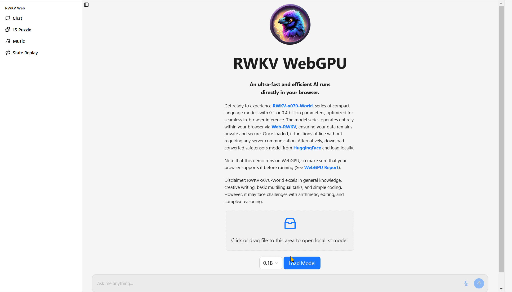
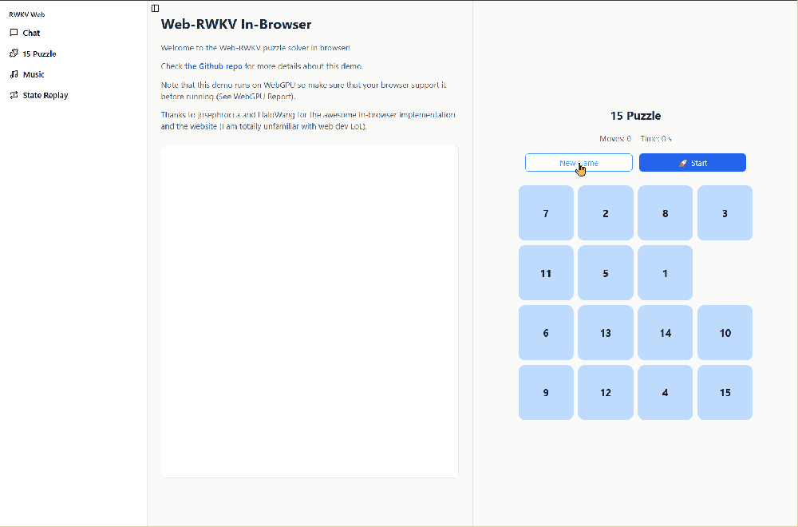
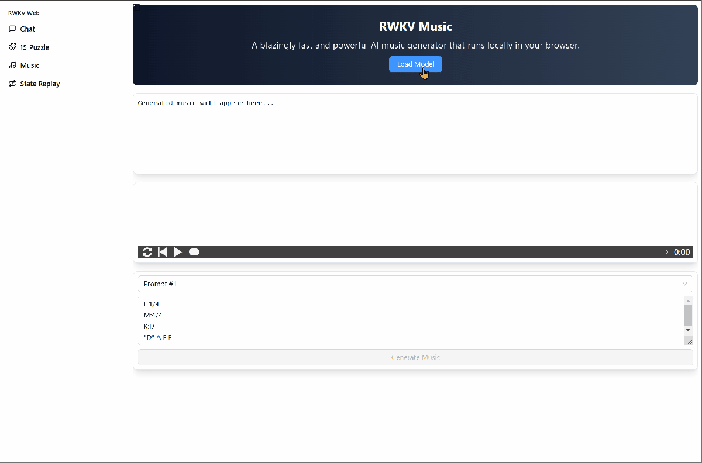
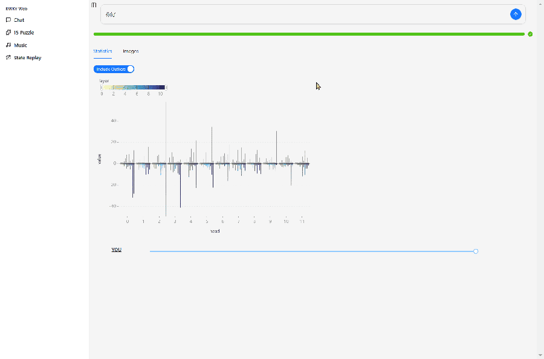

import { CallOut } from 'components-docs/call-out/call-out.tsx'

以下内容可指引你体验 RWKV 模型（在线服务或本地部署）：

在体验 RWKV 模型之前，推荐阅读以下两个章节：

<Cards>
  <Card  title="RWKV 的解码参数" href="./RWKV-Parameters" />
  <Card  title="RWKV 的提示词格式" href="./Prompt-Format" />
</Cards>

## RWKV 模型在线 DEMO[#RWKV-Online-Demo]

如果你只是想简单尝试一下 RWKV 模型，可以尝试由 RWKV 官方部署在各大模型平台的演示 Demo：

### 在线 DEMO 视频教程

<div className="iframe-container">
 <iframe 
 src="https://player.bilibili.com/player.html?isOutside=true&aid=114199304864645&bvid=BV1dhXrY7ELs&cid=28985331109&poster=1&p=0&high_quality=1&autoplay=0"
 scrolling="no"
 frameBorder="0"
 allowFullScreen={true}
 sandbox="allow-top-navigation allow-same-origin allow-forms allow-scripts"
>
</iframe>
</div>
<CallOut type="info">
高画质视频请[跳转到 B 站](https://www.bilibili.com/video/BV1dhXrY7ELs)观看。
</CallOut>

### 对话模式 Demo[#Chat-Mode]

如果希望直接聊天，优先使用当前的 RWKV Chat；如果希望观察原始续写和思考输出，可以使用官方 Gradio：

<Cards>
  <Card title="RWKV Chat" href="https://rwkv.halowang.cloud/" />
  <Card title="RWKV 官方 Gradio 1" href="https://huggingface.co/spaces/BlinkDL/RWKV-Gradio-1" />
  <Card title="RWKV 官方 Gradio 2" href="https://huggingface.co/spaces/BlinkDL/RWKV-Gradio-2" />
</Cards>

### Hugging Face 续写模式[#Hugging-Face-Online-Demo]

<Cards>
  <Card title="RWKV 官方 Gradio 1" href="https://huggingface.co/spaces/BlinkDL/RWKV-Gradio-1" />
  <Card title="RWKV 官方 Gradio 2" href="https://huggingface.co/spaces/BlinkDL/RWKV-Gradio-2" />
</Cards>

<CallOut type="warning">
上述两个 Gradio 以续写模式为主，不会像聊天客户端一样自动补全对话格式。
</CallOut>

如果你在公共 Demo 中体验 RWKV 模型，建议按 RWKV 的两种标准格式输入 prompts：

```bash copy
User: 请将下列瑞典语 hur lång tid tog det att bygga twin towers 翻译成中文

Assistant:
```

```bash copy
Instruction: 请将下列瑞典语翻译成中文

Input: hur lång tid tog det att bygga twin towers

Response:
```

对于 **RWKV7-G1 系列推理模型**，可以在 QA prompt 中添加 **`<think>` 标签**开启模型的推理过程：

``` bash copy
User: simulate SpaceX mars landing using python
 
Assistant: <think
```


### RWKV WebGPU Demo[#RWKV-WebGPU-Demo]

基于 [web-rwkv](https://github.com/cryscan/web-rwkv "web-rwkv") 的 [RWKV WebGPU Demo](https://cryscan.github.io/web-rwkv-puzzles/#/chat "RWKV WebGPU Demo") 由社区开发。

**无需下载任何应用**，RWKV WebGPU Demo 在浏览器中**本地运行 RWKV-7 模型**，支持**聊天**、**解 15 谜题**、**音乐作曲**，以及**可视化查看 state 变化**等功能！

加载模型后，RWKV 模型将在浏览器中离线运行，不需要任何服务器通信。

**对话功能**

在 chat 界面选择一个 RWKV-7-World 模型（0.1B 或 0.4B），点击 Load Model 按钮，即可下载并运行模型进行对话。

也可以从**本地目录**拖动一个 RWKV-7 模型（`.st` 格式）到灰框内运行，省略下载的过程。



**解 15 谜题**

<CallOut type="info">
15 谜题（也叫数字推盘游戏或 15 数码）是一个经典的滑块益智游戏，玩家需要在一个 4x4 的方格中放置 1-15 数字并留一个空格，然后通过滑动数字将数字按顺序排列。
</CallOut>

在 Demo 的 15 puzzle 界面点击 `New Game` 按钮，可以设置一局全新的 15 谜题。

点击 `start` 按钮，WebGPU Demo 会运行 RWKV-puzzle15 模型**自动**解开当前的 15 谜题，左侧则显示模型的 CoT 推理过程。



**作曲功能**

在 Demo 的 Music 界面，可以驱动 **RWKV ABC 模型**进行**作曲**。操作步骤：

1. 点击 `Load Model` 按钮下载作曲模型
2. 点击 `prompt`下拉框选择一个 ABC 格式的 prompt
3. 点击 `Generate Music` 按钮，开始作曲



**State 可视化**

在 Demo 的 State Replay 界面，可以查看 **RWKV 作为 RNN 模型的隐藏状态演变**。

<CallOut type="info">
State Replay 功能需要提前在 **chat 界面**启动一个 RWKV 模型。
</CallOut>

下图是对 RWKV-7-World-0.1B 模型输入 “你好” 后，模型的隐藏状态演化。

RWKV-7-World-0.1B 的设计是 L12-D768，所以我们可以在 State Replay 中查看模型 12 层的状态演化，每层按照 $64×64$  维度（一个 head）划分为 12 个可视化小方格。

小方格的颜色解释：

- 深蓝色：较低值或接近负数的数值
- 黄色：较高值或接近正数的数值
- 灰色或黑色：数值接近 0



## 本地部署 RWKV 模型[#Local-Deployment-of-RWKV-Model]

如果你希望在自己的设备上本地部署并使用 RWKV 模型，建议采用以下几种工具：

### RWKV Runner

RWKV Runner 是 RWKV 模型的管理和启动工具，由 RWKV 开源社区成员 josStorer 开发，它本身也是一个开源软件，且体积仅 10MB 左右（不含依赖项）。

用户可使用 RWKV Runner 轻松运行本地 RWKV 模型，体验各类 AI 功能，包括但不限于聊天、写作、MIDI/ABC 作曲交互等。

RWKV Runner 的具体用法可以参考 [RWKV Runner 使用教程](../intermediate/RWKV-Runner/Simple-Usage)。

### AI00 RWKV Server

Ai00 Server 是基于 web-rwkv 推理引擎的 RWKV 语言模型推理 API 服务器。它本身也是一个基于 MIT 协议的开源软件，由 RWKV 开源社区成员 @cryscan 和@顾真牛牵头成立的 Ai00-x 开发组开发。

Ai00 Server 支持 Vulkan 作为推理后端，支持 Vulkan 并行和并发批量推理，可以在所有支持 Vulkan 的 GPU 上运行。事实上， Ai00 Server 支持大部分 NVIDIA、AMD、Intel 的显卡（包括集成显卡）。

在高兼容性的同时，Ai00 Server 又不需要笨重的 pytorch 、 CUDA 和其他运行时环境。它结构紧凑，开箱即用，且支持 INT8/NF4 量化，可以在绝大部分的个人电脑上高速运行。

AI00 的具体用法可以参考 [Ai00 使用教程](../intermediate/ai00/Simple-Usage)。

### ChatRWKV

ChatRWKV 是 RWKV 官方的聊天机器人项目，但无图形化界面。你可能需要一定的命令行知识才能使用 ChatRWKV。

[ChatRWKV 仓库地址](https://github.com/BlinkDL/ChatRWKV)

## 选择适合本机的模型[#VRAM-of-RWKV]

模型能否运行取决于参数规模、精度、推理后端和设备。为了避免同一组数据在多个页面逐渐分叉，本页不再复制性能表；请在[部署 RWKV 模型的显存需求](/docs/RWKV-Wiki/Vram)中查看测试环境和实测结果。


