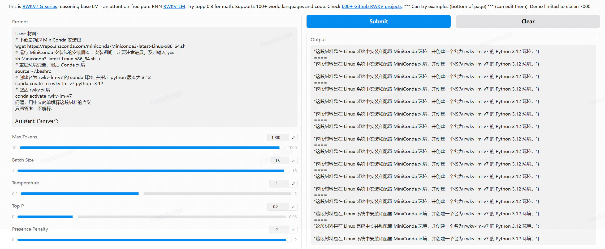

import { Tab, Tabs } from 'fumadocs-ui/components/tabs'
import { CallOut } from 'components-docs/call-out/call-out.tsx'
import { LinkCard } from 'components-docs/link-card/link-card.tsx'

## 视频介绍[#video-introduction]

<div className="iframe-container">
 <iframe 
 src="https://player.bilibili.com/player.html?isOutside=true&aid=114159593195042&bvid=BV1XXQ3YoEXW&cid=28857797453&poster=1&p=0&high_quality=1&autoplay=0"
 scrolling="no"
 frameBorder="0"
 allowFullScreen={true}
 sandbox="allow-top-navigation allow-same-origin allow-forms allow-scripts"
>
</iframe>
</div>
<CallOut type="info">
高画质视频请[跳转到 B 站](https://www.bilibili.com/video/BV1XXQ3YoEXW/)观看。
</CallOut>

**先确认你正在使用哪种推理模式：**

| 模式 | 需要输入的内容 |
| --- | --- |
| 自然续写模式 | 输入本页展示的完整 Prompt，例如 `User: xxx` 和末尾留空的 `Assistant:`。 |
| Chat 模式 | 只发送 `xxx` 部分。聊天应用会使用内置的 Chat 模板自动补全 `User:`、`Assistant:` 等格式，无需手动拼接。 |

---

**RWKV 是 RNN 的变体。出于架构原理，RWKV 对提示词的格式比 Transformer 更敏感。**

RWKV 更适合 QA 和指令问答两种提示格式：

## QA 格式 prompt[#QA-Format-Prompt]

<CallOut type="info">
QA（问答）格式是 RWKV 的默认训练格式。

其中 `User:` 是用户提问的问题，`Assistant:` 是模型的回答。因此我们需要在**最后一个** `Assistant:` 后面留空，让模型进行续写。
</CallOut>

<Tabs items={["思考模式", "快思考模式"]}>

<Tab>
```bash
User: 将下面的英语翻译成中文：RWKV (pronounced RwaKuv) is an RNN with great LLM performance and parallelizable like a Transformer.

Assistant: <think
```
</Tab>

<Tab>
```bash
User: 将下面的英语翻译成中文：RWKV (pronounced RwaKuv) is an RNN with great LLM performance and parallelizable like a Transformer.

Assistant: <think></think
```
<CallOut type="info">
快思考模式直接闭合 `<think></think` 标签，跳过思考内容，缩短生成时间。

</CallOut>
</Tab>

</Tabs>

## 指令问答格式 prompt[#Instruction-Format-Prompt]

```bash
Instruction: 请将下列英语翻译成中文

Input: RWKV (pronounced RwaKuv) is an RNN with great LLM performance and parallelizable like a Transformer.

Response:
```
<CallOut type="info">
指令问答是 RWKV 另一种训练格式。其中 `Instruction:` 是用户给模型的指令，`Input:` 是用户给模型的输入，`Response:` 是模型的回答。

`Response:` 后面留空，让模型进行续写。
</CallOut>

```bash
Instruction: 以json格式总结下面的材料文本，包含date/location/title

Input: 2025 年 2 月 22 日，RWKV project 在中国上海漕河泾举办了主题为《RWKV-7 与未来趋势》的开发者大会。来自全国各地的开发者、行业专家和技术创新者齐聚一堂 —— 从知名高校实验室到前沿创业团队，现场涌动的创新能量印证了 RWKV-7 的优秀性能和深远意义。

Response:
```

参考的回复：
```json
{
  "date": "2025年2月22日",
  "location": "中国上海漕河泾",
  "title": "RWKV-7 与未来趋势开发者大会"
}
```

## 材料问答格式

推荐使用以下材料问答格式：

```markdown
User:\n材料：\n{context}\n问题：{question}\n只根据下文回答；没有就答null。\n\nAssistant: {"answer": 

User:\n下文：\n{context}\n问题：{question}\n只写材料中的答案；没有就答null。\n\nAssistant: {"answer": 

User:\n材料：\n{context}\n问题：{question}\n只回答材料中的答案；没有就答null。\n\nAssistant: {"answer": 

User:\n下文：\n{context}\n根据上文回答：{question}\n只根据上文回答；没有就答null。\n\nAssistant: {"answer": 
```
可以根据具体的材料内容，修改问题和限制条件。例如：
```markdown
User: 材料：
# 下载最新的 MiniConda 安装包
wget https://repo.anaconda.com/miniconda/Miniconda3-latest-Linux-x86_64.sh
# 运行 MiniConda 安装包的安装脚本，安装期间一定要注意进展，及时输入 yes  ！
sh Miniconda3-latest-Linux-x86_64.sh -u
# 重启环境变量，激活 Conda 环境
source ~/.bashrc
# 创建名为 rwkv-lm-v7 的 conda 环境, 并指定 python 版本为 3.12
conda create -n rwkv-lm-v7 python=3.12
# 激活 rwkv 环境
conda activate rwkv-lm-v7
问题：用中文简单解释这段材料的含义
只写答案，不解释。

Assistant: {"answer": 
```
在 [web demo](https://www.modelscope.cn/studios/BlinkDL/RWKV-CHN-2) 中并发 16 路测试：




<CallOut type="info">
推荐参数： Temperature=1、Topp=0.2、Penalty 参数调整为 0。
</CallOut>

## few-shot[#Few-Shot]

<CallOut type="info">
对于一些带上下文的问答任务，我们建议在 prompt 中重复几个同类的问题为模型作示范，这种技巧被称为 few-shot。
</CallOut>

举个例子：直接使用以下 prompt 进行续写时，模型生成的回复缺乏明显的风格特征：

```bash
User: 请你帮我给以下句子写广告词：这是一款新的笔记本，很轻，电池能用很久。

Assistant:
```
参考的模型回复：
```bash
这款笔记本轻巧便携，让你随时随地畅享移动办公。同时，它的电池续航能力惊人，让你不用担心频繁充电的烦恼。无论是学习、工作还是娱乐，这款笔记本都能满足你的需求。快来体验它吧！
```
使用下面的 few-shot prompt 进行续写时，模型能够从上下文中学习到具有鲜明风格特征的前文信息，从而生成带有明显风格特色的广告词：

```bash
User: 请你帮我给以下句子写广告词：这是一款手冲咖啡壶，玻璃材质，可以过滤咖啡。

Assistant: 告别速溶，只需3分钟，在家复刻咖啡馆级的风味。高透玻璃壶身，亲眼见证每一滴香醇的萃取。用一个清晨的仪式感，唤醒一整天的活力。

User: 请你帮我给以下句子写广告词：我们新出了一门口语课，教你怎么跟外国人聊天。

Assistant: 还在对着屏幕说“Hello, how are you?” 别让你的口语停留在课本里！我们的课程带你走进真实对话场景，从点餐到侃大山，让你自信开口，像本地人一样聊天！

User: 请你帮我给以下句子写广告词：这是一款新的笔记本，很轻，电池能用很久。

Assistant:
```
参考的回复：
```bash
轻盈如羽，电池如海。这款笔记本让你随时随地畅游数字世界，无需担心续航问题。
```

## function call[#function-call]

<CallOut type="warning">
请使用最新的 RWKV-7 G1x 模型。其他模型即使套用相同提示词，也不具备可靠的 Function Call 能力。
</CallOut>

<LinkCard content="RWKV-7 G1x 官方提示词模板" link="https://github.com/BlinkDL/RWKV-LM/blob/main/RWKV-v7/RWKV7-G1x-templates.txt" isNewTab />

工具定义必须放在 `System: Tools:` 后，并明确要求模型只返回 JSON 函数调用。

<Tabs items={["单次调用", "连续调用"]}>
<Tab>
````text
System: Tools:
- get_weather(location: string, unit?: "celsius" | "fahrenheit")
- get_stock_price(ticker: string)
- translate_text(text: string, target_language: string)
Return only a JSON function call.

User: Translate "Will it rain tomorrow?" into Japanese.

Assistant: ```json
````
</Tab>

<Tab>
````text
System: Tools:
[
{"name":"find_free_slots","description":"Find free calendar slots","arguments":{"date":{"type":"string"},"duration_minutes":{"type":"integer"},"time_window":{"type":"string"}}},
{"name":"create_calendar_event","description":"Create a calendar event","arguments":{"title":{"type":"string"},"start_time":{"type":"string"},"end_time":{"type":"string"},"attendees":{"type":"array","items":{"type":"string"}}}}
]
Return only a JSON function call.

User: Schedule a 30-minute sync with Bob on 2026-05-08 afternoon.

Assistant: ```json
{"name":"find_free_slots","arguments":{"date":"2026-05-08","duration_minutes":30,"time_window":"afternoon"}}
```

User: Function output:
{"free_slots":[{"start":"2026-05-08T15:00:00+09:00","end":"2026-05-08T15:30:00+09:00"}],"bob_email":"bob@example.com"}

Assistant: ```json
````
</Tab>
</Tabs>

<CallOut type="tips">
应用需要解析并校验模型返回的 JSON、限制可调用的工具，并处理参数缺失与执行失败；模型只负责生成调用请求，不会替应用执行工具。
</CallOut>
