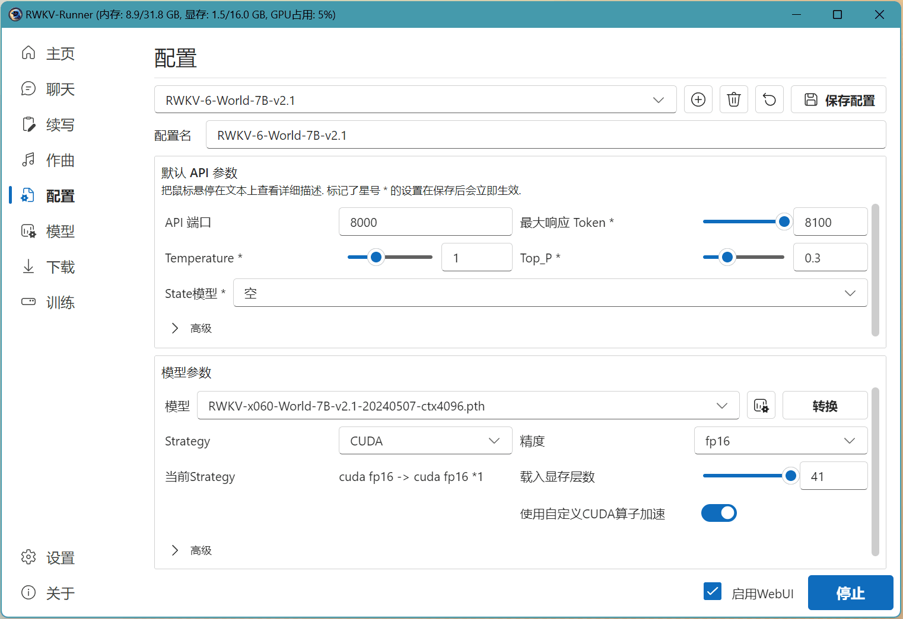
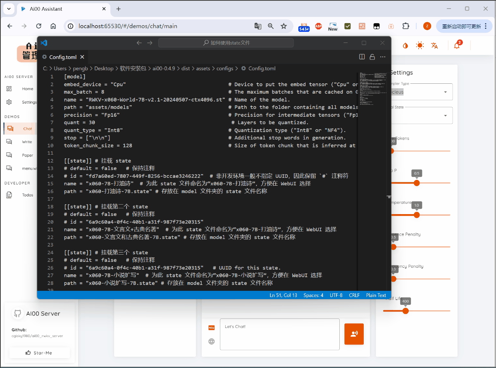

import { Tab, Tabs } from 'fumadocs-ui/components/tabs'
import { CallOut } from 'components-docs/call-out/call-out.tsx'

## state 文件是什么

RNN 网络在运行过程中会保持一个隐藏状态（state），隐藏状态可看作 RNN 模型的“心理状态”。就像人类在思考时，脑海中会保留与当前事件关联度最高的“关键信息”。随着思考内容的变化，人类脑海中的“关键信息”会不断更新。同样的，RNN 网络也会通过特定的函数不断更新其隐藏状态。

RWKV 是 RNN 的变种架构，RWKV 模型在推理时也会生成并更新 state。RWKV 的 state 具有很强的可操作性，比如 state 可以被缓存，可类似于“历史聊天记录”一般被保存为独立的文件。在推理时加载此 state 文件，即可恢复对应的历史上下文。

此外，RWKV 有独特的 [state tuning](../advanced/Fine-Tune/RWKV-PEFT/State-Tuning) 方法，微调 RWKV 的初始 state，就相当于最彻底的 prompt tuning。state tuning 常应用于以下场景：

1. 角色扮演调优（Character State）
2. 任务特化（Task Embedding）
3. Domain adaptation（在新领域任务上适配）
4. 长上下文压缩（把一大段语料学习成一个 state）

state tuning 可以得到 “state” 检查点文件，这些 state 文件本质上就是经过优化的 hidden state，在推理模型时**加载 state** 后，模型会表现出相应的语义倾向或风格。

## 如何挂载 state 文件

state 文件需要配合基底 RWKV 模型，才能发挥其效果。

你可以在 [RWKV Runner](../intermediate/RWKV-Runner/Introduction.md) 或者 [Ai00](../intermediate/ai00/Introduction.md) 中搭载 state 文件，二者搭载 state 文件的方法略有不同。

### RWKV Runner 挂载 state 文件

在 RWKV Runner 中，你可以按照以下步骤使用 state 文件：

- 启动一个 RWKV 模型
- 在配置页面选择对应的 state 
- 点击`保存配置`按钮。

点击保存后即可实时更新 state ，无需重新启动 RWKV 模型。

在下图的示例中，我们已经启动了 RWKV-6-7B-World 模型。那么我们只需在 RWKV Runner  的配置页面，选择基于 RWKV-6 7B 的 state 文件（名称中带有 `x060 | 7B` 字段），然后点击 `保存配置` 按钮。



### Ai00 挂载 state 文件

<CallOut type="info">
请使用 [Ai00 转换脚本](https://github.com/Ai00-X/ai00_server/blob/main/assets/scripts/convert_safetensors.py)将 `.pth` 格式的 State 文件转换为 `.st` 格式，并重命名为 `.state` 格式，才能在 Ai00 中使用。
</CallOut>

在 Ai00 中，你可以按照以下步骤使用 state 文件：

修改 `config.toml` 配置文件，取消注释以开启 `state` 选项，并指定对应的 state 文件路径。

``` toml
[[state]] # 开启 state 挂载功能
# id = "fd7a60ed-7807-449f-8256-bccae3246222"  # 非开发环境一般不指定 UUID，可保留 `#` 注释符
name = "x060-7B-Chinese"  # 为此 state 文件命名为“x060-7B-Chinese”，方便在 WebUI 选择
path = "rwkv-x060-chn-single-round-qa-7B-20240516-ctx2048.state" # 存放在 model 文件夹的 state 文件名称
```
Ai00 支持在 `config.toml` 配置文件中添加多个 `[[state]]` 块，一次配置多个 state 文件，然后在 WebUI 中动态切换 state 文件。

在下面的 Ai00 示例中，我们将配置三个基于 RWKV-6-7B 模型的 state 文件。在 `config.toml` 中添加如下配置：

```toml
[[state]] # 挂载 state
# default = false   # 保持注释
# id = "fd7a60ed-7807-449f-8256-bccae3246222"  # 非开发环境一般不指定 UUID，因此保留 `#` 注释符
name = "x060-7B-打油诗"  # 为此 state 文件命名为“x060-7B-打油诗”，方便在 WebUI 选择
path = "x060-打油诗-7B.state" # 存放在 model 文件夹的 state 文件名称

[[state]] # 挂载第二个 state
name = "x060-7B-文言文+古典名著"  # 为此 state 文件命名为“x060-7B-打油诗”，方便在 WebUI 选择
path = "x060-文言文和古典名著-7B.state" # 存放在 model 文件夹的 state 文件名称

[[state]] # 挂载第三个 state
name = "x060-7B-小说扩写"  # 为此 state 文件命名为“x060-7B-小说扩写”，方便在 WebUI 选择
path = "x060-小说扩写-7B.state" # 存放在 model 文件夹的 state 文件名称
```

保存配置文件并启动 `Ai00-server`，在 Ai00 WebUI 右上角可以动态切换 state 。



在 Ai00 WebUI 切换 state 时，建议新建一个聊天会话或清除上一个 state 的聊天内容，以确保新的 state 文件生效。