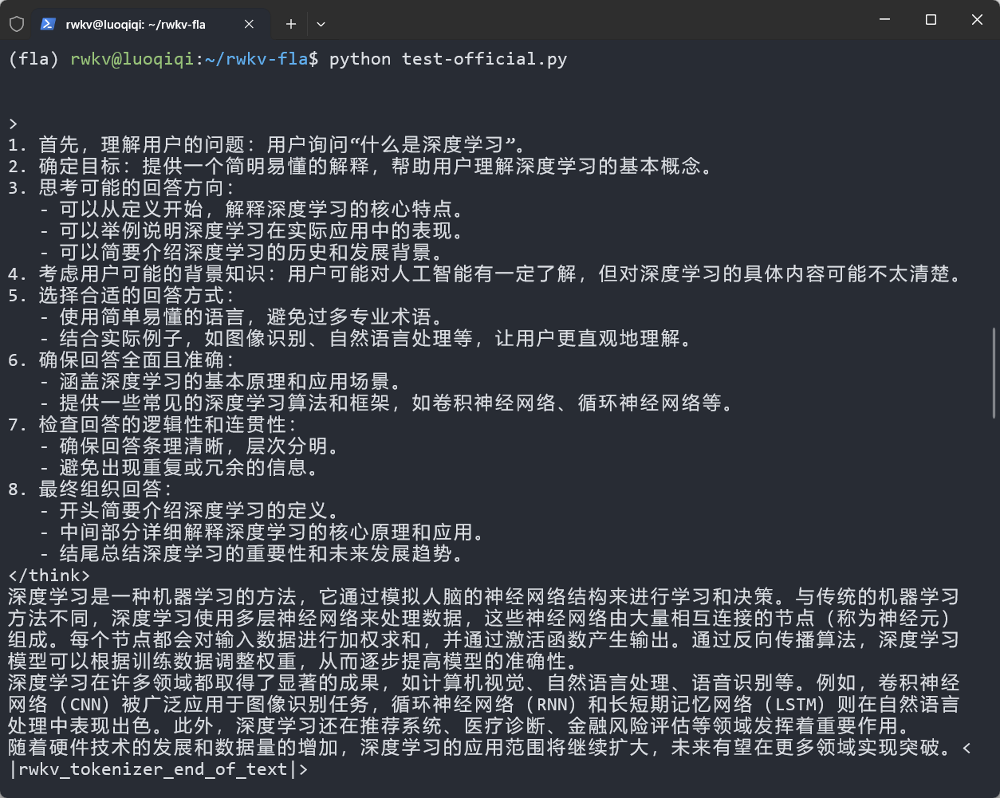

import { Tab, Tabs } from 'fumadocs-ui/components/tabs'
import { Step, Steps } from 'fumadocs-ui/components/steps'
import { CallOut } from 'components-docs/call-out/call-out.tsx'

<CallOut type='info'>
RWKV-FLA 是一个专为 RWKV 模型系列提供的高性能推理和训练框架，它利用 Triton 内核来加速 RWKV 模型的性能。
</CallOut>


## 特性与优势

- **跨平台支持**：支持多种硬件后端，包括 NVIDIA、Intel、AMD、摩尔线程、沐曦等
- **高性能实现**：基于 Triton 内核优化，提供高效的计算性能
- **灵活的API**：提供友好的接口，易于与现有代码集成
- **精度与稳定性**：在 NVIDIA 4090、H100 和 Intel A770 上经过验证

## 安装指南
<Tabs items={['消费级显卡（推荐）', '高性能显卡']}>
<Tab value='消费级显卡（推荐）'>

对于消费级显卡（4090及以下），我们建议使用稳定版本的 triton；

使用以下命令可以一键安装 RKWV-FLA 及相关依赖：
```bash
# 创建新环境（推荐）
conda create -n rwkv-fla python=3.12
# 进入刚刚创建的环境
conda activate rwkv-fla
# 安装相关依赖
pip3 install torch torchvision torchaudio --upgrade
# 安装最新版的 RWKV-FLA
pip install --upgrade rwkv-fla
```

<CallOut type='info'>
此处推荐使用主流的 Linux 发行版，Windows 和 Mac 系统有诸多更复杂的配置，不推荐使用。
</CallOut>
</Tab>
<Tab value='高性能显卡'>
Triton nightly 是 Triton 最新的

要使用 Triton nightly 版本，建议按照以下步骤创建一个全新的环境：

```bash
# 创建新环境（推荐）
conda create -n triton-nightly python=3.12
conda activate triton-nightly

# 安装 PyTorch nightly (与 Triton nightly 兼容所必需)
pip install -U --pre torch --index-url https://download.pytorch.org/whl/nightly/cu126

# 安装 Triton nightly
pip uninstall triton pytorch-triton -y
pip install -U triton-nightly --index-url http://pypi.fla-org.com/simple --trusted-host pypi.fla-org.com

# 安装 flash-linear-attention
pip install einops ninja datasets transformers numpy
pip uninstall flash-linear-attention && pip install -U --no-use-pep517 git+https://github.com/fla-org/flash-linear-attention --no-deps

# 可选：安装 flash-attention
conda install nvidia/label/cuda-12.6.3::cuda-nvcc
pip install packaging psutil ninja
pip install flash-attn --no-deps --no-cache-dir --no-build-isolation
```
</Tab>
</Tabs>
## 模型推理示例

使用 RWKV-FLA 进行模型推理非常简单，与 Hugging Face Transformers 库的使用方式类似;

下面我们给出一个测试代码，大家可以复制到任意 `.py` 文件，然后使用 `python` 命令运行：

```python
from transformers import AutoModelForCausalLM, AutoTokenizer

# 加载模型和分词器
model = AutoModelForCausalLM.from_pretrained('fla-hub/rwkv7-0.4B-world', trust_remote_code=True)
tokenizer = AutoTokenizer.from_pretrained('fla-hub/rwkv7-0.4B-world', trust_remote_code=True)
model = model.cuda()

# 准备对话历史
prompt = "你能干什么？\n\n"
messages = [
    {"role": "user", "content": "你是谁？"},
    {"role": "assistant", "content": "我是RWKV"},
    {"role": "user", "content": prompt}
]

# 应用对话模板
text = tokenizer.apply_chat_template(
    messages,
    tokenize=False,
    add_generation_prompt=True
)

# 模型推理
model_inputs = tokenizer([text], return_tensors="pt").to(model.device)
generated_ids = model.generate(
    **model_inputs,
    max_new_tokens=1024,
)

# 处理输出
generated_ids = [
    output_ids[len(input_ids):] for input_ids, output_ids in zip(model_inputs.input_ids, generated_ids)
]
response = tokenizer.batch_decode(generated_ids, skip_special_tokens=False)[0]
print('\n')
print(response)
print('\n')
```
如果正常安装，代码运行后会在终端中输出如下图所示的内容：


<CallOut type='info'>
此处以 RWKV7-World-0.4B 为例，可选模型还有很多，详细请到 [https://huggingface.co/fla-hub](https://huggingface.co/fla-hub) 查看。
</CallOut>

## 使用 RWKV 组件

RWKV-FLA 提供了各种组件，可以单独使用以构建自定义模型架构。

### 使用 RWKV7 注意力层

```python
from rwkvfla.layers.rwkv7 import RWKV7Attention

attention_layer = RWKV7Attention(
    mode=config.attn_mode,
    hidden_size=config.hidden_size,
    head_dim=config.head_dim,
    num_heads=config.num_heads,
    decay_low_rank_dim=config.decay_low_rank_dim,
    gate_low_rank_dim=config.gate_low_rank_dim,
    a_low_rank_dim=config.a_low_rank_dim,
    v_low_rank_dim=config.v_low_rank_dim,
    norm_eps=config.norm_eps,
    fuse_norm=config.fuse_norm,
    layer_idx=layer_idx,
    value_dim=config.value_dim[layer_idx],
    num_hidden_layers=config.num_hidden_layers
)
```

### 使用 RWKV7 前馈网络

```python
from rwkvfla.models.rwkv7.modeling_rwkv7 import RWKV7FeedForward

ffn_layer = RWKV7FeedForward(
    hidden_size=config.hidden_size,
    hidden_ratio=config.hidden_ratio,
    intermediate_size=config.intermediate_size,
    hidden_act=config.hidden_act,
    layer_idx=layer_idx,
    num_hidden_layers=config.num_hidden_layers
)
```

## 常见问题与解决方案

### H100 上的 MMA 断言错误

**错误信息**:
```
Assertion `!(srcMmaLayout && dstMmaLayout && !srcMmaLayout.isAmpere()) && "mma -> mma layout conversion is only supported on Ampere"' failed.
```

**解决方案**:
这个问题已在 [PR #4492](https://github.com/triton-lang/triton/pull/4492) 中修复。请安装 nightly 版本，参照上述安装指南。

### 'NoneType' 对象没有 'start' 属性

**解决方案**:
这是已知问题 ([triton-lang/triton#5224](https://github.com/triton-lang/triton/issues/5224))。请升级到 Python 3.10 或更高版本。

### H100 LinearLayout 断言错误

**错误信息**:
```
mlir::triton::LinearLayout::reshapeOuts(...) failed.
```

**解决方案**:
这是已知问题 ([triton-lang/triton#5609](https://github.com/triton-lang/triton/issues/5609))。请参照前文 MMA 断言错误的解决方案安装最新版本。

## 注意事项

- 虽然 RWKV-FLA 支持多种硬件平台，但目前仅在 NVIDIA 4090、H100 和 Intel A770 上经过全面验证
- 如遇到平台特定问题（如 Triton 版本、精度异常等），建议优先向相应硬件厂商反映
- 不建议直接调用底层计算内核，除非有特殊需求并已充分了解代码实现

## 版本要求

- 推荐使用 Triton 3.2.0 及以上版本
- 特别推荐使用 Triton nightly 版本以获取最新功能和bug修复