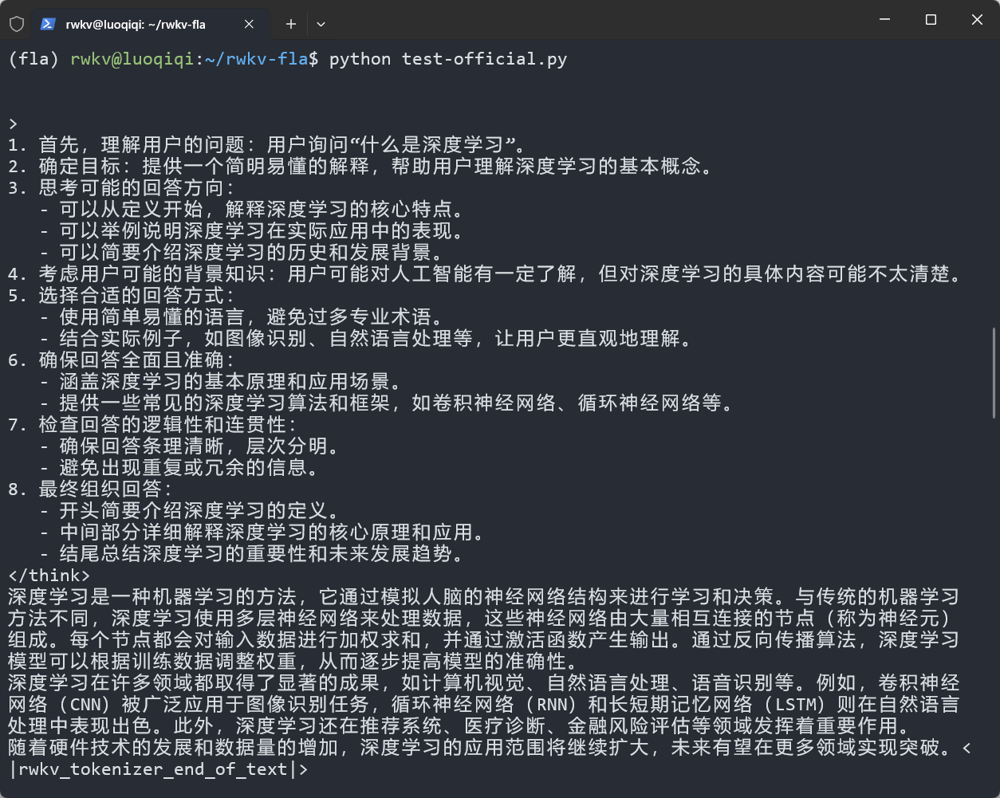

import { Tab, Tabs } from 'fumadocs-ui/components/tabs'
import { CallOut } from 'components-docs/call-out/call-out.tsx'

<CallOut type='info'>
RWKV-FLA 提供基于 PyTorch 与 Triton 的 RWKV 算子、模型组件和 Hugging Face 风格接口，适合跨硬件实验与已有 FLA 模型推理。
</CallOut>

<CallOut type='warning'>
本页适用于 RWKV-FLA 算子实验和已有 `fla-hub` 模型推理。

FLA 的 RWKV-7 实现尚未与官方参考实现完全对齐，训练效果和性能也存在差距。需要复现或训练正式 RWKV-7 模型时，请使用 [RWKV-7 `train_temp` 参考实现](https://github.com/BlinkDL/RWKV-LM/tree/main/RWKV-v7/train_temp)。
</CallOut>

## 特性与优势

- **跨平台支持**：支持多种硬件后端，包括 NVIDIA、Intel、AMD、摩尔线程、沐曦等
- **Triton 算子**：提供 RWKV 的并行与循环计算实现
- **灵活的API**：提供友好的接口，易于与现有代码集成
- **Transformers 接口**：可以加载兼容的 `fla-hub` 模型进行推理

## 安装指南
先根据 [PyTorch 安装页面](https://pytorch.org/get-started/locally/) 安装适合当前硬件的 PyTorch，再选择对应的 RWKV-FLA 可选依赖：

<Tabs items={['NVIDIA CUDA', 'Intel XPU', 'AMD ROCm']}>
<Tab value='NVIDIA CUDA'>

```bash
# 创建新环境（支持 Python 3.10 ~ 3.13）
conda create -n rwkv-fla python=3.12
conda activate rwkv-fla

# 先按 PyTorch 官网命令安装 CUDA 版 PyTorch，再安装 RWKV-FLA
python -m pip install --upgrade "rwkv-fla[cuda]"
```
</Tab>
<Tab value='Intel XPU'>

```bash
python -m pip install --upgrade "rwkv-fla[xpu]"
```
</Tab>
<Tab value='AMD ROCm'>

```bash
python -m pip install --upgrade "rwkv-fla[rocm]"
```
</Tab>
</Tabs>

<CallOut type='info'>
遇到算子或兼容性问题时，先运行 `python -m pip install --upgrade rwkv-fla triton`。

如果升级后问题仍然存在，请在反馈时附上 PyTorch、Triton、显卡和驱动版本。
</CallOut>

## 模型推理示例

下面的示例使用 Hugging Face Transformers 风格接口加载模型。将代码保存为 `xx.py`，然后运行 `python xx.py`：

```python
from transformers import AutoModelForCausalLM, AutoTokenizer
import torch
# 加载模型和分词器
model = AutoModelForCausalLM.from_pretrained('fla-hub/rwkv7-1.5B-g1',torch_dtype=torch.bfloat16, trust_remote_code=True)
tokenizer = AutoTokenizer.from_pretrained('fla-hub/rwkv7-1.5B-g1', trust_remote_code=True)
model = model.cuda()
# 准备对话历史和提示词
prompt = "什么是深度学习？\n\n"
messages = [
    {"role": "user", "content": "你是谁？"},
    {"role": "assistant", "content": "我是RWKV，一个基于RWKV架构的AI模型。"},
    {"role": "user", "content": prompt}
]
# 应用对话模板
text = tokenizer.apply_chat_template(
    messages,
    tokenize=False,
    add_generation_prompt=True,
    enable_thinking=True  # 默认为 True，设为 False 则禁用思考
)
# 模型推理，可以通过调整 temperature 等解码参数来调整生成质量
model_inputs = tokenizer([text], return_tensors="pt").to(model.device)
generated_ids = model.generate(
    **model_inputs,
    max_new_tokens=500,
    do_sample=True,
    temperature=1.0,
    top_p=0.3,
    repetition_penalty=1.3
)
# 处理输出
generated_ids = [
    output_ids[len(input_ids):] for input_ids, output_ids in zip(model_inputs.input_ids, generated_ids)
]
response = tokenizer.batch_decode(generated_ids, skip_special_tokens=False)[0]
print('\n')
print(response)
print('\n')
```
成功运行后，终端会输出如下内容：



<CallOut type='info'>
此处以 RWKV7-1.5B-g1 为例，可选模型还有很多，详细请到 [https://huggingface.co/fla-hub](https://huggingface.co/fla-hub) 查看。
</CallOut>

## 使用 RWKV 组件

RWKV-FLA 提供了各种组件，可以单独使用以构建自定义模型架构。

### 使用 RWKV7 注意力层

```python
from fla.layers.rwkv7 import RWKV7Attention

attention_layer = RWKV7Attention(
    mode=config.attn_mode,
    hidden_size=config.hidden_size,
    head_dim=config.head_dim,
    num_heads=config.num_heads,
    decay_low_rank_dim=config.decay_low_rank_dim,
    gate_low_rank_dim=config.gate_low_rank_dim,
    a_low_rank_dim=config.a_low_rank_dim,
    v_low_rank_dim=config.v_low_rank_dim,
    norm_eps=config.norm_eps,
    fuse_norm=config.fuse_norm,
    layer_idx=layer_idx,
    value_dim=config.value_dim[layer_idx],
    num_hidden_layers=config.num_hidden_layers
)
```

### 使用 RWKV7 前馈网络

```python
from fla.models.rwkv7.modeling_rwkv7 import RWKV7FeedForward

ffn_layer = RWKV7FeedForward(
    hidden_size=config.hidden_size,
    hidden_ratio=config.hidden_ratio,
    intermediate_size=config.intermediate_size,
    hidden_act=config.hidden_act,
    layer_idx=layer_idx,
    num_hidden_layers=config.num_hidden_layers
)
```

## 注意事项

- 不要将 RWKV-FLA 的 RWKV-7 训练结果当作官方参考实现的等价结果
- 如遇到平台特定问题（如 Triton 版本、精度异常等），建议优先向相应硬件厂商反映
- 不建议直接调用底层计算内核，除非有特殊需求并已充分了解代码实现

## 版本要求

- Python 3.10 及以上版本
- PyTorch 2.5 及以上版本
- Triton 3.0 及以上版本
- Transformers 4.45 及以上版本
