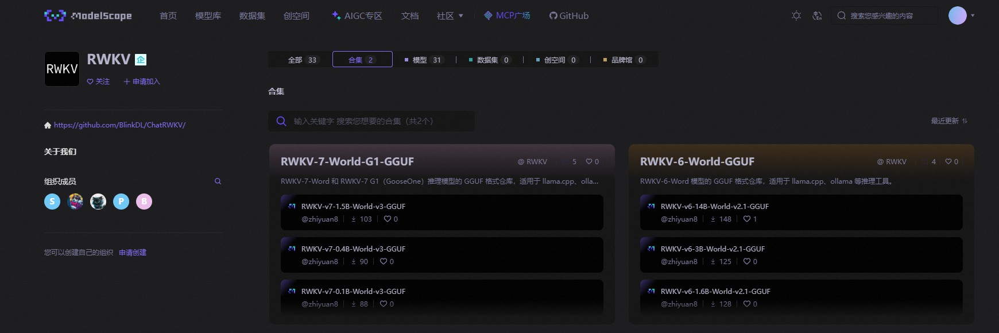

import { CallOut } from 'components-docs/call-out/call-out.tsx'

<CallOut type="info">
[KoboldCpp](https://github.com/LostRuins/koboldcpp) 是一款带图形启动器和内置 KoboldAI Lite WebUI 的本地模型推理工具。本教程使用它加载 RWKV 的 `GGUF` 模型。
</CallOut>

本教程将指引你在 KoboldCpp 中运行 RWKV 模型，并与模型聊天对话。

## 下载与安装

### 下载 RWKV 模型

KoboldCpp 使用 `GGUF` 格式的 RWKV 模型。对于 1.5B 及以上模型，第一次可以从 `Q5_K_M` 等中等量化开始。0.1B 和 0.4B 模型则建议使用 `Q8_0` 或 FP16，避免低比特量化带来的精度损失。

可以从 [RWKV7-Gxx GGUF 合集](https://huggingface.co/collections/shoumenchougou/rwkv7-gxx-gguf) 或 [RWKV ModelScope 合集](https://modelscope.cn/organization/RWKV?tab=collection) 下载模型。先在合集页面选择需要的模型，进入模型仓库后再下载一个以 `.gguf` 结尾的量化文件：



<CallOut type="tips">
自己微调了一个 RWKV-7 模型，想从 pth 转 gguf 格式？查看 [llama.cpp 文档 - 从 pth 模型转换为 gguf](../llamacpp#get-gguf-models)。
</CallOut>

<CallOut type="info">
同一模型通常提供多种量化文件。量化越高，通常越占用内存或显存，也越接近原始权重。请先以“能够完整加载并稳定生成”为目标，再比较不同量化的速度与输出效果。
</CallOut>

### 下载 KoboldCpp

从 [KoboldCpp Releases](https://github.com/LostRuins/koboldcpp/releases/latest) 下载适合当前系统的文件。正式版发布页提供的文件选择如下：

| 系统与硬件 | 下载文件 | 说明 |
| --- | --- | --- |
| Windows + NVIDIA GPU | `koboldcpp.exe` | 官方推荐的单文件版本 |
| Windows，无 NVIDIA GPU 或不使用 CUDA | 文件名包含 `nocuda` 的版本 | AMD GPU 可先在这个版本中选择 Vulkan |
| 较旧 CPU 或较旧 NVIDIA GPU | 文件名包含 `oldpc` 的版本 | 使用 CUDA 11 和 AVX1，供默认版本无法启动时尝试 |
| Linux + NVIDIA GPU | `koboldcpp-linux-x64` | 官方推荐的单文件版本 |
| Linux + AMD GPU | 文件名包含 `nocuda` 的版本 | 优先尝试 Vulkan |
| Apple Silicon Mac | `koboldcpp-mac-arm64` | 适用于 M 系列芯片 |

如果 Linux + AMD GPU 使用 Vulkan 时遇到兼容性问题，可以再尝试[滚动更新的 ROCm 版本](https://koboldai.org/cpplinuxrocm)。

## 配置与运行

### 调整 KoboldCpp 配置

下面以 Windows 单文件版本为例。双击下载的 exe 文件，即可打开 KoboldCpp 的启动器 GUI。

Linux 和 macOS 用户需要先为下载的文件添加执行权限，再从终端启动：

```bash
# Linux
chmod +x koboldcpp-linux-x64
./koboldcpp-linux-x64

# Apple Silicon Mac
chmod +x koboldcpp-mac-arm64
./koboldcpp-mac-arm64
```

如果 macOS 阻止程序运行，请在系统的安全性设置中允许该程序后重试。

其他安装方式可参考 [KoboldCpp README](https://github.com/LostRuins/koboldcpp#readme)。

在启动器的快速启动（Quick Launch）界面，可以**调整 KoboldCpp 和模型的配置**，重点关注以下三个选项：

- **`GGUF Text Model`**：选择一个 `.gguf` 格式的 RWKV 模型文件。
- **`Backend`**：NVIDIA 显卡选择 `Use CUDA`，AMD 或 Intel 显卡优先尝试 `Use Vulkan`，只使用 CPU 时选择 `Use CPU`。
- **`GPU Layers`**：控制放到 GPU 中运行的模型层数。通常保留默认值 `-1`，由 AutoFit 自动估算。

如果加载模型时提示显存不足，请将 `GPU Layers` 改为更小的数值后重试。

其他选项**建议保持默认**，或根据需要调整：

- **`Use MMQ`**：一般保持默认即可。需要比较不同计算方式的速度时，再参考 [KoboldCpp 文档 - MMQ 的作用](https://github.com/LostRuins/koboldcpp/wiki#what-does-quantized-mat-mul-mmq-do-for-cuda)
- **`Launch Browser`**：是否在加载模型后自动打开浏览器，并访问 KoboldCpp 的 WebUI
- **`Use ContextShift`**：运行 RWKV 模型时保持默认即可
- **`Use FlashAttention`**：运行 RWKV 模型时保持默认即可
- **`Quiet Mode`**：选择此选项后，终端不再显示模型生成的文本内容
- **`Remote Tunnel`**：创建一个可从互联网访问的临时地址。仅在需要远程连接时启用
- **`Context Size`**：设置 KoboldCpp 可处理的最大上下文长度。第一次运行保持默认即可。增大上下文会增加内存或显存占用
- 其他参数的释义，请参考 [KoboldCpp 文档](https://github.com/LostRuins/koboldcpp/wiki) 

### 运行 KoboldCpp

配置完毕后，点击右下角的 `Launch` 按钮启动 KoboldCpp。

模型加载成功后，终端会显示本地服务地址。启用了 `Launch Browser` 时，浏览器还会自动打开 KoboldCpp WebUI：

```text
Load Text Model OK: True
Please connect to custom endpoint at http://localhost:5001
```

看到 WebUI 并能够发送一条消息，即说明下载、后端选择和模型加载都已完成。

如果启用了 `Launch Browser`，但浏览器没有自动打开，请手动访问终端显示的地址。默认地址通常为 `http://localhost:5001`。

<CallOut type="warning">
启动器 `Network` 页的 `Host` 留空时，同一局域网中的其他设备也可能访问这个服务。

- **仅在本机使用：**将 `Host` 设为 `127.0.0.1`
- **允许局域网设备或远程隧道访问：**先设置 `Password`，不要直接暴露未鉴权的服务
</CallOut>

## KoboldCpp 使用指南

### 更改对话模式

KoboldCpp 支持四种使用模式。在 KoboldCpp 的 WebUI 中打开 `Settings`，在 `General` 页的 `Usage Mode` 中切换模式：

- **`Instruct Mode`**：指令模式，适合带有指令的文本生成
- **`Story Mode`**：故事模式，适合小说风格的文本生成
- **`Adventure Mode`**：冒险模式，适合生成**交互式小说/角色扮演游戏**等内容。
- **`Chat Mode`**：聊天模式，适合闲聊

一般聊天可以先选择 `Chat Mode`，执行具体任务时可以选择 `Instruct Mode`。`Story Mode` 和 `Adventure Mode` 分别用于故事续写和交互式叙事。

<CallOut type="info">
**使用 `Chat Mode`：**在 `General` 页将 `Your Name` 设为 `User`、`AI Name(s)` 设为 `Assistant`。

**使用 `Instruct Mode`：**还需要按照模型使用的提示词格式设置指令的开始和结束标签，不能只切换使用模式。

其他格式请参考 [RWKV 提示词格式](../../basic/Prompt-Format)。
</CallOut>

### 更改 WebUI 风格

在 `Settings` 的 `General` 页找到 `UI style`，即可调整 WebUI 风格。当前提供以下四种风格，并非所有风格都适用于全部使用模式：

- **`Classic Theme`**：简洁界面，适用于所有模式。
- **`Messenger Theme`**：即时通信风格，适用于聊天模式。
- **`Aesthetic Theme`**：可调整字体、间距、背景和角色头像等显示效果。
- **`Corpo Theme`**：类似常见在线 AI 助手的界面。

想要接近常见在线聊天工具的布局时，可以选择 `Corpo Theme`。

### 其他设置项

更多设置项的释义，请参考 WebUI 中的注释和 [KoboldCpp 文档](https://github.com/LostRuins/koboldcpp/wiki)。

<CallOut type="info">
如果不习惯全英文的 WebUI 界面，可使用浏览器的翻译功能将页面翻译成中文。
</CallOut>
