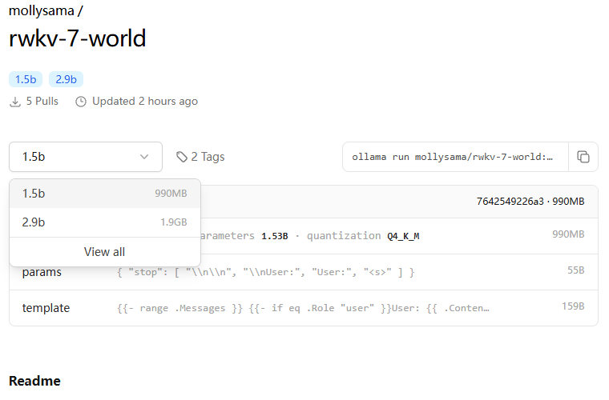
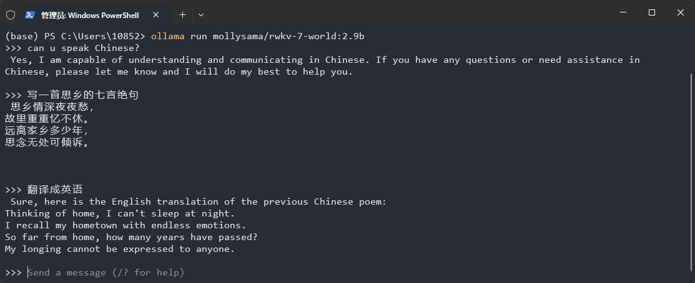
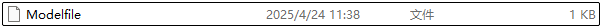
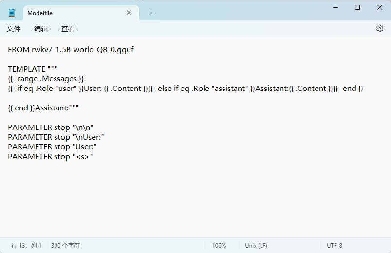
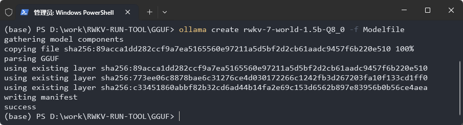
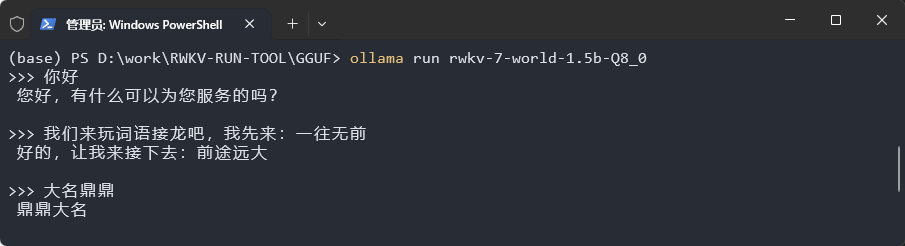
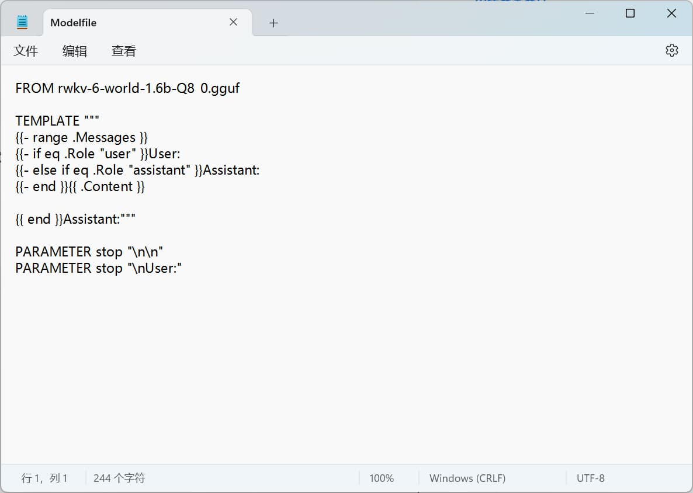
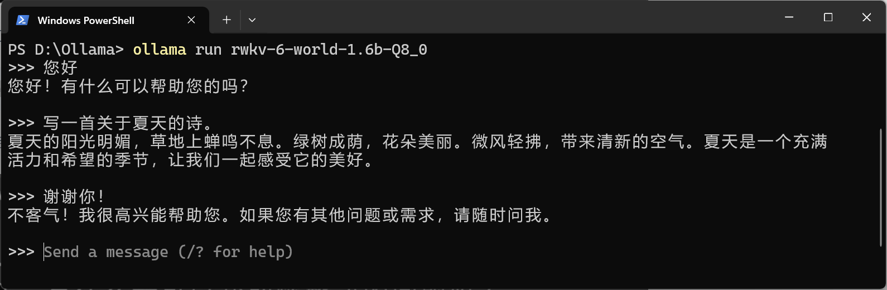

import { Tab, Tabs } from 'fumadocs-ui/components/tabs'
import { Step, Steps } from 'fumadocs-ui/components/steps'
import { CallOut } from 'components-docs/call-out/call-out.tsx'

<CallOut type="info">
[Ollama](https://github.com/ollama) 是一个简单易用的开源本地大语言模型运行框架，支持在个人电脑上一键部署和运行各类开源模型，具有配置简单、资源占用低等特点。
</CallOut>

随着 RWKV 社区成员 [@MollySophia](https://github.com/MollySophia) 的工作，Ollama 现已适配 RWKV 模型。

本章节介绍如何在 Ollama 中使用 RWKV 模型进行推理。

<CallOut type="info">
现在 Ollama 已经适配 RWKV-7 了！欢迎大家使用！
</CallOut>

## 视频教程[#video-tutorial]

<div className="iframe-container">
 <iframe 
 src="https://player.bilibili.com/player.html?isOutside=true&aid=113790360225173&bvid=BV1TrrdYmE7M&cid=27756529920&poster=1&p=0&high_quality=1&autoplay=0"
 scrolling="no"
 frameBorder="0"
 allowFullScreen={true}
 sandbox="allow-top-navigation allow-same-origin allow-forms allow-scripts"
>
</iframe>
</div>
<CallOut type="info">
高画质视频请[跳转到 B 站](https://www.bilibili.com/video/BV1TrrdYmE7M/)观看。
</CallOut>

## Ollama 下载与安装[#ollama-download-and-install]

可从 [Ollama 官网](https://ollama.com/) 下载 Ollama 的安装程序。

下载完成后，双击 exe 文件进行安装。安装完成后 `Ollama` 会自动启动，启动后可在系统任务栏看到 `Ollama` 图标。


## 运行 RWKV 模型[#run-rwkv-model]

以下两种方法可以在 Ollama 中运行 gguf 格式的 RWKV-7 和 RWKV-6 各版本的模型：

- **从 [Ollama 的 RWKV 仓库](https://ollama.com/mollysama)下载**：操作简单，但 Ollama 提供的 RWKV 模型**只有 `q4_k_m` 量化版本**
- **自定义 RWKV 模型**：需要手动下载 `gguf` 格式的 RWKV 模型并创建 `Modelfile` 配置文件，但是可以**自由运行任意量化的 RWKV 模型**

<Tabs items={['从 Ollama 仓库下载', '自定义 RWKV-7 模型', '自定义 RWKV-6 模型']}>
<Tab>

[Ollama 的 RWKV 仓库](https://ollama.com/mollysama) 提供了 RWKV7-G1 0.1B/0.4B 和 RWKV7-World 1.5B/2.9B 四种模型。

RWKV-6 也仍在仓库中保留，大家可以根据需求选择下载。



在你的终端执行 `ollama run mollysama/rwkv-7-world:2.9b` 命令，即可自动**下载并运行** `q4_k_m` 量化版本的 RWKV-7-World 2.9B 模型。



<CallOut type='info'>
目前我们尚未完成开启 RWKV7-G1 系列模型的 `think` 功能的 Ollama 配置，因此暂时无法使用该功能。
</CallOut>

</Tab>
<Tab>
<Steps>
<Step>
### 下载 RWKV gguf 模型[#download-rwkv-gguf-model]

要自定义 RWKV 模型，需要先从 [RWKV-GGUF 仓库](https://modelscope.cn/organization/RWKV?tab=collection) 下载 `gguf` 格式的 RWKV-7-World 模型。

<CallOut type="warning" >
RWKV gguf 模型有各种量化版本，建议使用 `Q5_1`、 `Q8_0` 两种量化精度，更低的量化精度（如 `Q4_0`、`Q3_0` 等）可能会使模型的回答变得很差。
</CallOut>
</Step>
<Step>
### 创建模型的 Modelfile 文件[#create-model-modelfile]

在存放 RWKV gguf 模型文件的文件夹下创建名为 `Modelfile` 的文本文件，不需要后缀名。



之后使用“记事本”等文本编辑工具打开该文本文件，写入以下内容：

```bash copy
FROM rwkv7-1.5B-world-Q8_0.gguf

TEMPLATE """
{{- range .Messages }}
{{- if eq .Role "user" }}User: {{ .Content }}{{- else if eq .Role "assistant" }}Assistant:{{ .Content }}{{- end }}

{{ end }}Assistant:"""

PARAMETER stop "\n\n"
PARAMETER stop "\nUser:"
PARAMETER stop "User:"
PARAMETER stop "<s>"
```

将第一行 `FROM` 之后的 `rwkv7-1.5B-world-Q8_0.gguf` 修改为你下载的 RWKV 模型文件名。

<CallOut type="warning" >
建议直接复制上面的内容到 `Modelfile` 内，以确保 `User:` 后有一个空格， `Assistant:` 后没有空格；`{{ end }}Assistant:"""` 上有空行，后面没有多余字符。
</CallOut>


</Step>
<Step>
### 运行自定义 RWKV 模型[#run-custom-rwkv-model]

在 RWKV gguf 模型文件夹下打开终端，并执行 `ollama create` 命令：

``` bash copy
ollama create rwkv-7-world-1.5b-Q8_0 -f Modelfile
```
<CallOut type="info">
将 `ollama create` 后面的模型名称改成你本地的 RWKV 模型，与 `Modelfile` 中的模型名称保持一致。
</CallOut>



创建完毕后，使用 `ollama run` 命令直接运行模型：

``` bash copy
ollama run rwkv-7-world-1.5b-Q8_0
```

成功运行后，即可与模型进行聊天对话：


</Step>
</Steps>

</Tab>

<Tab>

<Steps>
<Step>
### 下载 RWKV gguf 模型[#download-rwkv-gguf-model]

要自定义 RWKV 模型，需要先从 [RWKV-GGUF 仓库](https://modelscope.cn/organization/RWKV?tab=collection) 下载 `gguf` 格式的 RWKV-6-World 模型。

<CallOut type="warning" >
RWKV gguf 模型有各种量化版本，建议使用 `Q5_1`、 `Q8_0` 两种量化精度，更低的量化精度（如 `Q4_0`、`Q3_0` 等）可能会使模型的回答变得很差。
</CallOut>
</Step>
<Step>
### 创建模型的 Modelfile 文件[#create-model-modelfile]

在存放 RWKV gguf 模型文件的文件夹下创建名为 `Modelfile` 的文本文件，不需要后缀名。


之后使用“记事本”等文本编辑工具打开该文本文件，写入以下内容：

```bash copy
FROM rwkv-6-world-1.6b-Q8_0.gguf
 
TEMPLATE """
{{- range .Messages }}
{{- if eq .Role "user" }}User: 
{{- else if eq .Role "assistant" }}Assistant:
{{- end }}{{ .Content }}
 
{{ end }}Assistant:"""
 
PARAMETER stop "\n\n"
PARAMETER stop "\nUser:"
```

将第一行 `FROM` 之后的 `rwkv-6-world-1.6b-Q8_0.gguf` 修改为你下载的 RWKV 模型文件名。

<CallOut type="warning" >
建议直接复制上面的内容到 `Modelfile` 内，以确保 `User:` 后有一个空格， `Assistant:` 后没有空格；`{{ end }}Assistant:"""` 上有空行，后面没有多余字符。
</CallOut>


</Step>
<Step>
### 运行自定义 RWKV 模型[#run-custom-rwkv-model]

在 RWKV gguf 模型文件夹下打开终端，并执行 `ollama create` 命令：

``` bash copy
ollama create rwkv-6-world-1.6b-Q8_0 -f Modelfile
```
<CallOut type="info">
将 `ollama create` 后面的模型名称改成你本地的 RWKV 模型，与 `Modelfile` 中的模型名称保持一致。
</CallOut>


创建完毕后，使用 `ollama run` 命令直接运行模型：

``` bash copy
ollama run rwkv-6-world-1.6b-Q8_0
```

成功运行后，即可与模型进行聊天对话：


</Step>
</Steps>
</Tab>
</Tabs>

## Ollama GUI 和桌面程序[#ollama-gui-and-desktop-program]

Ollama 本身并没有提供 GUI 或 WebUI 服务，但其社区提供了第三方 GUI 和桌面程序。

可以在 [Ollama 的 GitHub 文档](https://github.com/ollama/ollama?tab=readme-ov-file#web--desktop) 中查看所有第三方 Ollama 工具。

## 参考资料

- [Ollama 官网](https://ollama.com/)
- [RWKV gguf 模型仓库](https://modelscope.cn/organization/RWKV?tab=collection)
- [Ollama 的 GitHub 文档](https://github.com/ollama/ollama?tab=readme-ov-file#web--desktop)