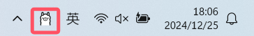
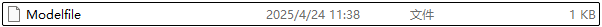

import { Step, Steps } from 'fumadocs-ui/components/steps'
import { CallOut } from 'components-docs/call-out/call-out.tsx'

<CallOut type="info">
[Ollama](https://github.com/ollama) 是一个本地模型运行工具，可以通过命令行或桌面程序下载、管理和运行模型。
</CallOut>

本章节介绍如何在 Ollama 中运行 RWKV-7 模型：你可以直接运行 Ollama 模型，也可以导入本地 GGUF 文件。

## 视频教程[#video-tutorial]

<div className="iframe-container">
 <iframe 
 src="https://player.bilibili.com/player.html?isOutside=true&aid=113790360225173&bvid=BV1TrrdYmE7M&cid=27756529920&poster=1&p=0&high_quality=1&autoplay=0"
 scrolling="no"
 frameBorder="0"
 allowFullScreen={true}
 sandbox="allow-top-navigation allow-same-origin allow-forms allow-scripts"
>
</iframe>
</div>
<CallOut type="info">
高画质视频请[跳转到 B 站](https://www.bilibili.com/video/BV1TrrdYmE7M/)观看。
</CallOut>

## Ollama 下载与安装[#ollama-download-and-install]

可从 [Ollama 官网](https://ollama.com/) 下载 Ollama 的安装程序。以下安装步骤以 Windows 为例。

下载完成后，双击 exe 文件进行安装。Ollama 会在安装后自动启动，系统任务栏出现 `Ollama` 图标即表示安装完成。



接下来，我们将在 Ollama 中运行 `gguf` 格式的 RWKV 模型。从以下两种方法中选择一种：

| 方法 | 描述 | 优点 | 缺点 |
|------|------|------|------|
| **[直接运行 Ollama 模型](#run-ollama-provided-rwkv-model)** | 根据模型名称自动下载并运行 | 操作简单，不需要手写 Modelfile | 可选的量化精度由模型发布者决定 |
| **[运行自定义 RWKV 模型](#run-custom-rwkv-model)** | 导入本地 GGUF 并创建 `Modelfile` | 可以选择自己的 GGUF 文件和量化版本 | 需要手动创建 `Modelfile`，且并非所有 GGUF 都兼容 |

## 直接运行 Ollama 模型[#run-ollama-provided-rwkv-model]

下面以 G1i 1.5B 模型为例。

在终端中执行：

```bash
ollama run shoumenchougou/rwkv-7-g1i:1.5b
```

首次运行时，Ollama 会自动下载模型。看到 `>>>` 输入提示符后，即可直接发送问题。

需要选择其他参数规模时，请先在 [Ollama 的 RWKV 搜索结果](https://ollama.com/search?q=rwkv) 中确认可用的模型名称，再替换命令中的模型参数。

<CallOut type="tips">
在 Ollama 对话界面中，输入 `/set think` 可启用思考模式，输入 `/set nothink` 可切换到快速回答。
</CallOut>

## 运行自定义 RWKV 模型[#run-custom-rwkv-model]

要运行自定义 RWKV 模型，需要准备一个 `.gguf` 模型文件和一个 `Modelfile` 配置文件。准备完成后，依次使用 `ollama create` 和 `ollama run` 创建并运行模型。

<Steps>
<Step>
**下载 RWKV gguf 模型**

可以从 [RWKV7-Gxx-GGUF 合集](https://huggingface.co/collections/shoumenchougou/rwkv7-gxx-gguf) 下载 `gguf` 格式的 RWKV 模型。

<CallOut type="warning">
量化精度越低，模型文件通常越小，但回答质量也可能下降。对于 0.1B、0.4B 等小模型，优先选择 `FP16` 或 `Q8_0`。其他参数规模可根据可用内存选择量化版本。
</CallOut>
<CallOut type="tips">
自己微调了一个 RWKV-7 模型，想从 pth 格式转 gguf？查看 [从 pth 模型转换为 gguf](../llamacpp#get-gguf-models)。
</CallOut>
</Step>
<Step>
**创建模型的 Modelfile 文件**

在存放 RWKV GGUF 模型的文件夹中创建一个名为 `Modelfile` 的文本文件，不需要添加后缀名。

在 Windows 中，请确认文件没有被保存成 `Modelfile.txt`。



使用“记事本”等文本编辑工具打开 `Modelfile`，写入以下模板和参数。

<CallOut type="tips">
以下模板支持 `/set think` 和 `/set nothink`。
</CallOut>

```text
FROM ./rwkv7-g1i-1.5b-Q6_K.gguf

TEMPLATE """{{- if .System }}System: {{ .System }}{{ end }}
{{- range $i, $_ := .Messages }}
{{- $last := eq (len (slice $.Messages $i)) 1}}
{{- if eq .Role "user" }}
{{- if eq $i 0}}User: {{ .Content }}{{- else }}

User: {{ .Content }}{{- end }}
{{- else if eq .Role "assistant" }}

Assistant: <{{- if and $last .Thinking -}}think>{{ .Thinking }}</think>{{- else }}think>
</think>{{- end }}{{ .Content }}{{- end }}
{{- if and $last (ne .Role "assistant") }}

Assistant:{{- if $.IsThinkSet }} <{{- if not $.Think }}think>
</think>{{- end }}{{- end }}{{- end }}{{- end }}"""

PARAMETER stop """

"""
PARAMETER frequency_penalty 0.5
PARAMETER presence_penalty 0.5
PARAMETER repeat_penalty 1
PARAMETER temperature 1
PARAMETER top_k 128
PARAMETER top_p 0.5
```
请先将第一行 `FROM` 之后的文件名改成你下载的 RWKV GGUF 文件名。

`PARAMETER temperature 1`、`PARAMETER top_p 0.5` 等解码参数可以根据需要调整。

</Step>
<Step>
**创建并运行自定义 RWKV 模型**

在存放 RWKV gguf 模型和 `Modelfile` 文件的目录下打开终端，并执行 `ollama create` 命令：

```bash
ollama create rwkv7-g1i-1.5b -f Modelfile
```
<CallOut type="info">
`ollama create` 后面填写的是模型在 Ollama 中的本地名称，不是 GGUF 文件名，因此不需要添加 `.gguf` 后缀名。
</CallOut>

创建完毕后，使用 `ollama run` 命令直接运行模型：

```bash
ollama run rwkv7-g1i-1.5b
```

成功运行后，即可与模型进行聊天对话。
</Step>
</Steps>

## 清除对话或释放模型[#close-ollama]

在 Ollama 对话界面中输入 `/clear`，可以清除当前对话的历史消息并开始新对话。已经设置的 system prompt 会保留。

需要退出对话界面时输入 `/bye`。退出后如需立即将模型从内存中卸载，再执行：

```bash
ollama stop rwkv7-g1i-1.5b
```

## 使用 Ollama 桌面程序[#ollama-gui-and-desktop-program]

Windows 和 macOS 的 Ollama 安装包已经包含桌面聊天界面，可以直接在应用中下载模型并开始对话。

本教程先使用命令行，是为了让你明确看到模型的下载和加载结果。确认模型可以正常运行后，再根据个人习惯选择命令行或桌面界面。

## 参考资料

- [Ollama 官网](https://ollama.com/)
- [Ollama G1i 模型仓库](https://ollama.com/shoumenchougou/rwkv-7-g1i)
- [RWKV7-Gxx-GGUF 合集](https://huggingface.co/collections/shoumenchougou/rwkv7-gxx-gguf)
- [Ollama 导入 GGUF 文档](https://docs.ollama.com/import)
