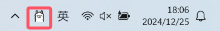

import { Tab, Tabs } from 'fumadocs-ui/components/tabs'
import { Step, Steps } from 'fumadocs-ui/components/steps'
import { CallOut } from 'components-docs/call-out/call-out.tsx'
import { TEMP_CODE_BLOCK } from 'components-docs/ui/TEMP-CODE-BLOCK.tsx'

<CallOut type="info">
[Ollama](https://github.com/ollama) 是一个简单易用的开源本地大语言模型运行框架，支持在个人电脑上一键部署和运行各类开源模型，具有配置简单、资源占用低等特点。
</CallOut>

随着 RWKV 社区成员 [@MollySophia](https://github.com/MollySophia) 的工作，Ollama 现已适配 RWKV 模型。

本章节介绍如何在 Ollama 中使用 RWKV 模型进行推理。

<CallOut type="info">
现在 Ollama 已经适配 RWKV-7 了！欢迎大家使用！
</CallOut>

## 视频教程[#video-tutorial]

<div className="iframe-container">
 <iframe 
 src="https://player.bilibili.com/player.html?isOutside=true&aid=113790360225173&bvid=BV1TrrdYmE7M&cid=27756529920&poster=1&p=0&high_quality=1&autoplay=0"
 scrolling="no"
 frameBorder="0"
 allowFullScreen={true}
 sandbox="allow-top-navigation allow-same-origin allow-forms allow-scripts"
>
</iframe>
</div>
<CallOut type="info">
高画质视频请[跳转到 B 站](https://www.bilibili.com/video/BV1TrrdYmE7M/)观看。
</CallOut>

## Ollama 下载与安装[#ollama-download-and-install]

可从 [Ollama 官网](https://ollama.com/) 下载 Ollama 的安装程序。

下载完成后，双击 exe 文件进行安装。安装完成后 `Ollama` 会自动启动，启动后可在系统任务栏看到 `Ollama` 图标。



接下来，我们将在 Ollama 中运行 `gguf` 格式的 RWKV 模型。从以下两种方法中选择一种：

| 方法 | 描述 | 优点 | 缺点 |
|------|------|------|------|
| **[运行 Ollama 提供的 RWKV 仓库](#run-ollama-provided-rwkv-model)** | 从 Ollama 提供的 RWKV 仓库中下载并运行模型 | 操作简单 | Ollama 提供的 RWKV 模型**只有 `Q8_0` 和 `Q6_K` 等量化版本** |
| **[运行自定义 RWKV 模型](#run-custom-rwkv-model)** | 需要手动下载 `gguf` 格式的 RWKV 模型并创建 `Modelfile` 配置文件 | 可以**运行任意量化**的 RWKV 模型，包括**微调的 RWKV 模型** | 需要手动配置 |

## 运行 Ollama 提供的 RWKV 模型[#run-ollama-provided-rwkv-model]

<CallOut type="info">
Ollama 的 RWKV 仓库提供了 [RWKV7-G1](https://ollama.com/mollysama/rwkv-7-g1)（推荐使用） 和 [RWKV7-World](https://ollama.com/mollysama/rwkv-7-world) 模型。
</CallOut>
<CallOut type="error">
RWKV-6 World 模型已过时，不再推荐使用。
</CallOut>
<Tabs items={['RWKV7-G1 模型(推荐)', 'RWKV-7-World 模型']}>
<Tab>

在终端中运行 `ollama run mollysama/rwkv-7-g1:2.9b` 命令，Ollama 将**自动下载并运行** RWKV7-G1 2.9B 模型。您可以在终端中与 RWKV 模型进行对话。

<CallOut type="tips">
Ollama 的 RWKV7-G1 模型默认开启思考模式，可以通过 `/set nothink` 和 `/set think` 命令灵活地开关思考模式。
</CallOut>


所有可选的 Ollama/RWKV7-G1 模型：

- `mollysama/rwkv-7-g1:2.9b`：量化精度为 `Q8_0`
- `mollysama/rwkv-7-g1:2.9b-q6_k`：量化精度为 `Q6_K`
- `mollysama/rwkv-7-g1:2.9b-thinkdisabled`：禁用思考模式，量化精度为 `Q8_0`
- `mollysama/rwkv-7-g1:2.9b-thinkdisabled-q6_k`：禁用思考模式，量化精度为 `Q6_K`
- `mollysama/rwkv-7-g1:1.5b`：量化精度为 `Q8_0`
- `mollysama/rwkv-7-g1:1.5b-q6_k`：量化精度为 `Q6_K`
- `mollysama/rwkv-7-g1:1.5b-thinkdisabled`：禁用思考模式，量化精度为 `Q8_0`
- `mollysama/rwkv-7-g1:1.5b-thinkdisabled-q6_k`：禁用思考模式，量化精度为 `Q6_K`

<CallOut type="info">
若您曾经下载过 `mollysama/rwkv-7-g1:2.9b` 模型，请运行 `ollama pull mollysama/rwkv-7-g1:2.9b` 命令，拉取最新的变更。
</CallOut>
</Tab>
<Tab>
<CallOut type="warning">
RWKV7-G1 模型是 RWKV-7-World 模型的全面升级，推荐使用 RWKV7-G1 模型。
</CallOut>

在终端中运行 `ollama run mollysama/rwkv-7-world:2.9b` 命令，Ollama 将**自动下载并运行** RWKV7-World 2.9B 模型。您可以在终端中与 RWKV 模型进行对话，如下图所示：


所有可选的 Ollama/RWKV-7 World 模型：

- `mollysama/rwkv-7-world:1.5b`：量化精度为 `Q4_K_M`
- `mollysama/rwkv-7-world:2.9b`：量化精度为 `Q4_K_M`

<CallOut type="info">
若您曾经下载过 `mollysama/rwkv-7-world:2.9b` 模型，请运行 `ollama pull mollysama/rwkv-7-world:2.9b` 命令，拉取最新的变更。
</CallOut>
</Tab>
</Tabs>

## 运行自定义 RWKV 模型[#run-custom-rwkv-model]

要运行一个自定义的 RWKV 模型，你需要一个 `.gguf` 格式的模型文件，和一个用于配置**聊天模板和解码参数**的 `Modelfile` 文件。然后使用 `ollama create` 命令创建一个自定义 Ollama 模型。

创建完毕后，即可使用 `ollama run` 命令运行自定义模型。

<Steps>
<Step>
**下载 RWKV gguf 模型**

可以从 [ModelScope - RWKV GGUF 合集](https://modelscope.cn/organization/RWKV?tab=collection) 下载 `gguf` 格式的 RWKV 模型。

<CallOut type="warning">
RWKV gguf 模型有各种量化版本，建议使用 `FP16`、 `Q8_0` 两种量化精度，更低的量化精度（如 `Q5_K_M`、`Q4_K_M` 等）可能会使模型的回答变差。
</CallOut>
<CallOut type="tips">
自己微调了一个 RWKV-7 模型，想从 pth 转 gguf 格式？查看 [llama.cpp 文档 - 从 pth 模型转换为 gguf](../llamacpp#get-gguf-models)。
</CallOut>
</Step>
<Step>
**创建模型的 Modelfile 文件**

在存放 RWKV gguf 模型文件的文件夹下创建名为 `Modelfile` 的文本文件，不需要后缀名。


使用“记事本”等文本编辑工具打开 `Modelfile`，然后根据**模型是否支持思考模式**创建不同的 Modelfile 文件。

<CallOut type="tips">
RWKV G0/G1 系列推理模型**同时支持“思考”和“不思考”两种模式**，因此下列两种 Modelfile 都可用，根据您对推理功能的需求选择一种即可。
</CallOut>

<Tabs items={['思考模式', '不思考模式']}>
<Tab>

对于 RWKV G0/G1 系列**支持思考功能**的 RWKV 模型，请在 `Modelfile` 中写入以下内容：

```bash
`FROM rwkv7-g1-2.9b-20250519-ctx4096-Q8_0.gguf

TEMPLATE """{{- if .System }}System: {{ .System }}{{ end }}
{{- range $i, $_ := .Messages }}
{{- $last := eq (len (slice $.Messages $i)) 1}}
{{- if eq .Role "user" }}
{{- if eq $i 0}}User: {{ .Content }}{{- else }}

User: {{ .Content }}{{- end }}
{{- else if eq .Role "assistant" }}

Assistant: <{{- if and $last .Thinking -}}think>{{ .Thinking }}</think>{{- else }}think>
</think>{{- end }}{{ .Content }}{{- end }}
{{- if and $last (ne .Role "assistant") }}

Assistant:{{- if $.IsThinkSet }} <{{- if not $.Think }}think>
</think>{{- end }}{{- end }}{{- end }}{{- end }}"""

PARAMETER stop """

"""
PARAMETER stop """
User"""

PARAMETER stop "User"
PARAMETER stop "Assistant"

PARAMETER temperature 1
PARAMETER top_p 0.5
PARAMETER repeat_penalty 1.2`
```
</Tab>
<Tab>
对于 RWKV-World 等**不支持思考**的 RWKV 模型，请在 `Modelfile` 中写入以下内容：

```bash
`FROM rwkv7-2.9B-world-F16.gguf

TEMPLATE """{{- if .System }}System: {{ .System }}{{ end }}
{{- range $i, $_ := .Messages }}
{{- $last := eq (len (slice $.Messages $i)) 1}}
{{- if eq .Role "user" }}
{{- if eq $i 0}}User: {{ .Content }}{{- else }}

User: {{ .Content }}{{- end }}
{{- else if eq .Role "assistant" }}

Assistant:{{ .Content }}{{- end }}
{{- if and $last (ne .Role "assistant") }}

Assistant:{{- end -}}{{- end }}"""

PARAMETER stop """

"""
PARAMETER stop """
User"""

PARAMETER temperature 1
PARAMETER top_p 0.5
PARAMETER repeat_penalty 1.2`
```

</Tab>
</Tabs>
请将第一行 `FROM` 之后的 `rwkv-xxx.gguf` 修改为你本地的 RWKV 模型文件名称。

`PARAMETER temperature 1`、`PARAMETER top_p 0.5` 等解码参数可以根据需要进行调整。

</Step>
<Step>
**创建并运行自定义 RWKV 模型**

在存放 RWKV gguf 模型和 `Modelfile` 文件的目录下打开终端，并执行 `ollama create` 命令：

``` bash
ollama create rwkv-xxx -f Modelfile
```
<CallOut type="info">
将 `ollama create` 后面的模型名称改成你本地的 RWKV 模型（与 `Modelfile` 中的模型名称保持一致），但**无需 `.gguf` 后缀名**。
</CallOut>

创建完毕后，使用 `ollama run` 命令直接运行模型：

``` bash
ollama run rwkv-xxx
```

成功运行后，即可与模型进行聊天对话。
</Step>
</Steps>

## 关闭 Ollama[#close-ollama]

请使用 `ollama stop mollysama/rwkv-7-g1:2.9b` 命令停止当前模型实例，从而**重置对话上下文**。

如果你不需要停止当前模型，而是想要开始一轮全新的对话，则可以使用 `/clear` 命令**清除当前模型的上下文（历史消息）**。

## Ollama GUI 和桌面程序[#ollama-gui-and-desktop-program]

Ollama 本身并没有提供 GUI 或 WebUI 服务，但其社区提供了第三方 GUI 和桌面程序。

可以在 [Ollama 的 GitHub 文档](https://github.com/ollama/ollama?tab=readme-ov-file#web--desktop) 中查看所有第三方 Ollama 工具。

## 参考资料

- [Ollama 官网](https://ollama.com/)
- [RWKV gguf 模型仓库](https://modelscope.cn/organization/RWKV?tab=collection)
- [Ollama 的 GitHub 文档](https://github.com/ollama/ollama?tab=readme-ov-file#web--desktop)