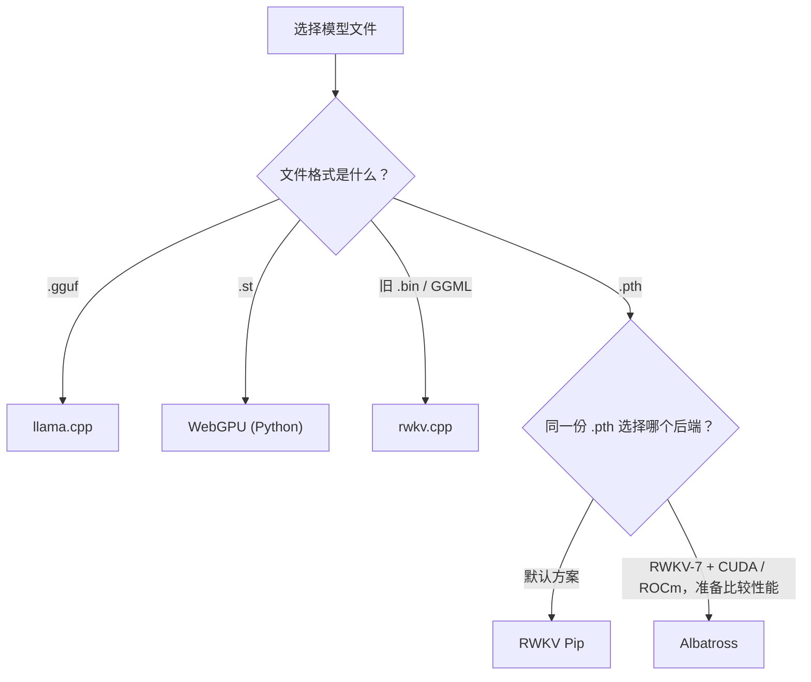
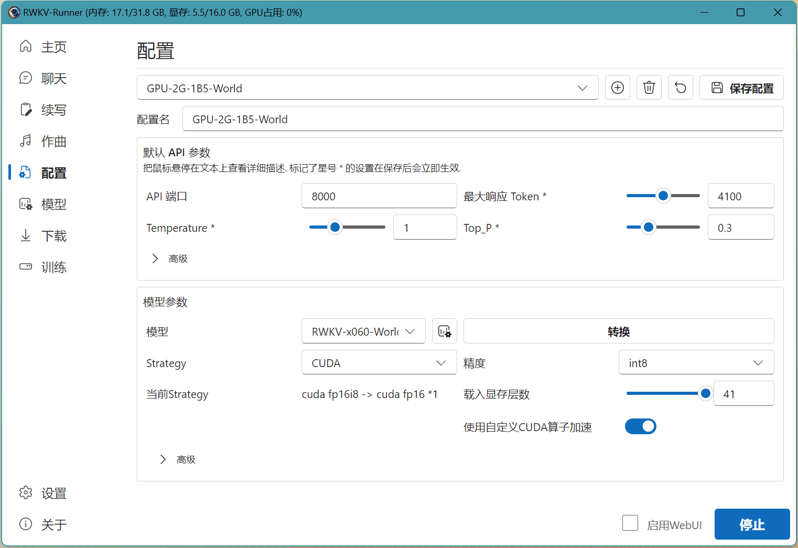
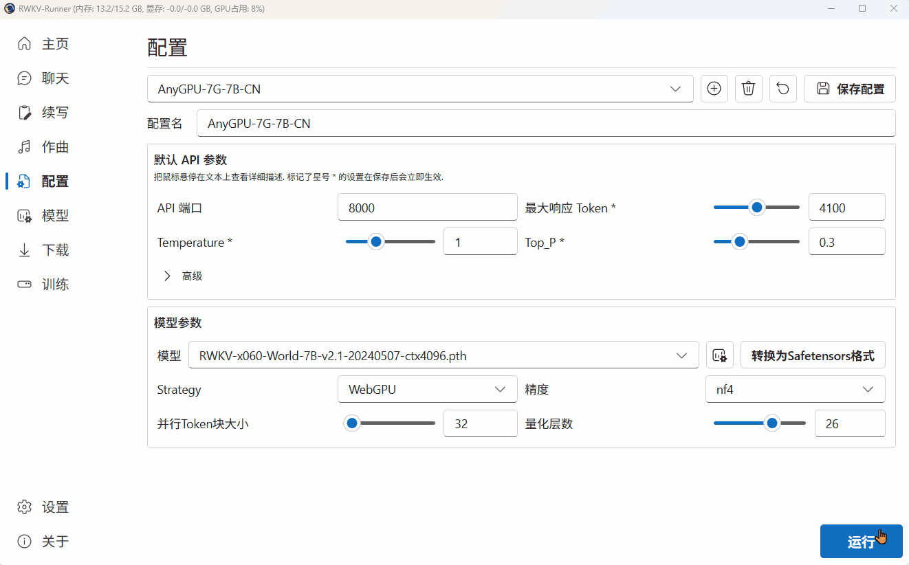
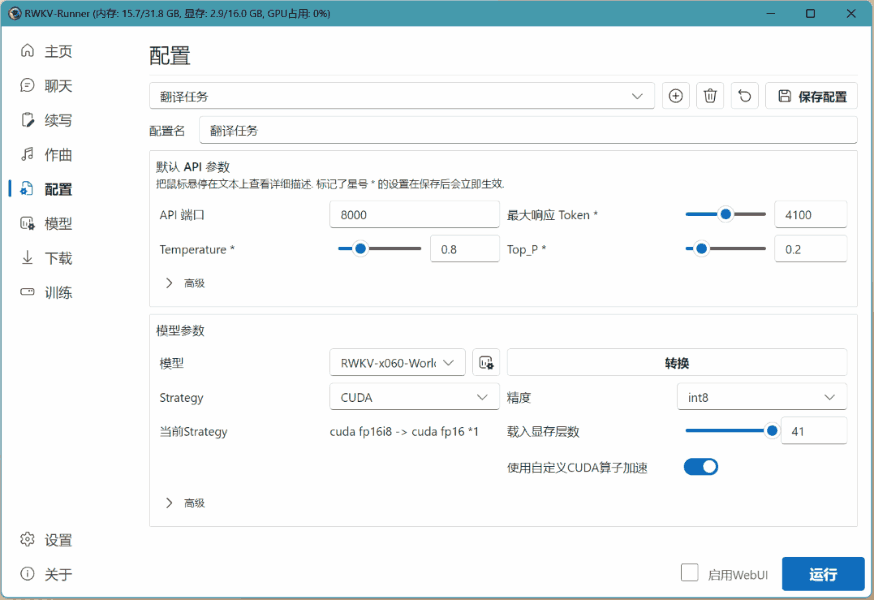
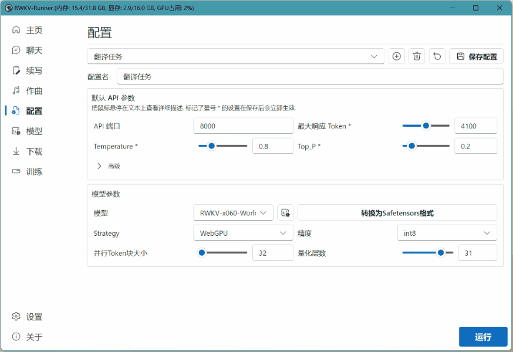
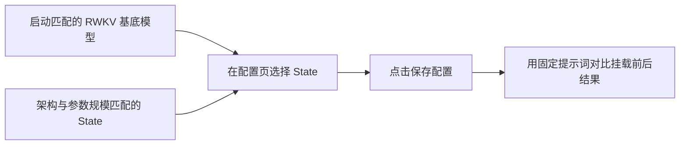
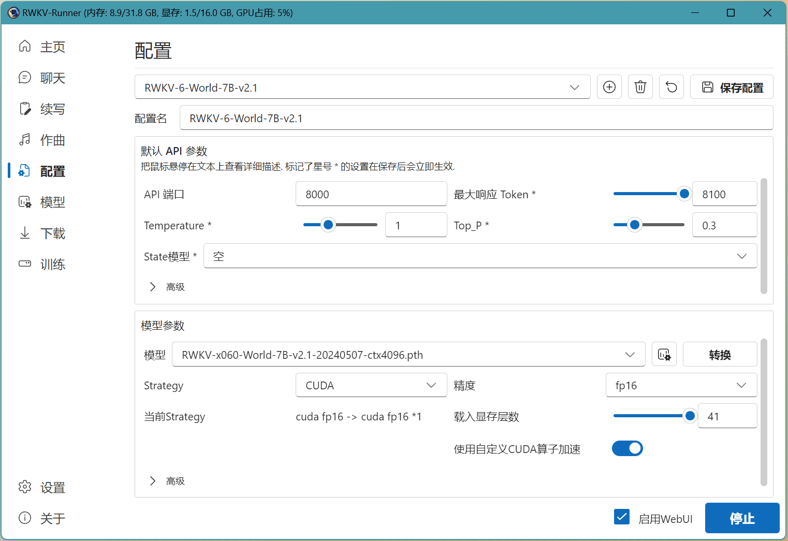
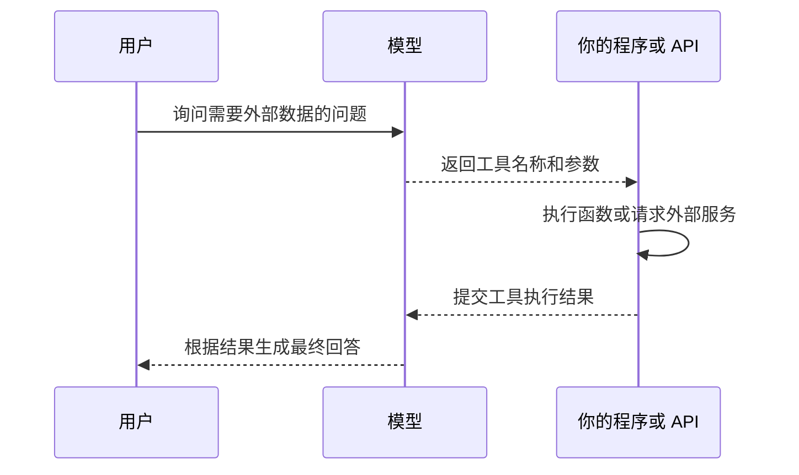
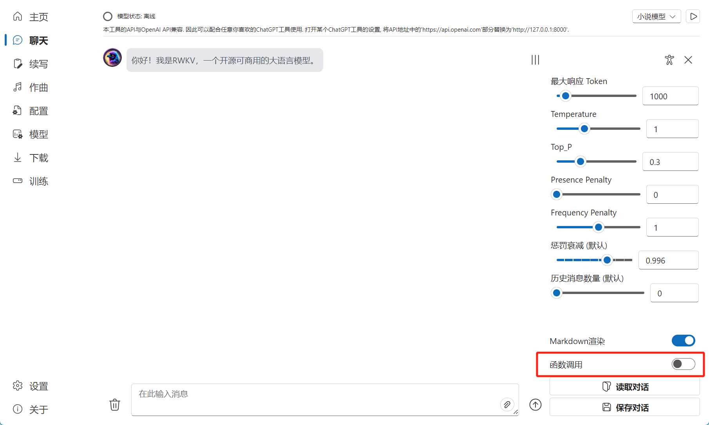
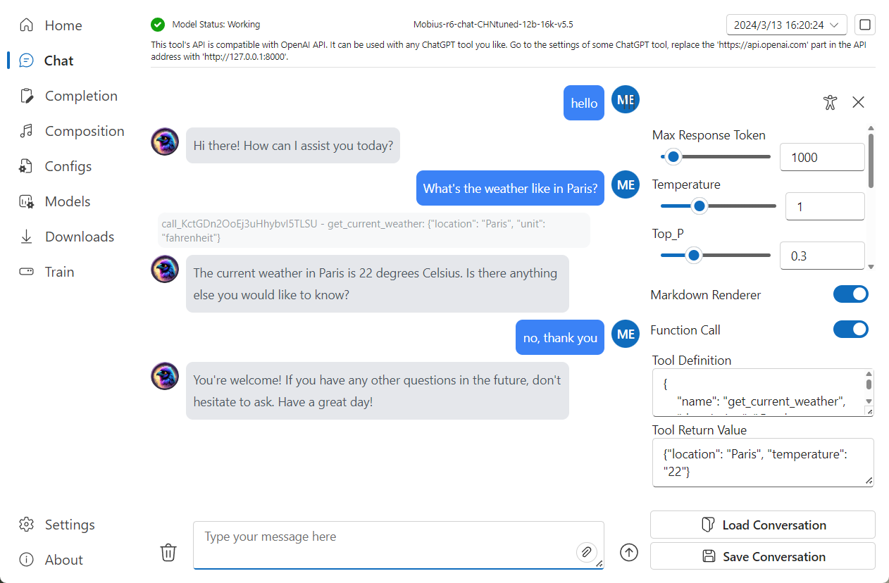

import { Tab, Tabs } from 'fumadocs-ui/components/tabs'
import { Step, Steps } from 'fumadocs-ui/components/steps'
import { Accordion, Accordions } from 'fumadocs-ui/components/accordion'
import { CallOut } from 'components-docs/call-out/call-out.tsx'
import { LearnMore } from 'components-docs/learn-more/learn-more.tsx'

本页适合已经完成 [快速入门](./Simple-Usage)、能够正常启动模型，希望继续调整推理方式、挂载 State 或部署服务器的用户。

| 你准备做什么 | 从哪里开始 |
| --- | --- |
| 更换模型格式、显卡或推理后端 | [选择推理后端](#选择推理后端) |
| 调整 Temperature、Top_P 或模型加载方式 | [配置参数](#配置参数) |
| 使用 State 或 Function Call | [进阶功能](#进阶功能) |
| 在 Linux 服务器运行 Runner | [服务器部署](#server-dev) |

## 选择推理后端

大多数用户直接使用 Runner 预设配置即可。只有模型无法加载、需要 GGUF / WebGPU，或者准备比较 Albatross 时，才需要手动调整后端。

| 你的模型与设备 | 在 Runner 中怎么选 | 后端 | 使用前确认 |
| --- | --- | --- | --- |
| `.pth`；使用默认加载方式 | 选择模型后使用 `cuda fp16`、`cuda fp16i8` 或 `cpu fp32` 等 Strategy | **RWKV Pip** | Runner 默认方案，先从它开始 |
| 同一份 `.pth`；模型是 RWKV-7，且使用 CUDA 或 ROCm GPU | 不转换模型，只把 Strategy 改为 `albatross workers=1 batch=32` | **Albatross** | 与 RWKV Pip 实测速度后再决定；不支持 `/v1/embeddings` |
| `.gguf` 量化模型 | 直接选择 `.gguf`；Strategy 使用 `cpu 8192` 或 `cuda 8192` | **llama.cpp** | 第二个数值是上下文长度 |
| `.st`；AMD、Intel、Apple 或其他 WebGPU 设备 | 以 `--webgpu` 启动 Python 服务 | **WebGPU (Python)** | 官方 `.pth` 需要先转换为 `.st` |
| 旧版 `.bin` / GGML 模型 | 以 `--rwkv.cpp` 启动 Python 服务 | **rwkv.cpp** | 仅用于兼容旧模型，不要与 llama.cpp 混淆 |



<LearnMore title="了解更多：后端、Strategy 与量化有什么区别？">

后端决定由哪套程序加载并运行模型；Strategy 是 Runner 交给后端的加载配置；量化则是用较低精度保存或计算权重，以减少显存或内存占用。

| 名称 | 它实际控制什么 | 示例 |
| --- | --- | --- |
| 推理后端 | 哪套程序加载并运行模型 | RWKV Pip、Albatross、llama.cpp |
| Strategy | 后端、设备、精度或上下文长度 | `cuda fp16`、`albatross workers=1 batch=32`、`cuda 8192` |
| 量化 | 模型权重的保存或计算精度 | `fp16i8`、GGUF `Q5_K_M`、WebGPU `NF4` |

后端没有脱离设备和模型的“绝对最快”选项。同一个 RWKV-7 模型可以分别测试 RWKV Pip 和 Albatross，比较首 token 等待时间、生成速度和显存占用后再选择。

</LearnMore>

### 后端设置速查

<Tabs items={['RWKV Pip', 'Albatross', 'llama.cpp / GGUF', '其他后端']}>
<Tab>

| 项目 | 设置 |
| --- | --- |
| 模型格式 | `.pth` |
| 常用 Strategy | NVIDIA：`cuda fp16`；CPU：`cpu fp32`；显存不足可尝试 `cuda fp16i8` |
| 自定义 CUDA | NVIDIA 用户可测试；加载失败或输出异常时先关闭 |
| 适合 | Runner 默认推理、灵活分配设备与精度、读取模型状态 |

<LearnMore title="了解更多：RWKV Pip 的 embeddings 是普通文本向量吗？">

`/v1/embeddings` 只在 RWKV Pip 路径提供。RWKV-7 返回的是随模型结构变化的多维状态数组，不能直接当作通用的一维文本向量。具体格式见 [API 用法](./API-Usage#embeddings)。

</LearnMore>

</Tab>
<Tab>

| Strategy 片段 | 作用 | 建议 |
| --- | --- | --- |
| 模型文件 | 直接加载 `.pth` | 与 RWKV Pip 使用同一份文件，不需要转换 |
| `albatross` | 选择 Albatross | 新配置使用这个名称，不再使用兼容名称 `chirrup` |
| `workers=1` | 每个 Worker 使用一张 GPU，并加载一份模型 | 单卡从 `1` 开始 |
| `batch=32` | 单个 Worker 可调度的批处理规模 | 先用默认值，再根据并发压测调整 |

```json
{
  "model": "models/rwkv7-g1-2.9b-20250519-ctx4096.pth",
  "strategy": "albatross workers=1 batch=32",
  "tokenizer": null,
  "customCuda": false,
  "deploy": false
}
```

<LearnMore title="了解更多：Albatross 如何处理请求和加载算子？">

Albatross 可用于单条请求，也能在并发时组织批处理。它会优先使用匹配当前 Python、PyTorch、GPU 架构和 CUDA / ROCm 环境的预编译算子；没有匹配文件时会现场编译，因此第一次加载可能明显变慢。

排查性能时可以在启动 Runner 前设置以下环境变量：

| 环境变量 | 作用 |
| --- | --- |
| `ALBATROSS_PROFILE=1` | 记录性能数据，可通过 `/albatross/profile` 查询 |
| `ALBATROSS_TPS_LOG_INTERVAL=<秒>` | 定期在日志中输出解码吞吐 |
| `ALBATROSS_SAMPLER=python\|cuda` | 选择 Python 或融合 CUDA 采样器；默认 `python` |
| `ALBATROSS_SAMPLER_FALLBACK=1` | CUDA 采样器不可用时允许回退 |
| `ALBATROSS_KERNEL_ARCH=sm80_compute80` | 覆盖自动选择的算子架构，仅用于兼容性排查和对照测试 |

</LearnMore>

</Tab>
<Tab>

选择 `.gguf` 文件后，Runner 会自动使用 llama.cpp，不受 `--rwkv.cpp` 参数影响。

| Strategy | 运行位置 | 上下文长度 |
| --- | --- | --- |
| `cpu 8192` | CPU | 8192 |
| `cuda 8192` | 将可用层卸载到 GPU | 8192 |
| `cuda` | GPU | 默认 8192 |

```json
{
  "model": "models/rwkv7-g1-2.9b-ctx4096-Q6_K.gguf",
  "strategy": "cuda 8192",
  "tokenizer": null,
  "customCuda": false,
  "deploy": false
}
```

<LearnMore title="了解更多：Runner 如何处理 GGUF 的提示词？">

文件名包含 `rwkv` 的 GGUF 会使用 Runner 的 RWKV 提示词模板；其他 llama.cpp 模型使用模型自己的聊天模板。该后端不提供 Runner 的 `/v1/embeddings`。

</LearnMore>

</Tab>
<Tab>

| 后端 | 启动方式 | 模型格式 | 什么时候使用 |
| --- | --- | --- | --- |
| WebGPU (Python) | `python backend-python/main.py --webgpu` | `.st` | AMD、Intel、Apple 等 WebGPU 设备，或需要 NF4 / INT8 |
| rwkv.cpp | `python backend-python/main.py --rwkv.cpp` | 旧 `.bin` / GGML | 兼容旧版 RWKV CPU 模型 |
| RWKV Pip 自定义 Strategy | 在 Runner 配置中填写设备、层数和精度 | `.pth` | 将模型分配到 CPU、单张或多张 GPU |

</Tab>
</Tabs>

## 配置参数

在 Runner 的配置页面选择已有预设，或点击 `+` 新建配置：



第一次配置时，优先确认下面四项。模型能够正常回答后，再改采样和量化参数。

| 先确认 | 怎么设置 | 判断成功的方式 |
| --- | --- | --- |
| 模型 | 选择已经下载、格式与后端匹配的文件 | 文件名显示在模型栏中 |
| Strategy | 根据上方选择表填写 | 模型加载过程没有格式或设备错误 |
| API 端口 | 没有冲突时保留 `8000` | 可访问 `http://127.0.0.1:8000/status` |
| 最大响应 Token | 先保留默认值 | 聊天可以正常结束，不会无限生成 |

<Accordions type="single">
  <Accordion title="需要调整回答风格时：解码与 API 参数">

| 参数 | 什么时候调整 | 调整方向 |
| --- | --- | --- |
| API 端口 | `8000` 被占用，或同时运行多个服务 | 为每个服务使用不同端口 |
| 最大响应 Token | 回答经常被截断，或生成过长 | 提高或降低生成上限 |
| Temperature | 需要更稳定或更多样的回答 | 越低通常越稳定；越高随机性越强 |
| Top_P | 需要缩小候选 token 范围 | 越低候选范围通常越窄；不确定时保持默认 |
| Presence Penalty | 模型很少引入新内容 | 提高后，已经出现过的 token 会受到惩罚 |
| Frequency Penalty | 同一词句反复出现 | 提高后，出现次数越多惩罚越强 |
| 惩罚衰减 | 重复惩罚持续太久或消失太快 | 建议先保持默认值 |
| 全局惩罚 | 模型照抄输入或复述 prompt | 开启后，输入文本也参与重复惩罚 |

  </Accordion>
  <Accordion title="模型无法加载或显存不足时：模型参数">

| 参数 | 作用 | 注意事项 |
| --- | --- | --- |
| 模型转换 | 把 `.pth` 转成特定后端需要的格式 | 使用新的输出文件并保留原始 `.pth` |
| Strategy | 选择后端、设备、精度或上下文长度 | 不同后端的语法不同，先对照上方表格 |
| 精度 | 控制 RWKV Pip 或 WebGPU 的计算精度 | GGUF 的量化等级已经写在文件中；Albatross 使用 FP16 |
| 载入显存层数 | 决定多少模型层放在 GPU | 增加层数通常也会增加显存占用 |
| 自定义 CUDA 算子 | 启用 RWKV Pip 的 CUDA 算子 | 出现加载失败或输出异常时先关闭 |
| 并行 Token 块大小 | 单次并行处理的 token 数 | 增大可能加快预处理，也会占用更多显存 |
| 量化层数 | 让更多层使用较低精度 | 通常降低显存占用，也可能影响生成质量 |

  </Accordion>
</Accordions>

## 自定义模型配置示例

下面用 AMD 核显运行 RWKV7-G1 1.5B 翻译模型。由于设备不能使用 CUDA，本例选择 WebGPU (Python)，并把官方 `.pth` 转换为 `.st`。

<Steps>
<Step>

### 新建配置

进入配置页面，点击 `+`。填写配置名称，其他解码参数先保持默认。



</Step>
<Step>

### 选择并转换模型

在“模型”栏选择下载好的 RWKV7-G1 1.5B，将 Strategy 设为 `WebGPU (Python)`。如果模型是 `.pth`，点击“转换”生成 `.st` 文件。



</Step>
<Step>

### 运行模型

重新打开“模型”选项，选择生成的 `.st` 文件并点击“运行”。状态栏显示加载完成后，发送一条短消息确认模型能够回答。



</Step>
</Steps>

<CallOut type="info">
选择 CPU（rwkv.cpp）时，转换结果会使用类似 `fp16.bin` 的旧版 GGML 文件名，不能当作 `.st` 或 `.gguf` 加载。
</CallOut>

## 进阶功能

### 挂载 State

先对照文件名确认架构和模型规模：

| 检查项 | 基底模型 | State | 结果 |
| --- | --- | --- | --- |
| 架构 | RWKV-6（`x060`） | `x060` | 必须一致 |
| 参数规模 | 7B | 7B | 必须一致 |
| 文件用途 | 提供完整模型权重 | 提供训练后的状态 | 两者配合使用 |



下图中运行的是 RWKV-6 7B，因此应选择名称同时包含 `x060` 和 `7B` 的 State。保存后不需要重新启动后端。



### Function Call

<CallOut type="warning">
Function Call 需要模型本身具备工具调用能力。RWKV 基底模型不能直接使用该功能；本节界面示例使用社区微调的 [Mobius-RWKV-r6-12B](https://huggingface.co/TimeMobius/Mobius-RWKV-r6-12B/tree/main)。
</CallOut>



<Steps>
<Step>

### 打开函数调用

在聊天页面打开“函数调用”开关：



</Step>
<Step>

### 填写工具定义

“工具定义”只告诉模型函数名称和参数，不会自动访问天气服务：

```json copy
{
  "name": "get_current_weather",
  "description": "Get the current weather in a given location",
  "parameters": {
    "type": "object",
    "properties": {
      "location": {
        "type": "string",
        "description": "The city and state, e.g. San Francisco, CA"
      },
      "unit": {
        "type": "string",
        "enum": ["celsius", "fahrenheit"]
      }
    },
    "required": ["location"]
  }
}
```

</Step>
<Step>

### 返回工具结果

你的程序执行函数后，把结果填写到“工具返回值”。模型会根据这段数据继续回答：

```json copy
{"location": "Paris", "temperature": "22", "unit": "celsius"}
```



</Step>
</Steps>

<Accordions type="single">
  <Accordion title="查看通过 OpenAI Python SDK 调用工具的完整示例">

运行前安装 `openai`，并确认 Runner API 地址和端口正确。示例函数使用固定数据，不会真正查询天气。

```python copy
from openai import OpenAI
import json

client = OpenAI(
    base_url="http://127.0.0.1:8000/v1",
    api_key="rwkv",
)


def get_current_weather(location, unit="celsius"):
    return json.dumps(
        {"location": location, "temperature": "22", "unit": unit}
    )


messages = [{"role": "user", "content": "What's the weather like in Paris?"}]
tools = [
    {
        "type": "function",
        "function": {
            "name": "get_current_weather",
            "description": "Get the current weather in a given location",
            "parameters": {
                "type": "object",
                "properties": {
                    "location": {"type": "string"},
                    "unit": {
                        "type": "string",
                        "enum": ["celsius", "fahrenheit"],
                    },
                },
                "required": ["location"],
            },
        },
    }
]

response = client.chat.completions.create(
    model="rwkv",
    messages=messages,
    tools=tools,
    tool_choice="auto",
)
assistant_message = response.choices[0].message
messages.append(assistant_message)

for tool_call in assistant_message.tool_calls or []:
    arguments = json.loads(tool_call.function.arguments)
    result = get_current_weather(
        location=arguments["location"],
        unit=arguments.get("unit", "celsius"),
    )
    messages.append(
        {
            "role": "tool",
            "tool_call_id": tool_call.id,
            "name": tool_call.function.name,
            "content": result,
        }
    )

if assistant_message.tool_calls:
    final_response = client.chat.completions.create(
        model="rwkv",
        messages=messages,
    )
    print(final_response.choices[0].message.content)
else:
    print(assistant_message.content)
```

  </Accordion>
</Accordions>

## 服务器部署[#server-dev]

下面以 Debian / Ubuntu 和 RWKV Runner 1.9.12 为例。先让 API 只监听服务器本机，验证完成后再添加 WebUI、systemd 和反向代理。


| 开始前检查 | 验证命令或信息 |
| --- | --- |
| 已经通过 SSH 登录服务器 | 当前终端可以执行 `sudo` |
| 显卡驱动可用 | NVIDIA 用户执行 `nvidia-smi` |
| 知道模型的实际路径和格式 | 例如 `/opt/models/model.pth` 或 `.gguf` |
| Python 与 PyTorch 环境匹配 | 上游主要使用 Python 3.10；PyTorch 需匹配 CUDA 或 ROCm |

### 1. 安装后端

```bash
sudo apt update
sudo apt install -y git python3.10 python3.10-venv python3.10-dev build-essential ninja-build
git clone --depth=1 https://github.com/josStorer/RWKV-Runner.git
cd RWKV-Runner
python3.10 -m venv .venv
source .venv/bin/activate
python -m pip install --upgrade pip wheel
python -m pip install torch torchvision torchaudio
python -m pip install -r backend-python/requirements.txt
```

安装完成后检查 PyTorch 是否识别 CUDA：

```bash
python -c "import torch; print(torch.cuda.is_available())"
```

| 输出 | 下一步 |
| --- | --- |
| `True` | 可以继续使用 CUDA Strategy |
| `False`，计划使用 CPU | 继续启动服务，Strategy 使用 CPU |
| `False`，计划使用 NVIDIA GPU | 先检查驱动、CUDA 和 PyTorch 安装来源 |

Albatross 没有匹配的预编译算子时会现场编译，因此还需要 Python 开发头文件、C/C++ 编译器、Ninja 和对应的 CUDA / ROCm 工具链。

### 2. 启动 API 服务

```bash
source .venv/bin/activate
python backend-python/main.py --host 127.0.0.1 --port 8000
```

保持当前终端运行，再新建一个 SSH 会话检查状态：

```bash
curl http://127.0.0.1:8000/status
```

返回包含 `status`、`pid` 和 `device_name` 的 JSON，说明 API 已经启动。尚未加载模型时，`status` 为 `0`，设备也可能显示为 CPU。

<Accordions type="single">
  <Accordion title="查看完整启动参数">

| 参数 | 默认值 | 说明 |
| --- | --- | --- |
| `--host` | `127.0.0.1` | 监听地址；只在已配置防火墙和网关时使用 `0.0.0.0` |
| `--port` | `8000` | API 与 OpenAPI 文档端口 |
| `--backlog` | `2048` | 等待接受的 socket 连接上限 |
| `--timeout-keep-alive` | `120` | 空闲 HTTP Keep-Alive 秒数 |
| `--no-access-log` | 关闭 | 禁用 Uvicorn 逐请求日志 |
| `--webui` | 关闭 | 挂载已经构建的 Runner 前端 |
| `--rwkv.cpp` | 关闭 | 把非 GGUF 模型交给 rwkv.cpp |
| `--webgpu` | 关闭 | 把非 GGUF 模型交给 WebGPU Python 后端 |

  </Accordion>
</Accordions>

<LearnMore title="了解更多：为什么不直接增加 Uvicorn Worker？">

Runner 的启动入口固定使用一个 Uvicorn Worker。需要扩展 RWKV-7 并发时，调整 Albatross 的 `workers` 和 `batch`；运行多个独立 Runner 进程时，应分别规划端口、GPU 和显存，避免多个进程争用同一份 GPU 资源。

</LearnMore>

### 3. 加载并验证模型

第一次加载保留 `"deploy": false`，以便配置错误时仍能切换模型。把示例路径替换成服务器上的真实文件名。

<Tabs items={['RWKV Pip', 'Albatross', 'llama.cpp / GGUF']}>
<Tab>

```bash
curl http://127.0.0.1:8000/switch-model \
  -X POST -H 'Content-Type: application/json' \
  -d '{"model":"models/rwkv7-g1-2.9b-20250519-ctx4096.pth","strategy":"cuda fp16","customCuda":true,"deploy":false}'
```

</Tab>
<Tab>

诊断变量必须在启动 Python 服务前设置：

```bash
export ALBATROSS_PROFILE=1
export ALBATROSS_TPS_LOG_INTERVAL=30
python backend-python/main.py --host 127.0.0.1 --port 8000
```

在另一个终端加载模型：

```bash
curl http://127.0.0.1:8000/switch-model \
  -X POST -H 'Content-Type: application/json' \
  -d '{"model":"models/rwkv7-g1-2.9b-20250519-ctx4096.pth","strategy":"albatross workers=1 batch=32","deploy":false}'
```

</Tab>
<Tab>

```bash
curl http://127.0.0.1:8000/switch-model \
  -X POST -H 'Content-Type: application/json' \
  -d '{"model":"models/rwkv7-g1-2.9b-ctx4096-Q6_K.gguf","strategy":"cuda 8192","deploy":false}'
```

</Tab>
</Tabs>

模型加载成功后发送最小聊天请求：

```bash
curl http://127.0.0.1:8000/v1/chat/completions \
  -H 'Content-Type: application/json' \
  -d '{"model":"rwkv","messages":[{"role":"user","content":"你好"}],"max_tokens":64}'
```

| 检查点 | 正常结果 |
| --- | --- |
| Runner 日志 | 没有显存不足、格式错误或算子编译失败 |
| `/status` | `status` 为 `3` |
| 聊天响应 | JSON 中出现 `choices` 和模型生成的文本 |

`/switch-model` 会等待模型加载完成后再响应。客户端超时但 `/status` 仍为 `2` 时，服务端仍可能正在加载，不要立即重复提交。

### 4. 启动 WebUI

只调用 API 可以跳过此步。需要浏览器界面时构建前端：

```bash
cd frontend
npm ci
npm run build
cd ..
python backend-python/main.py --host 127.0.0.1 --port 8000 --webui
```

只提供静态前端、不启动推理 API：

```bash
python backend-python/webui_server.py
```

### 5. 使用 systemd 常驻运行

将下面内容保存为 `/etc/systemd/system/rwkv-runner.service`，并替换用户和安装路径：

```ini
[Unit]
Description=RWKV Runner API
After=network-online.target
Wants=network-online.target

[Service]
Type=simple
User=rwkv
WorkingDirectory=/opt/RWKV-Runner
Environment=PYTHONUNBUFFERED=1
ExecStart=/opt/RWKV-Runner/.venv/bin/python backend-python/main.py --host 127.0.0.1 --port 8000 --no-access-log
Restart=on-failure
RestartSec=5
LimitNOFILE=65535

[Install]
WantedBy=multi-user.target
```

```bash
sudo systemctl daemon-reload
sudo systemctl enable --now rwkv-runner
sudo systemctl status rwkv-runner
journalctl -u rwkv-runner -f
```

`active (running)` 表示服务已启动；`journalctl` 可持续查看日志。模型仍需由受保护的启动脚本或内部流程加载。

### 6. 对外服务检查清单

| 必须检查 | 原因 |
| --- | --- |
| 使用 Nginx、Caddy 或 API 网关提供 TLS 与鉴权 | Runner 后端本身不能代替公网安全网关 |
| 阻止公网访问 `/switch-model`、`/exit`、State Cache 和服务器文件接口 | 这些接口会修改进程状态或访问服务器文件 |
| 在网关和业务层限制请求体、并发数、超时与 `max_tokens` | 避免单次请求长时间占用推理资源 |
| 监控 `/status`、进程、显存、首 token 延迟和吞吐 | 及时发现加载失败、显存不足和性能下降 |
| 使用专用低权限账户运行服务 | 限制模型、缓存和日志目录的可写范围 |

所有请求字段和响应格式请参考 [RWKV Runner API 指南](./API-Usage)。
