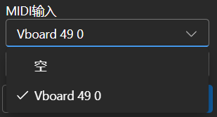
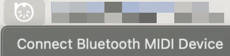
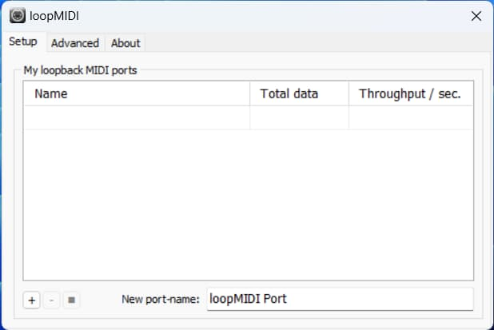
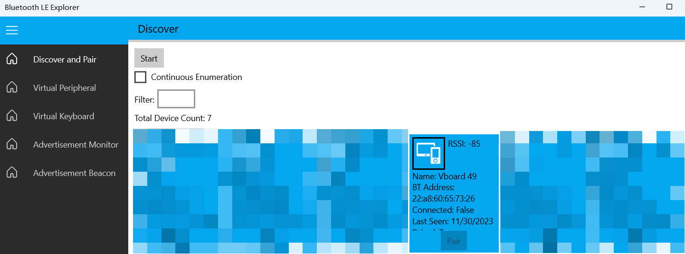
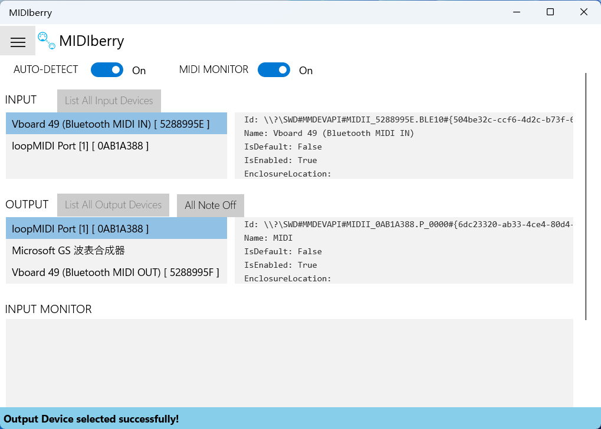
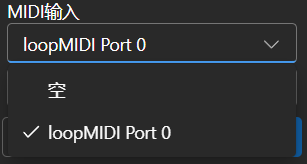

import { CallOut } from 'components-docs/call-out/call-out.tsx'
import { Step, Steps } from 'fumadocs-ui/components/steps'

RWKV Runner “作曲” 功能支持使用 MIDI 硬件创建旋律，这个章节介绍如何为 RWKV Runner 配置 MIDI 硬件输入。

如果你没有实体的 MIDI 键盘， 可以使用像 Virtual Midi Controller 3 LE 这样的虚拟 MIDI 输入软件，再配合 loopMIDI，即可使用普通电脑键盘作为 MIDI 输入。

[loopMIDI 下载](https://www.tobias-erichsen.de/wp-content/uploads/2020/01/loopMIDISetup_1_0_16_27.zip)

## 连接 USB 接口的 MIDI 设备

USB 接口的 MIDI 设备是即插即用的，你能够在 RWKV Runner 作曲界面选择已插入的 USB MIDI 输入设备：

## MacOS 的 MIDI 蓝牙连接

对于想要使用蓝牙输入的 Mac 用户，请安装 Bluetooth MIDI Connect。

启动 Bluetooth MIDI Connect 后，点击托盘连接，之后可以在作曲界面选择你的输入设备。

## Windows 系统的 MIDI 蓝牙连接

<CallOut type="warning" >
注意：如果你正在使用 Windows 11 ，请确保系统在 Windows 11 23H2 及以上版本。22H2 及之前版本有概率出现 BUG，导致 MIDIberry 的蓝牙任务无法正常运作。
</CallOut>

Windows 系统只为 UWP 实现了蓝牙 MIDI 支持，因此我们需要创建一个虚拟的 MIDI 设备，并通过 UWP 程序将实体蓝牙 MIDI 设备的输入重定向到虚拟的 MIDI 设备，再将输出提供给 RWKV Runner 。

听起来似乎有些复杂，但无需担心，只需跟着以下几个步骤操作即可：

<Steps>
<Step>
### Step 1: 使用 loopMIDI 创建一个本地的虚拟 MIDI 设备

首先，我们需要下载用于创建虚拟 MIDI 设备的 loopMIDI 软件。

下载完成后，打开 loopMIDI 并点击左下角的加号，创建一个虚拟的 MIDI 设备（如下图中的 loopMIDI Port ）：

</Step>
<Step>
### Step 2: 使用 Bluetooth LE Explorer 连接实体 MIDI 设备的蓝牙

第二步，你需要下载 Bluetooth LE Explorer，以发现并连接实体的蓝牙 MIDI 设备。

[Bluetooth LE Explorer 下载地址](https://apps.microsoft.com/detail/9N0ZTKF1QD98)

打开 Bluetooth LE Explorer，点击 “Start” 搜索设备， 然后点击 “Pair” 绑定实体 MIDI 设备（下图中的 Vboard 49 为实体 MIDI 键盘的蓝牙名称）。

</Step>
<Step>
### Step 3: 将实体 MIDI 设备的蓝牙输入重定向到虚拟的 MIDI 设备
 
在这一步，你需要安装 MIDIberry，这个 UWP 应用能将实体 MIDI 设备的蓝牙输入重定向到虚拟的 MIDI 设备。

启动 MIDIberry 后， 在输入栏双击你?实际的蓝牙 MIDI 设备名称（ Vboard 49 ），并在输出栏双击此前使用 loopMIDI 创建的虚拟 MIDI设备名称（loopMIDI Port）：

</Step>
<Step>
### Step 4: 使用 RWKV Runner 监听虚拟 MIDI 设备的输入

完成以上步骤后，实体 MIDI 设备的蓝牙已被映射到虚拟的 MIDI 设备上，此时可以在 RWKV Runner 的作曲界面选择虚拟 MIDI 设备（loopMIDI Port）作为输入。

连接完毕即可使用 RWKV Runner 创作.
</Step>
</Steps>

<CallOut type="info">
此时保持 MIDIberry 软件打开即可。可以关闭 Bluetooth LE Explorer 软件，也可以关闭 loopMIDI 窗口，它会自动在后台运行。
</CallOut>
