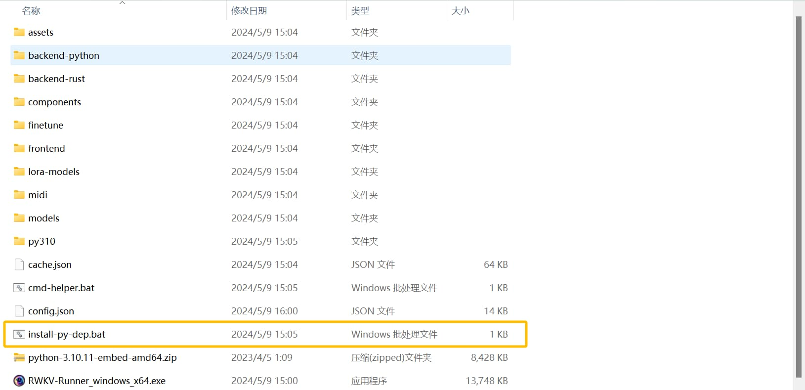

## 配置和运行问题

### 我的 Nvidia 显卡可以正常使用，但是开启自定义 CUDA 算子加速会报错

先打开 Runner 的“设置”页，查看“Pytorch 版本”和驱动 CUDA 版本。Windows 版 Runner 会根据驱动选择受支持的 PyTorch/CUDA 组合。不要通过查找某个固定版本的文件夹来判断环境是否正常。

- **使用 Runner 自带环境：**如果版本为空、显示 CPU 版，或安装过程曾经中断，请在“设置”页重新选择 PyTorch 版本，等待 Runner 完成安装。
- **使用自定义 Python：**请在该环境中安装 CUDA 版 PyTorch 和 `ninja`。
- **暂时不使用自定义算子：**在“配置”页关闭“使用自定义 CUDA 算子加速”。

---
### Torch not compiled with CUDA enabled

这表示当前 Python 环境加载的是 CPU 版 PyTorch，或 Runner 使用了错误的 Python 路径。

- **使用 Runner 自带环境：**在“设置”页重新选择 PyTorch 版本并完成安装。
- **使用自定义 Python：**确认“自定义 Python 路径”正确，并在该环境中安装 CUDA 版 PyTorch。不再使用该环境时，可以清空这个设置。

---
### 我使用 7B 或更大参数的 RWKV 模型，运行不成功或速度太慢。

模型能否运行取决于模型规模、精度、后端、上下文长度和可用内存，不能只用一组固定显存数字判断。请先尝试 1.5B 或 3B 模型。

如果仍需降低占用，可以选择以下方式：

- 使用 WebGPU (Python) 的 NF4/INT8 `.st` 模型
- 使用 llama.cpp 的量化 GGUF 模型

不同格式需要选择对应的 Strategy，具体操作见[自定义模型配置](./Advanced-Usage#%E8%87%AA%E5%AE%9A%E4%B9%89%E6%A8%A1%E5%9E%8B%E9%85%8D%E7%BD%AE%E7%A4%BA%E4%BE%8B)。

---

### 启动提示：切换模型失败 - 自定义 CUDA 算子开启失败 XXXX

这个问题通常由 Python 依赖没有安装完整、安装了 CPU 版 PyTorch，或自定义 Python 环境缺少编译工具引起。建议按以下顺序排查：

1. 在“设置”页重新选择 PyTorch 版本，等待安装窗口执行完成。
2. 如果其他 Python 依赖也不完整，双击 Runner 目录中的 `install-py-dep.bat` 重新安装，并确认过程中没有下载错误。
3. 使用自定义 Python 时安装 CUDA 版 PyTorch 和 `ninja`，或者返回“配置”页关闭“使用自定义 CUDA 算子加速”。

---
### 模型输出的内容乱码

请先更新显卡驱动。如果无法解决问题，请打开 Runner 配置页，关闭“自定义 CUDA 算子加速”后重试。

---
### 为什么使用 webgpu 模式的配置页没有 state 选项？

RWKV Runner 只有 Cuda 模式（NVIDIA 显卡）支持挂载 state。

非 NVIDIA 显卡需要使用 [Ai00](../ai00/Introduction) 才能搭载 State 文件。

## 开发和部署问题

---

###  RWKV Runner 是否可以作为其他 LLM API 的前端使用？

可以。在“设置”页填写目标服务的 `API URL` 和 `API Key`。目标服务需要兼容 OpenAI API 格式。

---

### 三方应用 API 接口调用报错

先确认 Runner 已加载模型并启动 API 服务，再按照 [API 调用文档](./API-Usage) 中的完整 cURL 示例测试本机接口。若本机调用正常、第三方应用仍然报错，再核对第三方应用填写的端口、接口路径和请求格式。

---

### 软件自动更新下载不动，想要手动下载覆盖，正确操作姿势

- **手动更新 Runner：**从 [RWKV Runner Releases](https://github.com/josStorer/RWKV-Runner/releases) 下载适合当前系统的版本，关闭正在运行的 Runner，再将新版本解压到单独目录。先保留旧目录，确认模型和配置迁移完成后再清理。
- **重新检查程序文件和依赖：**关闭 Runner，删除可自动生成的 `cache.json`，然后重新启动 Runner。
- **部署到离线环境：**不要删除 `cache.json`。请先在同系统、同架构的联网电脑上完成依赖安装，再将整个 Runner 目录复制到离线电脑，并测试模型加载是否正常。

空的 `cache.json` 不代表依赖已经安装完成，不能用来跳过离线部署准备。

---

### 内网离线环境更新 python API

当前版本的 Runner 会准备 `backend-python`，不需要逐个下载其中的 Python 文件。请在同系统、同架构的联网电脑上启动同一版本的 Runner，等待程序文件和 Python 依赖安装完成，再将整个 Runner 目录复制到内网电脑，并测试模型加载和 API 服务是否正常。

---

### 点击安装依赖后，几个黑窗一闪而过

请检查下载列表所有内容是否都已经下载完毕，下载完毕后再点击安装依赖。

- 如果下载列表有未完成的下载任务，请手动点一下继续。
- 如果下载列表是空的，说明本地文件都正常，可以安装依赖。

如果安装停在 Python 软件包下载阶段，可以在“设置”页切换“使用阿里云Pip镜像源”后重试。离线部署请按照上一节准备完整目录。

---

### Python 依赖无法下载，可不可以手动下载

不建议只下载 `backend-python` 或 `get-pip.py`。Runner 仍需根据 `backend-python/requirements.txt` 安装 Python 软件包，这两个文件本身不能组成完整环境。

- **电脑可以联网：**在“设置”页切换“使用阿里云Pip镜像源”，再重新安装依赖。
- **电脑无法联网：**在同系统、同架构的联网电脑上完成同版本 Runner 的依赖安装，再复制整个 Runner 目录，并测试模型加载是否正常。

