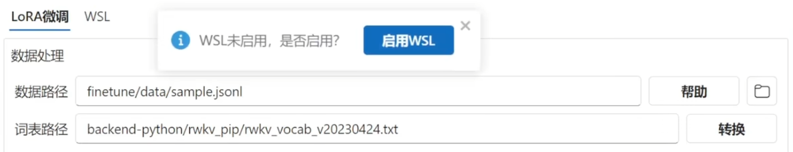
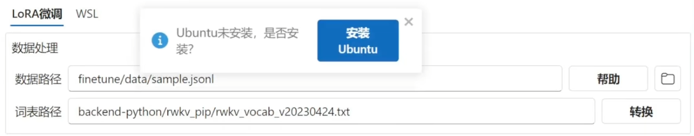
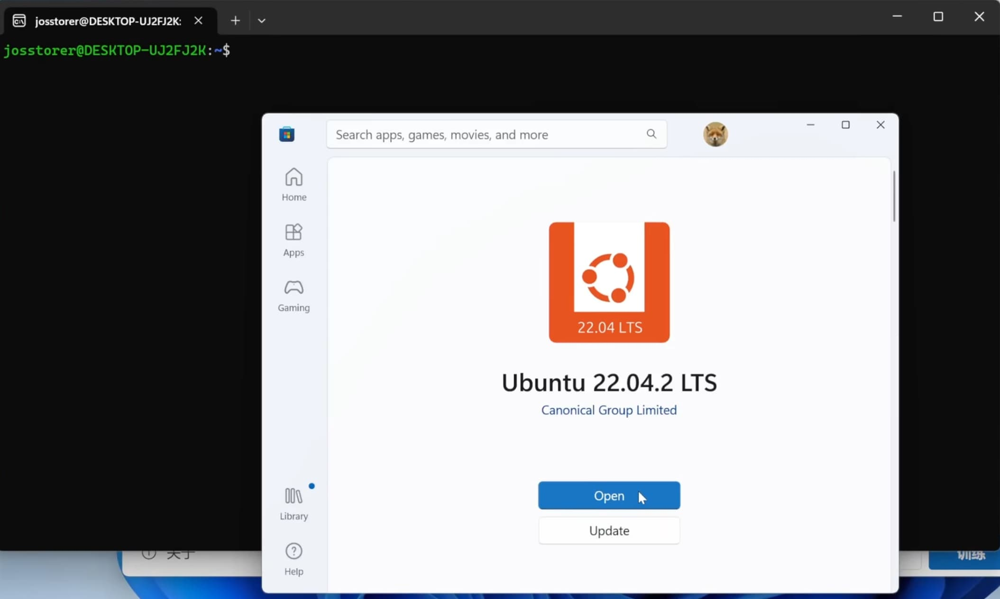
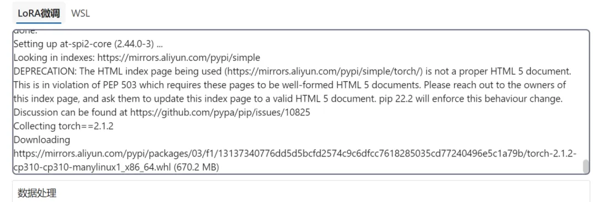
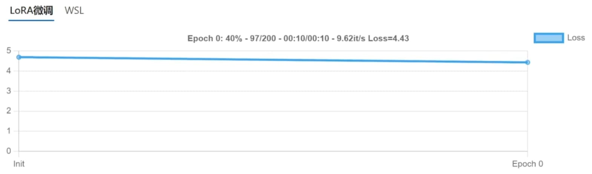
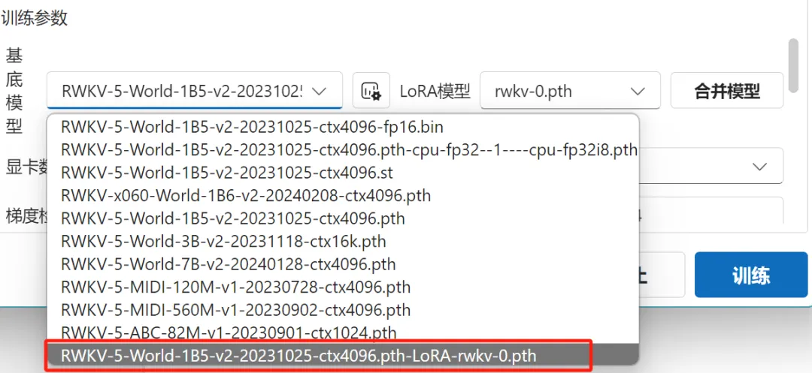
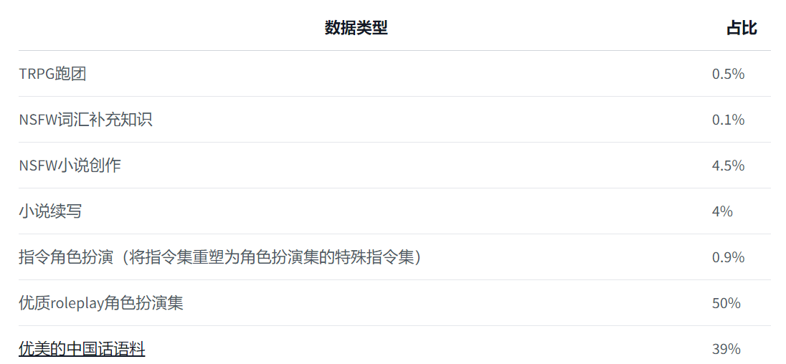
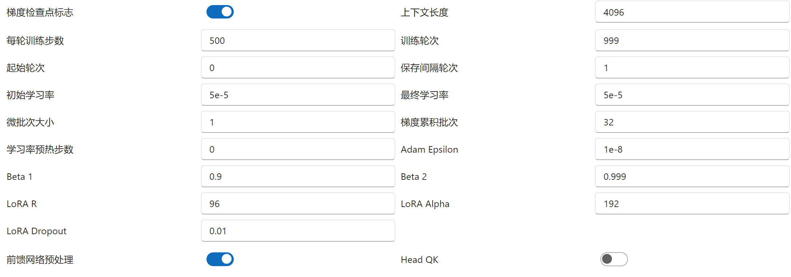

import { Step, Steps } from 'fumadocs-ui/components/steps'
import { CallOut } from 'components-docs/call-out/call-out.tsx'

# LoRA 微调功能

<CallOut type="info">
LORA（Low-Rank Adaptation）是一种针对大型预训练模型的微调技术。它不改变原始模型大部分参数，而是仅通过引入两个低秩矩阵来调整模型的部分权重，以此实现对特定任务的有效优化。这种方法能够在保持模型原有泛化能力的同时，减少微调所需资源，并提高特定任务的性能。
</CallOut>

RWKV Runner 的“训练”版块支持一键 LoRA 微调 RWKV 模型，但目前仅支持在 Windows 系统中使用 WSL 训练。

在开始训练之前，请确保你的 Windows 设备上已安装最新版的 WSL2（Windows Subsystem for Linux）。 

## LoRA 训练环境配置

在开始训练之前，我们需要先配置一次 LoRA 训练的环境。

以下步骤详细指导如何在一台新电脑上配置 RWKV Runner 的 LoRA 训练环境，请确保配置全程处于畅通的网络。

<Steps>
<Step>
###  选择基底 RWKV 模型，转换训练数据

打开 RWKV Runner 的`训练` - `训练参数`一栏，选择你要使用的基底模型，然后点击训练按钮。

初次执行时，系统会提示你数据需要转换，点击上方的转换按钮，将训练数据转换为更适合训练的 binidx 格式。
</Step>
<Step>
###  开启 WSL ，激活 Linux 环境

再次点击训练，RWKV Runner 将会尝试开启 Windows WSL 功能，激活 Linux 环境。

此操作会要求管理员权限，你需要点击确认，并在弹出的窗口完成激活。

<CallOut type="info">
激活后建议重启电脑，如果之前已经开启过 WSL 功能，则可以不进行重启。
</CallOut>
</Step>
<Step>
### 为 WSL 安装 Ubuntu 

接着，RWKV Runner 会自动查询 Windows 是否安装了 Ubuntu 系统。如果没有找到， Runner 将会提示你进行安装。

对于一般使用 Windows 家庭版或专业版的用户，点击弹框的安装按钮后，Microsoft Store 将会自动打开并跳转至 Ubuntu 的安装界面。

</Step>
<Step>
### 更新 WSL 版本
   
使用商店安装前，建议你先在命令行执行一次 `wsl --update` 进行 WSL 更新，并执行 `wsl --set-default-version 2` 将 WSL 的默认版本设为 2。

然后点击微软商店的 Ubuntu 安装按钮。

成功安装 ubuntu 后，点击打开按钮，让 Ubuntu 执行初始化配置。

如果你使用的是服务器版 Windows 系统，通常该系统没有微软商店组件，请使用命令行自行安装 Ubuntu 系统。
</Step>
<Step>
### 为 Ubuntu 配置训练环境

继续点击训练按钮，现在将会为 Ubuntu 配置训练环境。在这个阶段，RWKV Runner 界面将会出现一系列命令文本，并下载多个组件。

此阶段请保证你的网络畅通：

<CallOut type="info">
Ubuntu 训练环境只需要配置一次。
</CallOut>
</Step>
<Step>
### 开始 LoRA 训练

在环境配置完毕后，RWKV Runner 将自动开始训练，当你见到这个图形化 Loss 曲线时，意味着训练已正式开始。

</Step>
<Step>
### 合并训练权重

根据你设置的保存间隔轮次，在 LoRA 模型一栏，将会出现多个训练完成的 LoRA 权重，你可以选择一个权重，并点击合并模型按钮。

合并模型将会生成一个直接可用的新微调模型，新的微调模型会带有 LoRA 后缀。

此时可在 **RWKV Runner** 的配置页面选择新的微调模型并正常启动。

</Step>
</Steps>

## LoRA 微调的参数设置

以下是 RWKV Runner 中 LoRA 微调的**数据参数**设置：

**数据处理调整**

- 数据路径：这里的数据指的用于 LoRA 微调的数据集，这些数据集用于训练 RWKV 模型理解和学习特定任务，例如情感分析、文本分类、问答系统等。数据路径必须是一个**文件夹**或者具体的 **jsonl 格式文件** (jsonl 数据集的格式可参考：[RWKV 微调数据集](../../advanced/Fine-Tune/FT-Dataset)，未来会支持更多格式)。当你填写的路径是一个文件夹时，该文件夹内的所有 txt 文件会被自动转换为训练数据，通常用于大批量训练写作，代码生成或知识库。

- 词表路径： 默认情况下不需要修改。词表路径指向一个包含模型可识别的所有单词或标记（tokens）的列表的文件。在自然语言处理（NLP）中，词表（或词汇表）是模型用来理解输入文本的基础。每个单词或标记都会被映射到一个唯一的数字ID，模型使用这些ID来处理和生成文本。
训练参数调整

以下是 LoRA **训练参数**的作用和推荐设置：

| 模型参数 | 描述 |
| --- | --- |
| 基底模型 | 选取一个本地 RWKV 模型，作为 LoRA 微调的起点 |
| LoRA 模型 | 从某个 LoRA 权重继续训练。如果为空，则表示从基底预训练模型开始进行 LoRA 微调。 |
| 合并模型（按钮） | 训练得到的 LoRA 要与基底模型合并后使用，目前还不支持直接挂载 LoRA 。 |
| 显卡数量 | 使用多少块 GPU 进行训练，在单机多卡或者分布式环境下可以设置大于 1。 |
| 精度 | 通常选择 BF16，这是 RWKV 的官方训练精度。 |
| 梯度检查点标志 | 开启梯度检查点可以节省内存消耗，通过牺牲一些计算效率来换取更小的内存使用量。 |
| 上下文长度 | 训练出来的模型能处理的任务（对话/聊天等）的上下文长度，如果你训练数据量很大，可以适当加长（建议 4096 以内） |

其他参数主要涉及到优化器配置和学习率策略：

- 每轮训练步数、训练轮次、起始轮次、保存间隔轮次等参数控制着整体训练流程。一般情况下保持默认，可根据数据集的大小适当增大训练步数和训练轮次。

- 初始学习率、最终学习率、Adam Epsilon、Beta 1、Beta 2 等参数则影响着优化器（如 Adam）如何更新权重，一般情况下保持默认即可。如需修改学习率，请不要大于 le-4 。

还有一些特定于 LoRA 的超参：

- LoRA R 和 LoRa Alpha 用于控制低秩适应层（Low-Rank Adaptation layer）大小。根据训练的数据量和任务复杂情况，两者可保持一定的比例同时增大，如 LoRA R = 64, LoRA Alpha 128。

- LoRA Dropout 是低秩适应层中 dropout 的比例，一般保持默认即可。

其他开关，如`前馈网络预处理`和 `Head QK` ，正常情况下保持关闭即可。

## LoRA 微调参考示例

以下是 RWKV 开源社区开发者 @Seikaijyu 基于 RWKV-6-World 3B v2 模型进行 Lora 微调的 roleplay （角色扮演）模型：

---

此次 LoRA 微调使用全新的 180M 全中文数据集：

使用如下参数，在 RWKV-Runner 中进行 21 个 epoch 的 LoRA 微调：

