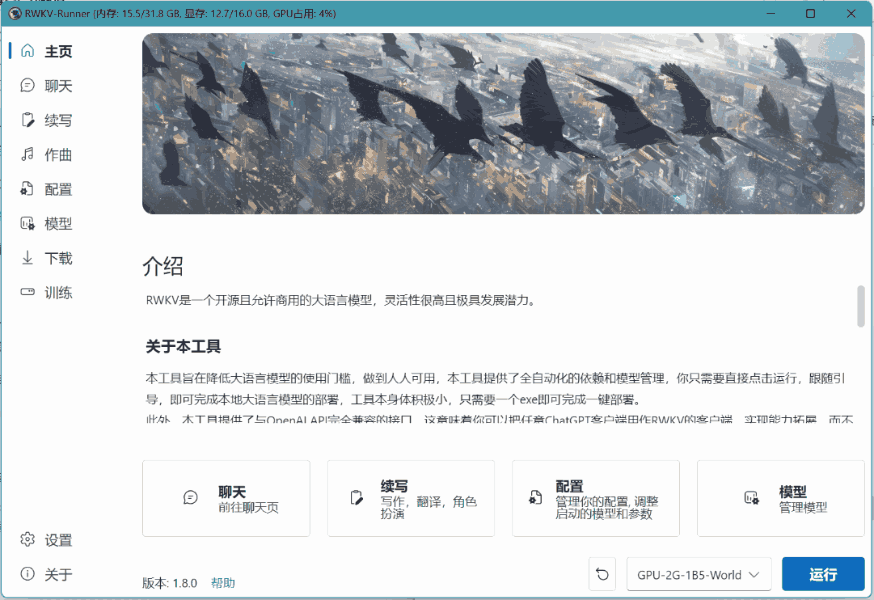
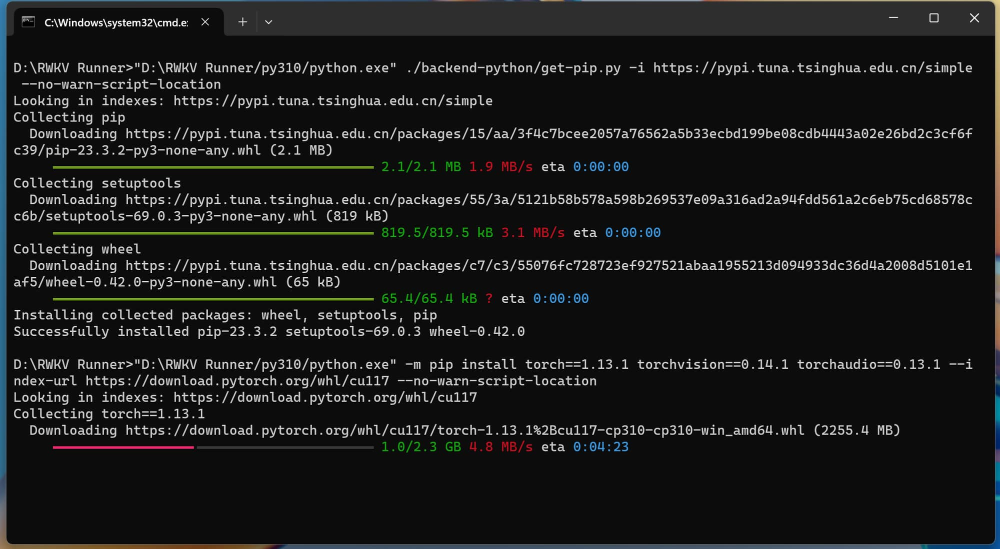
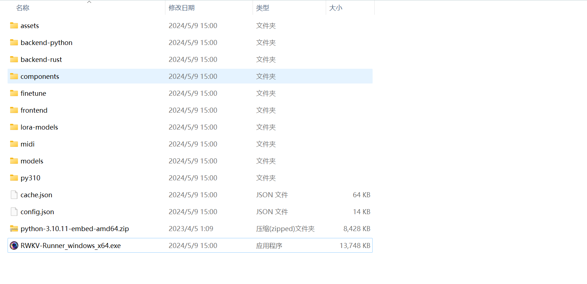
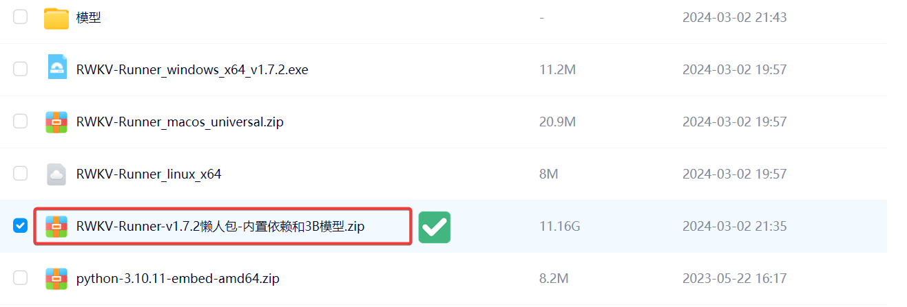
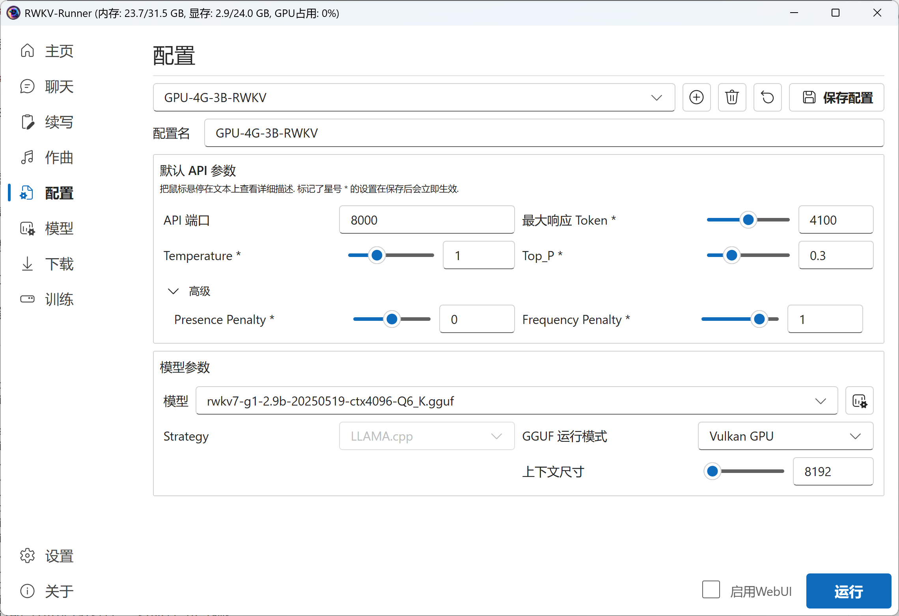
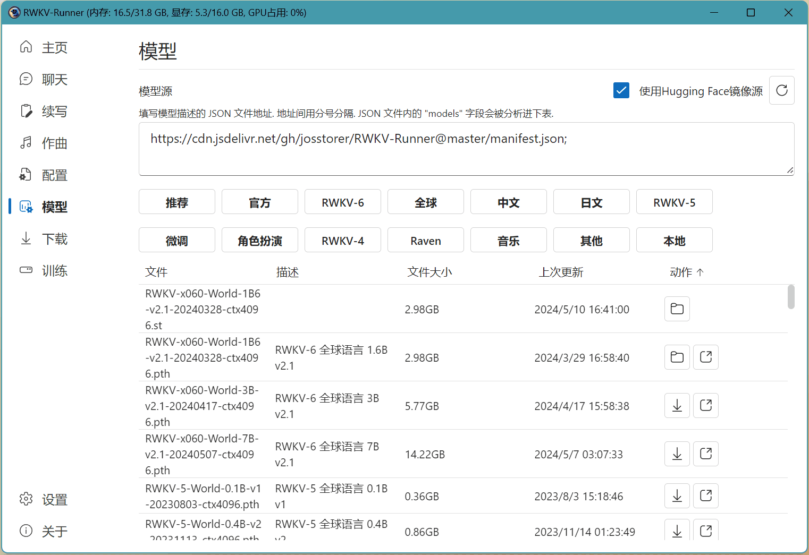

import { Step, Steps } from 'fumadocs-ui/components/steps'
import { CallOut } from 'components-docs/call-out/call-out.tsx'

这部分文档旨在为一些刚接触 RWKV 大模型的朋友们提供指引。

遵循以下步骤，应该可以成功使用 RWKV Runner 驱动本地 RWKV 模型，体验 RWKV 模型的魅力。

## 下载与安装

RWKV Runner 仓库支持 Windows、MacOS、Linux 平台。

- [Windows下载](https://github.com/josStorer/RWKV-Runner/releases/latest/download/RWKV-Runner_windows_x64.exe)
- [MacOS 下载](https://github.com/josStorer/RWKV-Runner/releases/latest/download/RWKV-Runner_macos_universal.zip)
- [Linux 下载](https://github.com/josStorer/RWKV-Runner/releases/latest/download/RWKV-Runner_linux_x64) 

若 Github 下载链接无法打开或下载速度太慢，可以在[Baidu 网盘中下载](https://pan.baidu.com/s/1zdzZ_a0uM3gDqi6pXIZVAA?pwd=1111)对应的安装包。

<CallOut type="warning" >
无论下载哪个版本，请将 RWKV Runner 软件放在一个空目录（空白文件夹）内再执行，因为 RWKV Runner 会自动在当前目录存放所有依赖文件。
</CallOut>

## 准备启动环境

<CallOut type="warning" >
在体验 RWKV Runner 的 AI 功能之前，需要确保设备中安装了 Python 和 Pytorch 等依赖项，这是 RWKV Runner 正常运作的前提。
</CallOut>
以下两种方法可为你的 RWKV Runner 软件提供完整的启动环境：

### 通过 RWKV Runner 自动下载

首次打开 RWKV Runner 软件时，点击“运行”按钮，软件会提示你缺失 Python 等依赖项。

跟随软件的引导逐步点击 “安装”，RWKV Runner 会为你自动下载并安装所需的文件。

耐心等待，直到所有依赖项完成下载。

<CallOut type="info">
    下载完成后。命令行窗口会自动关闭
</CallOut>

---

一切依赖项下载完成后，放置 RWKV Runner 的文件夹应该会有标准的离线环境目录结构，如下图：

其中 `models` 文件夹用于存放 RWKV 模型，RWKV Runner 默认从此文件夹读取本地 RWKV 模型。

<CallOut type="info">
启动环境只需在首次启动 RWKV Runner 时配置一次。
</CallOut>

对于 Mac 和 Linux 用户，请手动安装 Python3.10 (通常最新的系统已经内置了)。此外，你可以在设置中指定使用的 Python 解释器。

### 下载懒人包

直接下载 [Baidu 网盘](https://pan.baidu.com/s/1zdzZ_a0uM3gDqi6pXIZVAA?pwd=1111)中的懒人包，然后在一个空白的目录中解压懒人包。

<CallOut type="error">
只需下载约 11G 的懒人包即可，请勿下载网盘中所有文件
</CallOut>

懒人包中预置了 RWKV Runner 软件本体和 Python 、Pytorch 等所有依赖项，以及一个 3B 的 RWKV 模型。将其下载至本地并在**空白目录**中解压，即可正常使用。

## 模型配置与运行

完成启动环境的配置后，我们可以开始下一步：选择预设模型配置、下载并运行 RWKV 模型。

### 什么是预设模型配置？

为了照顾新手用户，RWKV Runner 内置了一系列预设模型配置，以降低使用难度。

每个模型配置名称的规则，依次代表着：设备-所需显存-模型规模-模型类型。例如 GPU-4G-3B-RWKV，表示该配置需要 4G 显存，模型规模为 30 亿（3B）参数，使用的是 RWKV 模型。
模型的参数规模越大，理论上的任务效果会更好，但对**设备的内存、显存**等性能要求也会更高。

选择一项预设的模型配置后，点击右下角的 `运行` 按钮，即可运行对应的模型。
<CallOut type="tips">
如果你尚未拥有该预设配置所需的 RWKV 模型，请点击弹窗的“下载”按钮，系统将自动为你下载对应的模型文件。（如果模型下载失败或无响应，请看下一个章节：模型下载方法）
</CallOut>
等待模型下载完成，再度点击 `运行` 按钮，即可启动模型并运行各类 AI 功能。

## RWKV 模型下载方法

有几种方法可以下载 RWKV 模型：

### RWKV Runner 下载（默认）

在 RWKV runner 的“模型”版块，可以筛选并下载 RWKV 模型。

<CallOut type="warning" >
注意：如果你无法科学上网，请先勾选 `使用 Hugging Face 镜像源` 再下载模型。
</CallOut>

### 通过网站下载

如果 RWKV runner 的下载任务迟迟未响应，你可以按以下步骤手动下载：

1. 在浏览器中下载 RWKV 模型
2. 将下载的 RWKV 模型放在 RWKV Runner 的 `models` 文件夹中

<CallOut type="tips">

推荐使用 RWKV7-G0/G1 系列模型，RWKV7-G1 系列模型拥有杰出的推理能力，且原生支持世界 100+ 种语言和代码。即使是最小的 0.1B 也能回答开放性和创造性问题。

- [Hugging Face 主站](https://huggingface.co/BlinkDL/rwkv7-g1/tree/main)
- [Hugging Face 镜像站](https://hf-mirror.com/BlinkDL/rwkv7-g1/tree/main)（国内可访问）
- [ModelScope 仓库](https://modelscope.cn/models/Blink_DL/rwkv7-g1/files)（国内可访问）
- [WiseModel 仓库](https://wisemodel.cn/models/rwkv4fun/RWKV-7-G1/file)（国内可访问）

其他模型下载链接请参考：[模型下载](../../basic/Model-Download)
</CallOut>

