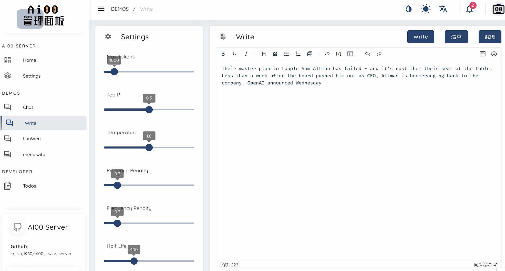

## 简介

Ai00 Server 是基于 web-rwkv 推理引擎的 RWKV 语言模型推理 API 服务器。它本身也是一个基于 MIT 协议的开源软件，由 RWKV 开源社区成员 [@cryscan](https://github.com/cryscan) 和[@顾真牛](https://github.com/cgisky1980)牵头成立的 Ai00-x 开发组开发。

Ai00 Server 支持 Vulkan 作为推理后端，支持 Vulkan 并行和并发批量推理，可以在所有支持 Vulkan 的 GPU 上运行。事实上， Ai00 Server 支持大部分 NVIDIA、AMD、Intel 的显卡（包括集成显卡）。

在高兼容性的同时，Ai00 Server 又不需要笨重的 pytorch 、 CUDA 和其他运行时环境。它结构紧凑，开箱即用，且支持 INT8/NF4 量化，可以在绝大部分的个人电脑上高速运行。

Ai00 Server 仓库地址：<https://github.com/Ai00-X/ai00_server>

这篇新手教程旨在为一些刚接触 RWKV 大模型和 Ai00 Server 的朋友们提供指引。遵循本文的步骤，应该可以成功使用 Ai00 Server 本地运行 RWKV 模型，并进行各种任务，包括聊天、文本生成、翻译和问答。

## 功能预览

**聊天功能**

与模型对话，聊天或提出问题让模型回答。

**续写功能**

使 RWKV 模型根据你给定的内容进行续写。

也可以使用特定格式的 prompt ,让模型遵循某种指令执行任务。具体的 prompt 实现请参阅：[续写模式的提示词示例](../../../docs/RWKV-Prompts/Completion-Prompts)

**写论文**

从给定的论文标题生成论文提纲，再根据提纲生成论文内容。

