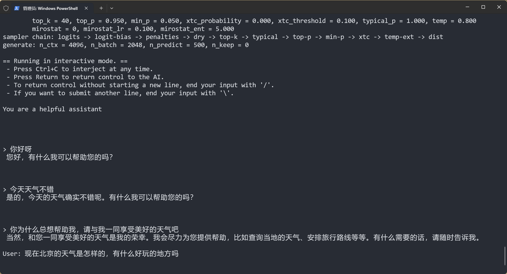
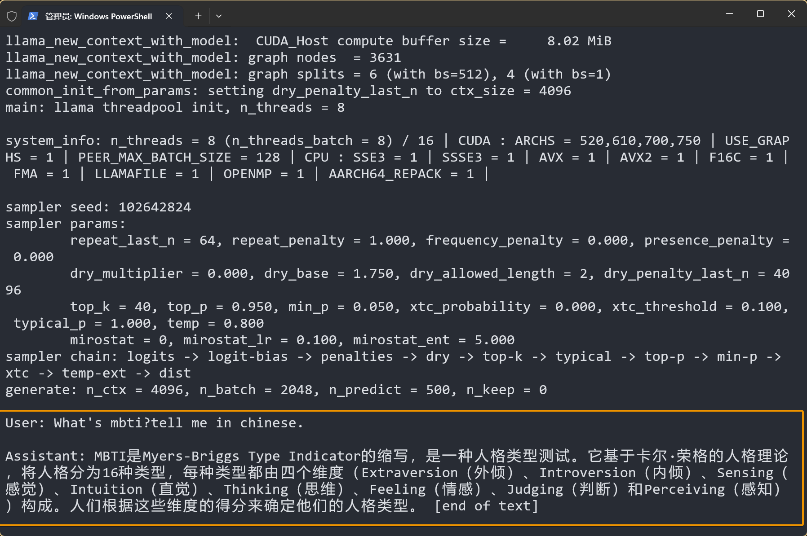
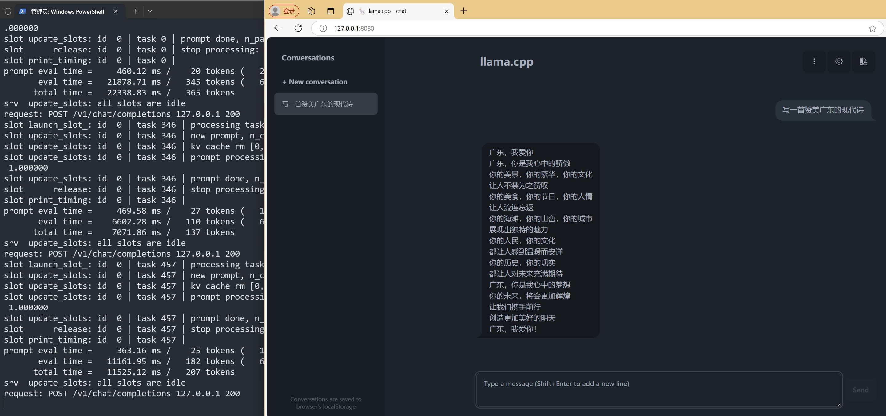
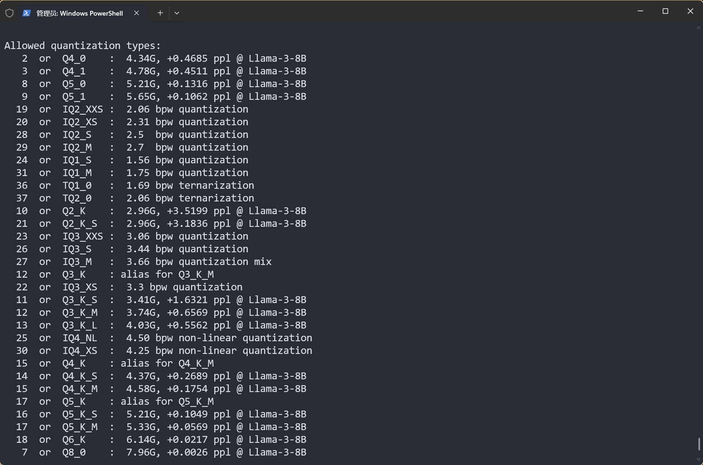

import { Tab, Tabs } from 'fumadocs-ui/components/tabs'
import { Step, Steps } from 'fumadocs-ui/components/steps'
import { CallOut } from 'components-docs/call-out/call-out.tsx'

<CallOut type="info">
[llama.cpp](https://github.com/ggerganov/llama.cpp) 是一个轻量化的大语言模型运行框架，专门优化了在 CPU 上运行模型的性能。
</CallOut>

随着 RWKV 社区成员 [@MollySophia](https://github.com/MollySophia) 的工作，llama.cpp 现已适配 RWKV-6/7 模型。

本章节介绍如何在 llama.cpp 中使用 RWKV 模型进行推理。

## 视频教程

<div className="iframe-container">
 <iframe 
 src="https://player.bilibili.com/player.html?isOutside=true&aid=113842906467984&bvid=BV1hgcdeqEW8&cid=27919253558&poster=1&p=0&high_quality=1&autoplay=0"
 scrolling="no"
 frameBorder="0"
 allowFullScreen={true}
 sandbox="allow-top-navigation allow-same-origin allow-forms allow-scripts"
>
</iframe>
</div>
<CallOut type="info">
高画质视频请[跳转到 B 站](https://www.bilibili.com/video/BV1hgcdeqEW8/)观看。
</CallOut>

##  llama.cpp 推理 RWKV 模型

<Steps>
<Step>
### 本地构建 llama.cpp 
 
可以选择从 [llama.cpp 的 release 页面](https://github.com/ggerganov/llama.cpp/releases)下载已编译的 llama.cpp 程序。

llama.cpp 提供了多种预编译版本，根据你的显卡类型选择合适的版本：

| 系统类型 | GPU 类型 | 包名称字段 |
|----------|----------|------------|
| macOS | 苹果芯片 | macos-arm64.zip |
| Windows | 英特尔 GPU（含 Arc 独显/Xe 核显） | win-sycl-x64.zip |
| Windows | 英伟达 GPU（CUDA 11.7-12.3） | win-cuda-cu11.7-x64.zip |
| Windows | 英伟达 GPU（CUDA 12.4+） | win-cuda-cu12.4-x64.zip |
| Windows | AMD 和其他 GPU（含 AMD 核显） | win-vulkan-x64.zip |
| Windows | 无 GPU | win-openblas-x64.zip |

也可以参照 [llama.cpp 官方构建文档](https://github.com/ggerganov/llama.cpp/blob/master/docs/build.md)，选择适合的方法本地编译构建。
</Step>
<Step>
### 获取 gguf 格式模型[#get-gguf-models]

llama.cpp 支持 `.gguf` 格式的模型，但 RWKV 官方仅发布了 `.pth` 格式模型。因此，我们需要使用以下两种方法之一获取 `.gguf` 格式的 RWKV 模型。

<Tabs items={[' 直接下载 gguf 模型（推荐）', '从 pth 转换成 gguf']}>
  <Tab> 
可以从 [RWKV-GGUF 合集](https://modelscope.cn/organization/RWKV?tab=collection) 下载 gguf 格式的 RWKV 模型。

<CallOut type="info">
请在 llama.cpp 目录下新建一个 models 文件夹，将下载的 gguf 模型放入 models 文件夹中。
</CallOut>

<CallOut type="warning">
RWKV gguf 模型有**多种量化类型**，精度越高，模型的回复效果越好，但模型体积和计算要求越高。

推荐顺序：`FP16` > `Q8_0` > `Q5_K_M` > `Q4_K_M` ，更低的量化精度（如 `Q3_0`、`Q2_0` 等）可能会大大降低模型的性能。
</CallOut>

</Tab>
  <Tab id="pth-to-gguf"> 
1. 首先，从 [Hugging Face](https://huggingface.co/BlinkDL) 或[魔搭平台](https://modelscope.cn/organization/RWKV?tab=model)（国内可访问）下载一个 `pth` 格式的 RWKV 模型
2. 从 [MollySophia/rwkv-mobile 仓库](https://github.com/MollySophia/rwkv-mobile/blob/master/converter/convert_rwkv_pth_to_gguf.py) 下载 `convert_hf_to_gguf.py` 转换脚本
3. 下载 RWKV 分词表[rwkv_vocab_v20230424.txt](https://github.com/MollySophia/rwkv-mobile/blob/master/assets/rwkv_vocab_v20230424.txt)，确保分词器和转换脚本放在同一目录下
4. 运行 `pip install torch gguf` 命令，安装转换脚本所需的依赖项
5. 在转换脚本目录下运行以下命令，将 `pth` 格式的模型转换为 `gguf` 格式的模型

```bash
python convert_rwkv_pth_to_gguf.py [pth模型文件路径] rwkv_vocab_v20230424.txt
```

<CallOut type="warning">
 请将上述命令中的 `[pth模型文件路径]`改成你的 pth 格式 RWKV 模型路径。
</CallOut>
  </Tab>
</Tabs>
</Step>
<Step>

### 运行 RWKV 模型进行对话

在 llama.cpp 目录运行以下命令，可以开启 llama.cpp 的命令行**对话模式**：

``` bash copy
./llama-cli -m models/rwkv-6-world-7b-Q8_0.gguf -p "You are a helpful assistant" -cnv -t 8 -ngl 99 -n 500
```
这条命令通过 `llama-cli` 运行 `models/rwkv-6-world-7b-Q8_0.gguf` 模型，使用 8 个线程、并根据给定的初始 prompt `You are a helpful assistant` 开启对话，每次生成最多 500 个 token。



**参数解释：**

- `./llama-cli`：启动编译好的 llama-cli 程序
- `-m models/rwkv-6-world-7b-Q8_0.gguf`：模型的路径参数
- `-p "You are a helpful assistant"`：初始 prompt 参数，模型根据该提示词开启对话
- `-cnv`：开启对话模式，此参数为默认参数，可以省略
- `-t 8`：指定线程数，建议根据可用的物理 CPU 核心数调整
- `-ngl`：指定使用 GPU 加载的模型层数，可以通过设定 `-ngl 99`，使用 GPU 加载 RWKV 模型所有层
- `-n 500`：-n 参数表示模型生成的最大 token 数

<CallOut type="info">
完整的参数列表可以在 [llama.cpp 参数文档](https://github.com/ggml-org/llama.cpp/blob/master/tools/main/README.md#input-prompts)中查看。
</CallOut>
</Step>
</Steps>

## 附加功能（可选）

### 启用续写模式

<CallOut type="info">
`./llama-cli` 默认是对话模式。可通过添加 `-no-cnv` 参数设置为续写模式，根据给定的 prompt 继续生成文本。
</CallOut>

``` bash copy
./llama-cli -m models/rwkv-6-world-7b-Q8_0.gguf -p "User: What's mbti?tell me in chinese.\n\nAssistant:" -no-cnv -t 8 -ngl 99 -n 500
```



- `-p "User: What's mbti?tell me in chinese.\n\nAssistant:"`： prompt 参数，模型根据该提示词进行续写。更多 RWKV prompt 格式请在 [RWKV 的提示词格式](../basic/Prompt-Format)中查看
- `-no-cnv` 参数：关闭对话模式，设置 llama.cpp 为续写模式，模型会根据给定的 prompt 继续生成文本
- 其他参数：与对话模式相同

### 启动 Web 服务（推荐）

使用以下命令，启动 llama.cpp 的 Web 服务：

``` bash copy
./llama-server -m models/rwkv-6-world-7b-Q8_0.gguf -ngl 99
```

启动后，可以通过 `http://127.0.0.1:8080` 访问 llama.cpp Web 页面：




### 量化 gguf 模型

在 llama.cpp 目录运行 `./llama-quantize [input_model] [output_model] [quantization_type]` 命令，可以对 `fp32` 和 `fp16` 的 `.gguf` 模型进行量化，例如：

``` bash copy
./llama-quantize models/rwkv-6-world-1.6b-F16.gguf models/rwkv-6-world-1b6-Q8_0.gguf Q8_0
```
<CallOut type="warning">
输入模型的精度限制为 `fp32` 和 `fp16`，推荐使用 `Q5_1`、 `Q8_0` 两种量化精度。
</CallOut>

使用 `./llama-quantize --help` 命令，查看所有可选的量化精度：



{/*
## 搭载 RWKV State 文件[#state-file]

<CallOut type="info">

State 是 RWKV 这类 RNN 模型特有的状态。通过搭载自定义的 State 文件，可以强化 RWKV 模型在不同任务上的表现。（类似于增强插件）

RWKV State 的介绍可参照 [State 文件介绍和用法](https://rwkv.cn/news/read?id=343)文章。
</CallOut>

遵循以下步骤，可在 llama.cpp 推理 RWKV 模型时搭载 State 文件：

<Steps>
### 下载 .pth 格式 State 文件

从以下链接下载 `.pth` 格式的 RWKV State 文件：

- [RWKV-6-World-v2.1/RWKV-6-ChnNovel 模型的 State 文件](https://hf-mirror.com/BlinkDL/temp-latest-training-models/tree/main/states)
- [RWKV-6-World-v3 模型的 State 文件](https://hf-mirror.com/BlinkDL/rwkv-6-misc/tree/main/states)

### 使用脚本转换 State 文件
 
由于 llama.cpp for RWKV 只接受 `.bin` 格式的 State 文件，因此我们需要使用附录中的 [convert_rwkv_state_to_llamacpp.py 脚本](#state-pthtobin)，将 `.pth` 格式的 State 文件转换为 `.bin` 格式。

在脚本目录，运行以下转换命令：

```bash copy
python convert_rwkv_state_to_llamacpp.py rwkv-x060-chn_single_round_qa-3B-20240516-ctx2048.pth rwkv-x060-chn_single_round_qa-3B-20240516-ctx2048-llamacpp.bin
```
参数解释：

- `rwkv-x060-chn_single_round_qa-3B-20240516-ctx2048.pth`：需要转换的 `.pth` State 文件路径
- `rwkv-x060-chn_single_round_qa-3B-20240516-ctx2048-llamacpp.bin`：转换后的 `.bin` State 文件路径

### 推理时搭载 State 文件

在 llama.cpp 推理 RWKV 模型时，添加额外的`-prompt-cache` 和 `--prompt-cache-ro` 参数，以搭载 RWKV State ：

``` bash copy
./llama-cli -m models/rwkv-6-world-7b-Q8_0.gguf -p "how can a pig fly?" -t 8 -ngl 99 -n 500 --prompt-cache rwkv-6-7b-v3-enQA-llamacpp.bin --prompt-cache-ro
```

参数解释：

- `--prompt-cache` ：加载 prompt cache 文件 ，填写 State 文件路径，如 `rwkv-x060-chn_single_round_qa-3B-20240516-ctx2048-llamacpp.bin`
- `--prompt-cache-ro` : 以只读方模式加载，生成时不要覆盖原 State 文件


</Steps>

## 附录代码[#appendix-code]

### `pth` 转 `gguf` 格式[#pthtogguf]


### `.pth` State 文件转成 `.bin`[#state-pthtobin]


以下代码可将 RWKV 官方发布的`.pth` State 文件，转换为 llama.cpp 可使用的 `.bin`格式 State 文件：

``` python copy filename="convert_rwkv_state_to_llamacpp.py"
import torch
import argparse
import struct
import array
from pathlib import Path


def convert_rwkv_state_to_llamacpp_cache(path_input, path_output):
    state = torch.load(path_input, map_location='cpu')
    n_head, head_size, _ = state['blocks.0.att.time_state'].shape
    n_embd = n_head * head_size
    n_layer = len(state.keys())
    print(f'n_layer: {n_layer}, n_embd: {n_embd}')
    
    LLAMA_SESSION_MAGIC = 0x6767736e
    LLAMA_SESSION_VERSION = 9

    with open(path_output, 'wb') as file:
        # magic, version, n_token_count
        file.write(struct.pack('3I', LLAMA_SESSION_MAGIC, LLAMA_SESSION_VERSION, 0))
        # model arch
        file.write(struct.pack('I5s', 5, b'rwkv6'))
        # session output ids, logits, embeddings (skip)
        file.write(struct.pack('=IQQ', 0, 0, 0))
        # cell_count, pos, n_seq_id, v_trans, n_layer
        file.write(struct.pack('=5I', 1, 0, 0, 0, n_layer))
        for _ in range(n_layer):
            # k_type = GGML_TYPE_F32, k_size = 2 * n_embd * sizeof(float)
            file.write(struct.pack('=iq', 0, 2 * n_embd * 4))
            for _ in range(2*n_embd):
                file.write(struct.pack('=f', 0.0))
            
        for i in range(n_layer):
            # v_type = GGML_TYPE_F32, v_size = n_head * head_size * head_size * sizeof(float)
            file.write(struct.pack('=iq', 0, n_head * head_size * head_size * 4))
            data = state[f'blocks.{i}.att.time_state'].float().transpose(1, 2).flatten().tolist()
            file.write(struct.pack(f'{n_head * head_size * head_size}f', *data))

def main():
    parser = argparse.ArgumentParser(description='Convert RWKV state to llama.cpp prompt cache')
    parser.add_argument('input', type=Path, help='Path to RWKV state')
    parser.add_argument('output', type=Path, help='File name for llama.cpp prompt cache')
    args = parser.parse_args()

    convert_rwkv_state_to_llamacpp_cache(args.input, args.output)

if __name__ == '__main__':
    main()
```
*/}