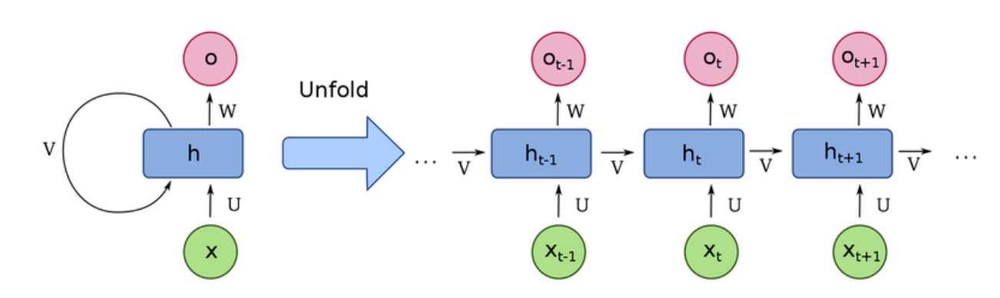
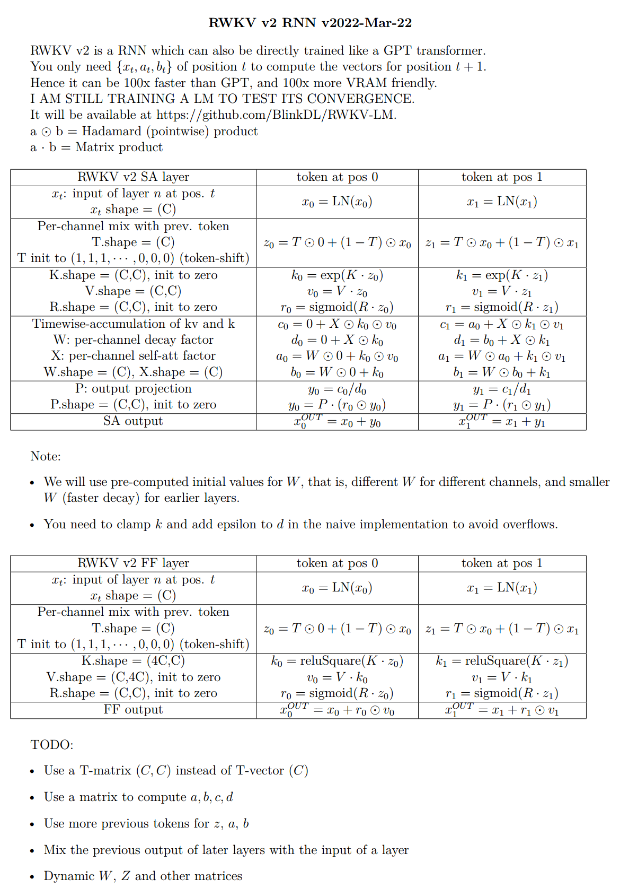
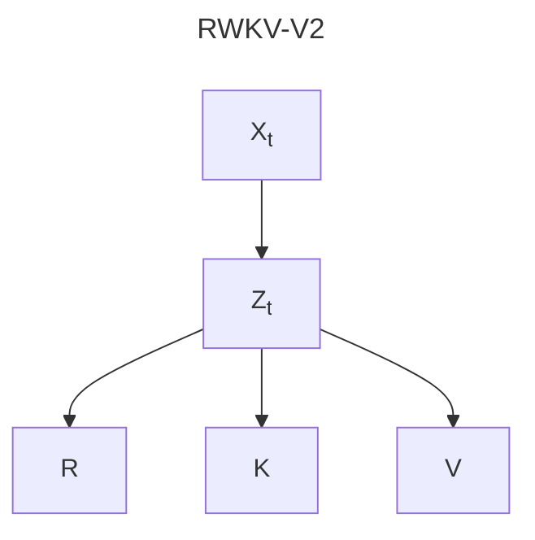
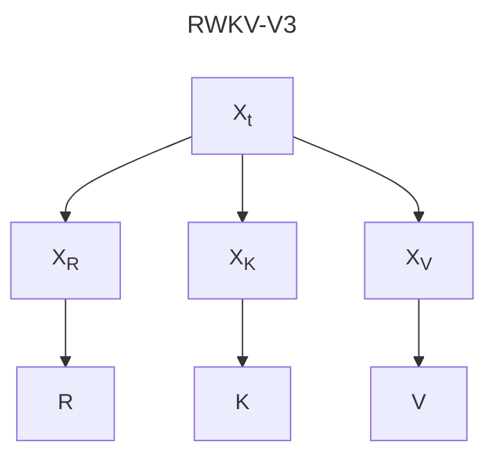
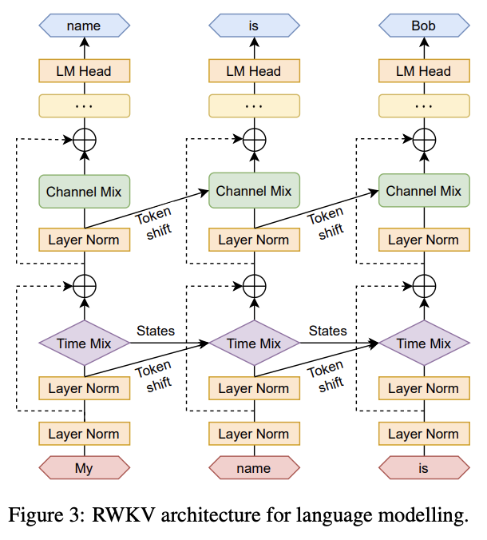
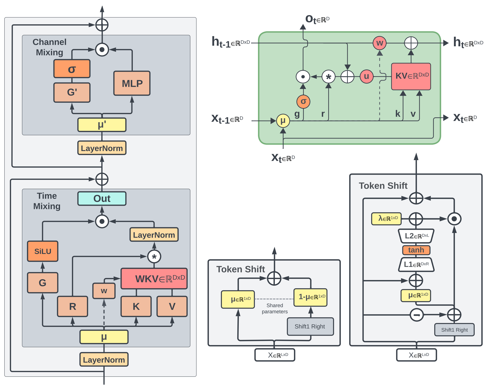
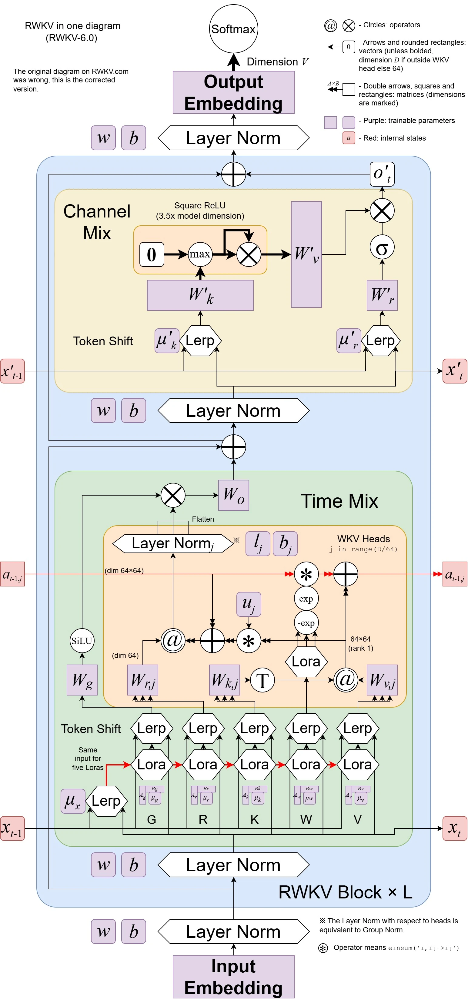
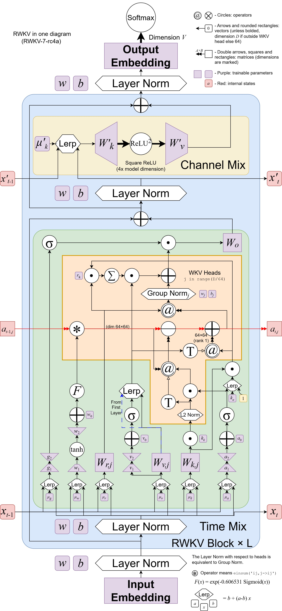

import { Callout } from 'nextra/components'
import { Steps } from 'nextra/components'

以下是 RWKV 架构相关的知识，包括 RWKV 架构名称的由来、RWKV 架构特性、架构历史、以及每个架构的模型发布等内容。

**RWKV 是 RNN 的一个变体**。因此，有必要先介绍：什么是 RNN 架构，以及 RNN 架构的隐藏状态是什么？

## RNN 架构和隐藏状态[#rnn-and-state]

循环神经网络（RNN）是一种广泛应用于深度学习领域的神经网络模型。

RNN 网络在运行过程中会保持一个隐藏状态（state），隐藏状态可看作 RNN 模型的“心理状态”。就像人类在思考时，脑海中会保留与当前事件关联度最高的“关键信息”。随着思考内容的变化，我们脑海中的“关键信息”会不断更新。同样的，RNN 网络也会**通过特定的函数不断更新其隐藏状态**。



如图所示，RNN 网络依次处理每一个输入的 token，并根据“当前隐藏状态”来预测下一个可能出现的 token（如果有需求）。每处理一个 token，RNN 会将结果反馈给网络自身，从而“更新其隐藏状态”，再用“更新后的状态”去预测下一个 token。如此循环，直到达到“完成任务”的状态。

<Callout type="warning" emoji="✨">
作为 RNN 的一种变体，RWKV 支持对隐藏状态进行微调（[state tuning](https://rwkv.cn/RWKV-Fine-Tuning/State-Tuning)）。通过调整模型的“心理状态”，可使 RWKV 模型在特定任务上表现更佳。
</Callout>

## RWKV 架构名称的由来[#name-origin]

RWKV 架构的名称来源于时间混合和通道混合块中使用的四个主要模型参数，分别如下:

- $R$：Receptance，作为过去信息的接受程度的接受向量
- $W$：Weight，位置权重衰减向量，可训练的模型参数
- $K$：键(Key)是类似于传统注意力中 $K$ 的向量
- $V$：值(Value)是类似于传统注意力中 $V$ 的向量

## RWKV 架构的发展历程[#history]

2020 年，BlinkDL 开始研究 Transformer ，立刻发现其有两个明显的改进方向：引入显式 decay 和 Token-shift（或者说短卷积）。在 **https://github.com/BlinkDL/minGPT-tuned** 上测试后，发现这些技巧对于 Transformer 的性能有显著提升。

随后，他注意到 Apple 的 [**Attention Free Transformer**](https://arxiv.org/abs/2105.14103) （AFT）论文并对其进行测试，发现这两种技巧也为 AFT 带来了显著的性能提升。

### RWKV-V1

2021 年 8 月，RWKV 架构的初版：RWKV-V1 被提交到 [**RWKV-LM 仓库**](https://github.com/BlinkDL/RWKV-LM) 中。RWKV-V1 [**首次 commit**](https://github.com/BlinkDL/RWKV-LM/commit/4c6db5607c6f94c38c10004efb292510bc71ba59) 于 2021 年 8 月 9 日。

RWKV-V1 使用长卷积代替 Attention 机制，其架构由交替的 Time-mix 和 Channel-mix 组成。**Channel-mix 是 Transformer 的 GeGLU 层的变种。Time-mix 则是对于 AFT 的显著改进**：

$$
\text { Time-mix }: \mathbf{TM}_{t, c}=\operatorname{sigmoid}\left(R_{t, c}\right) \cdot \sum_{u} W_{t, u, c} \cdot \operatorname{softmax}_{t}\left(K_{u, c}\right) \cdot V_{u, c}
$$

$$
\text { Channel-mix } \mathbf{CM}_{t, c}=\operatorname{sigmoid}\left(R_{t, c}\right) \cdot \sum_{d} W_{c, d} \cdot \operatorname{gelu}\left(K_{t, d}\right) \cdot V_{t, d}
$$

其中 $R$ 、 $K$ 、 $V$ 由输入线性变换生成，$W$ 则是长卷积中的卷积核。

<Callout type="info" emoji="ℹ️">
Time-mix 和 Channel-mix 的结构设计均基于 $R$ 、$W$ 、 $K$ 、 $V$ 四个主要参数，这便是 **RWKV** 这个名称的由来。
</Callout>

<Callout type="warning" emoji="✨">
RWKV-V1 更接近 Linear Transformer 而非 RNN ，因为其每一个时间步都依赖于历史时刻所有的输入。
</Callout>

### RWKV-V2-RNN

RWKV-V2 版本首次为 RWKV 实现了 RNN 模式，伪代码图如下：



**代码图的补充说明：**

- a 和 b 是 kv 和 k 的 EMA（exponential moving average）
- c 和 d 是 a 和 b 加上纯 self-attention 效应（原地的自己对自己的注意力）
- c / d 是记忆机制，因为如果某个字在某个通道的 k 很强，且 W 接近 1，那么这个字就会被后文记住
- $T$, $K$, $V$, $R$, $W$, $X$, $P$ 都是可以训练的参数
- $W$ 使用预计算的值进行初始化，与 Alibi（Attention with Linear Biases）有类似之处，但都是可训练的非固定值，且在每个通道都可以不同，表达能力显著提高。
- **发明了一种 headQK 机制**，让模型可以直接从前文复制或避免生成某些字，这对于 ICL（in context learning） 很重要。几年后，其它研究者也发现了这一现象。但为了测试纯 RNN 的能力极限，RWKV 主线模型并未加入这一功能。

```python
q = self.head_q(x)[:,:T,:] 
k = self.head_k(x)[:,:T,:] 
c = (q @ k.transpose(-2, -1)) * (1.0 / 256)
c = c.masked_fill(self.copy_mask[:T,:T] == 0, 0)
c = c @ F.one_hot(idx, num_classes = self.config.vocab_size).float()       
x = self.head(x) + c
```

<Callout type="warning" emoji="✨">
通过指数衰减（exponential decay），RWKV-V2 实现了 RNN 形式的推理：模型每次生成都依赖于上一个时刻的输入和当前时刻的输入，同时拥有固定大小的隐藏状态（在 RWKV-V2 里是 a 和 b）。
</Callout>

RWKV-V2 的自注意力层简化表达：

$$
x_{t+1} = \sigma(Rx_t) \cdot \frac{ \exp(Kx_t) \cdot (V_xt) + \exp(W) \cdot a_t }{ \exp(Kx_t) + \exp(W) \cdot b_t }
$$

### RWKV-V3

RWKV-V3 是一个短期的过渡版本，其相对 RWKV-V2 使用更全面的 token-shift（对 SA 和 FF 层中的 R / K / V 分别使用不同的可训练 TimeMix 因子） :

```
xx = self.time_shift(x)
xk = x * self.time_mix_k + xx * (1 - self.time_mix_k)
xv = x * self.time_mix_v + xx * (1 - self.time_mix_v)
xr = x * self.time_mix_r + xx * (1 - self.time_mix_r)
```
RWKV-V3 对比 V2 的 token-shift 改进图示：





此外，这个版本使用 preLN 代替 postLN（更稳定，且收敛更快）：

``` python
if self.layer_id == 0:
	x = self.ln0(x)
x = x + self.att(self.ln1(x))
x = x + self.ffn(self.ln2(x))
```

### RWKV-V4

RWKV-V4 是 RWKV 架构的**首个正式版本**，版本代号 "Dove（鸽）" 。RWKV-V4 解决了 RWKV-V3 架构的数值稳定性问题，同时也发布了 RWKV 项目的首篇论文 [《RWKV: Reinventing RNNs for the Transformer Era》](https://arxiv.org/abs/2305.13048)。

RWKV-V4 架构的论文由 RWKV 作者彭博和 RWKV 社区共同完成，初次发表于 2023 年 5 月 22 日。同年 10 月，RWKV-V4 架构论文被顶级会议 [EMNLP 2023](https://2023.emnlp.org/program/accepted_findings/) 收录。


<Callout type="info" emoji="ℹ️">
上图是 RWKV-V4 论文中的模型架构概览，其中：

- 左侧：RWKV-V4 的 time-mixing 和 channel-mixing 模块
- 右侧：RWKV-V4 的语言建模流程
</Callout>

#### Token Shift 概念[#token-shift]

RWKV-V4 论文中正式提出 “Token Shift” 概念：将 RWKV 接收的每个 token 和前一个 token 做混合，类似于大小 = 2 的一维因果卷积。Token Shift 让模型可以控制每个时间步将多少新信息与旧信息分配给每个头的接收、键、值和门向量（即 $r$、$k$、$v$ 和 $g$）。

RWKV-V4 语言建模的架构图，演示了 RWKV-V4 的 Token Shift 过程，以及 RWKV 的 state 更新过程：



<Callout type="warning" emoji="✨">
RWKV-V4 版本的一大特点是 state（RNN 的隐藏状态）非常小，这是因为彭博专注于在“最小的 state 下实现最大的性能”。

以 $D$ 为模型主维数， $L$ 为模型层数。RWKV-4 模型的 state 大小为 $5DL$，包括 $2DL $ 的 mixing 和 $3DL$ 的 WKV。
</Callout>

#### RWKV-V4 的模型发布[#rwkv-v4-model-release]

RWKV-V4 的研究（架构迭代和模型训练等）横跨了 2022 和 2023 年，主要发布了以下 4 类模型：

- RWKV-4-Pile：在 331B tokens 的 Pile 数据集上进行预训练，包含 169m、430m、1B5、3B、7B、14B 六种参数的模型
- RWKV-4-Raven：RWKV-4-Pile 的指令微调模型，使用 Alpaca、CodeAlpaca、Guanaco、GPT4All、ShareGPT 等开源数据集进行微调，包含 1B5、3B、7B、14B 四种参数的模型。
- RWKV-4-World：在 RWKV World v1 数据集上训练的多语言模型（100 多种世界语言，训练数据包含 Pile），包含 169m、430m、1B5、3B、7B 五种参数的 Base 模型，有一些中文微调模型。
- RWKV-4-Music：有 MIDI 和 ABC 两种格式的作曲模型，分别使用 bread-midi-dataset 和 irishman 乐谱数据进行训练。其中 ABC 模型参数为 82m，MIDI 模型参数分别为 120m 和 560m 。

**RWKV-V4 模型对比表格：**
<div style={{ 
  overflowX: 'auto',
  width: '100%',
  maxWidth: '100%',
  display: 'block',
  marginRight: 0,
  paddingRight: 0,
  wordBreak: 'break-all',
}}>

| 模型名称 | 描述 | 训练数据（数据量）| 词表（词表大小）|
|---------|------|------------------|----------------|
|**[RWKV-4-Pile](https://huggingface.co/BlinkDL/rwkv-4-pile-14b)**|基于 Pile 数据集的预训练语言模型|[EleutherAI/pile](https://huggingface.co/datasets/EleutherAI/pile) (331B tokens)|[20B_tokenizer](https://github.com/BlinkDL/RWKV-LM/blob/main/RWKV-v4/20B_tokenizer.json) (50,277)|
|**[RWKV-4-Raven](https://huggingface.co/BlinkDL/rwkv-4-raven)**|RWKV-4-Pile 的指令微调语言模型|Alpaca、CodeAlpaca、Guanaco、GPT4All、ShareGPT 等|20B_tokenizer (50,277)|
|**[RWKV-4-World](https://huggingface.co/BlinkDL/rwkv-4-world)**|基于 100 多种全球语言数据集的预训练语言模型|[RWKV World v1](https://rwkv.cn/RWKV-Wiki/FAQ#rwkv-%E6%A8%A1%E5%9E%8B%E5%90%8D%E7%9A%84-v2--v21-v3-%E6%98%AF%E4%BB%80%E4%B9%88%E6%84%8F%E6%80%9D) (590B tokens)|[rwkv_vocab_v20230424](https://github.com/BlinkDL/RWKV-LM/blob/main/RWKV-v5/tokenizer/rwkv_vocab_v20230424.txt) (65,536)|
|**[RWKV-4-Music（MIDI）](https://huggingface.co/BlinkDL/rwkv-4-music)**|基于 MIDI 乐谱数据训练的音乐（作曲）模型|[bread-midi-dataset](https://github.com/briansemrau/MIDI-LLM-tokenizer)|[MIDI-LLM-tokenizer](https://github.com/briansemrau/MIDI-LLM-tokenizer)（20,095）|
|**[RWKV-4-Music（ABC）](https://huggingface.co/BlinkDL/rwkv-4-music)**|基于 ABC 乐谱数据训练的音乐（作曲）模型|[irishman](https://huggingface.co/datasets/sander-wood/irishman)|-|

</div>
此外，RWKV-V4 模型首次训练了 14B 参数的模型，并从 RWKV-V4-World 起正式启用了包含 100 多种世界语言的 `World` 系列数据集，以及对应的多语言词表 `rwkv_vocab_v20230424`。

<Callout type="info" emoji="ℹ️">

RWKV-V5 和 RWKV-V6 等更新的 RWKV 架构沿用了 `World` 系列数据集和 `rwkv_vocab_v20230424` 词表。

`World` 数据集会持续补充训练数据，并更新版本号：

- World v1 ≈ 0.59T tokens
- World v2 ≈ 1.1T tokens
- World v2.1 ≈ 1.42T tokens，v2.1 模型的总训练数据 ≈ 2.5T tokens
- World v3 ≈ 3T tokens，v3 模型的总训练数据 ≈ 5.5T tokens

</Callout>

### RWKV-V5

RWKV-V5 是 RWKV-V4 架构的改良版本，版本代号“Eagle（鹰）”。

RWKV-V5 和 RWKV-V6 这两个架构在同一篇论文 [《Eagle and Finch: RWKV with Matrix-Valued States and Dynamic Recurrence》](https://arxiv.org/abs/2404.05892)中发布。

该论文由 RWKV 作者彭博和 RWKV 社区共同完成，初次发表于 2024 年 4 月 9 日。同年 10 月，RWKV 5/6 架构论文被 LLM 领域国际会议 [COLM 2024](https://colmweb.org/AcceptedPapers.html) 收录。



<Callout type="info" emoji="ℹ️">

上图是论文中 RWKV 5/6 的架构概览，其中：

- 左侧：RWKV 的 time-mixing 和 channel-mixing 模块
- 右上角：作为 RNN 单元时的 RWKV  time-mixing 模块
- 底部的中间：前向传播模式下 RWKV-V5 time-mixing 的 token-shift 模块
- 右下角：前向传播模式下 RWKV-V6 time-mixing 的 token-shift 模块
- 虚线箭头（左侧，右上角）：表示 RWKV-V6 架构的连接，但在 RWKV-V5 中不存在
</Callout>

#### RWKV-V5 架构优化细节[#rwkv-5-optimization-details]

相对 RWKV-V4， RWKV-V5 的最重点改动在于引入了**多头的**、**基于矩阵值的状态（state）**，即论文中的 “multi-headed matrix-valued states”。

在 RWKV-V4 架构的 time mixing 计算中，$u$、$w$、$k$、$v$ 参数都是维度为 $D$ 的向量，而 head size 是 1，所计算的 state 也是维度为 $D$ 的向量 ：

| $t$ | State $s_t \in \mathbb{R}^D$                                                                                                                              | Output $y_t \in \mathbb{R}^D$   |
| --- | --------------------------------------------------------------------------------------------------------------------------------------------------------- | ------------------------------- |
| 0   | $ s_0 = \frac{u \odot k_0 \odot v_0}{u \odot k_0} $                                                                                                       | $ y_0 = \sigma(r_0) \odot s_0 $ |
| 1   | $ s_1 = \frac{u \odot k_1 \odot v_1 + k_0 \odot v_0}{u \odot k_1 + k_0} $                                                                                 | $ y_1 = \sigma(r_1) \odot s_1 $ |
| 2   | $ s_2 = \frac{u \odot k_2 \odot v_2 + k_1 \odot v_1 + w \odot k_0 \odot v_0}{u \odot k_2 + k_1 + w \odot k_0} $                                           | $ y_2 = \sigma(r_2) \odot s_2 $ |
| 3   | $ s_3 = \frac{u \odot k_3 \odot v_3 + k_2 \odot v_2 + w \odot k_1 \odot v_1 + w^2 \odot k_0 \odot v_0}{u \odot k_3 + k_2 + w \odot k_1 + w^2 \odot k_0} $ | $ y_3 = \sigma(r_3) \odot s_3 $ |

而 RWKV-V5 则将 $u$、$w$、$k$、$v$ 分割成一组组维度为 64 向量， 每一组 $k$ 和 $v$ 通过外积交织相乘成为一个 $64 \times 64$ 的**矩阵**，即 state 的一个**头（head）**。 Head size 是固定的 64 。

RWKV-V5 每一个 head 的 time-mixing 时间步：

| $t$ | State $s_t \in \mathbb{R}^{64 \times 64}$                                                                                                                  | Output $y_t \in \mathbb{R}^{64}$ |
| --- | ---------------------------------------------------------------------------------------------------------------------------------------------------------- | -------------------------------- |
| 0   | $s_0 = \text{diag}(u) \cdot k_0^\top \cdot v_0$                                                                                                            | $y_0 = r_0 \cdot s_0$            |
| 1   | $s_1 = \text{diag}(u) \cdot k_1^\top \cdot v_1 + k_0^\top \cdot v_0$                                                                                       | $y_1 = r_1 \cdot s_1$            |
| 2   | $s_2 = \text{diag}(u) \cdot k_2^\top \cdot v_2 + k_1^\top \cdot v_1 + \text{diag}(w) \cdot k_0^\top \cdot v_0$                                             | $y_2 = r_2 \cdot s_2$            |
| 3   | $s_3 = \text{diag}(u) \cdot k_3^\top \cdot v_3 + k_2^\top \cdot v_2 + \text{diag}(w) \cdot k_1^\top \cdot v_1 + \text{diag}(w^2) \cdot k_0^\top \cdot v_0$ | $y_3 = r_3 \cdot s_3$            |

RWKV-V5 前向传播（推理过程）的 time-mixing 计算公式：

$$
\square_t = \text{lerp}_{\square}(x_t, x_{t-1}) W_{\square}, \quad \square \in \{ r, k, v, g \}
$$

$$
w = \exp(-\exp(\omega))
$$

$$
wkv_t = \text{diag}(u) \cdot k_t^\top \cdot v_t + \sum_{i=1}^{t-1} \text{diag}(w)^{t-1-i} \cdot k_i^\top \cdot v_i  \in \mathbb{R}^{(D/h) \times (D/h)}
$$

$$
o_t = \text{concat}(\text{SiLU}(g_t) \odot \text{LayerNorm}(r_t \cdot wkv_t)) W_o \in \mathbb{R}^D
$$


通过将 RWKV-V4 的向量变成矩阵，RWKV-V5 的 state 计算从“基于向量”变成了“基于 64×64 的矩阵值”，即 “matrix-valued states” 。假设当前 RWKV 模型的维度是 512 ，则可以说有 512/64 = 8 个头 （八头×64 维），这就是 RWKV-V5 的“多头-multi-headed” 概念。

因此，我们可以把 RWKV-V5 的优化细节总结为：**RWKV-V5 消除了归一化项（RWKV-V4 公式中的分母），并引入了矩阵值状态代替以往的向量值状态。**

通过这种方式，RWKV-V5 巧妙地扩大了 state 的规模，使得 RWKV 模型有更好的记忆力和模型容量。

<Callout type="info" emoji="ℹ️">
以 $D$ 为模型主维数， $L$ 为模型层数。RWKV 5/6 模型的 state 大小为 $66DL$，包括 $2DL $ 的 mixing 和 $64DL$ 的 WKV。
</Callout>

#### RWKV-V5 迭代过程[#rwkv-5-iteration]

实际上，RWKV-V5 架构的研究并非一蹴而就。从 2023 年 7 月提出到 2023 年 9 月定型，RWKV-V5 的优化过程可分为三个子版本：RWKV-5.0、5.1 和 5.2。

**RWKV-5.0**

RWKV-5.0 重新设计了 RWKV-V4 架构的 $wkv$ 模块，其中 $k$ 和 $v$ 两个参数从维度为 $D$ 的向量转化为维度为 64 \* 64 的矩阵，因此 RWKV-5.0 的 $$wkv$$ 状态比 RWKV-V4 大 32 倍。

RWKV-5.0 架构仅发布了 0.1B 模型：RWKV-5-World-0.1B-v1-20230803-ctx4096 ，此模型仍然基于 RWKV-V4 时期的 World-v1 数据集训练。

**RWKV-5.1**

RWKV-5.1 在 RWKV-5.0 的基础上引入了 Time-mixing 门控机制，即在 time-mixing 模块中添加额外的矩阵 $ W_g $ 和门控激活函数 SiLU 实现。

RWKV-5.1 架构仅发布了音乐模型：RWKV-5-ABC-82M-v1-20230901-ctx1024 和 RWKV-5-MIDI-560M-v1-20230902-ctx4096。

**RWKV-5.2**

RWKV-5.2 在 RWKV-5.1 的基础上引入了对角衰减矩阵，也就是将 $u$、$w$ 向量参数分别进行对角化。

RWKV-5.2 架构发布了 0.4B、1B5、3B、7B，以及 3B（ctx16k）六类模型，这些模型基于 World-v2 数据集训练。

**RWKV-V5 子版本对比表格**

| 架构版本 | 优化细节                                                                                                                            | 发布模型                                          | 数据集                                                                                                                                     |
| -------- | ----------------------------------------------------------------------------------------------------------------------------------- | ------------------------------------------------- | ------------------------------------------------------------------------------------------------------------------------------------------ |
| RWKV-5.0 | 在 RWKV-V4 的基础上重新设计了 $wkv$ 模块，其中 $k$ 和 $v$ 两个参数从维度为 $D$ 的向量转化为维度为 64 \* 64 的矩阵，因此 RWKV-5.0 的 $wkv$ 状态比 RWKV-V4 大 32 倍 | [RWKV-5-World-0.1B-v1](https://huggingface.co/BlinkDL/rwkv-5-world/blob/main/RWKV-5-World-0.1B-v1-20230803-ctx4096.pth)                              | World-v1                                                                                                                                   |
| RWKV-5.1 | 在 RWKV-5.0 的基础上引入了 Time-mixing 门控机制，即在 time-mixing 模块中添加额外的矩阵 $ W_g $ 和门控激活函数 SiLU 实现             | [RWKV-5-music](https://huggingface.co/BlinkDL/rwkv-5-music) 系列，含 ABC-82M 和 MIDI-560M                | [irishman](https://huggingface.co/datasets/sander-wood/irishman)， [bread-midi-dataset](https://github.com/briansemrau/MIDI-LLM-tokenizer) |
| RWKV-5.2 | 在 RWKV-5.1 的基础上引入了对角衰减矩阵，也就是将 $u$、$w$ 向量参数分别进行对角化                                                        | [RWKV-5-World-V2.1](https://huggingface.co/BlinkDL/rwkv-5-world) 系列，参数包含 0.4B、1B5、3B、7B，以及 3B（ctx16k） | World-v2                                                                                                                                   |

<Callout type="error" emoji="️🚫">
RWKV-V5 全系列模型均已过时，建议使用 RWKV-V6 模型。
</Callout>

### RWKV-V6

RWKV-V6 的版本代号是“Finch（雀）”，这个版本自 2023 年 10 月开发，是当前（2024 年 11 月）的稳定架构。



#### RWKV-V6 架构优化细节[#rwkv-6-optimization-details]

RWKV-V6 在 RWKV-V5 的基础上引入了基于 LoRA 的动态递归机制，进一步优化了 Token Shift 和 time-mixing 过程。

RWKV-V5 的 Token Shift 和 RWKV-V4 类似，是一个非常简单的线性插值（linear interpolation - lerp），且这个线性插值是数据无关的（data-independent），只由参数 $\mu$ 决定当前 token 和前一个 token 混合到模型输入的占比。

RWKV-V5 的 Token Shift 中，$x$ 和 $x-1$ 之间的线性插值公式如下：

$$
\text{lerp}_{\Box}(a, b) = a + (b - a) \odot \mu_x
$$

---

RWKV-V6 则借鉴了低秩适应（LoRA）的技术，将静态的参数 $\mu$ 替换成了动态的 LoRA ： $\mu_x$ 和每个 $\lambda_\square$ 引入了维度为 $D$ 的可训练向量，并且每个 $A_\square \in \mathbb{R}^{D \times 32}$，$B_\square \in \mathbb{R}^{32 \times D}$ 引入了新的可训练权重矩阵。

RWKV-V6 的 Token Shift 中，$x$ 和 $x-1$ 之间的线性插值公式如下：

$$
\text{lora}_{\Box}(x) = \lambda_{\Box} + \tanh(x A_{\Box}) B_{\Box}
$$
$$
\text{ddlerp}_{\Box}(a, b) = a + (b - a) \odot \text{lora}_{\Box}(a + (b - a) \odot \mu_x)
$$

相对 RWKV-V4/RWKV-V5 ，RWKV-V6 这种增强了数据依赖性的新型 Token Shift 有效地扩展模型的能力，每个通道分配的新旧数据量取决于当前和之前时间步骤的输入。

<Callout type="info" emoji="ℹ️">
通俗地理解，这种动态递归机制使“重要的信息”可以有效地标记自身，以待在后续任务使用；而“不重要的信息”也可以标记自身，以减少或完全避免进入后续的数据流，从而为更重要的现有数据保留空间。

此外，如果某些信息对于特定任务没有用，那么动态递归机制可以允许这些信息预先被过滤掉。
</Callout>

RWKV-V6 的动态 Time Mixing 计算公式：

$$
\square_{t} = \mathrm{ddlerp}_{\square}(x_t, x_{t-1}){W}_{\square}, \quad \square\in \{r,k,v,g\}
$$

$$
d_t = \mathrm{lora}_d( \mathrm{ddlerp}_d ( x_t, x_{t-1} ) )
$$

$$
w_t = \exp(-\exp(d_t))
$$

$$
{wkv}_{t} =  \mathrm{diag}(u)\cdot k_{t}^\mathrm{T} \cdot v_{t} + \sum_{i=1}^{t-1}  \mathrm{diag}\left(\bigodot_{j=1}^{i-1}w_{j}\right) \cdot  k_{i}^\mathrm{T} \cdot v_{i}  \in \mathbb{R}^{(D/h) \times (D/h)}
$$

$$
o_t = \mathrm{concat}\left(\mathrm{SiLU}(g_t) \odot \mathrm{LayerNorm}(r_{t} \cdot {wkv}_{t})\right){W}_o \in \mathbb{R}^{D}
$$

$$
{wkv}' = {s} + \mathrm{diag}(u) \cdot k^\mathrm{T} \cdot v
$$

$$
{s}' = \mathrm{diag}(w) \cdot {s} + k^\mathrm{T} \cdot v
$$

${wkv}_{t}$ 的注意力计算可以用递归方式写成：

$$
{wkv}' = {s} + \mathrm{diag}(u) \cdot k^\mathrm{T} \cdot v
$$

$$
{s}' = \mathrm{diag}(w) \cdot {s} + k^\mathrm{T} \cdot v
$$

与 RWKV-V5 不同，RWKV-V6 的 $w_t$ 在整个序列中不是静态的。这是 RWKV-V6 衰减的核心变化：$w_t$ 的每个通道可以根据**数据依赖性**独立变化，而以前是一个固定的学习向量。

<Callout type="warning" emoji="✨">
上述新的 LoRA 机制用于获取混合向量。注意，LoRA 过程本身使用 Eagle（RWKV-V5） 风格的 Token Shift 值作为输入（**RWKV-V6 完整架构图左下方**的 $\mu_x$）而不仅仅是最新的 token。新的时间变化衰减 $w_t$ 也需要再次应用 LoRA。

直观上，这是 Token Shift 的二阶变体，允许 $w_t$ 的每个通道根据当前和先前 token 的混合来变化，而混合本身由两个 token 的嵌入决定。 
</Callout>

#### RWKV-V6 的模型发布[#rwkv-v6-model-release]

RWKV-V6 架构本身并没有子版本，但发布了不同类型的模型，包括不同训练集的预训练基底模型，以及中文小说和日文微调模型。以下是基于 RWKV-V6 架构的模型概览：

| 模型类别          | 模型状态 | 模型描述                                                            | 训练数据                 |
| ----------------- | -------- | ------------------------------------------------------------------- | ------------------------ |
| RWKV-6-World-v2   | **过时**   | 基于 World-v2 数据集的多语言预训练模型                              | World-v2                 |
| RWKV-6-World-v2.1 | 稳定 | 基于 World-v2.1 数据集的多语言预训练模型                              | World-v2.1                 |
| RWKV-6-World-v3   | **训练中**   | 基于 World-v3 数据集的多语言预训练模型                              | World-v3                 |
| RWKV-6-ChnNovel   | 稳定 | 中文小说微调模型，在 RWKV-6-World-v2.1 的基础上，使用中文小说+指令数据微调 | World-v2.1，中文小说数据 |
| RWKV-6-Jpn        | 稳定 | 日文微调模型，在 RWKV-6-World-v2.1 的基础上，使用日文+指令数据微调 | World-v2                 |

#### RWKV-V6 的 state tuning[#rwkv-state-tuning]

<Callout type="info" emoji="ℹ️">
除了完整的模型权重，社区在 RWKV-V6 架构迭代期间研发出了 state tuning。这是一种新颖的微调方法，微调 RWKV 的初始 state 相当于最彻底的 prompt tuning，甚至可以用于 alignment，因为迁移能力很强。有关 state tuning 的详细方法，请查看 [RWKV 微调- state tuning](https://rwkv.cn/RWKV-Fine-Tuning/State-Tuning)。

微调得来的 state 文件可以合并到基底模型中，也可以作为“RWKV 模型的增强插件”使用：即在加载基底 RWKV 模型之前初始化模型的 state ，以影响模型的回答文风、回答格式等效果。

有关 RWKV State 文件的加载方法，请查看 [RWKV state 文件用法](https://rwkv.cn/news/read?id=343)。 
</Callout>

RWKV 官方发布了不同类型的 **state 文件**：

| state 类型                        | state 描述                                                     | 适用 RWKV 模型               |
|--------------------------------|----------------------------------------------------------|------------------------|
| chn-single-round               | 中文单轮对话增强，更符合人类语言习惯，带丰富的 Emoji 表情 | 通用 RWKV 模型         |
| eng-single-round               | 英文单轮对话增强，更符合人类语言习惯，带丰富的 Emoji 表情 | 通用 RWKV 模型         |
| chn-小说扩写-single-round       | 中文单轮对话，会根据用户输入进行小说扩写（建议使用 RWKV-V6-ChnNovel 模型和 state 作为替代）                 | 通用 RWKV 模型       |
| chn-打油诗-single-round         | 中文单轮对话，会根据用户输入创作打油诗                   | 通用 RWKV 模型         |
| chn-文言文-single-round         | 中文单轮对话，回答的风格会偏向文言文                     | 通用 RWKV 模型         |
| chn-文言文和古典名著-single-round | 中文单轮对话，回答的风格会偏向文言文和古典名著           | 通用 RWKV 模型         |
| OnlyForChnNovel_小说扩写 | 用于扩写中文小说，适用于同尺寸的 RWKV-V6-ChnNovel 模型     | RWKV-V6-ChnNovel 中文小说       |


### RWKV-7

RWKV-7 的架构代号是 “Goose（雁）” 。RWKV-7 **超越了 attention / linear attention 范式**，它的状态演化很灵活，可以解决在相同算力消耗下 attention 无法解决的问题。与此同时，RWKV-7 超越了 TC0 约束。

RWKV-7 的研究始于 2024 年 9 月，其预览版 `RWKV-7 "Goose" x070.rc2-2409-2r7a-b0b4a` 的训练代码首次提交于 RWKV-LM 仓库的 [commit](https://github.com/BlinkDL/RWKV-LM/commit/e1d143f526e28be61fc06571034dda179101a683) 中。



#### RWKV-7 架构优化细节[#rwkv-7-optimization-details]

<Callout type="info" emoji="ℹ️">
RWKV-7 采用了**动态状态演化**（Dynamic State Evolution），超越了 attention / linear attention 范式 $TC0$ 表达能力的根本限制。RWKV-7 拥有 $NC1$ 的表达能力，使其可以解决许多 attention 无法解决的问题。
</Callout>

简单地说，传统注意力机制（如 Transformer 的 QKV-softmax-attention）会将多个 ${k, v}$（key 和 value 的向量对）存储起来，通过 $q$（query，查询向量）去匹配 key，得到对应的 value 输出。

RWKV-7 不直接存储 ${k, v}$ 对，而是通过动态计算更新 state，从上下文动态学习 key 和 value 之间的关系，再使用更新后的 state 处理新的输入 $q$（在 RWKV 中是 $r$） 并得到输出。

具体而言，RWKV-7 模型拥有一个内部模型 $v ≈ k S^\top$ 。它需要拟合一个简单的目标：对于给定的两个向量序列 ${k_t}$ 和 ${v_t}$，通过 $S$（state）把 $k_i$ 转化为 $v_i$ ，输出的 $v$ 需要和目标的 $v$ 尽量接近。

为实现这个目标，RWKV-7 在推理时，对于 L2 损失函数 $\mathcal{L} = \frac{1}{2} \| v - k S^\top \|^2$ 自动模拟出动态的梯度下降，以此来持续训练内部模型 $v ≈ kS^\top$。

**state 的梯度公式：**

$$
\frac{\partial \mathcal{L}}{\partial S} = S k^\top k - v^\top k
$$

带权重衰减 $w_t$ 和学习率 $η_t$ 的 state 梯度下降公式：

$$
S_t = S_{t-1} \cdot \text{diag}(w_t) - \left( S_{t-1} k_t^\top k_t - v_t^\top k_t \right)  \text{diag}(\eta_t)
$$

等价于：

$$
S_t = S_{t-1} \left( \text{diag}(w_t) - k_t^\top k_t  \text{diag}(\eta_t) \right) + v_t^\top k_t \text{diag}(\eta_t)
$$

RWKV-7 广义公式
$$
S_t = S_{t-1}  \left( \text{diag}(w_t) + \text{a}_t^\top \text{b}_t \right) + \text{v}_t^\top \text{k}_t
$$

其中，合理的初始值选择为：

$$
\text{a} = -k ,\quad \text{b} = k \cdot \eta, \quad \text{v} = v, \quad \text{k} = k \cdot \eta
$$

**RWKV -7 与历史版本（RWKV5/6）的时间步公式和状态更新机制对比：**

| 模型版本 | 时间步公式 | 状态更新机制 |
| --- | --- | --- |
| RKWV-5 Eagle | $S_t = \begin{pmatrix} w_0 & \cdots & 0 \\ \cdots & \cdots & \cdots \\ 0 & \cdots & w_n \end{pmatrix} S_{t-1}$ | Trainable State Decay |
| RKWV-6 Finch | $S_t = \begin{pmatrix} w_{t,0} & \cdots & 0 \\ \cdots & \cdots & \cdots \\ 0 & \cdots & w_{t,n} \end{pmatrix} S_{t-1}$ | Dynamic State Decay |
| RKWV-7 Goose | $S_t = \begin{pmatrix} w_{t,0,0} & \cdots & w_{t,0,n} \\ \cdots & \cdots & \cdots \\ w_{t,n,0} & \cdots & w_{t,n,n} \end{pmatrix} S_{t-1}$ | Dynamic State Evolution |


#### 核心机制代码[#core-mechanism]

``` python
def ref_fwd(r, w, k, v, a, b):
    r = r.view(B, T, H, N)
    k = k.view(B, T, H, N)
    v = v.view(B, T, H, N)
    a = a.view(B, T, H, N)
    b = b.view(B, T, H, N)
    w = torch.exp(-torch.exp(w.view(B, T, H, N)))
    out = torch.zeros((B, T, H, N), device=DEVICE)
    state = torch.zeros((B, H, N, N), device=DEVICE)

    for t in range(T):
        kk = k[:, t, :]
        rr = r[:, t, :]
        vv = v[:, t, :]
        aa = a[:, t, :]
        bb = b[:, t, :]
        sab = torch.einsum('bhik,bhk,bhj->bhij', state, aa, bb)
        state = state * w[: , t, :, None, :] + sab + torch.einsum('bhj,bhi->bhij', kk, vv)
        out[:, t, :] = torch.einsum('bhj,bhij->bhi', rr, state)

    return out.view((B, T, C))

```
<Callout type="warning" emoji="⚠️">
RWKV-7 论文由 RWKV 作者彭博和社区成员共同撰写。截至 2024 年 12 月，论文仍处于撰写阶段，暂无具体发布计划。
</Callout>


{/*
## RWKV 与经典 RNN 的区别

由于 RNN 本身具有顺序性质，传统的 RNN 需要完全处理**一个 token 及其隐藏状态**才能处理下一个 token。因此，传统 RNN 很难并行化地用 GPU 集群训练。在 RWKV 架构之前，训练大参数的 RNN 语言模型是一件非常困难的事情。

而 RWKV 的并行化是 head-wise 和 channel-wise 的，也就是“逐头”和“逐通道”的。在 time mixing 每一层中，不同的头可以独立计算，在 channel mixing 中，不同的通道也可以独立计算，因此 RWKV 模型架构具有较好的并行性。


*/}

## RWKV 架构特性[#features]

RWKV 大模型架构的特点包括：

- 高效且稳定的推理速度
- 低且固定的显存占用量（支持在CPU 上运行）
- 能够处理无限上下文，非常适合长文本处理和多轮对话等应用
- 对硬件友好，仅执行矩阵与矢量的乘法操作，无需 KV 缓存

RWKV 架构由一系列堆叠的残差块组成，每个残差块由具有循环结构的时间混合（timemixing）和通道混合（channel-mixing）子块组成，该循环通过将当前输入和上一时间步的输入之间进行线性插值来实现（在 RWKV-4 架构论文中，这一过程被称为 token shift）。RWKV 6 通过借鉴 LoRA 技术优化了 token shift 过程，使其 RWKV4/5 的简单线性插值（lerp）变成了数据依赖的、动态的线性插值（ddlerp）。

根据对不同模型的推理复杂度进行比较，Transformer 的时间复杂度为：O (T^2)、空间复杂度为：O (T^2)，因此推理速度将会越来越慢，也越来越耗内存。而 RWKV 的时间复杂度为：O(T)、空间复杂度为 O(1)。RWKV 大模型通过对计算流程的优化，实现了恒定的推理速度，极大地减少了推理过程中的时间消耗。

此外，RWKV 架构设计显著降低了显存占用，使得模型即使在标准配置的 CPU 或非专业级的 GPU上也能高效运行，无需依赖昂贵或高端的计算硬件。这一突破性的进展使得大规模深度学习模型不再受限于特定的硬件平台，拓宽了应用范围。


## RWKV 架构参考资料[#reference-material]

有关 RWKV 架构的核心概念，可以查看 [RWKV 150 行代码](https://github.com/BlinkDL/ChatRWKV/blob/main/RWKV_in_150_lines.py)。

有关 RWKV-6 架构的代码解读，可以参考这篇博客：[介绍 RWKV-6 的模型设计，代码带注释](https://zhuanlan.zhihu.com/p/694593540) 。

或者，你可以通过阅读 RWKV 论文学习：

- [RWKV-4 架构论文 | arXiv（2305.13048）](https://arxiv.org/abs/2305.13048)
- [RWKV 5 /6 架构论文 | arXiv（2404.05892）](https://arxiv.org/abs/2404.05892)

如果你对基础有了掌握，可以开始在[RWKV 主仓库](https://github.com/BlinkDL/RWKV-LM)中研究 RWKV 的训练和 CUDA 代码。

RWKV 架构发展的综述论文：

- [The Evolution of RWKV | arXiv（2411.02795）](https://arxiv.org/abs/2411.02795)
- [A Survey of RWKV | arXiv（2412.14847）](https://arxiv.org/abs/2412.14847)
