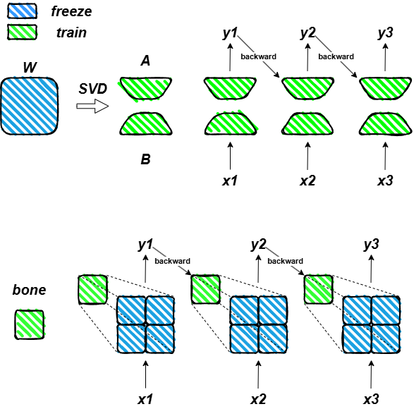
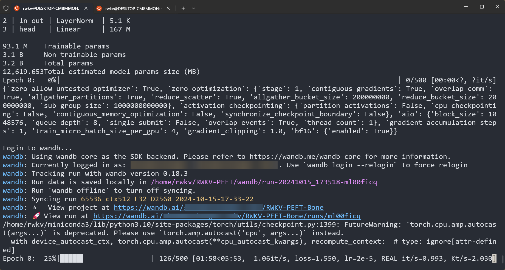
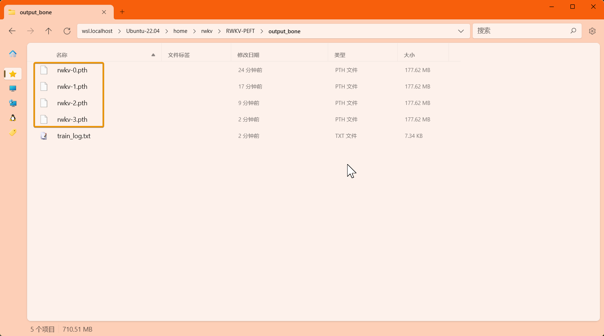
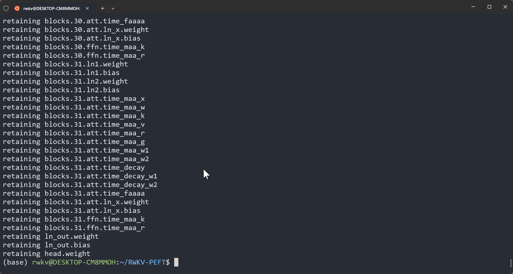
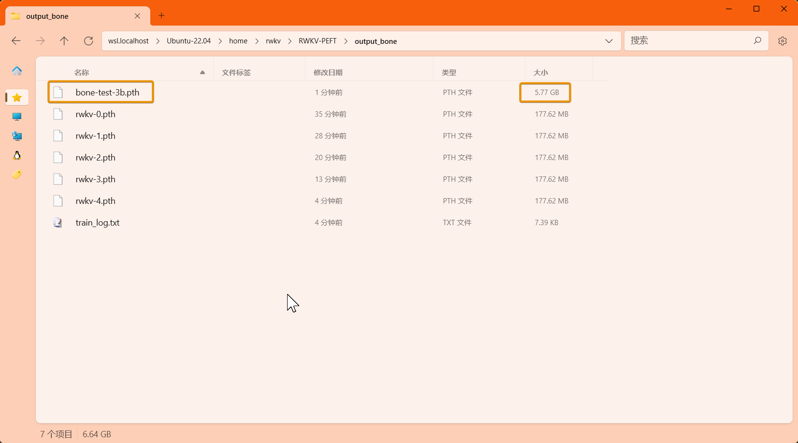
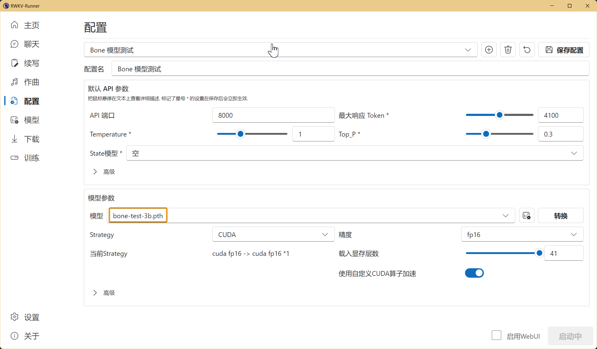
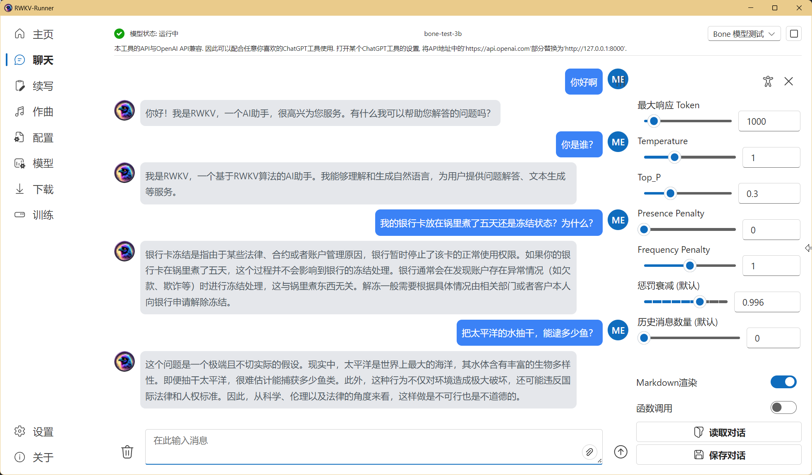

import { Callout } from 'nextra/components'
import { Steps } from 'nextra/components'

<Callout type="info" emoji="ℹ️">
**Bone 微调是什么？**

[Bone 微调](https://arxiv.org/abs/2409.15371v2)（Block Affine）是一种全新的参数高效微调方法（PEFT，Parameter-Efficient Fine-Tuning）。

相对 LoRA 微调，Bone 微调通过增强原始权重信息的利用率和强调权重间的内部联系，实现更快的收敛和更好的数据拟合。



</Callout>
---

本文的 Bone 微调方法来自 RWKV 社区微调项目 [RWKV-PEFT ](https://github.com/JL-er/RWKV-PEFT)。

在开始 Bone 微调之前，请确保你拥有一个 Linux 工作区，以及支持 CUDA 的 NVIDIA 显卡。

## Bone 微调显存参考

RWKV Bone 微调的显存（GPU VRAM）需求可参考下表：

|   模型参数 | bf16  | int8 | nf4 |
| --------- | ---- | ---- | ---- |
| RWKV-6-1.6B | 7.3GB  | 5.9GB  | 5.4GB  |
| RWKV-6-3B  | 11.8GB  | 9.4GB  | 8.1GB  |
| RWKV-6-7B | 23.7GB| 17.3GB | 14.9GB  |

上表的数据基于以下训练参数：

- ctxlen=1024 
- micro_bsz=1
- strategy=deepspeed_stage_1

随着训练参数的变更，RWKV Bone 微调所需显存会发生改变。

## 收集训练数据

你需要使用收集更适合训练 RWKV 的 binidx 数据，具体方法可参考[准备微调数据集](https://rwkv.cn/RWKV-Fine-Tuning/FT-Dataset)。

## 配置训练环境

请参考[RWKV 微调环境配置](https://rwkv.cn/RWKV-Fine-Tuning/FT-Environment)板块，配置 Conda 等训练环境。

## 克隆仓库并安装依赖

在 Linux 或 WSL 中，使用 git 命令克隆 RWKV-PEFT 仓库​：

```  bash copy
git clone https://github.com/JL-er/RWKV-PEFT.git
```

克隆完成后，使用 `cd RWKV-PEFT` 命令进入 RWKV-PEFT 目录。并运行以下命令，安装项目所需依赖：

```  bash copy
pip install -r requirements.txt
```

## 修改训练参数 

使用任意文本编辑器（如 vscode）打开 RWKV-PEFT/scripts 目录下的 `run_bone.sh` 文件，可以修改训练参数，进而控制微调的训练过程和训练效果：


以下是一次 Bone 微调的调参过程：

<Steps>

### 调整路径参数

`demo_pissa.sh` 文件前三行是文件路径参数：
 
- load_model： 基底 RWKV 模型的路径
- proj_dir：训练日志和训练得到的 Bone 文件输出路径
- data_file：训练数据集的路径，注意路径中不需要带 bin 和 idx 后缀，仅需文件名称。

### 调整 n_layer 和 n_embd 参数

<Callout type="warning" emoji="⚠️">
不同参数的 RWKV 模型，训练时使用的 n_layer 和 n_embd 数值不一样
</Callout>

以下 RWKV 模型参数对应的 n_layer/n_embd 值：

| 模型参数 | n_layer | n_embd |
|------------|---------|--------|
| 0.1B       | 12      | 768    |
| 0.4B       | 24      | 1024   |
| 1.5B       | 24      | 2048   |
| 3B         | 32      | 2560   |
| 7B         | 32      | 4096   |
| 14B        | 61      | 4096   |

### 调整重要训练参数

<Callout type="info" emoji="ℹ️">
以下参数建议根据你的微调数据、设备性能进行调整。
</Callout>

| 参数 | 描述 |
| --- | --- |
| `micro_bsz=1` | 微批次大小，根据显存大小调整，微调时从 1 开始逐渐增大 |
| `epoch_save=5` | 每隔多少个训练轮次保存一次 Pissa 文件，注意存储空间是否充足 |
| `epoch_steps=1000` | 每个训练轮次的步数，增加会延长单个 epoch 的训练时间 |
| `ctx_len=512` | 微调模型的上下文长度，建议根据语料长度修改 |

### 调整 Bone 微调相关参数

<Callout type="info" emoji="ℹ️">
`bone_config` 包含 Bone 微调的参数，效果参考下表：
</Callout>

| 参数 | 描述 |
| --- | --- |
| "bone_load":"" | Bone 文件路径，代表从哪个 Bone checkpoint 开始微调。若从头训练 Bone 可不填 |
| "bone_r":32 | Bone 微调的 rank 参数，值越大效果越好，但训练速度越慢/显存需求越高，一般训练使用 32 或者 64 即可 |


### 调整其他训练参数

下面列出了脚本中其他可修改的训练参数，及其修改的效果。

| 参数 | 描述 |
| --- | --- |
| `--data_type binidx` | 训练语料的文件格式，支持："utf-8", "utf-16le", "numpy", "binidx", "dummy", "wds_img", "uint16" |
| `--vocab_size 65536` | 词表大小，默认为 65536，设置为 0 表示模型自动确定词汇表大小 |
| `--epoch_count 5` | 总训练轮次 |
| `--epoch_begin 0` | 初始训练轮次，即从第 N 个训练轮次开始加载 |
| `--pre_ffn 0` | 用 ffn 替换第一个 att 层，通常保持默认值 0 |
| `--head_qk 0` | 通常保持默认值 0，即关闭状态 |
| `--lr_init 2e-5` | 初始学习率，Bone 建议 2e-5 ，最大不超过 1e-4 |
| `--lr_final 2e-5` | 最终学习率，建议和初始学习率保持一致 |
| `--warmup_steps 0` | 预热步骤数，默认 0，加载模型时可尝试改成 50 |
| `--beta1 0.9` | Adam 优化器的 beta1 参数，保持默认值 |
| `--beta2 0.99` | Adam 优化器的 beta2 参数，保持默认值 |
| `--adam_eps 1e-8` | Adam 优化器的 epsilon 参数，保持默认值 |
| `--accelerator gpu` | 使用的加速器类型，目前主要支持 gpu， cpu 基本不支持训练 |
| `--devices 1` | 显卡数量，单显卡填 1，多卡按实际数量填写 |
| `--precision bf16` | 训练精度，建议保持默认值 bf16，支持："fp32", "tf32", "fp16", "bf16" |
| `--strategy deepspeed_stage_1` | lightning 训练策略参数，微调推荐使用 deepspeed_stage_1，设备显存太小可将 1 改成 2 |
| `--grad_cp 1` | 梯度累积步数，0 训练更快但需更多显存，1 训练较慢但节省显存 |
| `--my_testing "x060"` | 训练的 RWKV 模型版本，v5 选 x052，v6 选 x060 |
| `--dataload pad` | 数据加载选项，"pad" 支持 `bsz>1`，"only" 则限制 `bsz=1` |
| `--loss_mask pad` | 在数据末尾进行 padding，可改成 "qa" 以对 QA 任务中的问题部分进行屏蔽，防止模型根据问题来记忆答案，从而增强模型的泛化能力。 |
| `--fla` | 是否启用 fla 以减小显存需求，bsz 小于 8 时建议开启 |
| `--peft bone` | 训练类型，Bone 微调填 bone 即可 |
| `--quant int8/nf4` | RWKV 默认使用 bf16 训练精度，但支持 int8 和 nf4 两种量化训练类型，推荐使用精度损失较小的 int8 |
| `--train_parts` | 指定微调的模型区域，如“emb”、“head”、“time”、“ln”。训练时建议移除此参数，以使用默认值 ["time", "ln"]|
| `--wandb RWKV-PEFT-Pissa` | 是否使用 wandb 可视化记录训练日志，需提前配置 [wandb](https://wandb.ai/) 账号 |

<Callout type="warning" emoji="⚠️">
参数调整完成后，请记得保存 `run_bone.sh` 文件。
</Callout>

</Steps>

### 附录：run_bone.sh 配置参考

``` bash copy filename="run_bone.sh"
load_model='/home/rwkv/models/basemodel/3b.pth'
proj_dir='/home/rwkv/RWKV-PEFT/output_bone'
data_file='/home/rwkv/RWKV-PEFT/data/lora-test'

n_layer=32
n_embd=2560

micro_bsz=1
epoch_save=1
epoch_steps=500
ctx_len=512

bone_config='{"bone_load":"","bone_r":64}'

python train.py --load_model $load_model \
--proj_dir $proj_dir --data_file $data_file \
--data_type binidx --vocab_size 65536 \
--ctx_len $ctx_len --epoch_steps $epoch_steps --epoch_count 5 --epoch_begin 0 --epoch_save $epoch_save --micro_bsz $micro_bsz \
--n_layer $n_layer --n_embd $n_embd \
--pre_ffn 0 --head_qk 0 --lr_init 2e-5 --lr_final 2e-5 --warmup_steps 0 --beta1 0.9 --beta2 0.99 --adam_eps 1e-8 \
--accelerator gpu --devices 1 --precision bf16 --strategy deepspeed_stage_1 --grad_cp 1 \
--my_testing "x060" \
--dataload pad --loss_mask pad \
--peft bone --bone_config $bone_config
# 以下是可选项
# --fla （是否开启 fla 加快训练，micro_bsz < 8 时建议开启）
#  --wandb RWKV-PEFT-Bone （是否使用 wandb 监控训练过程）
# --quant int8/nf4 （是否量化训练）
# --train_parts ["time", "ln"]（是否指定训练范围，通常不建议添加此参数）
```

## 开始训练

在 RWKV-PEFT 目录，运行 `sh scripts/run_bone.sh` 命令，开启 Bone 微调 。

正常开始训练后，应当是如下画面：



训练完毕后，应当可以在输出文件夹中找到训练好的 Bone 权重文件（`.pth` 格式）和训练日志（`.txt` 文件）:



## 如何使用 Bone 权重文件

得到 Bone 权重文件后，你需要将它合并到基底 RWKV 模型中，获得一个完整的 Bone 微调模型。

这个过程可以使用 `scripts` 目录的 `merge_bone.sh` 脚本文件来完成。

### 修改合并参数

使用文本编辑器打开 `scripts` 目录下的 `merge_bone.sh` 脚本文件，并修改脚本中的合并参数：

| 参数 | 描述 |
| ---| --- |
| base_model | Bone 微调的基底 RWKV 模型路径，参考 run_bone.sh 的 load_model 参数 |
| bone_checkpoint | 训练得到的某个 Bone 检查点文件路径 |
| output | 合并后的 Bone 模型输出路径（包含模型命名 `xxx.pth`） |
| --quant | 跟随训练时的量化参数，"nf4"或者"int8"。如果训练时未使用量化，则无需添加此参数 |

合并参数参考：

``` bash copy filename="merge_bone.sh"
base_model='/home/rwkv/models/basemodel/3b.pth'
lora_checkpoint='/home/rwkv/RWKV-PEFT/output_bone/rwkv-4.pth'
output='/home/rwkv/RWKV-PEFT/output_bone/bone-test-3b.pth'


python merge/merge_bone.py --base_model $base_model \
--lora_checkpoint $lora_checkpoint \
--output $output \
# --quant int8/nf4 （和训练时的量化参数同步）
```

### 合并 Bone 权重文件

修改完成后保存文件，在 `RWKV-PEFT` 主目录运行 `sh scripts/merge_bone.sh` 命令，进行 Bone 模型合并：
 


合并结束后，在输出路径中可以找到合并后的 Bone 模型文件（`.pth` 格式）:



合并后的 Bone 模型可以在 RWKV Runner 或者 Ai00 中正常使用。





详细用法请参考 [RWKV Runner 教程](https://rwkv.cn/RWKV-Runner/Introduction) 和 [Ai00 教程](https://rwkv.cn/ai00/Introduction)。


