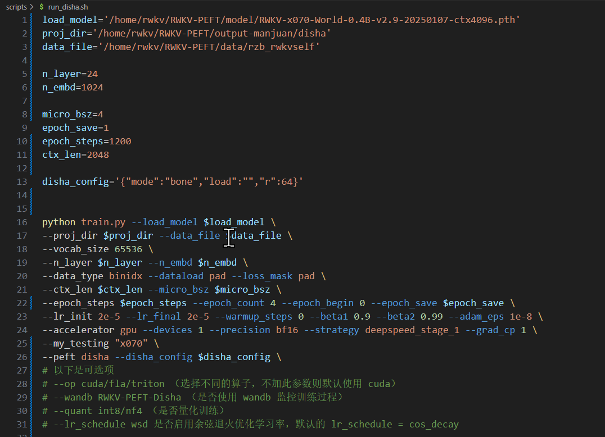
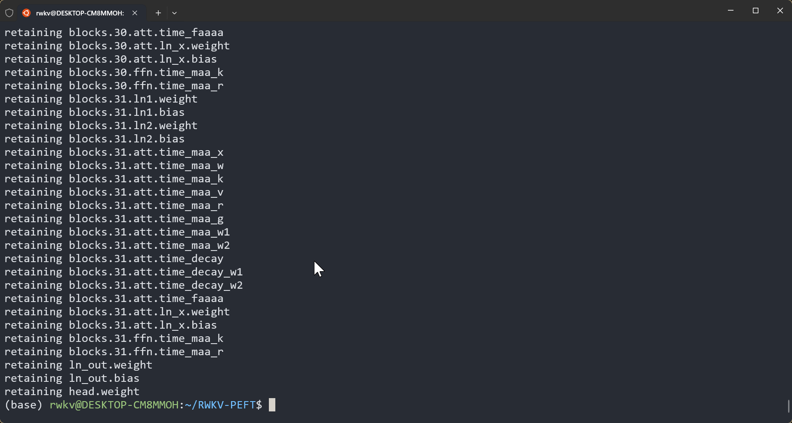
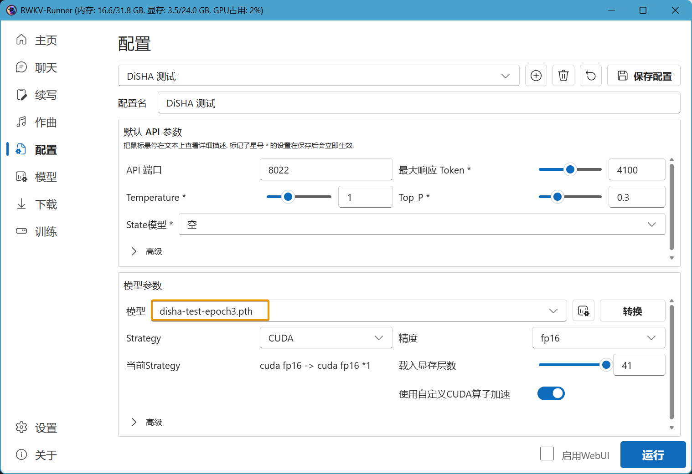

import { Callout } from 'nextra/components'
import { Steps } from 'nextra/components'

<Callout type="info" emoji="ℹ️">
**DiSHA 微调是什么？**

[DiSHA 微调](https://arxiv.org/abs/2409.15371v8)（Dimension-Sharding Adaptation）是一种新颖的参数高效微调方法（PEFT，Parameter-Efficient Fine-Tuning），旨在进一步降低可训练参数数量，同时加速收敛。

DiSHA 微调框架通过引入两种核心计算结构：块仿射高效计算（Bone）和块仿射变换 (Bat) ，扩展了 PEFT 的设计空间。Bone 结构在保持高性能的同时显著提升计算效率，而 Bat 通过非线性变换克服了部分 DiSHA 变体可能出现的共线性问题，从而增强模型能力。

实验结果表明，DiSHA 及其 Bone 结构在评估指标、计算效率和资源使用方面均优于 LoRA 及其变体。


</Callout>
---

本文的 DiSHA 微调方法来自 RWKV 社区微调项目 [RWKV-PEFT ](https://github.com/JL-er/RWKV-PEFT)。

在开始 DiSHA 微调之前，请确保你拥有一个 Linux 工作区，以及支持 CUDA 的 NVIDIA 显卡。

## DiSHA 微调显存参考

RWKV DiSHA 微调的显存（GPU VRAM）需求可参考下表：

|   模型参数 | bf16  | int8 | nf4 |
| --------- | ---- | ---- | ---- |
| RWKV-6-1.6B | 7.3GB  | 5.9GB  | 5.4GB  |
| RWKV-6-3B  | 11.8GB  | 9.4GB  | 8.1GB  |
| RWKV-6-7B | 23.7GB| 17.3GB | 14.9GB  |

上表的数据基于以下训练参数：

- ctxlen=1024 
- micro_bsz=1
- strategy=deepspeed_stage_1

随着训练参数的变更，RWKV DiSHA 微调所需显存会发生改变。

## 收集训练数据

你需要使用收集更适合训练 RWKV 的 binidx 数据，具体方法可参考[准备微调数据集](https://rwkv.cn/RWKV-Fine-Tuning/FT-Dataset)。

## 配置训练环境

请参考[RWKV 微调环境配置](https://rwkv.cn/RWKV-Fine-Tuning/FT-Environment)板块，配置 Conda 等训练环境。

## 克隆仓库并安装依赖

在 Linux 或 WSL 中，使用 git 命令克隆 RWKV-PEFT 仓库​：

```  bash copy
git clone https://github.com/JL-er/RWKV-PEFT.git
```

克隆完成后，使用 `cd RWKV-PEFT` 命令进入 RWKV-PEFT 目录。并运行以下命令，安装项目所需依赖：

```  bash copy
pip install -r requirements.txt
```

## 修改训练参数 

使用任意文本编辑器（如 vscode）打开 `RWKV-PEFT/scripts` 目录下的 `run_disha.sh` 文件，可以修改训练参数，进而控制微调的训练过程和训练效果：



以下是一次 DiSHA 微调的调参过程：

<Steps>

### 调整路径参数

`run_disha.sh` 文件前三行是文件路径参数：
 
- load_model： 基底 RWKV 模型的路径
- proj_dir：训练日志和训练得到的 DiSHA 文件输出路径
- data_file：训练数据集的路径，注意路径中不需要带 bin 和 idx 后缀，仅需文件名称。

### 调整 n_layer 和 n_embd 参数

<Callout type="warning" emoji="⚠️">
不同参数的 RWKV 模型，训练时使用的 n_layer 和 n_embd 数值不一样
</Callout>

以下是 RWKV 模型参数对应的 n_layer/n_embd 值：

| 模型参数 | n_layer | n_embd |
|------------|---------|--------|
| 0.1B       | 12      | 768    |
| 0.4B       | 24      | 1024   |
| 1.5B       | 24      | 2048   |
| 3B         | 32      | 2560   |
| 7B         | 32      | 4096   |
| 14B        | 61      | 4096   |

### 调整重要训练参数

<Callout type="info" emoji="ℹ️">
以下参数建议根据你的微调数据、设备性能进行调整。
</Callout>

| 参数 | 描述 |
| --- | --- |
| `micro_bsz=1` | 微批次大小，根据显存大小调整，微调时从 1 开始逐渐增大 |
| `epoch_save=5` | 每隔多少个训练轮次保存一次 Pissa 文件，注意存储空间是否充足 |
| `epoch_steps=1200` | 每个训练轮次的步数，增加会延长单个 epoch 的训练时间 |
| `ctx_len=512` | 微调模型的上下文长度，建议根据语料长度修改 |

### 调整 DiSHA 微调相关参数

<Callout type="info" emoji="ℹ️">
`disha_config` 包含 DiSHA 微调的参数，效果参考下表：
</Callout>

| 参数 | 描述 |
| --- | --- |
| "mode":"bone" | 训练模式，可选 `bone`或者 `bat` 微调，Bone 速度更快且显存占用更低，Bat 速度更慢但效果稍好一些 |
| "load":"" | 文件路径，从哪个 Disha checkpoint 开始微调。若从头微调训练可不填 |
| "r":32 | DiSHA 微调的 rank 参数，值越大效果越好，但训练速度越慢/显存需求越高，一般训练使用 32 或者 64 即可 |


### 调整其他训练参数

下面列出了脚本中其他可修改的训练参数，及其修改的效果。

| 参数 | 描述 |
| --- | --- |
| `--data_type binidx` | 训练语料的文件格式，支持：`utf-8`、 `utf-16le`、 `numpy`、 `binidx`、 `dummy`、 `wds_img`、 `uint16` |
| `--vocab_size 65536` | 词表大小，默认为 `65536`，设置为 `0` 表示模型自动确定词汇表大小 |
| `--epoch_count 5` | 总训练轮次 |
| `--epoch_begin 0` | 初始训练轮次，即从第 N 个训练轮次开始加载 |
| `--lr_init 2e-5` | 初始学习率，DiSHA 建议 `2e-5` ，最大不超过 `1e-4` |
| `--lr_final 2e-5` | 最终学习率，建议和初始学习率保持一致 |
| `--warmup_steps 0` | 预热步骤数，默认 `0`，加载模型微调时可尝试改成 `50` |
| `--beta1 0.9` | Adam 优化器的 beta1 参数，保持默认值 |
| `--beta2 0.99` | Adam 优化器的 beta2 参数，保持默认值 |
| `--adam_eps 1e-8` | Adam 优化器的 epsilon 参数，保持默认值 |
| `--accelerator gpu` | 使用的加速器类型，目前主要支持 `gpu`，`cpu` 基本不支持训练 |
| `--devices 1` | 显卡数量，单显卡填 `1`，多卡按实际数量填写 |
| `--precision bf16` | 训练精度，建议保持默认值 `bf16`，支持：`fp32`、`tf32`、`fp16`、`bf16` |
| `--strategy deepspeed_stage_1` | lightning 训练策略参数，微调推荐使用 `deepspeed_stage_1`，设备显存太小可将 `1` 改成 `2` |
| `--grad_cp 1` | 梯度累积步数，`0` 训练更快但需更多显存，`1` 训练较慢但节省显存 |
| `--my_testing "x070"` | 训练的 RWKV 模型版本，v5 选 `x052`，v6 选 `x060`，v7 选 `x070` |
| `--dataload pad` | 数据加载选项，`pad` 支持 `bsz>1`，`only` 则限制 `bsz=1` |
| `--loss_mask pad` | 在数据末尾进行 padding，可改成 `qa` 以对 QA 任务中的问题部分进行屏蔽，防止模型根据问题来记忆答案，从而增强模型的泛化能力。 |
| `--peft disha` | 微调训练类型，DiSHA 微调填 `disha` 即可 |
| `--op` | 选择算子，支持 `cuda`、`fla`、`triton`，默认设置为 `cuda` |
| `--quant int8/nf4` | **可选**，RWKV 默认使用 `bf16` 训练精度，但也支持 `int8` 和 `nf4` 两种量化训练，推荐使用精度损失较小的 `int8` |
| `--wandb RWKV-PEFT-Disha` | **可选**，是否使用 wandb 可视化记录训练日志，需提前配置 [wandb](https://wandb.ai/) 账号 |
</Steps>

### 附录：run_disha.sh 配置参考

``` bash copy filename="run_disha.sh"
load_model='/home/rwkv/RWKV-PEFT/model/RWKV-x070-World-2.9B-v3-20250211-ctx4096.pth'
proj_dir='/home/rwkv/RWKV-PEFT/output_disha'
data_file='/home/rwkv/RWKV-PEFT/data/rzb_rwkvself'

n_layer=32
n_embd=2560

micro_bsz=4
epoch_save=1
epoch_steps=1200
ctx_len=2048

disha_config='{"mode":"bone","load":"","r":64}'


python train.py --load_model $load_model \
--proj_dir $proj_dir --data_file $data_file \
--vocab_size 65536 \
--n_layer $n_layer --n_embd $n_embd \
--data_type binidx --dataload pad --loss_mask pad \
--ctx_len $ctx_len --micro_bsz $micro_bsz \
--epoch_steps $epoch_steps --epoch_count 4 --epoch_begin 0 --epoch_save $epoch_save \
--lr_init 2e-5 --lr_final 2e-5 --warmup_steps 0 --beta1 0.9 --beta2 0.99 --adam_eps 1e-8 \
--accelerator gpu --devices 1 --precision bf16 --strategy deepspeed_stage_1 --grad_cp 1 \
--my_testing "x070" \
--peft disha --disha_config $disha_config
# 以下是可选项
# --op cuda/fla/triton （选择不同的算子，不加此参数则默认使用 cuda）
#  --wandb RWKV-PEFT-Disha （是否使用 wandb 监控训练过程）
# --quant int8/nf4 （是否量化训练）
# --lr_schedule wsd 是否启用余弦退火优化学习率，默认的 lr_schedule = cos_decay  
```

<Callout type="warning" emoji="⚠️">
参数调整完成后，请记得保存 `run_disha.sh` 文件。
</Callout>

## 开始训练

在 RWKV-PEFT 目录，运行 `sh scripts/run_disha.sh` 命令，开启 DiSHA 微调 。

正常开始训练后，应当是如下画面：


训练完毕后，应当可以在输出文件夹中找到训练好的 DiSHA 权重文件（`.pth` 格式）和训练日志（`.txt` 文件）:


## 如何使用 DiSHA 权重文件

得到 DiSHA 权重文件（如 `rwkv-0.pth`）后，你需要将它**合并到基底 RWKV 模型**中，获得一个完整的 DiSHA 微调模型。

这个过程可以使用 `RWKV-PEFT/scripts` 目录的 `merge_disha.sh` 脚本文件来完成。

### 修改合并参数[#modify-merge-parameters]

使用文本编辑器打开 `scripts` 目录下的 `merge_disha.sh` 脚本文件，并修改脚本中的合并参数：

| 参数 | 描述 |
| ---| --- |
| `base_model` | 微调的基底 RWKV 模型路径，参考 `run_disha.sh` 的 `load_model` 参数 |
| `disha_checkpoint` | 训练得到的某个 DiSHA 检查点文件路径（如 `rwkv-0.pth` ） |
| `output` | 合并后的 DiSHA 模型输出路径（包含模型命名 `xxx.pth`） |
| `--quant` | 跟随训练时的量化参数，`nf4` 或者 `int8`。如果训练时未使用量化，则无需添加此参数 |

`merge_disha.sh` 脚本参考：

``` bash copy filename="merge_disha.sh"
base_model='/home/rwkv/RWKV-PEFT/model/RWKV-x070-World-0.4B-v2.9-20250107-ctx4096.pth'
peft_checkpoint='/home/rwkv/RWKV-PEFT/output_disha/rwkv-0.pth'
output='/home/rwkv/RWKV-PEFT/output_disha/disha-test.pth'


python merge/merge_disha.py --base_model $base_model \
--peft_checkpoint $peft_checkpoint \
--output $output
# --quant int8/nf4 （和训练时的量化参数同步）
```

### 合并 DiSHA 权重文件[#merge-disha]

修改完成后保存文件，在 `RWKV-PEFT` 主目录运行 `sh scripts/merge_disha.sh` 命令，进行 DiSHA 模型合并：
 


合并结束后，在输出路径中可以找到合并后的 DiSHA 模型文件（`.pth` 格式）:


合并后的 DiSHA 模型可以在 RWKV Runner 或者 Ai00 中正常使用。




详细用法请参考 [RWKV Runner 教程](https://rwkv.cn/RWKV-Runner/Introduction) 和 [Ai00 教程](https://rwkv.cn/ai00/Introduction)。


