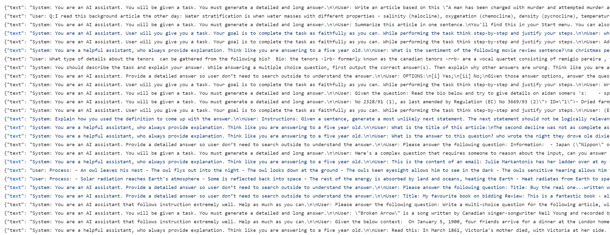
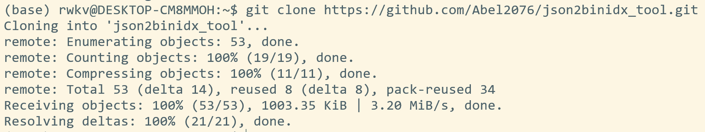

import { Callout } from 'nextra/components'
import { Steps } from 'nextra/components'

请遵循以下步骤，收集你的训练数据集，并将其放在一个名为 `data` 的文件夹中。

## 整理 jsonl 语料

首先确认“你希望 RWKV 模型学习哪些知识”。

这里的知识可以是某一领域的资料，比如法律问答、金融知识等；也可以是某类任务的文本，如材料总结、角色扮演等。

总而言之，你需要收集此类数据，并将其转化为特定的 jsonl 格式。

下面是各类内容的 jsonl 格式参考：

``` jsonl copy
单轮问答： {"text": "User: 问题\n\nAssistant: 答案"}

多轮对话例子：{"text": "User: 问题一\n\nAssistant: 答案一\n\nUser: 问题二\n\nAssistant: 答案二"}

材料问答：{"text": "Instruction: 问题\n\nInput: 材料\n\nResponse: 答案"}

内容生成/续写：{"text": "将每篇文章的内容变成 JSONL 的一行，即使是一百万字的小说也变成一行。"} 或者 {"text": "《标题》\n正文内容"}

小说扩写：{"text": "User: 段落的开头\n\nAssistant: 完整的段落"}
```
整理完成的 jsonl 文件应该是这样的：



## 将 jsonl 文件转化为 binidx 文件

在这一步，我们需要使用 [json2binidx](https://github.com/Abel2076/json2binidx_tool) 工具，将 jsonl 文件转成更适合微调训练的 binidx 文件。

<Steps>

### 下载 json2binidx 文件夹

克隆仓库
``` bash copy
git clone https://github.com/Abel2076/json2binidx_tool.git
```



或直接[下载压缩包](https://github.com/Abel2076/json2binidx_tool/archive/refs/heads/main.zip)并解压。

得到 json2binidx 文件夹后，使用 `cd json2binidx_tool` 命令进入 `json2binidx_tool` 目录。

### jsonl 文件转 binidx 文件

将准备好的 jsonl 数据集文件放在 `json2binidx/data` 文件夹中。

打开终端，运行以下命令，可以将 `data`文件夹中的 jsonl 文件转成 binidx 文件 ：

``` bash copy
python3 tools/preprocess_data.py --input ./data/sample.jsonl --output-prefix ./data/sample --vocab ./rwkv_vocab_v20230424.txt --dataset-impl mmap --tokenizer-type RWKVTokenizer --append-eod
```

如果你在使用自己的 jsonl 数据集，这条命令有两个需要修改的参数：
``` bash copy
--input ./data/sample.jsonl # 输入 jsonl 文件的路径
--output-prefix ./data/sample # 输出的 bin / idx 文件路径
```
将 `--input` 的 `sample.jsonl` 改成你准备好的 jsonl 文件名，`--output` 的 `sample` 改成你想要的 bin / idx 文件名称，其他参数保持默认即可。

</Steps>

出现以下提示，意味着转换已经完成：


你应该能在 `data `文件夹中找到转换完成的 bin / idx 文件：


此时我们的准备工作已经结束了，接下来需要**选择一种微调方法**，并阅读对应的文档。
