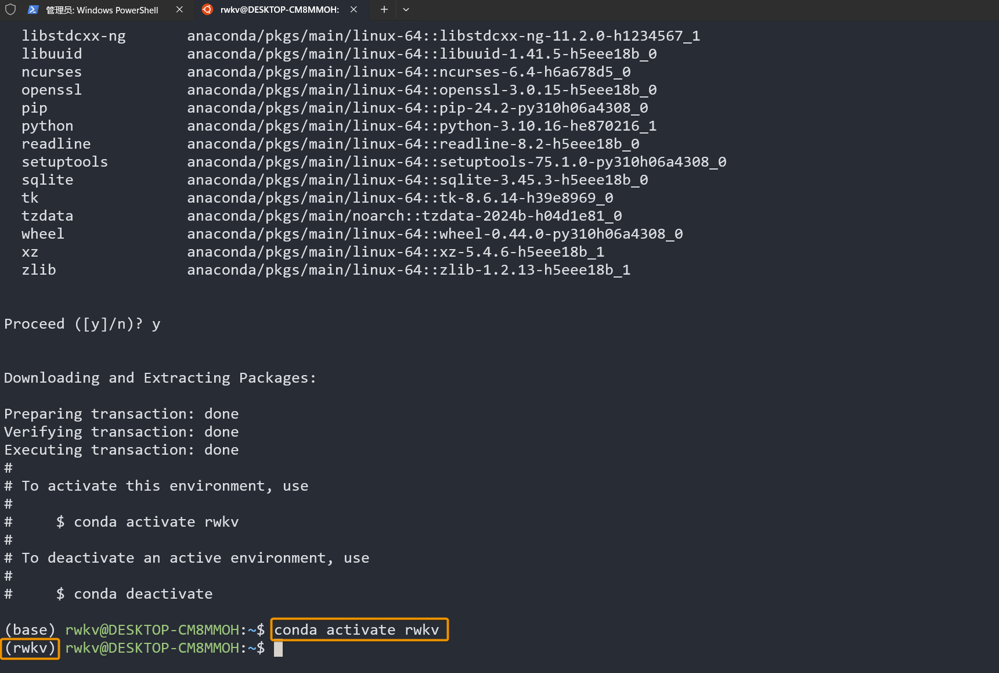
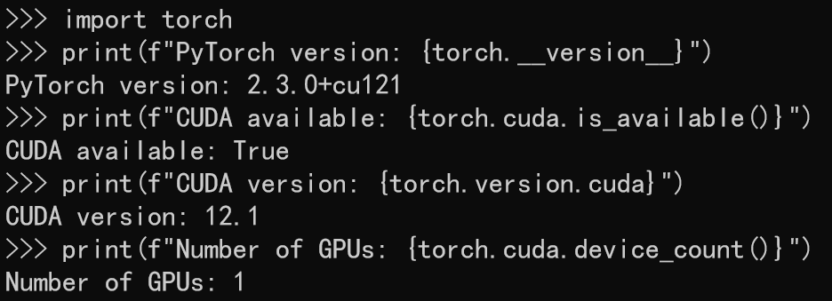

import { Callout } from 'nextra/components'

要训练 RWKV 模型，请先遵循以下步骤，为你的 Linux 系统配置训练环境。

##  配置 Conda 虚拟环境

RWKV 模型的微调训练默认虚拟环境为 Conda。此处以 MiniConda 为例，介绍如何配置 Linux 系统的 Conda 环境。在你的 Linux 工作区，依次运行以下命令：

``` bash copy
# 下载最新的 MiniConda 安装包
wget https://repo.anaconda.com/miniconda/Miniconda3-latest-Linux-x86_64.sh
# 运行 MiniConda 安装包的安装脚本，安装期间一定要注意进展，及时输入 yes  ！
sh Miniconda3-latest-Linux-x86_64.sh -u
# 重启环境变量，激活 Conda 环境
~/.bashrc
```
此时我们处于 Conda 默认的 `base` 环境中。为了避免软件版本冲突，我们需要新建并激活一个名为 `rwkv` 的 conda 环境。依次运行以下命令：

``` bash copy
# 创建名为 rwkv 的 conda 环境, 并指定 python 版本为 3.10
conda create -n rwkv python=3.10
# 激活 rwkv 环境
conda activate rwkv
```


至此，我们已经配置了 RWKV 微调所需的 Conda 环境。

## 安装训练所需的软件

要获得 RWKV 模型的**最佳训练性能**，推荐安装如下软件：

- torch 2.1.2+cu121（或最新版本）
- 最新的 deepspeed
- pytorch-lightning ==1.9.5

在终端的 Conda 环境中依次运行以下命令，安装 RWKV 训练环境：

``` bash copy
# 通过指定 url 安装 CUDA 12.1 版本的 torch
pip install torch --upgrade --extra-index-url https://download.pytorch.org/whl/cu121
# 指定安装 1.9.5 版本的 `PyTorch Lightning ` 和其他机器学习常用包
# --upgrade 参数意味着如果环境中已经安装了对应的软件包，则将其升级到最新版本
pip install pytorch-lightning==1.9.5 deepspeed wandb ninja --upgrade
# 以下是使用 RWKV-PEFT 微调时使用的其他工具包，建议提前安装
pip install bitsandbytes einops triton rwkv-fla rwkv transformers GPUtil plotly gradio datasets

```

<Callout type="info" emoji="ℹ️">
推荐的软件版本为 RWKV 训练的最佳实践，也可以选择安装最新版本的软件，保证兼容性即可。
</Callout>

## 检查 CUDA 环境

上述依赖安装完毕后，你应该已经同时安装好最新版本的 Torch 和 CUDA 12.1 工具包。

依次运行以下命令，检查 PyTorch 的版本和 CUDA 工具是否可用：
```python
python3 # 启动 python3

import torch # 导入 torch 包

# 打印 PyTorch 版本
print(f"PyTorch version: {torch.__version__}") 
# 检查 CUDA 是否可用
print(f"CUDA available: {torch.cuda.is_available()}")
# 打印 CUDA 版本
print(f"CUDA version: {torch.version.cuda}")
# 打印可用的 GPU 数量
print(f"Number of GPUs: {torch.cuda.device_count()}")
```

如果 `CUDA available: True` ，证明 CUDA 环境可用：



如果返回 `False` ，请重新安装 CUDA 环境（建议 cuda 12.3+），安装步骤请参阅 [**CUDA Toolkit 安装文档**](https://developer.nvidia.com/cuda-downloads)。

此处提供 Ubuntu 22.04 的 CUDA Toolkit 安装步骤，在你的工作区依次运行以下命令：

``` bash copy
# 下载 CUDA repository 的 pin 文件，以确保安装优先级
wget https://developer.download.nvidia.com/compute/cuda/repos/ubuntu2204/x86_64/cuda-ubuntu2204.pin
# 将 pin 文件移动到指定目录，设置安装优先级
sudo mv cuda-ubuntu2204.pin /etc/apt/preferences.d/cuda-repository-pin-600
# 下载 CUDA 12.6.3 的本地安装包（适用于 Ubuntu 22.04）
wget https://developer.download.nvidia.com/compute/cuda/12.6.3/local_installers/cuda-repo-ubuntu2204-12-6-local_12.6.3-560.35.05-1_amd64.deb
# 安装 CUDA 本地安装包
sudo dpkg -i cuda-repo-ubuntu2204-12-6-local_12.6.3-560.35.05-1_amd64.deb
# 将 CUDA 安装包的 GPG 密钥复制到系统密钥库
sudo cp /var/cuda-repo-ubuntu2204-12-6-local/cuda-*-keyring.gpg /usr/share/keyrings/
# 更新 apt 的包索引
sudo apt-get update
# 安装 CUDA 工具包 12.6
sudo apt-get -y install cuda-toolkit-12-6
```
