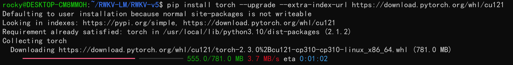
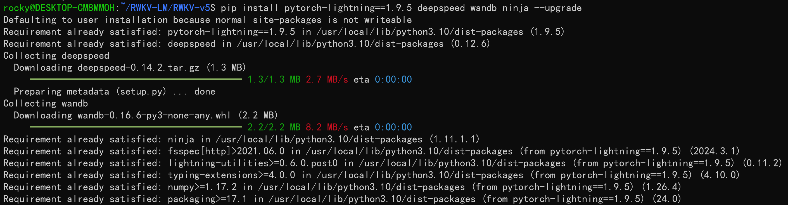
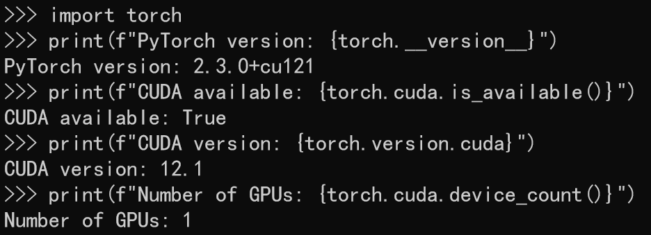

import { Callout } from 'nextra/components'

要训练 RWKV 模型，请先遵循以下步骤，为你的 Linux 系统配置训练环境。

##  配置虚拟环境（conda）

RWKV 模型的微调训练默认虚拟环境为 conda ，如果不知道如何配置 Linux 系统的 conda ，请参考[**此文章**](https://zhuanlan.zhihu.com/p/166102942)。

## 安装训练所需的软件

要获得 RWKV 模型的**最佳训练性能**，你需要安装如下软件：

- python 3.10
- torch 2.1.2+cu121（或最新版本）
- cuda 12.3+
- 最新的 deepspeed
- 保持 pytorch-lightning ==1.9.5

在 Linux 环境中依次运行以下命令：
```
pip install torch --upgrade --extra-index-url https://download.pytorch.org/whl/cu121
pip install pytorch-lightning==1.9.5 deepspeed wandb ninja --upgrade
```
第一条命令通过指定 url 安装 cu121 版本的 torch ： 



第二条命令安装 `PyTorch Lightning`、`Deepspeed`、`WandB（Weights & Biases）`、`Ninja` 包，并指定安装 1.9.5 版本的 `PyTorch Lightning `。



`-- upgrade` 参数意味着如果环境中已经安装了对应的软件包，则将其升级到最新版本。

<Callout type="info" emoji="ℹ️">
推荐的软件版本为 RWKV 训练的最佳实践，你也可以选择安装新版本的软件，只要保证兼容性即可。
</Callout>

## 检查 CUDA 环境

上述依赖安装完毕后，你应该已经同时安装好最新版本的 Torch 和 CUDA 12.1 工具包。

依次运行以下命令，检查 PyTorch 的版本和 CUDA 工具是否可用：
```python
python3 # 启动 python3

import torch # 导入 torch 包

# 打印 PyTorch 版本
print(f"PyTorch version: {torch.__version__}") 

# 检查 CUDA 是否可用
print(f"CUDA available: {torch.cuda.is_available()}")

# 打印 CUDA 版本
print(f"CUDA version: {torch.version.cuda}")

# 打印可用的 GPU 数量
print(f"Number of GPUs: {torch.cuda.device_count()}")

```

如果 `CUDA available: True` ，证明 CUDA 环境可用。如果返回 False ，请重新安装 CUDA 环境（cuda 12.3+）。

**参考检查结果：**


