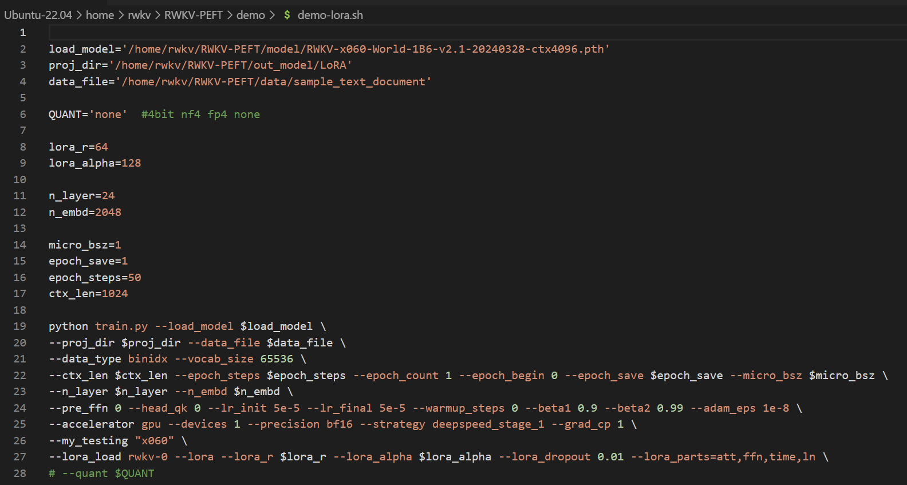
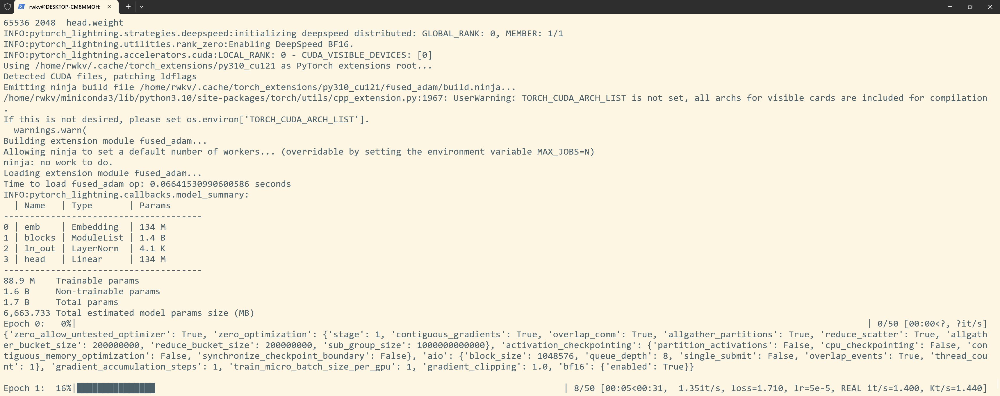
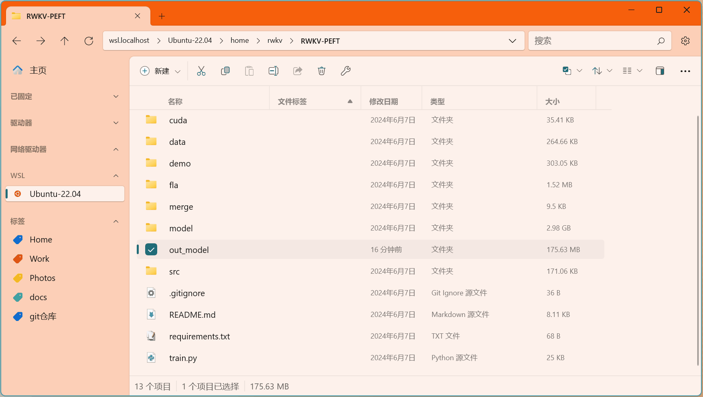
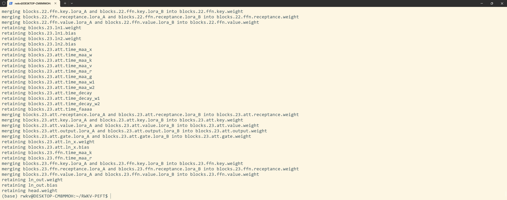
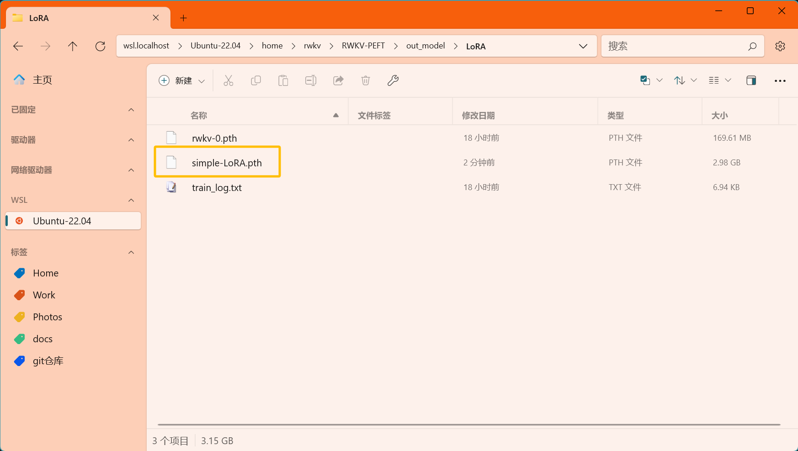

import { Callout } from 'nextra/components'
import { Steps } from 'nextra/components'

<Callout type="info" emoji="ℹ️">
**LoRA 微调是什么？**

LORA（Low-Rank Adaptation）是一种针对大型预训练模型的微调技术。它不改变原始模型大部分参数，而是调整模型的部分权重，以此实现对特定任务的优化。
</Callout>
---

本文的 LoRA 微调方法来自 RWKV 社区微调项目 [RWKV-PEFT ](https://github.com/JL-er/RWKV-PEFT)。

在开始 LoRA 微调之前，请确保你拥有一个 Linux 工作区，以及支持 CUDA 的 NVIDIA 显卡。

## LoRA 显存参考

RWKV LoRA 微调的显存（GPU VRAM）需求可参考下表：

|   模型参数 | fp16  | int8 | nf4 |
| --------- | ---- | ---- | ---- |
| RWKV-6-1.6B | 7.3GB  | 5.9GB  | 5.4GB  |
| RWKV-6-3B  | 11.8GB  | 9.4GB  | 8.1GB  |
| RWKV-6-7B | 23.7GB| 17.3GB | 14.9GB  |

上表的数据基于以下训练参数：

- ctxlen=1024 
- micro_bsz=1
- strategy=deepspeed_stage_1
- lora_r=64

随着训练参数的变更，RWKV LoRA 微调所需显存会发生改变。

## 收集训练数据

你需要使用收集更适合训练 RWKV 的 binidx 数据，具体方法可参考[准备微调数据集](https://rwkv.cn/RWKV-Fine-Tuning/FT-Dataset)。

## 配置训练环境

要训练 RWKV 模型，首先要配置训练环境。具体过程请参考[RWKV 微调环境配置](https://rwkv.cn/RWKV-Fine-Tuning/FT-Environment)板块。

## 克隆 RWKV-PEFT 仓库 

在 Linux 或 WSL 中，使用 git 命令克隆 RWKV-PEFT 仓库​：
```  bash copy
git clone https://github.com/JL-er/RWKV-PEFT.git
```
克隆完成后，使用 `cd RWKV-PEFT` 命令进入 RWKV-PEFT 目录。

## 修改训练参数 

使用任意文本编辑器（如 vscode）打开 RWKV-PEFT/demo 目录下的 `demo-lora.sh` 文件，可以修改训练参数，进而控制微调的训练过程和训练效果：



以下是一次 LoRA 微调的调参过程：

<Steps>

### 调整路径参数

`demo-lora.sh` 文件前三行是文件路径参数：
 
- load_model： 基底 RWKV 模型的路径
- proj_dir：训练日志和训练得到的 LoRA 文件输出路径
- data_file：训练数据集的路径，注意路径中不需要带 bin 和 idx 后缀，仅需文件名称。

### 调整 LoRA 相关参数

| 参数 | 描述 |
| --- | --- |
| `lora_r=64` | LoRA 微调的 rank 参数，越大效果越好，但训练速度越慢/显存需求越高，一般训练使用 32 或者 64 即可 |
| `lora_alpha=128` | LoRA 微调的 alpha 参数（缩放因子），建议保持 lora_r 的两倍 |
| `--lora_dropout 0.01` | LoRA 微调的丢弃率，建议保持默认值 0.01 |
| `--lora_parts=att,ffn,time,ln` | LoRA 微调影响的范围，建议保持默认值 |


### 调整 n_layer 和 n_embd 参数

基底 RWKV 模型的参数大小不同，训练时使用的 n_layer 和 n_embd 数值也不一样。以下是不同参数的 RWKV 模型和 n_layer 和 n_embd 数值的对照列表：

| 模型参数 | n_layer | n_embd |
|------------|---------|--------|
| 0.1B       | 12      | 768    |
| 0.4B       | 24      | 1024   |
| 1.5B       | 24      | 2048   |
| 3B         | 32      | 2560   |
| 7B         | 32      | 4096   |
| 14B        | 61      | 4096   |

### 调整重要训练参数

<Callout type="info" emoji="ℹ️">
以下参数建议根据你的微调数据、设备性能进行调整。
</Callout>

| 参数 | 描述 |
| --- | --- |
| `micro_bsz=1` | 根据显存大小调整，微调时从 1 开始逐渐增大 |
| `epoch_save=5` | 每隔多少个训练轮次保存一次模型，注意存储空间 |
| `epoch_steps=1000` | 每个训练轮次的步数，增加会拉长单个epoch的训练时间 |
| `ctx_len=512` | 微调模型的上下文长度，建议根据语料长度修改 |
| `QUANT='nf4'` | 支持的量化训练类型："Int8" 和 "nf4"，推荐使用精度损失较小的 "Int8"  |

量化训练可以降低显存需求，但会导致模型精度损失。如果不需要量化训练，可以删除所有 `QUANT` 相关的参数。

### 调整其他训练参数

下面列出了脚本中其他可修改的训练参数，及其修改的效果。

| 参数 | 描述 |
| --- | --- |
| `--data_type binidx` | 训练语料的文件格式，支持："utf-8", "utf-16le", "numpy", "binidx", "dummy", "wds_img", "uint16" |
| `--vocab_size 65536` | 词表大小，默认为 65536，设置为 0 表示模型自动确定词汇表大小 |
| `--epoch_count 10` | 总训练轮次 |
| `--epoch_begin 0` | 初始训练轮次，即从第 N 个训练轮次开始加载 |
| `--pre_ffn 0` | 用 ffn 替换第一个 att 层，通常保持默认值 0 |
| `--head_qk 0` | 通常保持默认值 0，即关闭状态 |
| `--lr_init 5e-5` | 初始学习率，LoRA 建议 5e-5 ，最大不超过 1e-4 |
| `--lr_final 5e-5` | 最终学习率，建议和初始学习率保持一致 |
| `--warmup_steps 0` | 预热步骤数，默认 0，加载模型时可尝试改成 50 |
| `--beta1 0.9` | Adam 优化器的 beta1 参数 |
| `--beta2 0.99` | Adam 优化器的 beta2 参数 |
| `--adam_eps 1e-8` | Adam 优化器的 epsilon 参数 |
| `--accelerator gpu` | 使用的加速器类型，目前主要支持 gpu， cpu 基本不支持训练 |
| `--devices 1` | 单显卡填 1，多卡按实际数量填写 |
| `--precision bf16` | 训练精度，默认为 bf16，支持："fp32", "tf32", "fp16", "bf16" |
| `--strategy deepspeed_stage_1` | lightning 训练策略参数，微调推荐使用 deepspeed_stage_1，设备显存太小可将 1 改成 2 |
| `--grad_cp 1` | 梯度累积步数，0 训练更快但需更多显存，1 训练较慢但节省显存 |
| `--my_testing "x060"` | 训练的 RWKV 模型版本，v5 选 x052，v6 选 x060 |
| `--lora_load rwkv-0` | LoRA 文件路径，代表从哪个 LoRA 模型开始微调|
| `--lora_dropout 0.01` | LoRA 微调的丢弃率，建议保持默认值 0.01 |
| `--lora_parts=att,ffn,time,ln` | LoRA 微调影响的范围，建议保持默认值 |
| `--fla` | 是否启用 fla 以减小显存需求，bsz 小于 8 时建议开启 |

参数调整完成后，请记得保存 `demo-lora.sh` 文件。

</Steps>

## 开始训练

在 RWKV-PEFT 目录，运行 `sh demo/demo-lora.sh` 命令，开启 LoRA 微调 。

正常开始训练后，应当是如下画面：



训练完毕后，应当可以在输出文件夹中找到训练好的 LoRA 文件（`.pth` 格式）和训练日志（`.txt` 文件）:



## 合并 LoRA 文件

得到 LoRA 文件后，你需要将它合并到基底 RWKV 模型中，获得一个完整的 LoRA 微调模型。

这个过程可以使用 demo 目录的 `demo-lora-merge.sh` 脚本来完成。

### 修改合并参数

使用文本编辑器打开 demo 目录的 `demo-lora-merge.sh` 文件，修改合并参数：

| 参数 | 描述 |
| ---| --- |
| base_model | 基底 RWKV 模型的路径 |
| lora_checkpoint | 训练得到的某个 LoRA 文件路径 |
| output | 合并后的 LoRA 模型输出路径（包含模型命名） |
| QUANT | 跟随训练时的量化参数，"nf4"或者"Int8" |
| TYPE='lora' | 合并类型：LoRA，无需修改 |
| Lora_alpha | 跟随训练时的 Lora_alpha 参数 |

<Callout type="warning" emoji="⚠️">
请删除 `--lora_init` 相关的参数，它是 Pissa 微调的特有参数。
</Callout>

### 合并 LoRA 文件

修改完成后保存文件，在 RWKV-PEFT 目录打开终端，并运行 `sh demo/demo-lora-merge.sh` 命令，进行 LoRA 模型合并。
 


合并结束后，在输出路径中可以找到合并后的 LoRA 模型文件（`.pth` 格式）:



合并后的 LoRA 模型可以在 RWKV Runner 或者 Ai00 中正常使用。


