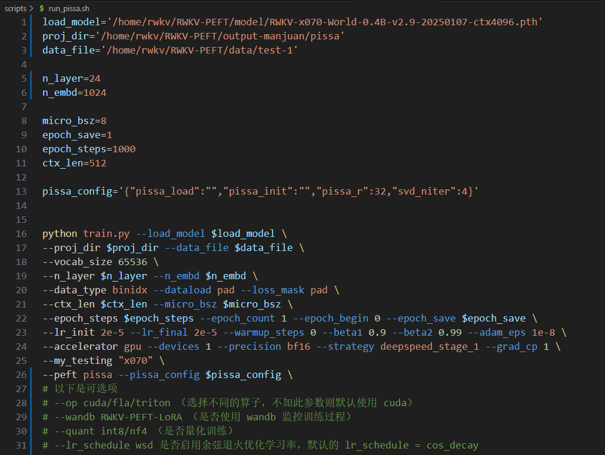

import { Callout } from 'nextra/components'
import { Tabs, Tab } from 'nextra/components'
import { Steps } from 'nextra/components'

<Callout type="info" emoji="ℹ️">
**PiSSA 微调是什么？**

[PiSSA 微调](https://arxiv.org/abs/2404.02948)是一种参数高效微调方法（PEFT，Parameter-Efficient Fine-Tuning），PiSSA 微调通过选择性更新部分参数（例如 LoRA 或 Adapter 层）来保持模型性能，同时避免对整个模型进行全面更新，从而提升训练效率。

PiSSA 与 LoRA 微调的架构一致，只是初始化 Adapter 的方式不同：LoRA 用高斯噪声以及 0 初始化适配器参数、冻结核心模型参数，PiSSA 则是直接对 W 的低秩主成分 A、B 进行微调，冻结次要的修正项。


因此，PiSSA 比 LoRA 收敛更快、效果更好。
</Callout>
---

本文的 PiSSA 微调方法来自 RWKV 社区的高效参数微调项目 [RWKV-PEFT ](https://github.com/JL-er/RWKV-PEFT)。

在开始 PiSSA 微调之前，请确保你拥有一个 Linux 工作区，以及支持 CUDA 的 NVIDIA 显卡。

## PiSSA 显存参考

RWKV PiSSA 微调的显存（GPU VRAM）需求可参考下表：

<Tabs items={["RWKV7 模型", "RWKV6 模型"]}>
<Tab>
| 模型参数 | bf16  | int8 | nf4 |
| --------- | ---- | ---- | ---- |
| RWKV7-0.1B | 2.6GB GPU | 2.4GB GPU  | 2.5GB GPU  |
| RWKV7-0.4B | 3.4GB GPU  | 3GB GPU  | 2.7GB GPU  |
| RWKV7-1.5B | 5.6GB GPU  | 4.6GB GPU  | 3.9GB GPU  |
| RWKV7-3B | 8.8GB GPU  | 6.7GB GPU  | 5.7GB GPU  |
</Tab>
<Tab>
| 模型参数 | bf16  | int8 | nf4 |
| --------- | ---- | ---- | ---- |
| RWKV6-1.6B | 7.3GB GPU  | 5.9GB GPU  | 5.4GB GPU  |
| RWKV6-3B  | 11.8GB GPU  | 9.4GB GPU  | 8.1GB GPU  |
| RWKV6-7B | 23.7GB GPU | 17.3GB GPU | 14.9GB GPU  |
</Tab>
</Tabs>

上表的数据基于以下训练参数：

- ctxlen=1024 
- micro_bsz=1
- strategy=deepspeed_stage_1
- pissa_r=32
- svd_niter=4

随着训练参数的变更，RWKV PiSSA 微调所需显存会发生改变。

## 收集训练数据

请参考[准备微调数据集](https://rwkv.cn/RWKV-Fine-Tuning/FT-Dataset)，收集更适合训练 RWKV 的 binidx 数据。

## 配置训练环境

请参考[RWKV 微调环境配置](https://rwkv.cn/RWKV-Fine-Tuning/FT-Environment)板块配置 Conda 等训练环境。

## 克隆仓库并安装依赖

在 Linux 或 WSL 中，使用 git 命令克隆 RWKV-PEFT 仓库​：

```  bash copy
git clone https://github.com/JL-er/RWKV-PEFT.git
```

克隆完成后，使用 `cd RWKV-PEFT` 命令进入 RWKV-PEFT 目录。并运行以下命令，安装项目所需依赖：

```  bash copy
pip install -r requirements.txt
```

## 修改训练参数 

使用任意文本编辑器（如 vscode）打开 `RWKV-PEFT/scripts` 目录下的 `run_pissa.sh` 文件，可以修改训练参数，进而控制微调的训练过程和训练效果：



以下是一次 PiSSA 微调的调参过程：

<Steps>

### 调整路径参数

`run_pissa.sh` 文件前三行是文件路径参数：
 
- load_model： 基底 RWKV 模型的路径
- proj_dir：训练日志和训练得到的 PiSSA 文件输出路径
- data_file：训练数据集的路径，注意路径中不需要带 bin 和 idx 后缀，仅需文件名称。

### 调整 n_layer 和 n_embd 参数

<Callout type="warning" emoji="⚠️">
不同参数的 RWKV 模型，训练时使用的 n_layer 和 n_embd 数值不一样
</Callout>

以下 RWKV 模型参数对应的 n_layer/n_embd 值：

| 模型参数 | n_layer | n_embd |
|------------|---------|--------|
| 0.1B       | 12      | 768    |
| 0.4B       | 24      | 1024   |
| 1.5B       | 24      | 2048   |
| 3B         | 32      | 2560   |
| 7B         | 32      | 4096   |
| 14B        | 61      | 4096   |

### 调整重要训练参数

<Callout type="info" emoji="ℹ️">
以下参数建议根据你的微调数据、设备性能进行调整。
</Callout>

| 参数 | 描述 |
| --- | --- |
| `micro_bsz=1` | 微批次大小，根据显存大小调整，微调时从 1 开始逐渐增大 |
| `epoch_save=5` | 每隔多少个训练轮次保存一次 PiSSA 文件，注意存储空间是否充足 |
| `epoch_steps=1000` | 每个训练轮次的步数，增加会延长单个 epoch 的训练时间 |
| `ctx_len=512` | 微调模型的上下文长度，建议根据语料长度修改 |

### 调整 PiSSA 相关参数

<Callout type="info" emoji="ℹ️">
`pissa_config` 包含 PiSSA 微调的参数，效果参考下表：
</Callout>

| 参数 | 描述 |
| --- | --- |
| "pissa_load":"" | PiSSA 文件路径，代表从哪个 PiSSA checkpoint 开始微调。若从头训练 PiSSA 可不填 |
| "pissa_init":"" | PiSSA 初始化的权重路径，若从头训练 PiSSA 可不填 |
| "pissa_r":32 | PiSSA 微调的 rank 参数，值越大效果越好，但训练速度越慢/显存需求越高，一般训练使用 32 或者 64 即可 |
| "svd_niter":4 | PiSSA 微调的奇异值分解迭代次数，值越大效果越好，但训练速度越慢/显存需求越高，一般训练使用 4 即可 |


### 调整其他训练参数

下面列出了脚本中其他可修改的训练参数，及其修改的效果。

| 参数 | 描述 |
| --- | --- |
| `--data_type binidx` | 训练语料的文件格式，支持："utf-8", "utf-16le", "numpy", "binidx", "dummy", "wds_img", "uint16" |
| `--vocab_size 65536` | 词表大小，默认为 `65536`，设置为 `0` 表示模型自动确定词汇表大小 |
| `--epoch_count 10` | 总训练轮次 |
| `--epoch_begin 0` | 初始训练轮次，即从第 N 个训练轮次开始加载 |
| `--pre_ffn 0` | 用 ffn 替换第一个 att 层，通常保持默认值 0 |
| `--head_qk 0` | 通常保持默认值 0，即关闭状态 |
| `--lr_init 2e-5` | 初始学习率，PiSSA 建议 `2e-5` ，最大不超过 `1e-4` |
| `--lr_final 2e-5` | 最终学习率，建议和初始学习率保持一致 |
| `--warmup_steps 0` | 预热步骤数，默认 `0`，加载模型时可尝试改成 `50` |
| `--beta1 0.9` | Adam 优化器的 beta1 参数，保持默认值 |
| `--beta2 0.99` | Adam 优化器的 beta2 参数，保持默认值 |
| `--adam_eps 1e-8` | Adam 优化器的 epsilon 参数，保持默认值 |
| `--accelerator gpu` | 使用的加速器类型，目前主要支持 `gpu`，`cpu` 基本不支持训练 |
| `--devices 1` | 显卡数量，单显卡填 `1`，多卡按实际数量填写 |
| `--precision bf16` | 训练精度，建议保持默认值 `bf16`，支持：`fp32`、`tf32`、`fp16`、`bf16` |
| `--strategy deepspeed_stage_1` | lightning 训练策略参数，微调推荐使用 `deepspeed_stage_1`，设备显存太小可将 `1` 改成 `2` |
| `--grad_cp 1` | 梯度累积步数，`0` 训练更快但需更多显存，`1` 训练较慢但节省显存 |
| `--my_testing "x060"` | 训练的 RWKV 模型版本，v5 选 `x052`，v6 选 `x060` |
| `--dataload pad` | 数据加载选项，`pad` 支持 `bsz>1`，`only` 则限制 `bsz=1` |
| `--loss_mask pad` | 在数据末尾进行 padding，可改成 `qa` 以对 QA 任务中的问题部分进行屏蔽，防止模型根据问题来记忆答案，从而增强模型的泛化能力。 |
| `--op` | 选择算子，支持 `cuda`、`fla`、`triton`，默认设置为 `cuda` |
| `--peft pissa` | 训练类型，PiSSA 微调填 `pissa`，支持：`lora`、`state`、`pissa`、`bone` |
| `--quant int8/nf4` | RWKV 默认使用 `bf16` 训练精度，但支持 `int8` 和 `nf4` 两种量化训练类型，推荐使用精度损失较小的 `int8` |
| `--wandb RWKV-PEFT-Pissa` | 是否使用 wandb 可视化记录训练日志，需提前配置 [wandb](https://wandb.ai/) 账号 |

<Callout type="warning" emoji="⚠️">
参数调整完成后，请记得保存 `run_pissa.sh` 文件。
</Callout>

</Steps>

### 附录：run_pissa.sh 配置参考

``` bash copy filename="run_pissa.sh"
load_model='/home/rwkv/RWKV-PEFT/model/RWKV-x070-World-0.4B-v2.9-20250107-ctx4096.pth'
proj_dir='/home/rwkv/RWKV-PEFT/output-manjuan/pissa'
data_file='/home/rwkv/RWKV-PEFT/data/test-1'

n_layer=24
n_embd=1024

micro_bsz=8
epoch_save=1
epoch_steps=1000
ctx_len=512

pissa_config='{"pissa_load":"","pissa_init":"","pissa_r":32,"svd_niter":4}'


python train.py --load_model $load_model \
--proj_dir $proj_dir --data_file $data_file \
--vocab_size 65536 \
--n_layer $n_layer --n_embd $n_embd \
--data_type binidx --dataload pad --loss_mask pad \
--ctx_len $ctx_len --micro_bsz $micro_bsz \
--epoch_steps $epoch_steps --epoch_count 1 --epoch_begin 0 --epoch_save $epoch_save \
--lr_init 2e-5 --lr_final 2e-5 --warmup_steps 0 --beta1 0.9 --beta2 0.99 --adam_eps 1e-8 \
--accelerator gpu --devices 1 --precision bf16 --strategy deepspeed_stage_1 --grad_cp 1 \
--my_testing "x070" \
--peft pissa --pissa_config $pissa_config \
# 以下是可选项
# --op cuda/fla/triton （选择不同的算子，不加此参数则默认使用 cuda）
# --wandb RWKV-PEFT-LoRA （是否使用 wandb 监控训练过程）
# --quant int8/nf4 （是否量化训练）
# --lr_schedule wsd 是否启用余弦退火优化学习率，默认的 lr_schedule = cos_decay 
```

## 开始训练

在 RWKV-PEFT 目录，运行 `sh scripts/run_pissa.sh` 命令，开启 PiSSA 微调 。

正常开始训练后，应当是如下画面：


训练完毕后，应当可以在输出文件夹中找到训练好的 PiSSA 权重文件（`.pth` 格式）和训练日志（`.txt` 文件）:


## 如何使用 PiSSA 权重文件

得到 PiSSA 权重文件后，你需要将它合并到基底 RWKV 模型中，获得一个完整的 PiSSA 微调模型。

合并过程可以使用 `scripts` 目录的 `merge_pissa.sh` 脚本文件来完成。

### 修改合并参数

使用文本编辑器打开 `scripts` 目录下的 `merge_pissa.sh` 脚本文件，并修改脚本中的合并参数：

| 参数 | 描述 |
| ---| --- |
| base_model | PiSSA 微调的基底 RWKV 模型路径，参考 run_pissa.sh 的 `load_model` 路径 |
| pissa_checkpoint | 训练得到的 pissa 文件路径，通常存放在 run_pissa.sh 指定的 `proj_dir` 目录中 |
| pissa_init | 填写 pissa 初始化权重文件路径（`init_pissa.pth`），通常和训练得到的 pissa 文件保存在同一目录 |
| output | 合并后的 PiSSA 模型输出路径（包含模型命名 `xxx.pth`） |
| TYPE='pissa' | 合并类型：PiSSA，无需修改 |
| --quant | 跟随训练时的量化参数，"nf4"或者"int8"。如果训练时未使用量化，则无需添加此参数 |

合并参数参考：

``` bash copy filename="merge_pissa.sh"
base_model='/home/rwkv/models/basemodel/3b.pth'
pissa_init='/home/rwkv/RWKV-PEFT/output_pissa/init_pissa.pth'
pissa_checkpoint='/home/rwkv/RWKV-PEFT/output_pissa/rwkv-2.pth'
output='/home/rwkv/RWKV-PEFT/output_pissa/pissa-test-3b.pth'
TYPE='pissa'

python merge/merge.py --base_model $base_model \
--lora_init $lora_init \
--lora_checkpoint $lora_checkpoint \
--output $output \
--type $TYPE 
# --quant int8/nf4 （和训练时的量化参数同步）
```

### 合并 PiSSA 权重文件

修改完成后保存文件，在 `RWKV-PEFT` 主目录运行 `sh scripts/merge_pissa.sh` 命令，将 PiSSA 权重文件和 RWKV 模型合并成完整的 PiSSA 微调模型：
 


合并结束后，可以在输出路径中找到合并后的 PiSSA 微调模型（`.pth` 格式）:


合并后的 PiSSA 微调模型可以在 RWKV Runner 或者 Ai00 中正常使用。


详细用法请参考 [RWKV Runner 教程](https://rwkv.cn/RWKV-Runner/Introduction) 和 [Ai00 教程](https://rwkv.cn/ai00/Introduction)。


