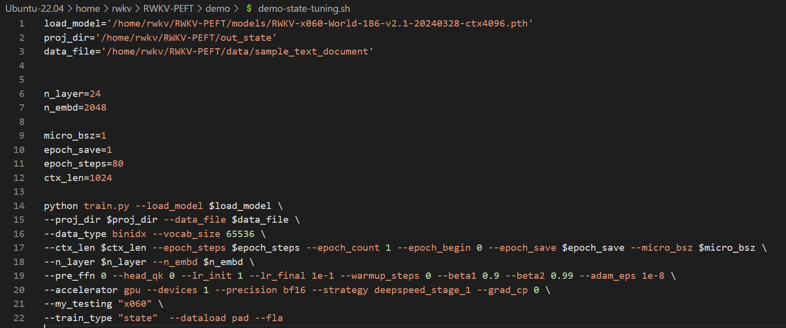

import { Callout } from 'nextra/components'
import { Steps } from 'nextra/components'

<Callout type="info" emoji="ℹ️">
**State 微调是什么？**

RWKV 是纯 RNN，因此可以做 transformer 难以做到的事情。例如，作为 RNN 有固定大小的 state，所以，微调 RWKV 的初始 state，就相当于最彻底的 prompt tuning，甚至可以用于 alignment，因为迁移能力很强。
</Callout>
本文的 State tuning 方法来自 RWKV 社区微调项目 [RWKV-PEFT ](https://github.com/JL-er/RWKV-PEFT)。

开始之前，请确保你拥有一个 Linux 工作区，以及支持 CUDA 的 NVIDIA 显卡。

State tuning 的显存需求可参考下表：

| 模型参数 | fp16  | int8  | nf4  |
|------------|---------|--------|--------|
| RWKV6-1.6B | 5.8GB GPU   | 4.5GB GPU  | 3.9GB GPU  | 
| RWKV6-3B      | 8.7GB GPU  | 6.2GB GPU  | 4.9GB GPU  | 
| RWKV6-7B      | 17.8GB GPU    | 11.9GB GPU  | 8.5GB GPU  | 

上表的数据基于以下测试参数:

- ctxlen=1024 
- micro_bsz=1
- strategy=deepspeed_stage_1


## 收集训练数据

你需要使用收集更适合训练 RWKV 的 binidx 数据，具体方法可参考[准备微调数据集](https://rwkv.cn/RWKV-Fine-Tuning/FT-Dataset)。

需要注意的是，训练 state 的 JSONL 数据集需要先用 [`make_data.py`](https://github.com/BlinkDL/RWKV-LM/blob/main/RWKV-v5/make_data.py) 脚本重复生成 10 遍，再转成 binidx 数据：

``` bash copy
python make_data.py novel.jsonl 10 512
```
在这条命令中，`novel.jsonl` 需要改成你的 JSONL 数据文件路径，10 则是数据重复的次数，512 则是你训练的 ctx 长度。

<Callout type="info" emoji="ℹ️">
在社区的实验中，State tuning 的 ctx_len 应当尽可能小，建议从 512 开始尝试。
</Callout>

## 配置训练环境

要训练 RWKV 模型，首先要配置训练环境。

<Steps>

### 1. 配置虚拟环境（conda）

RWKV 默认训练虚拟环境为 conda ，如果不知道如何配置 Linux 系统的 conda ，请参考[**此文章**](https://zhuanlan.zhihu.com/p/166102942)。

### 2. 安装 state tuning 所需的软件

要获得 RWKV 模型的最佳训练性能，请使用 `python 3.10`、`torch 2.1.2+cu121`（或最新版本）、`cuda 12.3+`、最新的 `deepspeed`，但保持 `pytorch-lightning ==1.9.5` 。

在 Linux 环境中依次运行以下命令：
``` bash copy
pip install torch --upgrade --extra-index-url https://download.pytorch.org/whl/cu121
```
``` bash copy
pip install pytorch-lightning==1.9.5 transformers ninja einops tqdm gpustat nvitop bitsandbytes wandb datasets triton==2.2.0 --upgrade
```
第一条命令通过指定 url 安装 cu121 版本的 torch ,第二条命令安装 RWKV State tuning 所需的其他软件包，并指定安装 1.9.5 版本的 `PyTorch Lightning`、2.2.0 版本的 `triton`。

`-- upgrade` 参数意味着如果环境中已经安装了对应的软件包，则将其升级到最新版本。

### 3. 检查 CUDA 环境

依次运行以下命令，检查 CUDA 库是否可用：
```  bash copy
python3 # 启动 python

import torch # 导入 torch 包

torch.cuda.is_available() # 检查 CUDA 是否可用
```


如果返回值为 True ，证明 CUDA 环境可用。如果返回 False ，请重新安装 CUDA 环境（cuda 12.3+）。

</Steps>

<Callout type="info" emoji="ℹ️">
安装 CUDA 环境的过程可以参考 https://docs.nvidia.com/cuda/ 。
</Callout>

## 克隆 RWKV-PEFT 仓库

在 Linux 或 WSL 中，使用 git 命令克隆 RWKV-PEFT 仓库​：
```  bash copy
git clone https://github.com/JL-er/RWKV-PEFT.git
```
克隆完成后，使用 `cd RWKV-PEFT` 命令进入 RWKV-PEFT 目录。

## 修改训练参数 

使用任意文本编辑器（如 vscode）打开 `demo-state-tuning.sh` 文件，可以修改训练参数，进而控制微调的训练过程和训练效果：



以下是一次 state tuning 调参过程：

<Steps>

### 调整路径参数

 `demo-state-tuning.sh` 文件前三行是文件路径参数：
 
- load_model： 基底 RWKV 模型的路径
- proj_dir：训练日志和训练得到的 state 文件输出路径
- data_file：训练数据集的路径，注意路径中不需要带 bin 和 idx 后缀，仅需文件名称。


### 调整 n_layer 和 n_embd 参数

基底 RWKV 模型的参数大小不同，训练时使用的 n_layer 和 n_embd 数值也不一样。以下是不同参数的 RWKV 模型和 n_layer 和 n_embd 数值的对照列表：

| 模型参数 | n_layer | n_embd |
|------------|---------|--------|
| 0.1B       | 12      | 768    |
| 0.4B       | 24      | 1024   |
| 1.5B       | 24      | 2048   |
| 3B         | 32      | 2560   |
| 7B         | 32      | 4096   |
| 14B        | 61      | 4096   |

### 调整重要训练参数

<Callout type="info" emoji="ℹ️">
以下参数建议根据你的微调数据、设备性能进行调整。
</Callout>

| 参数 | 描述 |
| --- | --- |
| `micro_bsz=1` | 根据显存大小调整，微调时从 1 开始逐渐增大 |
| `epoch_save=5` | 每隔多少个训练轮次保存一次模型，注意存储空间 |
| `epoch_steps=1000` | 每个训练轮次的步数，增加会拉长单个epoch的训练时间 |
| `ctx_len=512` | 微调模型的上下文长度，state tuning 建议从短开始尝试，如 512 |
| `QUANT='nf4'` | 支持的量化训练类型："Int8" 和 "nf4"，推荐使用精度损失较小的 "Int8"  |

量化训练可以降低显存需求，但会导致模型精度损失。如果不需要量化训练，可以删除所有 `QUANT` 相关的参数。

### 调整其他训练参数

下面列出了脚本中其他可修改的训练参数，及其修改的效果。

<Callout type="warning" emoji="⚠️">
注意：微调 state 时，建议 `--warmup_steps 10` 、`--lr_init 1` 、`--lr_final 0.01` ，以及尽可能短的 ctxlen 。（是的，state 微调需要使用非常高的学习率。）
</Callout>

| 参数 | 描述 |
| --- | --- |
| `--data_type binidx` | 训练语料的文件格式，支持："utf-8", "utf-16le", "numpy", "binidx", "dummy", "wds_img", "uint16" |
| `--vocab_size 65536` | 词表大小，默认为 65536，设置为 0 表示模型自动确定词汇表大小 |
| `--epoch_count 999999` | 总训练轮次，可根据效果调整 |
| `--epoch_begin 0` | 初始训练轮次，即从第 N 个 epoch 开始加载 |
| `--pre_ffn 0` | 用 ffn 替换第一个 att 层，有时可能有益 |
| `--head_qk 0` | 通常保持默认值 0，即关闭状态 |
| `--lr_init 1` | 初始学习率，state tuning 建议为 1，其他微调建议不超过 1e-4 |
| `--lr_final 0.01` | 最终学习率，state tuning 建议为 0.01，其他微调建议不超过 1e-4  |
| `--warmup_steps 10` | 预热步骤数，state tuning 建议为 10 |
| `--beta1 0.9` | Adam 优化器的 beta1 参数 |
| `--beta2 0.99` | Adam 优化器的 beta2 参数 |
| `--adam_eps 1e-8` | Adam 优化器的 epsilon 参数 |
| `--accelerator gpu` | 使用的加速器类型，目前主要支持 gpu， cpu 基本不支持训练 |
| `--devices 1` | 单显卡填 1，多卡按实际数量填写 |
| `--precision bf16` | 训练精度，默认为 bf16，支持："fp32", "tf32", "fp16", "bf16" |
| `--strategy deepspeed_stage_1` | lightning 训练策略参数，微调推荐使用 deepspeed_stage_1 |
| `--grad_cp 1` | 梯度累积步数，0 训练更快但需更多显存，1 训练较慢但节省显存 |
| `--my_testing "x060"` | 训练的 RWKV 模型版本，v5 选 x052，v6 选 x060 |
| `--dataload pad` | 数据加载选项，pad 支持 bsz>1，only 限制 bsz=1 |
| `--train_type "state"` | 训练类型 |
| `--fla` | 是否启用 fla，bsz < 8 时建议开启以减小显存需求 |


参数调整完成后，请记得保存 `demo-state-tuning.sh` 文件。

</Steps>

## 开始训练

在 RWKV-PEFT 文件夹，运行 `sh demo/demo-state-tuning.sh` 命令，开启 state tuning 。

正常开始训练后，应当是如下画面：


训练完毕后，应当可以在输出文件夹中找到训练好的 state 文件（`.pth` 格式）和训练日志（`.txt` 文件）:


## 如何使用 state 文件

获得 state 文件后，你可以如此使用：

- 使用 `demo-state-merge.sh` 工具将 state 文件合并到基底 RWKV 模型中，获得一个完整的 state 微调模型。

- 可以选择在 RWKV Runner 或 Ai00 等工具中单独挂载 state 文件。（推荐用法）

<Callout type="warning" emoji="ℹ️">
注意：挂载 state 文件时，必须使用训练此 state 文件的同款 RWKV 模型。
</Callout>

举个例子：这个 state 文件是基于 `RWKV-6-World-1.6B-v2.1` 模型微调而来，那么你在 RWKV Runner 或 Ai00 等工具中必须启动 `RWKV-6-World-1.6B-v2.1` 模型，挂载的 state 文件才会生效。


<Callout emoji="ℹ✨ ">
由于 state 文件支持单独挂载，其他用户也可以通过挂载你训练出来的的 state 文件，增强 RWKV 模型的使用体验。 

State 文件的用法可以参考 [RWKV Runner](https://rwkv.cn/RWKV-Runner/Advanced-Usage#%E5%9C%A8-rwkv-runner-%E4%B8%AD%E4%BD%BF%E7%94%A8-state-%E6%96%87%E4%BB%B6) |  [Ai00](https://rwkv.cn/ai00/Ai00-Features#%E6%8C%82%E8%BD%BD-state-%E6%96%87%E4%BB%B6-%E7%89%88%E6%9C%AC-049)
</Callout>