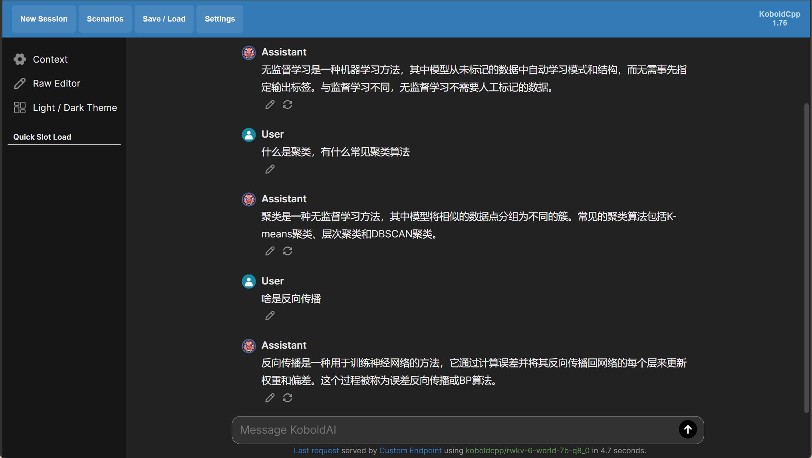
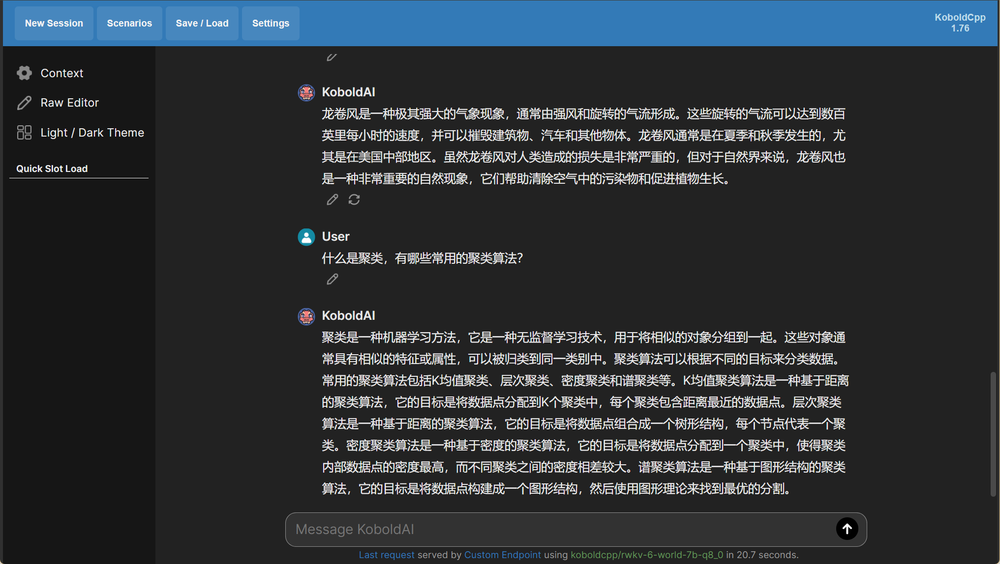
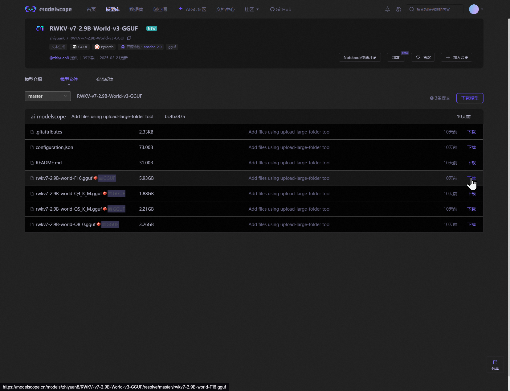
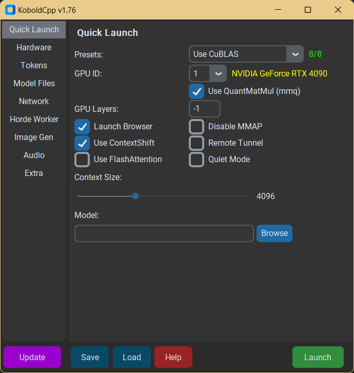
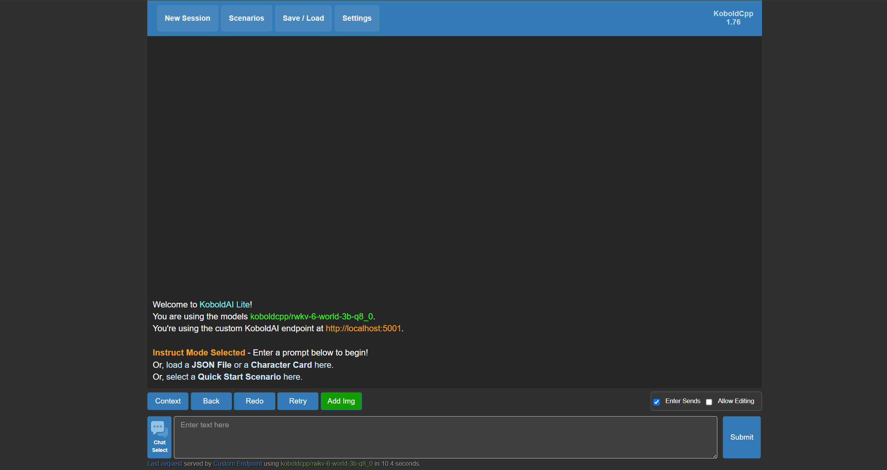
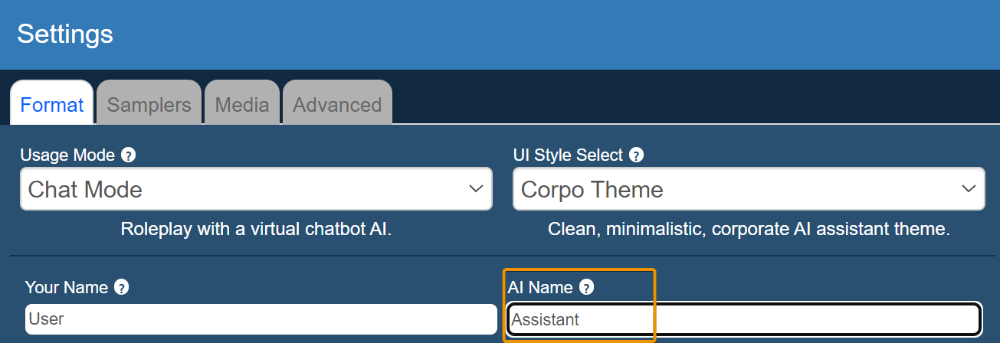

import { Callout } from 'nextra/components'

<Callout type="info" emoji="ℹ️">
[KoboldCpp](https://github.com/LostRuins/koboldcpp) 是一款简单易用的 AI 模型推理和文本生成工具。

KoboldCpp 基于 llama.cpp 推理后端构建，兼容 `ggml` 和 `gguf` 两种格式的模型。
</Callout>

本教程将指引你在 KoboldCpp 中运行 RWKV 模型，并与模型聊天对话。

## 视频教程

 <iframe 
 src="https://player.bilibili.com/player.html?isOutside=true&aid=113723637237645&bvid=BV15wCHYPEMm&cid=27557168288&poster=1&p=0&high_quality=1&autoplay=0"
 scrolling="no"
 frameBorder="0"
 allowfullscreen={true}
 sandbox="allow-top-navigation allow-same-origin allow-forms allow-scripts"
>
</iframe>

<Callout type="info" emoji="ℹ️">
高画质视频请[跳转到 B 站](https://www.bilibili.com/video/BV15wCHYPEMm)观看。
</Callout>

## 效果预览

**聊天模式（Chat Mode）**：模型回答较短，适合日常闲聊。

**指令模式（Instruct Mode）**：模型回答较详细，适合提问或解决问题。

## 下载与安装

### 下载 RWKV 模型

KoboldCpp 兼容 `ggml` 和 `gguf` 两种模型格式，推荐使用 `gguf` 格式的 RWKV 模型。

可以从 [RWKV-GGUF 仓库](https://huggingface.co/latestissue) 下载 `gguf` RWKV 模型。在 Hugging Face 页面，点击模型文件右侧的下载按钮，以下载模型文件：

<Callout type="info" emoji="ℹ️">
RWKV-GGUF 仓库为每种参数的 RWKV 模型提供了不同量化精度的 `gguf` 模型文件。

量化会影响模型的推理精度，从而影响模型的对话效果，推荐使用损失较低的 `Q5_1`、`Q8_0` 量化精度，以维持模型的性能和用户体验。
</Callout>

### 下载 KoboldCpp

从 [KoboldCpp 更新界面](https://github.com/LostRuins/koboldcpp/releases)可以下载最新版本的 KoboldCpp 项目。

#### Windows 系统

Windows 系统推荐下载 `koboldcpp.exe`，也可以根据设备的硬件配置选择其他 exe 文件：

- 如果不需要 CUDA（没有 NVIDIA 显卡），可以使用体积更小的 `koboldcpp_nocuda.exe`
- 如果您拥有 NVIDIA 显卡但使用老式 CPU，且 `koboldcpp.exe` 无法运行，试一下 `koboldcpp_oldcpu.exe`
- 如果您拥有较新的 NVIDIA 显卡，可以使用 CUDA 12 版本的 `koboldcpp_cu12.exe`（文件更大，但速度稍快）

#### Linux 系统

Linux 系统请选择相应 CUDA 版本的 Linux 二进制文件：

- `koboldcpp-linux-x64-cuda1150`：带 CUDA 11.5 的 Linux 二进制文件
- `koboldcpp-linux-x64-cuda1210`：带 CUDA 12.1 的 Linux 二进制文件
- `koboldcpp-linux-x64-nocuda`：不带 CUDA 的 Linux 二进制文件

#### macOS 系统

如果您正在使用运行于 Apple Silicon (M1, M2, M3 ...) 芯片上的 macOS 系统，可以尝试 `koboldcpp-mac-arm64` 二进制文件。

## 配置与运行

### 调整 KoboldCpp 配置

双击下载的 exe 文件，打开 KoboldCpp 的启动器 GUI 界面：

在启动器的快速启动（Quick Launch）界面，可以**调整 KoboldCpp 和模型的配置**，重点关注以下三个选项：

- **`Model`**：点击 `Browse` 按钮，选择一个 `gguf` 格式的 RWKV 模型文件。
- **`Presets`**：选择一种加载模型的方式。NVIDIA 显卡选择 `CUBLAS`，AMD 显卡选择 `CLBlast`，其他显卡选择 `Vulkan`，CPU 选择 `OpenBLAS`。
- **`Gpu layers`**：GPU 加载的模型层数，推荐保持默认值为 -1 （加载所有层）。如果显存不足，可从最大层数逐步减少加载层数：

    | 模型参数 | 最大层数 |
    | -------- | -------- |
    | RWKV-1.5B     | 24       |
    | RWKV-3B       | 32       |
    | RWKV-7B       | 32       |
    | RWKV-14B      | 61       |

其他选项**建议保持默认**，或根据需要调整：

- **`Use QuantMatMul (mmg)`** ：是否启用 `MMQ` 模式代替 `CuBLAS` 处理提示词，这是 `CUBLAS` 模式特有的选项，更详细的解释请参考 [KoboldCpp 文档 - MMQ 的作用](https://github.com/LostRuins/koboldcpp/wiki#what-does-quantized-mat-mul-mmq-do-for-cublas) 
- **`Launch Browser`**：是否在加载模型后自动打开浏览器，并访问 KoboldCpp 的 WebUI
- **`Use ContextShift`** ：是否使用 ContextShift 来减少重新处理上下文的时间。更详细的解释请参考 [KoboldCpp 文档 - ContextShift](https://github.com/LostRuins/koboldcpp/wiki#what-is-contextshift) 
- **`Use FlashAttention`** ：是否使用 FlashAttention 优化内存使用，仅对 `CUDA/CuBLAS` 模式有效
- **`Quite Mode`** ：选择此选项，终端将不会显示模型生成的文本内容
- **`Remote Tunnel`**：是否允许其他设备使用远程隧道连接 KoboldCpp，更详细的解释请参考 [KoboldCpp 文档 - Remote Tunnel](https://github.com/LostRuins/koboldcpp/wiki#how-do-i-run-koboldcpp-on-a-different-device-than-my-pc-over-the-network-remote-play) 
- **`Context Size`**：设置 KoboldCpp 可处理的最大上下文长度，RWKV 模型推荐保持默认值 4096
- 其他参数的释义，请参考 [KoboldCpp 文档](https://github.com/LostRuins/koboldcpp/wiki) 

### 运行 KoboldCpp

配置完毕后，点击右下角的 `Launch` 按钮启动 KoboldCpp。

此时 KoboldCpp 的启动器 GUI 将会自动关闭，并自动打开浏览器访问 KoboldCpp 的 WebUI 界面：

至此，KoboldCpp 已经成功运行，可以开始使用 RWKV 模型进行文本生成。

## KoboldCpp 使用指南

### 更改对话模式

KoboldCpp 支持四种聊天模式。在 KoboldCpp 的 WebUI 界面，点击 `Settings -> Format -> Usage Mode` 按钮，可以调整聊天模式：

- **`Instruct Mode`**：指令模式，适合带有指令的文本生成
- **`Story Mode`**：故事模式，适合小说风格的文本生成
- **`Adventure Mode`**：冒险模式，适合生成**交互式小说/角色扮演游戏**等内容。
- **`Chat Mode`**：聊天模式，适合闲聊

在我们的测试中，RWKV 模型在 `Instruct Mode` 和 `Chat Mode` 两种模式下表现较好。`Story Mode` 和 `Adventure Mode` 模式则需要进行一些额外的角色设定和配置，方可正常使用。

<Callout type="info" emoji="ℹ️">
使用 `Chat Mode` 时，请将 `AI Name` 选项设置为 `Assistant`，以获得最佳对话效果。
</Callout>

### 更改 WebUI 风格

KoboldCpp 支持三种 WebUI 风格。在 KoboldCpp 的 WebUI 界面，点击 `Settings -> Format -> UI Style Select` 按钮，可以调整 WebUI 风格：

- **`Classic Theme`**：默认主题，访问 KoboldCpp 的默认界面。
- **`Aesthetic Theme`**：美学主题，可以自定义 UI 大小、背景图、聊天框背景颜色等样式。
- **`Corpor Theme`**：极简主题，类似于 ChatGPT 等在线服务的界面。

推荐使用 `Corpor Theme` ：

### 其他设置项

由于 KoboldCpp 的设置项较多，此文档无法列出完整的设置项释义。

对于每个设置项的详细释义，请参考 WebUI 中的注释及 [KoboldCpp 文档](https://github.com/LostRuins/koboldcpp/wiki) 。

<Callout type="info" emoji="ℹ️">
如果不习惯全英文的 WebUI 界面，可使用浏览器的翻译功能将页面翻译成中文。
</Callout>
