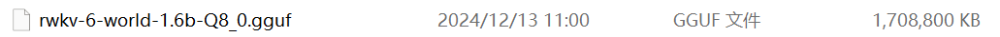
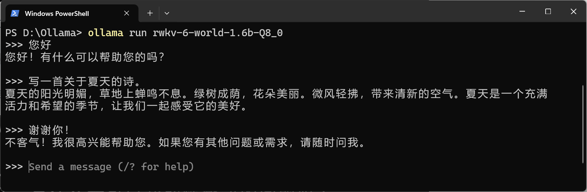

import { Callout } from 'nextra/components'

Ollama 是一个简单易用的开源本地大语言模型运行框架，支持在个人电脑上一键部署和运行各类开源模型，具有配置简单、资源占用低等特点。

随着 RWKV 社区成员 [@MollySophia](https://github.com/MollySophia) 的工作，Ollama 现已适配 RWKV-6 模型。

本章节介绍如何在 Ollama 中使用 RWKV-6 模型进行推理。

## 下载 RWKV v6 的 gguf 模型文件

在 Ollama 中我们建议使用 ``.gguf`` 格式的RWKV模型。

下载 gguf 格式的 RWKV 模型可参考 [llama.cpp 推理方法](https://rwkv.cn/llamacpp) 中 “获取 gguf 格式模型” 章节。



## 创建文本文件

在存放模型文件的同文件夹下创建文本文件，命名为 ``Modelfile``，此处创建的文本文件不包含后缀名。


之后使用“记事本”或 VS code 打开该文本文件，然后写入以下内容：

```
FROM rwkv-6-world-1.6b-Q8_0.gguf

TEMPLATE """
{{- range .Messages }}
{{- if eq .Role "user" }}User: 
{{- else if eq .Role "assistant" }}Assistant:
{{- end }}{{ .Content }}

{{ end }}Assistant:"""

PARAMETER stop "\n\n"
PARAMETER stop "\nUser:"
```

之后将第一行 ``FROM`` 之后修改为使用 RWKV 模型文件的文件名。

注意：建议直接复制上面的内容到 ``Modelfile`` 内，确保 ``User:`` 后有一个空格， ``Assistant:`` 后没有空格；``{{ end }}Assistant:"""`` 上有空行，后面没有多余字符。


## 下载 Ollama 客户端并安装

可从 [Ollama 官网](https://ollama.com/) 下载 Ollama 安装程序。

下载完成后，双击 exe 文件进行安装，安装完成后 ``Ollama`` 自动启动，启动之后可在右下角查看 Ollama 的图标。


## 使用 Ollama 运行 RWKV 模型

使用命令行在模型文件夹下执行：

``` bash
ollama create rwkv-6-world-1.6b-Q8_0 -f Modelfile
```

此处模型名称需与 ``Modelfile`` 中模型名称保持一致。


之后便可直接运行模型：

``` bash
ollama run rwkv-6-world-1.6b-Q8_0
```

运行之后即可与模型进行 Chat。


