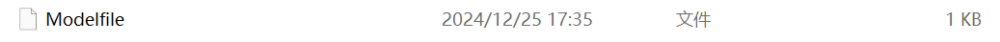
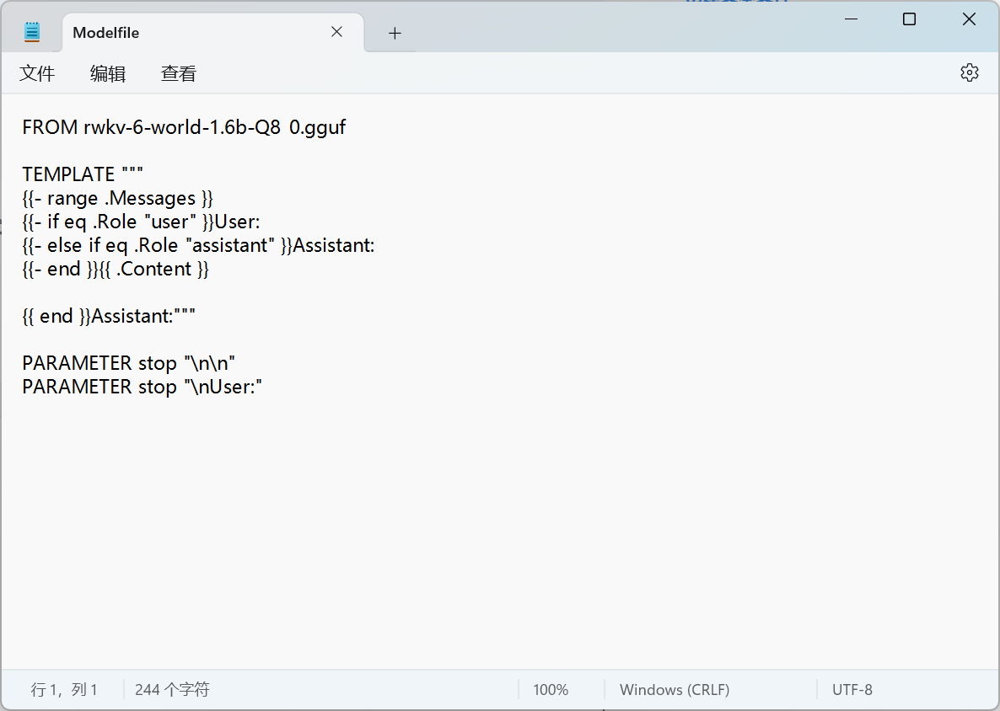
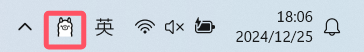
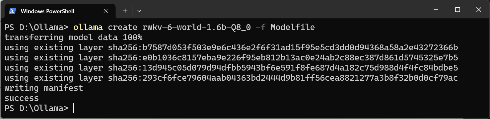

import { Callout } from 'nextra/components'
import { Tabs } from 'nextra/components'

<Callout type="info" emoji="ℹ️">
[Ollama](https://github.com/ollama) 是一个简单易用的开源本地大语言模型运行框架，支持在个人电脑上一键部署和运行各类开源模型，具有配置简单、资源占用低等特点。
</Callout>

随着 RWKV 社区成员 [@MollySophia](https://github.com/MollySophia) 的工作，Ollama 现已适配 RWKV-6 模型。

本章节介绍如何在 Ollama 中使用 RWKV-6 模型进行推理。

## 下载 gguf 格式 RWKV 模型

Ollama 支持 `.gguf` 格式的模型，但 RWKV 官方仅发布了 `.pth` 格式模型。因此，我们需要从 [RWKV - GGUF 仓库](https://hf-mirror.com/latestissue) 下载 gguf 格式的 RWKV 模型。

<Callout type="warning" emoji="⚠️">
RWKV gguf 模型有各种量化版本，建议使用 `Q5_1`、 `Q8_0` 两种量化精度，更低的量化精度（如 `Q4_0`、`Q3_0` 等）可能会使模型的回答变得很差。
</Callout>

## 创建模型的 Modelfile 文件

在存放 RWKV gguf 模型文件的文件夹下创建名为 `Modelfile` 的文本文件，不需要后缀名。



之后使用“记事本”等文本编辑工具打开该文本文件，写入以下内容：

```bash copy
FROM rwkv-6-world-1.6b-Q8_0.gguf

TEMPLATE """
{{- range .Messages }}
{{- if eq .Role "user" }}User: 
{{- else if eq .Role "assistant" }}Assistant:
{{- end }}{{ .Content }}

{{ end }}Assistant:"""

PARAMETER stop "\n\n"
PARAMETER stop "\nUser:"
```

将第一行 `FROM` 之后的 `rwkv-6-world-1.6b-Q8_0.gguf` 修改为你下载的 RWKV 模型文件名。

<Callout type="warning" emoji="⚠️">
建议直接复制上面的内容到 `Modelfile` 内，以确保 `User:` 后有一个空格， `Assistant:` 后没有空格；`{{ end }}Assistant:"""` 上有空行，后面没有多余字符。
</Callout>



## Ollama 的下载与安装

可从 [Ollama 官网](https://ollama.com/) 下载 Ollama 的安装程序。

下载完成后，双击 exe 文件进行安装。安装完成后 `Ollama` 会自动启动，启动后可在系统任务栏看到 `Ollama` 图标。



## Ollama 运行 RWKV 模型

在 RWKV gguf 模型文件夹下打开终端，并执行 `ollama create` 命令：

``` bash copy
ollama create rwkv-6-world-1.6b-Q8_0 -f Modelfile
```
<Callout type="info" emoji="ℹ️">
将 `ollama create` 后面的模型名称改成你本地的 RWKV 模型，与 `Modelfile` 中的模型名称保持一致。
</Callout>



创建完毕后，使用 `ollama run` 命令直接运行模型：

``` bash copy
ollama run rwkv-6-world-1.6b-Q8_0
```

成功运行后，即可与模型进行聊天对话：


## Ollama GUI 和桌面程序

Ollama 本身并没有提供 GUI 或 WebUI 服务，但其社区提供了第三方 GUI 和桌面程序。

可以在 [Ollama 的 GitHub 文档](https://github.com/ollama/ollama?tab=readme-ov-file#web--desktop) 中查看所有第三方 Ollama 工具。

## 参考资料

- [Ollama 官网](https://ollama.com/)
- [RWKV gguf 模型仓库](https://huggingface.co/latestissue)