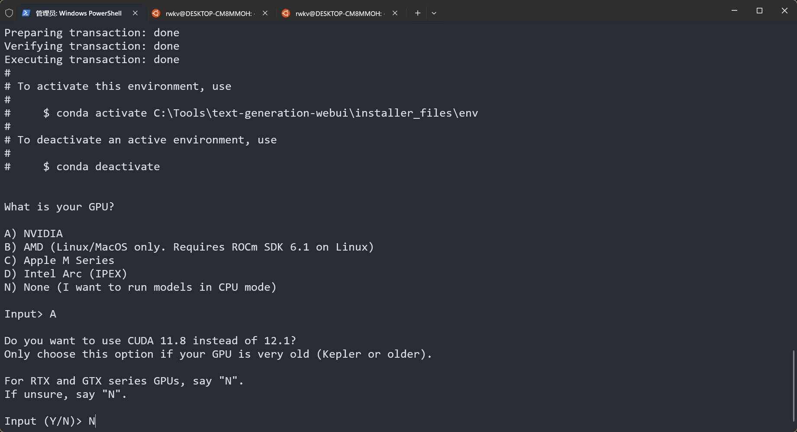
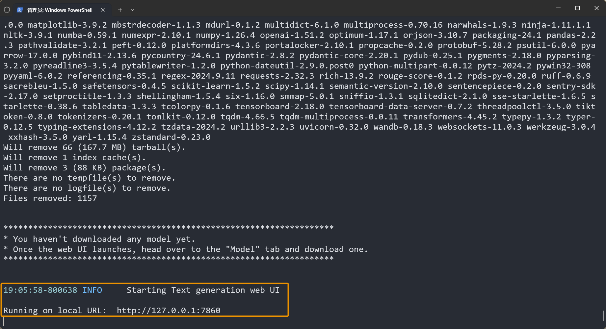
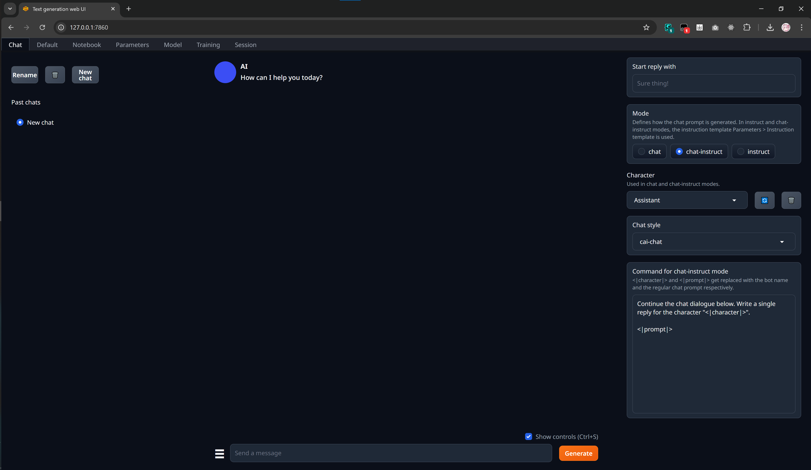
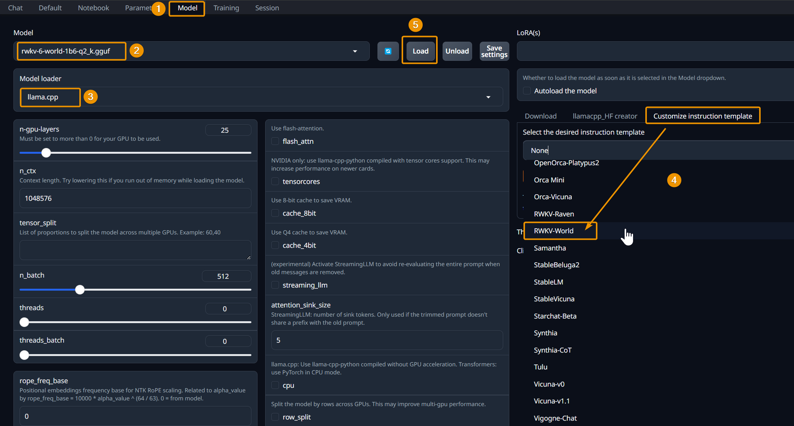
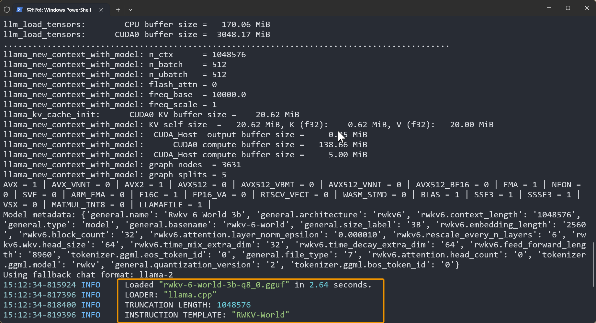
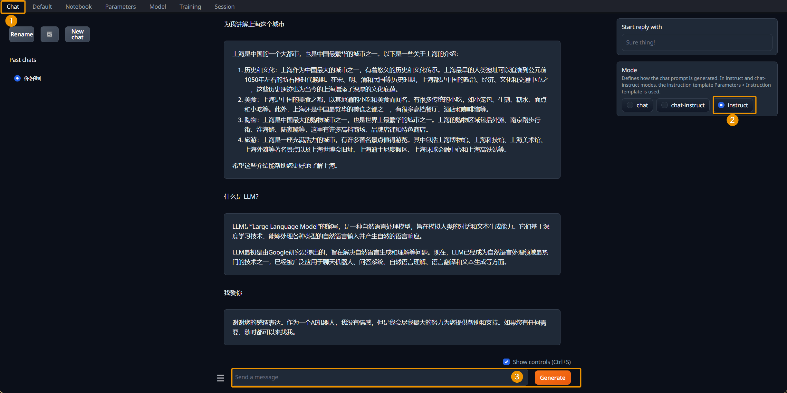

import { Callout } from 'nextra/components'

<Callout type="info" emoji="ℹ️">
[Text Generation WebUI](https://github.com/oobabooga/text-generation-webui) 是一个运行大语言模型的工具。它提供了一个友好的网页界面，用户可以轻松地在 Web 页面中配置和运行模型。
</Callout>

Text Generation WebUI 支持模型的推理和训练，本文将介绍如何使用 Text Generation WebUI 运行 RWKV 模型推理，并与模型聊天对话。

## 下载 Text Generation WebUI

使用 `git clone` 方法下载 Text Generation WebUI：

```bash
git clone https://github.com/oobabooga/text-generation-webui
```

项目克隆完毕后，运行 `cd text-generation-webui` 命令进入项目目录。

## 启动 Text Generation WebUI

根据你的操作系统，选择不同的 Text Generation WebUI 启动脚本：

### Windows 系统

在终端运行以下命令，启用 Windows 系统安装脚本：

```bash copy
./start_windows.bat
```

<Callout type="info" emoji="ℹ️">
此脚本将自动安装 [Miniconda](https://docs.anaconda.com/miniconda/) ，并在 conda 环境中安装 `torch 2.4.1` 等项目依赖工具。
</Callout>

等待 Miniconda 安装完毕，跟随提示选择设备的显卡类型和 CUDA 版本。



耐心等待脚本安装，直到出现以下提示：



此时 Text Generation WebUI 已成功启动，访问 `http://localhost:7860` 以打开项目的 Web 界面：



### MacOS 系统

MacOS 系统请使用 `start_macos.sh` 脚本启动项目：

```bash copy
sh start_macos.sh
```

<Callout type="warning" emoji="⚠️">
如果你正在使用的 macOS 版本大于 15，需要在 `requirements_apple_silicon.txt` 文件的末尾添加额外的依赖项，以保证 Text Generation WebUI 能够正确地使用 llama.cpp 加载模型：
</Callout>

``` Text copy
https://github.com/oobabooga/llama-cpp-python-cuBLAS-wheels/releases/download/metal/llama_cpp_python-0.3.1-cp311-cp311-macosx_14_0_arm64.whl; platform_system == "Darwin" and platform_release >= "24.0.0" and python_version == "3.11"
https://github.com/oobabooga/llama-cpp-python-cuBLAS-wheels/releases/download/metal/llama_cpp_python-0.3.1-cp310-cp310-macosx_14_0_arm64.whl; platform_system == "Darwin" and platform_release >= "24.0.0" and python_version == "3.10"
```

## 下载 RWKV 模型

Text Generation WebUI 支持多种模型加载器，其中 llama.cpp 模型加载器支持 RWKV 模型。

llama.cpp 仅支持 `gguf` 格式的 RWKV 模型，我们需要从 [RWKV-GGUF 仓库](https://huggingface.co/latestissue) 下载 `gguf`  RWKV 模型。

<Callout type="info" emoji="ℹ️">
RWKV-GGUF 仓库为每种参数的 RWKV 模型提供了不同量化精度的 `gguf` 模型文件。

量化会影响模型的推理精度，从而影响模型的对话效果，推荐使用损失较低的 `Q5_1`、`Q8_0` 量化精度，保持模型的智商和聊天体验。
</Callout>

在 Hugging Face 页面，点击模型文件右侧的下载按钮，以下载模型文件：


等待模型下载完毕，将模型文件放到 Text Generation WebUI 根目录的 `models` 文件夹中：

```
text-generation-webui
└── models
    └── rwkv-6-world-7b-iq4_nl.gguf
```

## 加载 RWKV 模型

回到 Text Generation WebUI 的网页界面，配置并加载 RWKV 模型：

1. 点击 `Model` 标签，切换到模型选择和配置页面
2. 点击 `Model` 下拉菜单，选择一个 RWKV 模型
3. 点击 `Model loader` 下拉菜单，选择 `llama.cpp` 作为模型加载器
4. 点击右侧的 `Customize instruction template` 下拉菜单，选择 `RWKV World` ，并点击下方 `submit` 按钮
5. 点击 `Load` 按钮加载 RWKV 模型



<Callout type="info" emoji="ℹ️">
如果 `Model` 下拉菜单未显示模型文件，可能是网页端未同步 `models` 文件夹中的模型列表。

请**点击右侧的 🔄 刷新按钮**，更新模型列表。
</Callout>

成功加载后，终端会显示 RWKV 模型名称、模型加载器、最大聊天长度、聊天指令模板 4 项信息：



## 开始聊天

模型加载完毕后，回到 `Chat` 页面 -> 选择 `instruct` 模式 -> 输入内容并点击 `Generate` 按钮，即可开始对话。



## 其他参数说明

除了最重要的模型文件（`gguf` 格式的 RWKV 模型）、模型加载器（`llama.cpp`）和聊天指令模板（`RWKV World`）以外，llama.cpp 还提供一系列可调整的参数，调整这些参数会影响**显存占用**和**生成速度**等模型性能指标。

通常可以**保持默认参数**运行模型。如需修改，请参考以下参数说明：

| 参数            | 描述                                                                                                                                                       |
| --------------- | ---------------------------------------------------------------------------------------------------------------------------------------------------------- |
| `n-gpu-layers`  | 指定分配到 GPU 的模型层数。设置为 0 时仅意味着使用 CPU。如果想把所有层都放到 GPU 上，可以将其设置为最大值。                                                |
| `n_ctx`         | 模型能处理的上下文长度。llama.cpp 预分配缓存，因此该值越高显存需求越大。通常在加载模型时**自动设置为模型的最大长度**，如果显存不足，可以降低这个值来适应 GPU。 |
| `tensor_split`  | 适用于多 GPU 计算。按比例分配每个 GPU 的内存，比如 30,70 表示一个 GPU 使用 30%，另一个使用 70%。                                                           |
| `n_batch`       | 处理提示时的批量大小。理论上增加这个值可以加快生成速度，但效果因硬件而异，**通常不需要改动**。                                                             |
| `threads`       | 使用的线程数量。推荐**保持默认**，或设置为电脑的物理核心数                                                                                                 |
| `threads_batch` | 批处理时使用的线程数。推荐**保持默认**，或设置为物理和虚拟核心的总数                                                                                       |
| `tensorcores`   | **NVIDIA RTX 显卡可以选择**此选项，使用支持 “tensor cores” 的 llama.cpp 版本来提高性能。                                                                   |
| `streamingllm`  | 实验功能，避免在删除旧消息时重新计算整个对话，可以节省推理时间。**不建议开启**                                                                             |
| `cpu`           | 强制使用 CPU 进行计算。**不建议开启**，只有在 GPU 无法正常工作，或希望完全使用 CPU 时才需要开启。                                                          |
| `no_mul_mat_q`  | 禁用用于加速计算的内核。禁用后可能会降低生成的速度，但**如果遇到兼容性问题**，可以尝试禁用。                                                               |
| `no-mmap`       | 一次性将模型加载到内存中，避免后续的硬盘读取操作，代价是加载时间更长。**不建议开启**                                                                       |
| `mlock`         | 强制系统将模型一直保留在内存中，不让系统转移到硬盘上，以防速度变慢。（注意，此功能未经全面评测，效果未知，**不建议开启**）                                 |
| `numa`          | 在某些多 CPU 系统上，可以使用这个选项来优化性能。                                                                                                          |


## 常见问题/注意事项


1. 在 MacOS 系统运行脚本时，如果终端日志提示需要安装 `httpx[socks]`，请在 `./requirements_apple_silicon.txt` 文件的末尾添加 `httpx[socks]` 依赖。

2. 使用 1.6B 参数的 RWKV 模型时，请使用 `Q5_1`、`Q5_k` 或更高量化精度。在测试中，Q5_0 及更低精度的量化可能会导致小参数模型的智商变低，甚至无法正常对话。