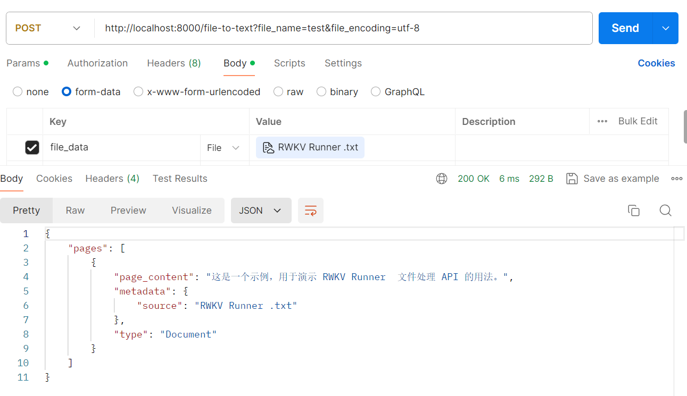
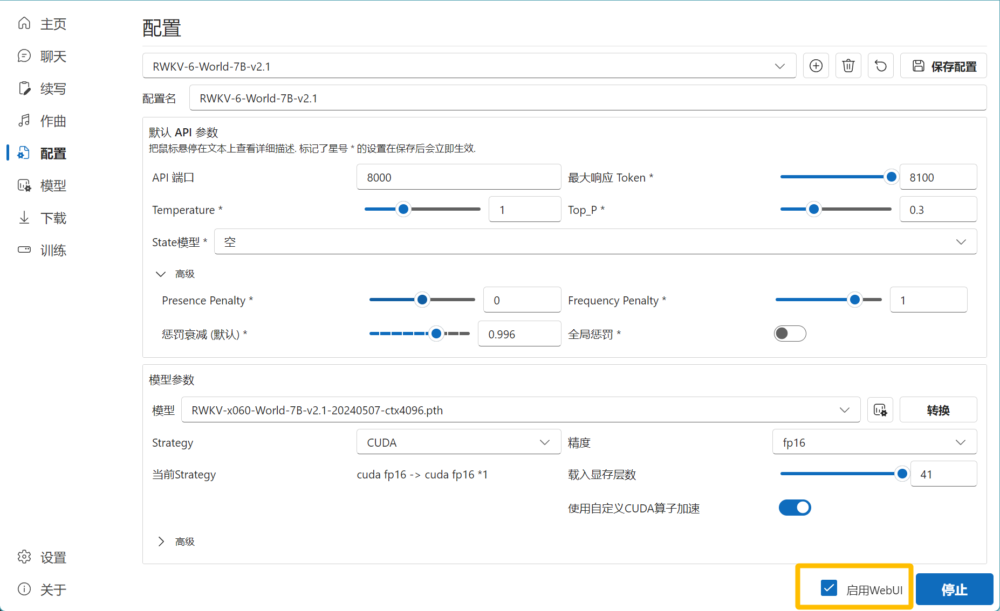

import { Callout } from 'nextra/components'
import { Steps } from 'nextra/components'

本文旨在让大家更轻松、更灵活地使用 RWKV Runner 的 API 。

此章节会列出 RWKV Runner 每个 API 的作用、请求主体的参考结构、有哪些必需和可选字段。

那么，让我们先从一些 RWKV 模型的基础知识开始吧！

## RWKV 模型解码参数（预备知识）

你可能注意到了，很多 RWKV 部署/体验工具都支持调整 `Temperature`、`Top_P` 等 RWKV 模型解码参数。

这些主要解码参数对应的效果如下：

| 参数                | 效果                                                                                                                                                            |
| ------------------- | --------------------------------------------------------------------------------------------------------------------------------------------------------------- |
| `Temperature`       | 采样温度，就像给模型喝酒，数值越大随机性越强，更具创造力，数值越小则越保守稳定。                                                                                |
| `Top_P`             | 就像给模型喂镇静剂，优先考虑前 n% 概率质量的结果。如设置成 0.1 则考虑前 10% , 生成内容质量更高但更保守。如设置成 1 ，则考虑所有质量结果，内容质量降低但更多样。 |
| `Presence penalty`  | 存在惩罚，正值根据“新 token 在至今的文本中是否出现过”来对其进行惩罚，从而增加了模型涉及新话题的可能性。                                                         |
| `Frequency Penalty` | 频率惩罚，根据新内容在目前的文本中出现的频率/次数来对其进行惩罚，从而减少模型原封不动地重复相同短语/句子的可能性。                                              |
| `max_tokens`        | 模型生成文本时的最大 token 数。如果你在对外提供服务，建议限制单个请求的 max_tokens，太高可能导致极端情况下单个响应消耗大量的服务器资源。                        |


续写小说和对话这一类**需要创造性的任务**，需要高 `Temperature` + 低 `Top_P` 的参数组合，可以尝试以下四种参数搭配：

- `Temperature` 1.2 ，`Top_P` 0.5
- `Temperature` 1.4 ，`Top_P` 0.4 
- `Temperature` 1.4 ，`Top_P` 0.3
- `Temperature` 2 ，`Top_P` 0.2 

举个例子，续写小说可以尝试将 `Temperature` 设为 2 （ `Temperature` 增加会提高文采，但逻辑会下降），然后将 `Top_P` 设为 0.1 ~ 0.2 （`Top_P` 越低，逻辑能力越强），这样生成的小说内容逻辑和文采都很好。

完成**相对机械的任务**，例如材料问答、文章摘要等，则可将参数设为：

- `Temperature` 1 ，`Top_P` 0.2
- `Temperature` 1 ，`Top_P` 0.1
- `Temperature` 1 ，`Top_P` 0 

举个例子，如果你正在执行像关键词提取之类的机械任务，不需要模型进行任何开放性思考，则可以将 `Temperature` 设为 1 ，`Top_P`、`Presence penalty`、`Frequency Penalty` 都设为 0 。

现在，你应该对 RWKV 模型最主要的四个解码参数有所了解了，现在我们开始了解 RWKV Runner 的所有 API 具体用法！

## Completions (续写) API 

RWKV Runner 的续写 API 分为**聊天续写**和**基础续写**两种，其中聊天续写 API 拥有“role - 角色”参数，因此支持角色扮演等进阶任务。

### /chat/completions

`v1/chat/completions` 和 `/chat/completions` 是相同的 API，用于 RWKV 的**聊天续写**模式，也就是和模型对话。

**API 地址**：（post）`http://127.0.0.1:8000/chat/completions`

**必需参数**

- "messages": 消息对象列表，包含两个元素：
  - "content": 提供给模型的 prompt ，即对话内容
  - "role": 扮演的角色名称，可以从"user", "assistant" 和 "system"选一个。

因此，聊天 API 的基础请求主体如下：


```json copy
{
    "messages": [
    {
      "content": "hello",
      "role": "user"
    }
    ]
}
```
<Callout type="warning" emoji="⚠️">
注意，上面是一个最简单的聊天续写请求，如果你希望控制模型的创作风格/创作能力，请考虑添加以下可选参数：
</Callout>

**可选参数**

下面列出了聊天续写 API 的所有可选参数：

| 参数名称          | 类型                            | 参数解释                                                        |
| ----------------- | ------------------------------- | --------------------------------------------------------------- |
| max_tokens        | integer                         | 生成文本的最大令牌数，最大 102400，对外部署时建议限制文本长度。 |
| temperature       | number                          | 解码参数之一，具体效果参考前文，范围[0, 3]                      |
| top_p             | number                          | 解码参数之一，具体效果参考前文，范围 [0, 1]                     |
| presence_penalty  | number                          | 解码参数之一，具体效果参考前文，范围 [-2, 2]                    |
| frequency_penalty | number                          | 解码参数之一，具体效果参考前文，范围 [-2, 2]                    |
| penalty_decay     | number                          | 频率的衰减参数，范围 [0.99, 0.999]，**不建议修改**              |
| top_k             | integer                         | 模型生成内容的候选词数量，范围 [0, 25] **不建议修改**           |
| global_penalty    | boolean                         | 是否应用全局惩罚，**不建议修改**                                |
| state             | string                          | 指定使用的 RWKV state 文件路径                                  |
| model             | string \| null                  | 指定使用的 RWKV 模型路径                                        |
| stream            | boolean                         | 是否以流模式生成文本。                                          |
| stop              | string \| array\<string\> \| null | 指定生成文本时的停止词。                                        |
| user_name         | string \| null                  | 聊天模式的用户名，**不建议修改**                                |
| assistant_name    | string \| null                  | 聊天模式的助手名，**不建议修改**                                |
| system_name       | string \| null                  | 聊天模式的系统名，**不建议修改**                                |

### /completions 

`/completions`和 `v1/completions`是相同的续写 API，对应的是 RWKV Runner 的**基础续写**模式，也就是让模型接着你的 prompt 继续生成内容。

**API 地址**：（post）`http://127.0.0.1:8000/completions`

**必需参数**

- "prompt": 你提供给模型的续写 prompt 。

因此，聊天 API 的基础请求主体如下：

```json copy
{
 "prompt": "那一天，人们又想起来被暴雨支配的恐惧..."
}
```

**可选参数**

下面列出了续写 API 的所有可选参数：

| 参数名称          | 类型                            | 参数解释                                                        |
| ----------------- | ------------------------------- | --------------------------------------------------------------- |
| max_tokens        | integer                         | 生成文本的最大令牌数，最大 102400，对外部署时建议限制文本长度。 |
| temperature       | number                          | 解码参数之一，具体效果参考前文，范围[0, 3]                      |
| top_p             | number                          | 解码参数之一，具体效果参考前文，范围 [0, 1]                     |
| presence_penalty  | number                          | 解码参数之一，具体效果参考前文，范围 [-2, 2]                    |
| frequency_penalty | number                          | 解码参数之一，具体效果参考前文，范围 [-2, 2]                    |
| penalty_decay     | number                          | 频率的衰减参数，范围 [0.99, 0.999]，**不建议修改**              |
| top_k             | integer                         | 模型生成内容的候选词数量，范围 [0, 25] **不建议修改**           |
| global_penalty    | boolean                         | 是否应用全局惩罚，**不建议修改**                                |
| state             | string                          | 指定使用的 RWKV state 文件路径                                  |
| model             | string \| null                  | 指定使用的 RWKV 模型路径                                        |
| stream            | boolean                         | 是否以流模式生成文本。                                          |
| stop              | string \| array\<string\> | null | 指定生成文本时的停止词。                                        |

<Callout type="info" emoji="ℹ️">
RWKV Runner 默认使用 `\n\nUser` 作为停止词，如果你希望修改默认的模型停止词，则可以指定 `stop` 字段（一个字符串或者是一个字符串列表）。
</Callout>

参考的停止词：

```JavaScript copy
["\n\nUser", "\n\nQuestion", "\n\nQ", "\n\nHuman", "\n\nBob", "\n\nAssistant", "\n\nAnswer", "\n\nA", "\n\nBot", "\n\nAlice"]
```

## Embeddings API

RWKV Runner 的 Embeddings API 还停留在 RWKV-4，未针对 RWKV5/6 架构更新，因此不建议使用。

## Configs（配置类） API 

### /switch-model 

这个 API 用于切换并重新部署 RWKV 模型。

**API 地址**：（post）`http://127.0.0.1:8000/switch-model`

**必需字段**

- "model":用于切换 RWKV 模型，填 RWKV 模型文件的路径，如 `model/xxx.pth`
- "strategy"：模型部署的方法，如"cuda fp16" 。不同的 strategy 需要的性能也不一样，参考下表：

| strategy                              | VRAM & RAM                        | 速度                                                                                                                                                                                                                                                                                                                       |
| ----------------------------------- | --------------------------------- | -------------------------------------------------------------------------------------------------------------------------------------------------------------------------------------------------------------------------------------------------------------------------------------------------------------------------- |
| **cpu fp32**                        |  7B 模型需要 32GB 内存             | 使用 CPU fp32 精度加载模型，适合 Intel。对 AMD 非常慢，因为 pytorch 的 cpu gemv 在 AMD 上有问题，并且只会运行在一个单核上。                                                                                                                                                                                                                         |
| **cpu bf16**                        | 7B 模型需要 16GB 内存             | 使用 CPU bf16 精度加载模型。在支持 bfloat16 的新 Intel CPU（如 Xeon Platinum）上速度较快。                                                                                                                                                                                                                                                                   |
| **cpu fp32i8**                      | 7B 模型需要 12GB 内存             | 使用 CPU int8 量化精度加载模型。速度较慢（比 cpu fp32 更慢）。                                                                                                                                                                                                                                                                                                   |
| **cuda fp16**                       | 7B 模型需要 15GB VRAM             | 使用 fp16 精度加载模型所有层，速度最快，但对显存（VRAM）的需求也最高。                                                                                                                                                                                                                                       |
| **cuda fp16i8**                     | 7B 模型需要 9GB VRAM              | 使用 int8 量化模型所有层，速度较快。                                                                                                                                                                                                                     |
| **cuda fp16i8 \*20 -> cuda fp16**   | VRAM 占用介于 fp16 和 fp16i8 之间 | 将模型的前 20 层（`*20` 指层数）量化为 fp16i8，其余层使用 fp16 加载。如果量化后还有较多 VRAM ，则酌情减少 fp16i8 层数（减少 20）。如果 VRAM 不足则继续增加 fp16i8 量化层数  |
| **cuda fp16i8 \*20+**               | 比 fp16i8 使用更少 VRAM           | 将模型的前 20 层（`*20` 指层数）量化为 fp16i8 并固定在 GPU 上，其他层按需动态加载（未固定的层加载速度会慢 3 倍，但节省 VRAM）。如果 VRAM 不足，减少固定层数（`*20`）。如果 VRAM 充足，增加固定层数。                                                                                                                                           |
| **cuda fp16i8 \*20 -> cpu fp32**    | 比 fp16i8 使用更少 VRAM，但消耗更多内存          | 将模型的前 20 层（`*20`）量化为 fp16i8 并固定在 GPU 上，其他层使用 CPU fp32 加载。当 CPU 性能比较强时，此策略比上一个策略（只在 GPU 上固定 20 层）更快。如果加载 20 层还有剩余 VRAM ，则继续增加 GPU 层数。如果没有足够 VRAM，减少 GPU 层数。                                                                                                                           |
| **cuda:0 fp16 \*20 -> cuda:1 fp16** | 使用双卡驱动模型                  | 使用 cuda:0（卡1） fp16 加载模型的前 20 层，然后使用 cuda:1（卡2） fp16 加载剩余的层（自动计算剩余层数）。建议在最快的 GPU 上运行更多层。如果某张卡的 VRAM 不够，可以将 fp16 换成 fp16i8 （int8 量化）。                                                                                                                            |

**可选字段**

| 参数名称   | 类型            | 参数解释                                               |
| ---------- | --------------- | ------------------------------------------------------ |
| tokenizer  | string \| nulls | 指定使用的 RWKV 分词器路径                             |
| customCuda | boolean         | 是否启用自定义 cuda 算子                               |
| deploy     | boolean         | 是否启用部署模式，启用部署模式会屏蔽掉**有风险的 API** |

- "customCuda"：是否启用自定义 cuda 算子，**不建议修改**
- "deploy"：是否启用服务器部署模式，启用服务器部署模式会屏蔽掉`/switch-model`、 `/exit`和其他有风险的 API
- "tokenizer"：指定使用的 RWKV 分词器路径，**不建议修改**


**参考的请求主体：**
```json copy 
{
"customCuda":false,"
deploy":false,
"model":"models/RWKV-4-World-3B-v1-20230619-ctx4096.pth",
"strategy":"cuda fp16",
"tokenizer":""
}
```
### /update-config

这个 API 用于**更新 RWKV Runner 的模型配置**，包括解码参数、是否挂载 state 文件等。

**API 地址**：（post）`http://127.0.0.1:8000/update-config`

**可选字段**

| 参数名称          | 类型    | 参数解释                                                        |
| ----------------- | ------- | --------------------------------------------------------------- |
| max_tokens        | integer | 生成文本的最大令牌数，最大 102400，对外部署时建议限制文本长度。 |
| temperature       | number  | 解码参数之一，具体效果参考前文，范围[0, 3]                      |
| top_p             | number  | 解码参数之一，具体效果参考前文，范围 [0, 1]                     |
| presence_penalty  | number  | 解码参数之一，具体效果参考前文，范围 [-2, 2]                    |
| frequency_penalty | number  | 解码参数之一，具体效果参考前文，范围 [-2, 2]                    |
| penalty_decay     | number  | 频率的衰减参数，范围 [0.99, 0.999]，**不建议修改**              |
| top_k             | integer | 模型生成内容的候选词数量，范围 [0, 25] **不建议修改**           |
| global_penalty    | boolean | 是否应用全局惩罚，**不建议修改**                                |
| state             | string  | 指定使用的 RWKV state 文件路径                                  |

**参考的请求主体：**
```json copy
{
  "frequency_penalty": 1,
  "global_penalty": false,
  "max_tokens": 1000,
  "penalty_decay": 0.996,
  "presence_penalty": 0,
  "state": "models/",
  "temperature": 1,
  "top_p": 0.3
}
```

### /status

这个 API 用于获取 RWKV Runner 运行的设备状态，比如 GPU 型号等。

**API 地址**：（get）`http://127.0.0.1:8000/status`

参考的**响应结构**：

```json copy
{
    "status": 3, # 模型工作的状态码
    "pid": 34776, # 模型的进程ID（Process ID）
    "device_name": "NVIDIA GeForce RTX 3080 Laptop GPU" #模型工作的 GPU 型号
}
```

<Callout type="info" emoji="ℹ️">
关于 RWKV Runner 状态码：
- 0 是模型离线
- 2 是模型正在载入
- 3 是模型正常工作中
</Callout>


## MIDI 相关 API 

RWKV Runner 的 MIDI API 用于处理 midi 乐谱文件（`.mid`），比如文本转 MIDI 、MIDI 转 WAV 音频文件等。

### /text-to-midi

这个 API 用于将 MIDI 格式的文本（text）转换为 MIDI 乐谱文件(`.mid`)。

<Callout type="warning" emoji="⚠️">
注意：此 API 与启动的 RWKV 模型无关。
</Callout> 

**API 地址**：（post）`http://127.0.0.1:8000/text-to-midi`

**必需字段**

- "text": 提供给模型的 MIDI 乐谱文本，即 MIDI 乐谱内容。

参考的请求主体：

```json copy
{
  "text": "p:24:a p:2a:a p:31:a p:39:a p:3b:a p:45:a b:26:a g:3e:a g:3e:a g:42:a g:42:a g:45:a g:45:a pi:3e:a pi:42:a pi:45:a t14 p:24:0 p:2a:0 p:31:0 p:39:0 p:3b:0 p:45:0 t2 p:2a:a p:3b:a p:45:a t14 p:2a:0 p:3b:0 p:45:0 b:26:0 g:3e:0"
}
```

### /midi-to-text

这个 API 用于将 MIDI 乐谱文件(`.mid`) 转换为 MIDI 格式的文本（text）。

<Callout type="warning" emoji="⚠️">
注意：此 API 与启动的 RWKV 模型无关。
</Callout> 

**API 地址**：（post）`http://127.0.0.1:8000/midi-to-text`

**必需字段**

- file_data：提供给模型的 MIDI 乐谱文件，也可以是 string($binary) - 字符串格式的二进制数据。

参考的响应结构：
```json copy
{
"text": "<start> p:24:a p:2a:a <end>"
}
```

### /txt-to-midi

这个 API 用于将 MIDI 内容的文本文件（`.txt`）转换为 MIDI 乐谱文件(`.mid`)。

**API 地址**：（post）`http://127.0.0.1:8000/txt-to-midi`

**必需字段**

- "midi/sample.mid": 转化完毕的 MIDI 文件保存路径
- "midi/sample.txt"：需要转化的 TXT 文件路径

**参考的请求主体**

```json copy
{
  "midi_path": "midi/sample.mid",
  "txt_path": "midi/sample.txt"
}
```
### /midi-to-wav

这个 API 用于将 MIDI 乐谱文件(`.mid`) 转换为 WAV 音频文件(`.wav`)。

<Callout type="warning" emoji="⚠️">
这个 API 与 RWKV 模型无关，需要先安装 [fluidsynth](https://github.com/FluidSynth/fluidsynth/wiki/Download#distributions) 。
</Callout>

**API 地址**：（post）`http://127.0.0.1:8000/midi-to-wav`

**必需字段**

- "midi_path": 需要转换的 MIDI 文件路径
- "wav_path":  WAV 文件保存路径

**可选字段**

- "sound_font_path"：影响 MIDI 音色和合成参数的 SoundFont 文件路径

**参考的请求主体**
```json copy
{
  "midi_path": "midi/sample.mid",
  "sound_font_path": "assets/default_sound_font.sf2",
  "wav_path": "midi/sample.wav"
}
```

### /text-to-wav

这个 API 用于将 MIDI 乐谱文本（text）转换为 WAV 音频文件(`.wav`)。

**API 地址**：（post）`http://127.0.0.1:8000/text-to-wav`

**必需字段**

- "text": 提供给模型的 MIDI 乐谱文本，即 MIDI 乐谱内容。
- "wav_name":  转化后返回的 WAV 文件名称

**可选字段**

- "sound_font_path"：影响 MIDI 音色和合成参数的 SoundFont 文件路径

**参考的请求主体**

```json copy
{
    "sound_font_path":"assets/default_sound_font.sf2",
    "text":"p:24:a p:2a:a p:31:a",
    "wav_name":"sample"
}
```

## 文件处理 API

文件处理 API 目前只有 `/file-to-text`，用于解析上传的 PDF/txt 文件。

**API 地址**：（post）`http://127.0.0.1:8000/file-to-text?file_name=233.PDF&file_encoding=utf-8`

**API 查询参数**

- file_name（必需参数）：指定需要解析的文件名称，如 `?file_name=233.PDF` 。这里必须正确填写**你上传的文件类型**后缀（`.txt` 或者 `.pdf`），因为 PDF 文件需要特殊处理。
- file_encoding：指定需要解析的文件编码，如 &file_encoding=utf-8

**必需字段**

- file_data：类型 *string($binary)，即上传一个 txt / PDF 文件或二进制数据



## MISC API 

这部分 API 主要用于兼容 OpenAI API ，以便开发者能将 RWKV 模型用在 ChatGPT 客户端中。

## State Cache 相关 API 

<Callout type="warning" emoji="⚠️">
State 缓存相关 API 没有请求主体。

此外，如果你打开了部署模式，或在运行模型时勾选了“启用WebUI”，State 缓存相关 API 将不可用。
</Callout>

### /disable-state-cache

这个 API 用于禁用 state 缓存

**API 地址**：（post）`http://127.0.0.1:8000/disable-state-cache`

### /enable-state-cache

这个 API 用于启用 state 缓存

**API 地址**：（post）`http://127.0.0.1:8000/enable-state-cache`

### /reset-state-cache

这个 API 用于重置 state 缓存设置

**API 地址**：（post）`http://127.0.0.1:8000/reset-state-cache`

有关 State 文件是什么，以及它的详细用法，请参考[此文章](https://rwkv.cn/news/read?id=343)。

## Root API

### /exit

这个 API 用于退出 RWKV Runner 的后端进程。

<Callout type="warning" emoji="⚠️">
如果你打开了部署模式，或在运行模型时勾选了“启用WebUI”，`/exit` API 将不可用。
</Callout>

**API 地址**：（post）`http://127.0.0.1:8000/exit`

此 API 及后续 API 请求通常无法获得任何响应，因为进程已被关闭。

### /

此 API 用于检查 RWKV Runner 服务是否在工作状态。

**API 地址**：（get）`http://127.0.0.1:8000/`

如果你已经打开了 WebUI，会得到以下返回：

```json
<!DOCTYPE html>
<html lang="en">
<head>
    <meta charset="UTF-8" />
    <meta content="width=device-width, initial-scale=1.0" name="viewport" />
    <title>RWKV-Runner</title>
    <link href="/assets/logo.png" rel="icon" type="image/x-icon">
    <script type="module" crossorigin src="/assets/index.js"></script>
    <link rel="modulepreload" crossorigin href="/assets/vendor.js">
    <link rel="modulepreload" crossorigin href="/assets/pdfjs-dist.js">
    <link rel="modulepreload" crossorigin href="/assets/uuid.js">
    <link rel="stylesheet" href="/assets/index.css">
</head>
<body>
    <div id="root"></div>
</body>
</html>
```
在浏览器中访问 http://127.0.0.1:8000/ ，可以访问 WebUI 。

如果你得到以下返回，意味着服务正在运行，但未打开 WebUI：
``` json
{
    "Hello": "World!"
}
```

## API 并发压力测试
   
``` bash copy
ab -p body.json -T application/json -c 20 -n 100 -l http://127.0.0.1:8000/chat/completions
```

请求主体：

``` json copy
{"messages": [{"role": "user","content": "Hello"}]}
```

## API 常见问题

**问题1：我要去哪里查看 RWKV Runner 的 API 文档？**

本地启动 RWKV Runner 并启动一个模型，你将可以在 http://localhost:8000/docs 中查看 RWKV Runner 的 API 文档。

**问题2： deploy 模式下，哪些 API 会因“危险权限”而被屏蔽？** 

在部署模式下，一切会影响服务器系统和硬件的 API 都会被屏蔽掉，这是为了安全起见。

比如：`/switch-model` 、 `/exit` 以及 State Cache 相关的 API 都会被屏蔽。

**问题3：为什么我本地部署 RWKV Runner 就默认开启了 deploy 模式？**

在 RWKV Runner 中，如果你勾选了 “启用 WebUI“ ，那么默认开启了 deploy 模式。

你可以通过关闭此选项，来解除部署模式，进而使用一些危险权限的 API 。



**问题4 ：为什么 RWKV Runner 的 embaddings API 用不了？**

截至目前（2023-07-05，RWKV Runner V 1.8.4） 不建议使用 RWKV Runner 文档中提供的 embaddings API 。

文档中的 embaddings API 目前停留在 RWKV-4，未针对 RWKV5/6 架构进行重构，因此会报错。