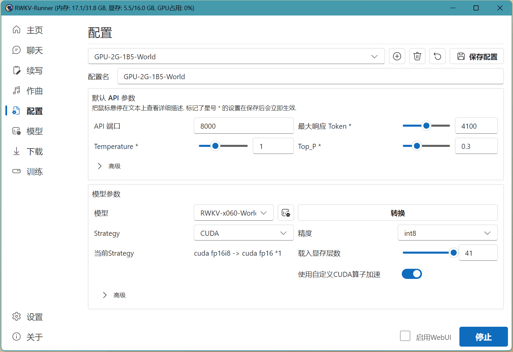
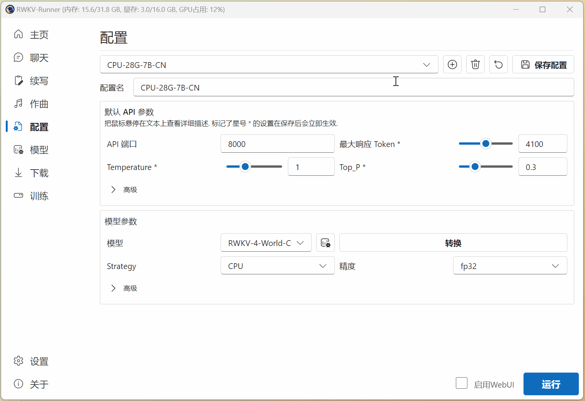
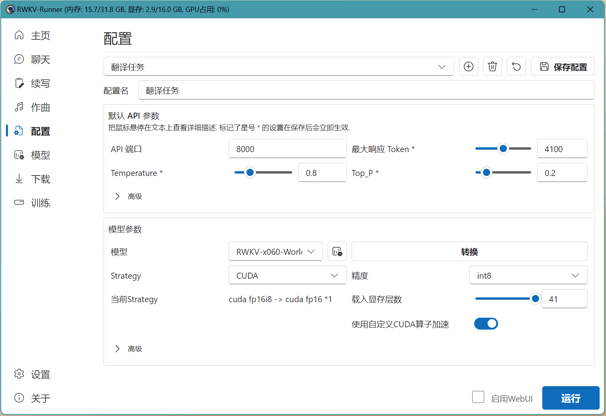
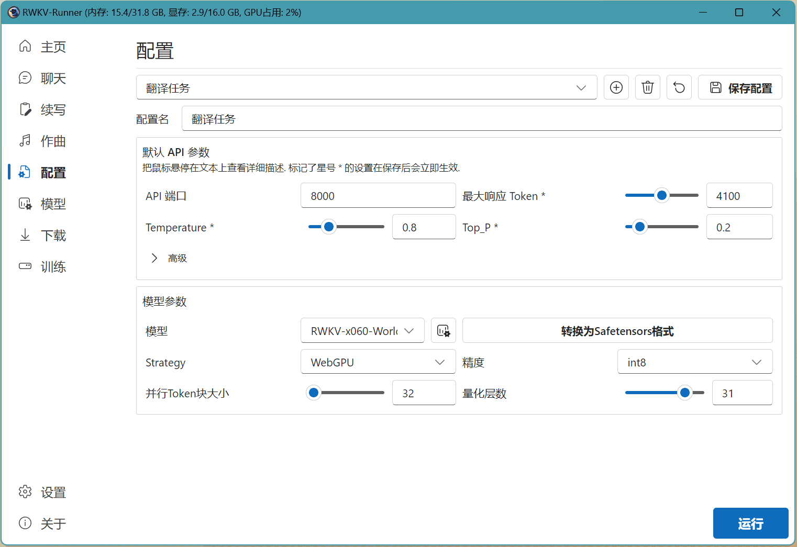
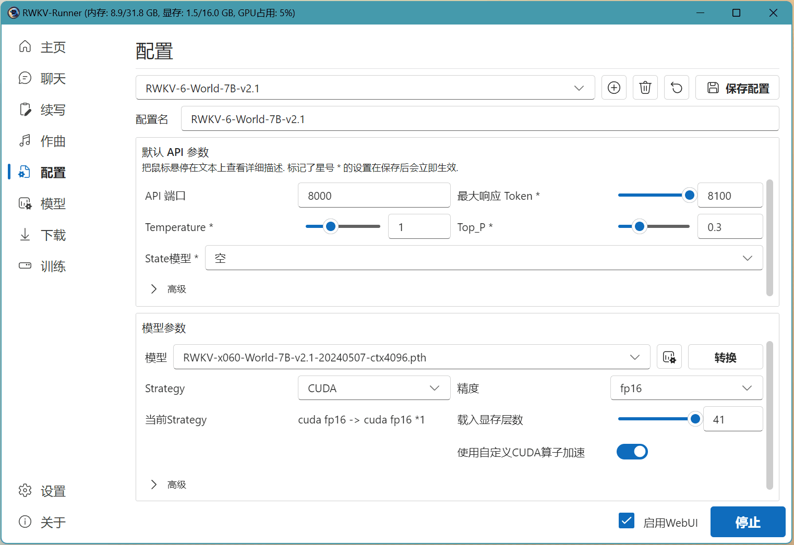
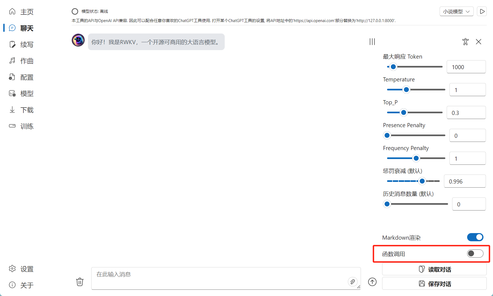
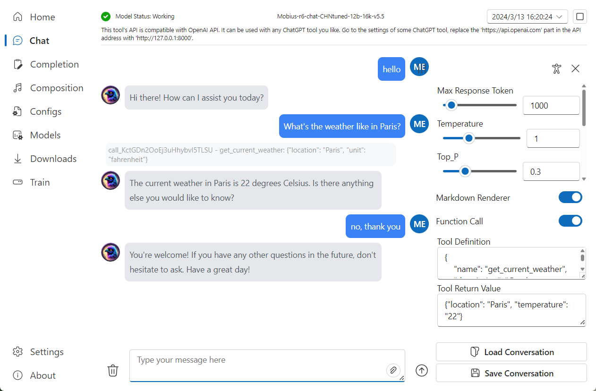

import { Callout } from 'nextra/components'
import { Tabs } from 'nextra/components'
import { Steps } from 'nextra/components'

## 什么是 Strategy 和量化


RWKV Runner 支持很多种 `Strategy` 参数，`Strategy` 决定了模型的加载方式，会影响模型的生成速度、准确性等用户体验。

`Strategy` 参数需要根据你的显卡类型调整，总体可以分为以下几类：

- 如果你是 NVIDIA 显卡，建议选择 CUDA 。
- 如果你是**性能适中**的 AMD / Intel 或其他显卡（包括核显），建议选择 WebGPU / WebGPU(python)。
- 如果你是**老掉牙**的核显，但 CPU 还算给力，建议选择 CPU（rwkv.cpp）。
- 如果你的设备年龄和你差不多，建议放弃本地部署，移步 [HF 在线 DEMO](https://huggingface.co/spaces/BlinkDL/RWKV-Gradio-2)。

量化则是使用不同的数据精度进行推理，RWKV 的默认训练精度是 BF16，推理精度是 FP16。

当你的显存和内存不足时，可以使用 INT8 / NF4 量化运行 RWKV 模型推理，以降低显存和内存需求。

<Callout type="info" emoji="ℹ️">
从回答质量来说，同参数的模型 FP16 回答质量最好，INT8 与 FP16 质量相当，NF4 回答质量相比 INT8 较明显地降低。
</Callout>

### 不同 `Strategy` 的显存需求和生成速度

<Callout type="info" emoji="ℹ️">
测试环境：

- CPU ：i7-10870H
- GPU： RTX 3080 Laptop ，16G 显存
- 内存：32GB
</Callout>

<Tabs items={['不同 Strategy 的显存需求', '不同 Strategy 的生成速度']}>
  <Tabs.Tab>
以下是 RWKV Runner 所有 Strategy 和对应量化方式（默认量化所有层）的显存/内存需求：

| Strategy | 1B6显存 | 3B显存 | 7B显存 | 14B显存 |
| --- | --- | --- | --- | --- |
| CPU-FP32 | 6.6G内存 | 12GB内存 | 21G内存 | OOM（不建议使用） |
| rwkv.cpp-FP16 | 3.5G内存 | 7.6GB内存 | 15.7G内存 | 30GB（内存） |
| rwkv.cpp-Q5_1 | 2GB内存 | 3.7GB内存 | 7.2GB内存 | 12.4GB（内存） |
| CUDA-FP16 | 3.2GB | 6.2GB | 14.3GB | 约31G |
| CUDA-INT8 | 1.9G | 3.4GB | 7.7GB | 15GB |
| webgpu-FP16 | 3.2GB | 6.5GB | 14.4GB | 约31G |
| webgpu-INT8 | 2GB | 4.4GB | 8.2GB | 16G（量化41层，60层约14.8GB） |
| webgpu-NF4 | 1.3GB | 2.6GB | 5.2GB | 15.1G（量化41层，60层约10.4GB） |
| webgpu(python)-FP16 | 3GB | 6.3GB | 14GB | 约30G  |
| webgpu(python)-INT8 | 1.9GB | 4.2GB | 7.7GB | 15GB（量化41层） |
| webgpu(python)-NF4  | 1.2GB | 2.5GB | 4.8GB | 14.3GB（量化41层） |
  
  </Tabs.Tab>
  <Tabs.Tab> 
  不同  Strategy  的生成速度（TPS，约等于每秒多少字）：

| Strategy | 1B6生成速度 | 3B生成速度 | 7B生成速度 | 14B生成速度 |
| --- | --- | --- | --- | --- |
| CPU-FP32 | 4.36 | 2.3 | 极慢 | OOM（不建议使用） |
| rwkv.cpp-FP16 | 8.6 | 4.5 | 2 | 1 |
| rwkv.cpp-Q5_1 | 14 | 8 | 3.7 | 2.1 |
| CUDA-FP16 | 25 | 18 | 15 | OOM，无法测试 |
| CUDA-INT8  | 22 | 16 | 18 | 7.4 |
| webgpu-FP16 | 45 | 38 | 21 | OOM，无法测试 |
| webgpu-INT8  | 60 | 44 | 30 | 18 |
| webgpu-NF4  | 60 | 47 | 34 | 20 |
| webgpu(python)-FP16 | 40 | 29 | 17 | OOM，无法测试 |
| webgpu(python)-INT8  | 45 | 35 | 23 | 15 |
| webgpu(python)-NF4  | 43 | 32 | 21 | 18 |
  </Tabs.Tab>
  <Tabs.Tab> **Yarn** 123 </Tabs.Tab>
</Tabs>


### 不同 `Strategy` 的优劣势对比

- **CPU**: **兼容性最强**，所有设备都能跑，支持所有 RWKV 系列模型，但速度很慢。
- **CPU(rwkv.cpp)**: 更快的 CPU 模式，比普通 CPU 模式快几倍。**所有设备都能跑**，且能以 Q5_1 量化在极低内存占用下运行。但是使用前要先将 .pth 后缀转换成 GGML 模型，目前不支持 RWKV 音乐模型（MIDI/ABC）。
- **CUDA**: 仅 NVIDIA 显卡可用的模式。支持显卡加速，支持所有 RWKV 系列模型。如果开启自定义算子加速，那么拥有最快的预处理速度，提交上万字的文本都能几乎秒出回答。但是自定义算子加速只支持 10 系及以上的 N 卡。
- **WebGPU**: 内存占用最低，**推理速度最快**，且具有并发推理支持。几乎支持所有显卡进行硬件加速，并支持 NF4 量化以获得最低的显存占用。但使用前需要先转换模型，并且目前仅支持 World 系列文本模型，无法开启 runner 内置的 Webui 。
- **WebGPU(Python)**: 同样**推理速度最快**的模式，并且**支持所有 RWKV 系列模型**，几乎支持所有显卡进行硬件加速，**支持 NF4 量化**获得最低的显存占用。但使用前需要先转换模型。
- **自定义**: 最灵活的模式，可以自由指定每层神经网络所用的设备，可以混合 cpu 和显卡推理，还能将网络分配在多张显卡上推理，也可以部分载入神经网络，除了 cuda 也能指定 dml 和 mps 等后端。**但不推荐新手使用，使用前请确保你是资深大语言模型玩家，具备充足的神经网络知识。**

### `Strategy` 参数便捷对照表

| Strategy 类型 | 显卡类型 | 支持的 RWKV 版本 | 使用的模型格式 | 支持的模型类型 | 速度参考 |
| --- | --- | --- | --- | --- | --- |
| CPU | 所有显卡 | 所有版本| PyTorch（`.pth`） | World/MIDI/ABC | ⭐⭐ |
| CPU（RWKV.cpp） | 所有显卡 | 暂不支持RWKV-6 | GGML（ `.bin` ） | World | ⭐⭐⭐ |
| CUDA | 仅支持NVIDIA显卡 | 所有版本 | PyTorch( `.pth` ) | World/MIDI/ABC | ⭐⭐⭐⭐ |
| WebGPU | 所有显卡 | 所有版本 | Safetensor( `.st` ) | World | ⭐⭐⭐⭐⭐ |
| WebGPU(python) | 所有显卡 | 所有版本 | Safetensor( `.st` ) | World/MIDI/ABC | ⭐⭐⭐⭐⭐ |


## RWKV Runner 配置参数对照表

在 RWKV Runner 的配置页面，可修改预设模型配置的参数，或点击 + 号添加**自定义的模型配置**。



如果说预设模型配置像餐厅提前准备好的食物套餐，那么自定义模型配置就像是自助餐，你可以随意调整与 RWKV 模型推理相关的各类参数。

<Callout type="warning" emoji="⚠️">
**请记住：针对每项参数的调整，都将影响 RWKV 模型最终的生成效果。**
</Callout>

**以下是 RWKV Runner  每项参数的作用和推荐的值，请认真阅读：**

### 解码 / api 参数

**自定义模型配置的模型解码 / api 参数说明，及其调整效果：**

| API 参数| 效果描述                                                                                                          
|----|----|
| API 端口 | RWKV Runner 所使用的本地端口，打开后可打开以下地址查看 API 文档： [http://127.0.0.1:8000/docs](http://127.0.0.1:8000/docs)。    |
| 最大响应 Token| 默认情况下，单个回复最多回答的 token 数量  |
| Temperature | 采样温度，就像给模型喝酒，数值越大随机性越强，更具创造力，数值越小则越保守稳定。                                             |
| Top_P | 就像给模型喂镇静剂，优先考虑前 n% 概率质量的结果。如设置成 0.1 则考虑前 10%，生成内容质量更高但更保守。如设置成 1，则考虑所有质量结果，质量降低但更多样。 |
| Presence Penalty | 存在惩罚，正值根据“新 token 在至今的文本中是否出现过”来对其进行惩罚，从而增加了模型涉及新话题的可能性。|
| Frequency Penalty| 频率惩罚，正值根据“新 token 在至今的文本中出现的频率/次数”来对其进行惩罚，从而减少模型原封不动地重复相同句子的可能性。|
| 惩罚衰减（建议默认）| 惩罚衰减系数越高，会减轻对重复内容的惩罚。模型在生成新 token 时，对先前出现的词或短语的“惩罚”更轻，可能导致内容重复、创造性降低，但会提高连贯性。|
|全局惩罚| 生成响应时，是否将提交的 prompt 也纳入到惩罚项。如果你发现生成结果出现重复，开启此项有助于避免生成重复内容。|

### 模型加载参数

下为自定义模型配置的**模型参数**说明，及其调整效果。

| 模型参数  | 描述 |
|-----|-------|
| 模型 | 选取一个本地模型，通常根据不同的任务类型选取对应的模型。|
| 模型转换 | 用于转换模型，使用转换过的模型能大大提升载入速度，但是转换后的模型无法再修改模型参数。|
| Strategy| 指驱动模型的方法，NVIDIA 显卡选 CUDA，其他类型的显卡建议选取 CPU 或 WebGPU。|
| 精度 | 深度学习的数据类型，fp16 质量更好，NF4 质量略微下降，但显存占用更低。|
| 载入显存层数 | 载入显存的神经网络层数，载入越多速度越快，但显存消耗越大（如果你的显存不够，会载入失败）。|
| 使用自定义 CUDA 算子加速 | 开启这个选项能提升推理速度并节省显存，但可能存在兼容性（回复乱码）问题。如果发生相关问题，请关闭此选项或更新你的显卡驱动。 |
|并行 Token 块大小  | 单次最多可以并行处理的 token 数量。对于高端显卡，可以设置成 64 或 128，使生成速度变得更快。|
| 量化层数 | 神经网络以当前精度量化的层数。量化层数越多，占用的显存越低，但质量会相应下降。                             |


## 自定义模型配置示例

下面以使用 RWKV-6 1.6B 模型执行翻译任务为例，演示自定义模型配置的过程：

<Steps>
### 选择或新建一项配置
 
点击 + 号，新建一项配置，并参考对照表调整各项 API 参数：



由于是不需要创造力的翻译任务，我们稍微调低了 Temperature 和 Top_P 两项参数，使翻译的结果更准确。
 
### 调整模型参数
 
在这一步，我们选择了一个 RWKV-6 1.6B 参数的 World 模型。

由于当前设备是 AMD 的核显，无法使用 CUDA 驱动模型。因此我们在 Strategy 选项中选择了 “WebGPU(python)”。

由于 WebGPU(python)模式只支持 Safetensors 格式。因此，我们需要点击 Runner 的“转换”弹框，将 `.pth` 后缀的官方 RWKV 模型转换为 `.st` 后缀的模型格式。



### 运行转换后的模型

耐心等待模型转换完成后，我们再次点击“模型”选项，选择转换完成后的 `.st` 模型，并点击运行。



等待模型加载完毕，即可开始聊天！

</Steps>

<Callout emoji="✨">
 Tips: 如果选择了 CPU（rwkv.cpp），则转换过后的模型会带有类似 fp16.bin 的后缀。
</Callout>

--- 

## RWKV Runner 的进阶功能

### 搭载 state 文件 

state 文件需要配合基底 RWKV 模型，才能发挥其效果。在 RWKV Runner 中，你可以按照以下步骤使用 state 文件：

- 启动一个 RWKV 模型
- 在配置页面选择与模型尺寸对应的 state 
- 点击`保存配置`按钮。

点击保存后即可实时更新 state ，无需重新启动 RWKV 模型。

在下图的示例中，我们已经启动了 RWKV-6-7B-World 模型。那么我们只需在 RWKV Runner  的配置页面，选择基于 RWKV-6 7B 的 state 文件（名称中带有 `x060 | 7B` 字段），然后点击 `保存配置` 按钮。




### Function Call 功能

RWKV Runner 在 1.8.7 版本引入了 Function Call 函数调用功能。

<Callout type="info" emoji="ℹ️">
Function Call 是指在模型推理过程中能够识别特定的指令，并触发外部函数来执行某些操作。

Function Call 使得模型不仅可以生成文本，还能够在特定情况下调用外部 API、执行计算、或者从外部源获取实时信息，然后将这些结果整合到响应文本中。
</Callout>

<Callout type="warning" emoji="⚠️">
RWKV 基底模型无法使用 Function Call 功能，请使用社区微调的 [Mobius-RWKV-r6-12B](https://huggingface.co/TimeMobius/Mobius-RWKV-r6-12B/tree/main) 模型。
</Callout>

要使用 RWKV Runner 的 Function Call 功能，请先打开图中的开关：



打开函数调用开关后，你需要在 `工具定义` 框中定义一些可用的函数。定义的函数必须满足 [OpenAI tool](https://platform.openai.com/docs/api-reference/chat/create#chat-create-tools) 格式，参考：

```json copy
{
    "name": "get_current_weather",
    "description": "Get the current weather in a given location",
    "parameters": {
        "type": "object",
        "properties": {
            "location": {
                "type": "string",
                "description": "The city and state, e.g. San Francisco, CA"
            },
            "unit": {"type": "string", "enum": ["celsius", "fahrenheit"]}
        },
        "required": ["location"]
    }
}
```
此外，还需要在 `工具返回值` 框中填写返回的数据格式，参考：

```json copy
{"location": "Paris", "temperature": "22"}
```

填写完毕后，即可正常与 RWKV 模型对话。如果对话过程涉及可调用的工具，模型会自动调用合适的工具，并将调用结果整合到回答中：



### Function Call 的 Python 示例

以下 Python 代码指引你调用 RWKV Runner 的 api 适配 Function Call 功能：

```python copy
# https://platform.openai.com/docs/guides/function-calling

from openai import OpenAI
import json

client = OpenAI(
    base_url="http://127.0.0.1:8000", # 根据 RWKV Runner 的配置修改端口号
    api_key="test",
)

# 这是硬编码的虚拟函数示例，返回天气情况
# 在生产环境中，需要改成你的后台 API 或外部 API
def get_current_weather(location, unit="fahrenheit"):
    """Get the current weather in a given location"""
    if "tokyo" in location.lower():
        return json.dumps({"location": "Tokyo", "temperature": "10", "unit": unit})
    elif "san francisco" in location.lower():
        return json.dumps(
            {"location": "San Francisco", "temperature": "72", "unit": unit}
        )
    elif "paris" in location.lower():
        return json.dumps({"location": "Paris", "temperature": "22", "unit": unit})
    else:
        return json.dumps({"location": location, "temperature": "unknown"})


def run_conversation():
    # 第 1 步：将对话和可用函数发送给模型
    messages = [
        {
            "role": "user",
            "content": "What's the weather like in Paris?",
        }
    ]
    tools = [
        {
            "type": "function",
            "function": {
                "name": "get_current_weather",
                "description": "Get the current weather in a given location",
                "parameters": {
                    "type": "object",
                    "properties": {
                        "location": {
                            "type": "string",
                            "description": "The city and state, e.g. San Francisco, CA",
                        },
                        "unit": {"type": "string", "enum": ["celsius", "fahrenheit"]},
                    },
                    "required": ["location"],
                },
            },
        }
    ]
    response = client.chat.completions.create(
        model="gpt-4o",
        messages=messages,
        tools=tools,
        tool_choice="auto",  # 不存在任何工具时，默认值 none。如果存在工具，则 auto 是默认值
    )
    response_message = response.choices[0].message
    tool_calls = response_message.tool_calls
    # 第 2 步：检查模型是否想要调用函数
    if tool_calls:
        # 第 3 步：调用函数
        # 注意：JSON 响应不一定生效；请务必处理错误情况
        available_functions = {
            "get_current_weather": get_current_weather,
        }  # 本示例中只有一个函数，实际可以有多个
        messages.append(response_message)  # 用 assistant 的回答扩展对话
        # 第 4 步：向模型发送每个函数调用和函数响应的信息
        for tool_call in tool_calls:
            function_name = tool_call.function.name
            function_to_call = available_functions[function_name]
            function_args = json.loads(tool_call.function.arguments)
            function_response = function_to_call(
                location=function_args.get("location"),
                unit=function_args.get("unit"),
            )
            messages.append(
                {
                    "tool_call_id": tool_call.id,
                    "role": "tool",
                    "name": function_name,
                    "content": function_response,
                }
            )  # 通过函数响应扩展模型的对话内容
        second_response = client.chat.completions.create(
            model="gpt-4o",
            messages=messages,
        )  # 从模型中获取新的响应，在模型中可以看到函数响应
        return second_response.choices[0].message.content


print(run_conversation())
```

## 🌐 服务器部署[#server-dev]

<Callout type="error" emoji="️🚫">
在Linux系统下, RWKV Runner 无法调用终端自动安装依赖, 你必须遵循以下步骤进行安装, 之后方可正常使用。
</Callout>

以下是一份简易的 Linux 服务器部署示例：

### 下载与安装

1. 在你的服务器中选择一个空的目录，然后执行以下语句，将 RWKV Runner 克隆到服务器中：
``` bash copy
git clone https://github.com/josStorer/RWKV-Runner
```

2. 进入 RWKV-Runner 目录，执行以下命令，安装项目所需的依赖：

```bash copy
cd RWKV-Runner 
sudo apt install python3-dev # 以 root 权限安装 python3-dev
chmod +x ./RWKV-Runner # 更改文件模式（权限）为可执行文件
./RWKV-Runner # 运行 RWKV Runner 
cd backend-python 
pip3 install -r requirements.txt # 也可以运行 pip3 install -r requirements_without_cyac.txt
```

3. 下载 RWKV-6 模型

在 RWKV Runner  目录运行以下命令下载 RWKV-6 系列模型，并将模型文件放置在 `RWKV-Runner/models` 目录下：

``` bash copy
mkdir models # 创建 models 文件夹
wget -N https://huggingface.co/BlinkDL/rwkv-6-world/resolve/main/RWKV-x060-World-1B6-v2.1-20240328-ctx4096.pth -P models/
```

请在 [RWKV 模型下载](https://rwkv.cn/RWKV-Wiki/Model-Download)页面，查看所有可用的 RWKV 模型下载链接。

### 启动推理和 Web 服务

1. 启动后端推理服务

如需启动后端推理服务，请执行以下命令:
``` bash copy
python ./backend-python/main.py
```

注意，main.py 默认使用 RWKV pip 库，支持 `CUDA` 和 `CPU` 两种推理 Strategy 。

如需以 rwkv.cpp 或 webgpu 两种 Strategy 进行推理，请带上对应的参数：

``` bash copy
python ./backend-python/main.py --rwkv.cpp # 以 rwkv.cpp 模式推理
python ./backend-python/main.py --webgpu 
```

服务启动后，可调用 `/switch-model` API 载入模型，参考 RWKV Runner [API 指南](https://rwkv.cn/RWKV-Runner/API-Usage#switch-model)或 API 文档：http://127.0.0.1:8000/docs 。

2. 如需启动前端服务，请执行以下命令：
``` bash copy
cd RWKV-Runner/frontend
npm ci
npm run build #编译前端
cd ..
python ./backend-python/webui_server.py #单独启动前端服务
```

3. 如需同时启动前后端服务，请执行以下语句：
``` bash copy
python ./backend-python/main.py --webui #同时启动前后端服务
```

4. 如需查看帮助参数，请执行：
``` bash copy
python ./backend-python/main.py -h
```

所有可用的 Web API 请参考：[RWKV Runner API 指南](https://rwkv.cn/RWKV-Runner/API-Usage)。


更详细的服务器部署案例请在此查看：https://github.com/josStorer/RWKV-Runner/tree/master/deploy-examples

<Callout type="warning" emoji="⚠️">
注意：如果你正在部署并对外提供公开服务，请通过 API 网关限制请求大小，避免过长的 prompt 提交占用资源。此外，请根据你的实际情况，限制请求的 max_tokens 上限，因为默认le = 102400，可能导致极端情况下单个响应消耗大量服务器资源。
</Callout>
