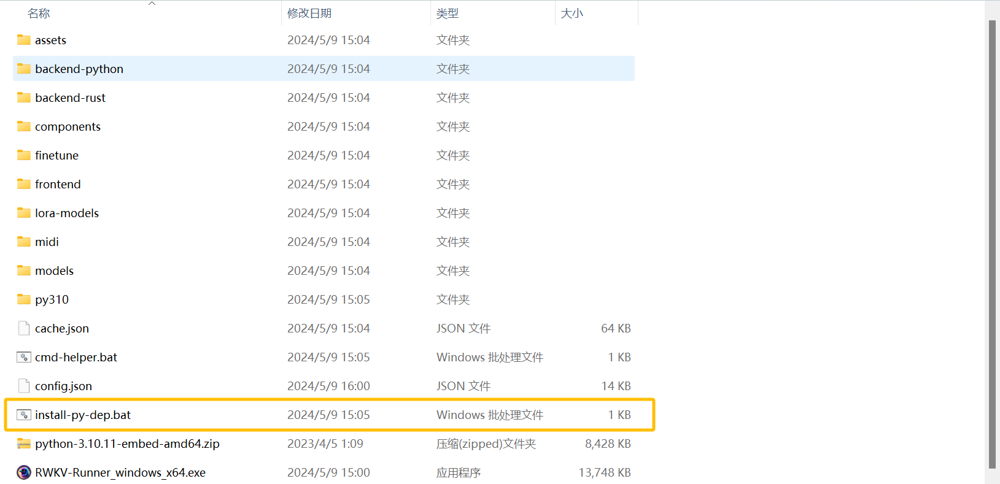
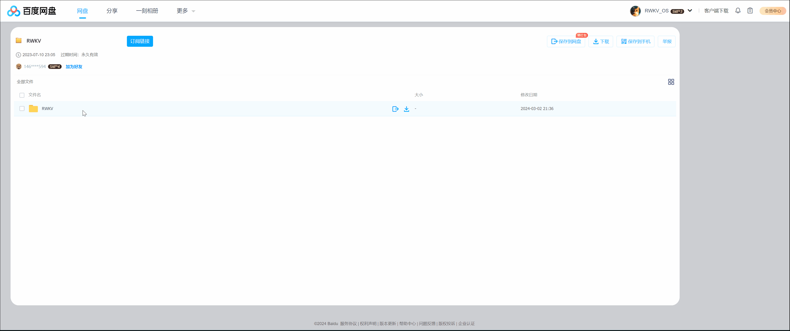

import { Callout } from 'nextra/components'
import { Steps } from 'nextra/components'

## 配置和运行问题

### 我的 Nvidia 显卡可以正常使用，但是开启自定义 CUDA 算子加速会报错

检查 `py310\\Lib\\site-packages` 目录下，是否有 `torch-1.13.1+cu117.dist-info` 这个文件夹。

如果没有，往往可能是装了 `torch-2.0.x` ，请删除现有的 torch 目录，并删除 RWKV Runner.exe 所在目录的 `cache.json` 文件。然后运行 RWKV Runner，让它自己重新安装依赖。

---
### Torch not compiled with CUDA enabled

解决方法和上面一样。

---
### 我使用 7B 或更大参数的 RWKV 模型，运行不成功或速度太慢。

如果选择 CUDA - fp16 加载方式， 7B 模型需要 15G 显存，14B 需要 30G 显存。

如果你的设备性能不佳（如内存 16 GB 或显存 8G 或者更低），在体验 7B 或更大规模的模型时，请尝试将模型参数的 Strategy 选项改为 WebGPU (Python)，精度改为 nf4 。

更换 Strategy 选项后需要点击 `转换模型`，选择转换后的 .st 格式模型，保存配置并重新运行。详情可参考 [自定义模型配置](https://rwkv.cn/RWKV-Runner/Advanced-Usage#%E8%87%AA%E5%AE%9A%E4%B9%89%E6%A8%A1%E5%9E%8B%E9%85%8D%E7%BD%AE%E7%A4%BA%E4%BE%8B)

---

### 启动提示: 切换模型失败 - 自定义CUDA算子开启失败XXXX

这个问题大概率是因为 RWKV Runner 的 python 依赖项出现错误，有几种方法可以帮助你解决这个问题: 

**方法1**

双击 RWKV Runner 文件夹的的 `install-py-dep.bat` 脚本，让它重新下载 python 依赖项, 先前下载时可能由于网络问题意外中断了。



**方法2**

下载[百度网盘的懒人包](https://pan.baidu.com/s/1zdzZ_a0uM3gDqi6pXIZVAA?pwd=1111)， 懒人包有完整的 Python 依赖。 

<Callout type="warning" emoji="⚠️">
注意：网盘的 `RWKV` 文件夹内有一个名字里写了"懒人包"的 zip 压缩文件, 只需要下载并解压这个文件即可。
</Callout>



**方法3**

如果你的显卡较旧, 那么请在"配置"页面, 关闭"使用自定义CUDA算子加速"

---
### 模型输出的内容乱码

请更新显卡驱动,。如果无法解决问题请打开 Runner 配置页，关闭配置页`自定义 CUDA 算子加速`。

---
### 为什么使用 webgpu 模式的配置页没有 state 选项？

RWKV Runner 只有 Cuda 模式（NVIDIA 显卡）支持挂载 state。

非 NVIDIA 显卡需要使用 [Ai00](https://rwkv.cn/ai00/Introduction) 才能搭载 State 文件。

## 开发和部署问题

---

###  RWKV Runner 是否可以作为其他 LLM API 的前端使用？

可以，兼容 OpenAI API 格式即可。

---

### 三方应用 API 接口调用报错

同样删除 cache.json，重启拉取最新 API 程序，检查下载列表，等待完成。

一个典型的调用 API 的示例是打开浏览器控制台，粘贴执行以下代码，应该能看到输出回答：
``` js copy
fetch("http://127.0.0.1:8000/chat/completions", {

  method: "POST",

  headers: { "Content-Type": "application/json" },

  body: JSON.stringify({ messages: [{ role: "user", content: "你好" }] }),

})

  .then((r) => r.json())

  .then(console.log);
```
---

### 软件自动更新下载不动，想要手动下载覆盖，正确操作姿势

如果你希望同时拉取最新相关依赖，请删除 cache.json，然后启动新版本的 exe 文件。

如果你在离线环境部署，请保留 cache.json，或至少自己新建一个空的 cache.json文件，避免拉取最新依赖。

---

### 内网离线环境更新 python API

与上述问题一样，参考该 Issue ：[https://github.com/josStorer/RWKV-Runner/issues/18](https://github.com/josStorer/RWKV-Runner/issues/18)，手动下载并放置到目录中。

---

### 点击安装依赖后，几个黑窗一闪而过

请检查下载列表所有内容是否都已经下载完毕，下载完毕后再点击安装依赖。

- 如果下载列表有未完成的下载任务，请手动点一下继续。
- 如果下载列表是空的，说明本地文件都正常，可以安装依赖。

如果始终下载不动，可以自己前往 github 手动下载，参考这个链接：https://github.com/josStorer/RWKV-Runner/issues/18

---

### python 依赖无法下载，可不可以手动下载

下载 github 仓库的 `/backend-python` 目录：
``` bash copy
https://github.com/josStorer/RWKV-Runner/tree/master/backend-python
```
下载完成放进 RWKV Runner 所在的文件夹。

然后下一个 `get-pip.py`  ：
``` bash copy
https://cdn.jsdelivr.net/gh/pypa/get-pip/public/get-pip.py
```

将其放进 backend-python 目录。

---

### Microsoft Store 下载软件超时

将 DNS 服务器手动设置为 4.2.2.2 和 4.2.2.1，确定后重试。

**⚠️ 注意**，下载完成后，请务必将 DNS 服务器改回之前的设置，否则可能影响网络连接。

---

