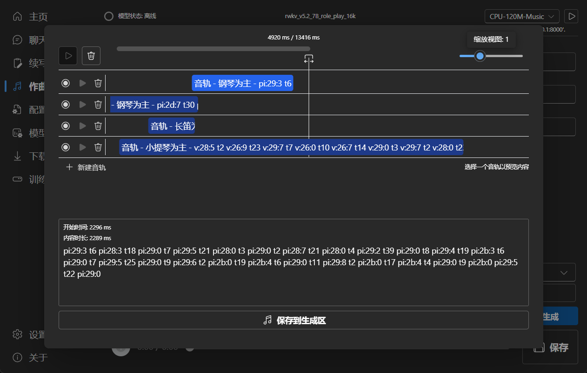

RWKV Runner 是 RWKV 模型的管理和启动工具，由 RWKV 开源社区成员 [josStorer]() 开发，它本身也是一个开源软件，且体积仅 10MB 左右（不含依赖项）。

RWKV Runner 仓库地址：https://github.com/josStorer/RWKV-Runner

用户可使用 RWKV Runner 轻松运行本地 RWKV 模型，体验各类 AI 功能，包括但不限于聊天、写作、作曲交互等。

## 👀 功能预览

RWKV runner 可提供基于 RWKV 模型的聊天、写作、作曲三项基础功能。

如果你不知道如何提示 RWKV 模型，才能让它更好地完成某项任务。可以从以下途径获得 RWKV-Prompts（提示词）参考：

1. 参考我们整理的 RWKV-Prompts（提示词）示例，地址：https://shoumenchougou.github.io/Awesome-RWKV-Prompts

2. 加入 RWKV 企鹅群 ：224287095 ，在群里提问（请附上任务文本）

### 聊天功能

软件提供了开箱即用的聊天功能，你可以与 AI 畅聊、提出问题并获取建议。

### 写作功能

写作功能可根据你提供的文本内容作进一步的续写、翻译等任务。

### 作曲功能

作曲功能可提供基于 MIDI 格式的乐谱创作、续写等功能，同时为生成的乐谱提供播放功能。

MIDI（Musical Instrument Digital Interface）是一种音乐数字化协议，它不传输录制的声音，而是使用标准化的数据格式来描述各种音乐元素，例如音符音调信息、旋律、节奏、声音效果等等。

