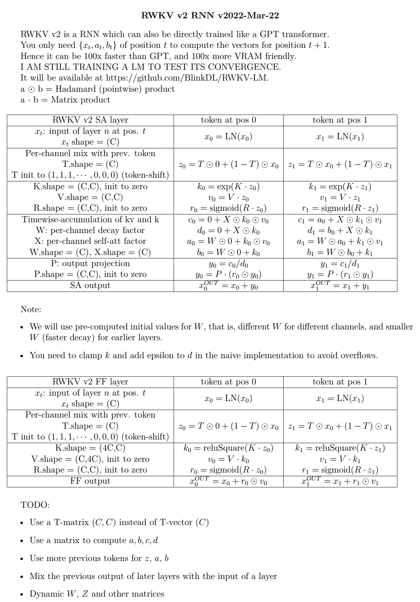

import { Callout } from 'nextra/components'
import { Steps } from 'nextra/components'

以下是 RWKV 架构相关的知识：

## RWKV 架构的发展历程

2020 年，BlinkDL 开始研究 Transformer ，立刻发现其有两个明显的改进方向：引入显式 decay 和 Token-shift（或者说短卷积）。在 **https://github.com/BlinkDL/minGPT-tuned** 上测试后，发现这些技巧对于 Transformer 的性能有显著提升。

随后，他注意到 Apple 的 [**Attention Free Transformer**](https://arxiv.org/abs/2105.14103) （AFT）论文并对其进行测试，发现这两种技巧也为 AFT 带来了显著的性能提升。


### RWKV-V1

2021 年 8 月，RWKV 架构的初版：RWKV-V1 被提交到 [**RWKV-LM 仓库**](https://github.com/BlinkDL/RWKV-LM) 中。RWKV-V1 [**首次 commit**](https://github.com/BlinkDL/RWKV-LM/commit/4c6db5607c6f94c38c10004efb292510bc71ba59) 于 2021 年 8 月 9 日。

RWKV-V1 使用长卷积代替 Attention 机制，其架构由交替的 Time-mix 和 Channel-mix 组成。**Channel-mix 是 Transformer 的 GeGLU 层的变种。Time-mix 则是对于 AFT 的显著改进**：

$$\text { Time-mix }: \mathbf{TM}_{t, c}=\operatorname{sigmoid}\left(R_{t, c}\right) \cdot \sum_{u} W_{t, u, c} \cdot \operatorname{softmax}_{t}\left(K_{u, c}\right) \cdot V_{u, c}$$

$$\text { Channel-mix } \mathbf{CM}_{t, c}=\operatorname{sigmoid}\left(R_{t, c}\right) \cdot \sum_{d} W_{c, d} \cdot \operatorname{gelu}\left(K_{t, d}\right) \cdot V_{t, d}$$

其中 $R$ 、 $K$ 、 $V$ 由输入线性变换生成，$W$ 则是长卷积中的卷积核。

<Callout type="info" emoji="ℹ️">
Time-mix 和 Channel-mix 的结构设计均基于 $R$ 、$W$ 、 $K$ 、 $V$ 四个主要参数，这便是 **RWKV** 这个名称的由来。
</Callout>

<Callout type="warning" emoji="✨">
RWKV-V1 更接近 Linear Transformer 而非 RNN ，因为其每一个时间步都依赖于历史时刻所有的输入。
</Callout>

### RWKV-V2-RNN

RWKV-V2 版本首次为 RWKV 实现了 RNN 模式，伪代码图如下：



**代码图的补充说明：**

- a 和 b 是 kv 和 k 的 EMA（exponential moving average）
- c 和 d 是 a 和 b 加上纯 self-attention 效应（原地的自己对自己的注意力）
- c / d 是记忆机制，因为如果某个字在某个通道的 k 很强，且 W 接近 1，那么这个字就会被后文记住
- $T$, $K$, $V$, $R$, $W$, $X$, $P$ 都是可以训练的参数
- $W$ 使用预计算的值进行初始化，与 Alibi（Attention with Linear Biases）有类似之处，但都是可训练的非固定值，且在每个通道都可以不同，表达能力显著提高。
- **发明了一种 headQK 机制**，让模型可以直接从前文复制或避免生成某些字，这对于 ICL（in context learning） 很重要。几年后，其它研究者也发现了这一现象。但为了测试纯 RNN 的能力极限，RWKV 主线模型并未加入这一功能。

```python
q = self.head_q(x)[:,:T,:] 
k = self.head_k(x)[:,:T,:] 
c = (q @ k.transpose(-2, -1)) * (1.0 / 256)
c = c.masked_fill(self.copy_mask[:T,:T] == 0, 0)
c = c @ F.one_hot(idx, num_classes = self.config.vocab_size).float()       
x = self.head(x) + c
```

<Callout type="warning" emoji="✨">
通过指数衰减（exponential decay），RWKV-V2 实现了 RNN 形式的推理：模型每次生成都依赖于上一个时刻的输入和当前时刻的输入，同时拥有固定大小的隐藏状态（在 RWKV-V2 里是 a 和 b）。
</Callout>

RWKV-V2 的自注意力层简化表达：

$$
x_{t+1} = \sigma(Rx_t) \cdot \frac{\exp(Kx_t) \cdot (V_xt) + \exp(W) \cdot a_t }{ \exp(Kx_t) + \exp(W) \cdot b_t }
$$

### RWKV-V3

RWKV-V3 是一个短期的过渡版本，其相对 RWKV-V2 使用更全面的 token-shift（对 SA 和 FF 层中的 R / K / V 分别使用不同的可训练 TimeMix 因子） :

```
xx = self.time_shift(x)
xk = x * self.time_mix_k + xx * (1 - self.time_mix_k)
xv = x * self.time_mix_v + xx * (1 - self.time_mix_v)
xr = x * self.time_mix_r + xx * (1 - self.time_mix_r)
```
RWKV-V3 对比 V2 的 token-shift 改进图示：


此外，这个版本使用 preLN 代替 postLN（更稳定，且收敛更快）：

```python
if self.layer_id == 0:
	x = self.ln0(x)
x = x + self.att(self.ln1(x))
x = x + self.ffn(self.ln2(x))
```


## 什么是经典 RNN 网络？/ 什么是隐藏状态？

RNN 即循环神经网络，是一种人工智能领域的神经网络模型。它在运行时使用一个隐藏状态（state），这一隐藏状态由特定函数持续更新。RNN 网络依次处理每一个输入的 token ，并在此基础上预测可能接续的下一个token（如果需要的话）。


每个 token 的处理又会被反馈到 RNN 网络中，进而更新其状态，并预测下一个 token。如此循环，直到达到“完成目标”的状态。这个隐藏的状态可以被视为 AI 模型的“心理状态”。

RWKV 可以被视为 RNN 的一个修改变种。RWKV 支持**微调这个隐藏状态**（state tuning），通过修改模型的“心理状态”，使模型更好地完成某类任务。

## RWKV 与经典 RNN 有何不同？

由于它们的顺序性质，传统的 RNN 需要完全处理一个 token 及其隐藏状态才能处理下一个，这使得它们很难并行化地用 GPUs 训练，训练大规模 RNN 语言模型变得非常困难。


RWKV 的并行化是 head-wise 和 channel-wise 的，也就是“逐头”和“逐通道”的。在 time mixing 每一层中，不同的头可以独立计算，在 channel mixing 中，不同的通道也可以独立计算，因此 RWKV 模型架构具有较好的并行性。

## 什么是通道/时间混合？用简单的话解释一下？

通道混合是一个过程，其中正在生成的下一个 token 与前一层的上一个状态输出混合，以更新这个“心理状态”。由于它不能从前一个迭代读取自己的通道混合层输出状态，通道混合中的信息只能通过层逐步向上流动——可以把这视为短期、精确的记忆的类比。

时间混合是一个类似的过程，但它允许模型保留部分先前的心理状态，使其能够选择并存储更长时间的状态信息，由模型决定。这是通过模型训练来实现的，如果它被训练为这样做，可能允许它无限期地保留过去的数据——可以把这视为长期、较低准确性记忆的类比。

因为当前 token 可以通过通道和时间混合的各种形式读取过去的状态数据，它提供了一个替代“注意力”模型的方式。关键信息存储在隐藏状态中（由模型权重决定），跨各个层与当前 token 对比，根据其训练应用各种效果。这有效地提供了一种“训练有素的注意力”，即过去 tokens（存储在隐藏状态中）对当前 token 的关注。

<Callout type="warning" emoji="💡">
上述是一个不准确的过度简化。
</Callout>

## RWKV 是如何工作的？/ 我想了解细节，我该去哪里找？

一个好的起点是查看 [RWKV 150 行代码](https://github.com/BlinkDL/ChatRWKV/blob/main/RWKV_in_150_lines.py)，它提供了 RWKV 核心概念的基本理解。

有关 RWKV-6 架构的代码解读，可以参考这篇博客：[介绍 RWKV-6 的模型设计，代码带注释](https://zhuanlan.zhihu.com/p/694593540) 。

或者，你可以通过阅读 RWKV 论文学习：

- [RWKV-4 架构论文 | arXiv（2305.13048）](https://arxiv.org/abs/2305.13048)
- [RWKV 5 /6 架构论文 | arXiv（2404.05892）](https://arxiv.org/abs/2404.05892)

如果你对基础有了掌握，可以开始在[RWKV 主仓库](https://github.com/BlinkDL/RWKV-LM)中研究 RWKV 的训练和 CUDA 代码。
