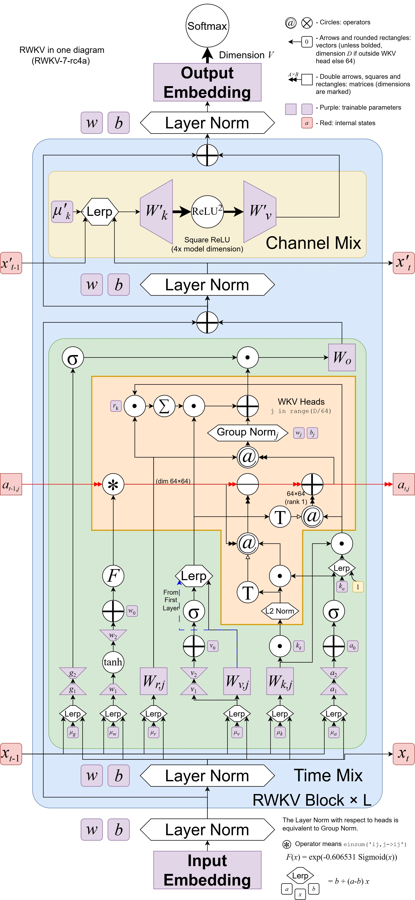

import { Callout } from 'nextra/components'
import { Steps } from 'nextra/components'
import { Tabs } from 'nextra/components'

RWKV（读作 RWaKuV）是一种具有 GPT 级大型语言模型（LLM）性能的 RNN，也可以像 GPT Transformer 一样直接训练（可并行化）。

RWKV 结合了 RNN 和 Transformer 的最佳特性：出色的性能、恒定的显存占用、恒定的推理生成速度、"无限" ctxlen 和免费的句嵌入，而且 100% 不含自注意力机制。

RWKV 项目最初由彭博（Bo Peng ，BlinkDL）提出，随着项目被外界关注，RWKV 项目逐渐发展成一个开源社区。

2023 年 9 月 20 日，RWKV 开源项目正式加入 Linux 开源基金会。如今的 RWKV 项目是一个开源的非盈利组织，隶属于 Linux 基金会，部分算力曾由赞助商支持。

## RWKV 架构和论文

RWKV 模型架构有 RWKV-4、RWKV-5（代号 Eagle）、RWKV-6（代号 Finch）、RWKV-7（代号 Goose） **四个正式版本**，更早以前的 RWKV 1/2/3 为实验版本。

<Tabs items={['RWKV-7 架构', 'RWKV-6 架构', 'RWKV-4 架构']}>
  <Tabs.Tab>

RWKV-7 架构是 RWKV 的最新版本，架构论文于 2025 年 3 月 18 日正式发布。

- **RWKV-7 论文**：RWKV-7 "Goose" with Expressive Dynamic State Evolution
- **论文地址**：[arXiv:2503.14456](https://arxiv.org/abs/2503.14456)

通过一系列创新（例如广义 Delta Rule），RWKV-7 在计算效率、任务表现和模型表达力全面超越 Transformer 和过去的 RWKV-6 架构。

在训练数据远低于 Qwen2.5、Llama3.2 等开源模型的前提下，RWKV-7-World 模型的**语言建模能力**在所有开源 3B 规模模型中达到 SoTA 水平。

通过引入广义 Delta Rule，RWKV-7 使用 **2 层即可实现 $NC^1$ 复杂度的 $S_5$ 状态跟踪问题**，**使用 4 层即可识别所有正则语言**，表达力显著超越了 Transformers 的 $TC^0$ 限制。

<Callout type="info" emoji="ℹ️">
有关 RWKV-7 论文的解读，可以参考[此文章](https://rwkv.cn/news/read?id=20250320)。
</Callout>

RWKV-7 架构图如下： 

</Tabs.Tab>
  <Tabs.Tab>
RWKV-5/6 两个架构在 RWKV-4 架构的基础上进行了若干改进。因此，这两个架构在同一篇论文中发布。

- **RWKV 5/6 论文**：《Eagle and Finch: RWKV with Matrix-Valued States and Dynamic Recurrence》
- **论文地址**：[arXiv:2404.05892](https://arxiv.org/abs/2404.05892)

<Callout type="info" emoji="ℹ️">
有关 RWKV-5/6 论文的解读，可以参考[此文章](https://rwkv.cn/news/read?id=382345)。
</Callout>

RWKV-6 架构图如下： 

<Callout type="info" emoji="ℹ️">
RWKV-6 架构图由 RWKV 社区开发者按照 CC-BY-SA 许可发布，可以在 [rwkv-wiki.fandom](https://rwkv.fandom.com/zh/wiki/RWKV-6%E6%9E%B6%E6%9E%84) 上找到原始版本。
</Callout>
</Tabs.Tab>
<Tabs.Tab>
RWKV-4 是 RWKV 模型的首个正式版本，论文由 RWKV 作者彭博和 RWKV 社区共同完成，初次发表于 2023 年 5 月 22 日。同年 10 月，RWKV-4 架构论文被顶级会议 [EMNLP 2023](https://2023.emnlp.org/program/accepted_findings/) 收录。

- **RWKV-4 论文**：《RWKV: Reinventing RNNs for the Transformer Era》
- **论文地址**：[arXiv:2305.13048](https://arxiv.org/abs/2305.13048)
</Tabs.Tab>
</Tabs>
## RWKV 模型的版本状态

从 RWKV-4 架构开始，RWKV 在每个架构版本都发布了多种参数规模的开源模型。

截至 2025 年 2 月，RWKV-4、RWKV-5 模型的生命周期已结束。推荐使用**最新的 RWKV-7-world 模型**。得益于最新的架构设计，RWKV-7 模型在所有任务上的表现都更好。

| 版本 | RWKV-V4 | RWKV-v5-Eagle | RWKV-v6-Finch | RWKV-v7-Goose |
| --- | --- | --- | --- | --- |
| 论文 | 🎓[论文已发布](https://arxiv.org/abs/2305.13048) | 🎓[论文已发布](https://arxiv.org/abs/2404.05892) | 🎓[论文已发布](https://arxiv.org/abs/2404.05892) | 🎓[论文已发布](https://arxiv.org/abs/2503.14456) |
| 总体状态 | **⚠ EOL** | **⚠ EOL**| **✨ 稳定版本** | **⚙️ 模型训练中** |
| 0.4B 模型 | ✅ 已发布 | ✅ 已发布 | ❌ 无计划 |✅ [已发布](https://modelscope.cn/models/Blink_DL/rwkv-7-world/files) |
| 1.5B 模型 | ✅ 已发布 | ✅ 已发布| ✅ [已发布](https://hf-mirror.com/BlinkDL/rwkv-6-world/blob/main/RWKV-x060-World-1B6-v2.1-20240328-ctx4096.pth) |✅ [已发布](https://modelscope.cn/models/Blink_DL/rwkv-7-world/files) |
| 3B 模型 | ✅ 已发布 | ✅ 已发布 | ✅ [已发布](https://hf-mirror.com/BlinkDL/rwkv-6-world/blob/main/RWKV-x060-World-1B6-v2.1-20240328-ctx4096.pth) |✅ [已发布](https://modelscope.cn/models/Blink_DL/rwkv-7-world/files) |
| 7B 模型 | ✅ 已发布 | ✅ 已发布| ✅ [已发布](https://hf-mirror.com/BlinkDL/rwkv-6-world/blob/main/RWKV-x060-World-7B-v2.1-20240507-ctx4096.pth) |**📅 计划训练** |
| 14B 模型 | ✅ 已发布 | ❌ 无计划 | ✅ [已发布](https://hf-mirror.com/BlinkDL/rwkv-6-world/blob/main/RWKV-x060-World-14B-v2.1-20240719-ctx4096.pth) |**📅 计划训练** |
| MoE 模型 | ❌ 无计划 | ❌ 无计划 | ❌ 无计划 | ❌ 无计划 |

## 我应该使用哪些 RWKV 模型？

<Callout type="warning" emoji="⚠️">
由于老旧架构导致的性能问题， RWKV-5、RWKV-4 全系列（Raven / World / Pile ...）和更早的 RWKV 版本均已结束生命周期，现有模型仅作为存档。
</Callout>

**请使用 RWKV-7 系列模型**，RWKV-7 模型基于最新的 RWKV-7 架构和最新的数据集，因此性能更强。

由于 RWKV-7 7B 及更大的模型正在训练中，因此对于 7B 及更大参数的模型，推荐使用 [RWKV-6-World-14B-V2.1](https://hf-mirror.com/BlinkDL/rwkv-6-world/blob/main/RWKV-x060-World-14B-v2.1-20240719-ctx4096.pth) 模型；如果你的硬件配置不足以使用 14B 参数模型，可以考虑使用 [RWKV-6-World-7B-V3](https://hf-mirror.com/BlinkDL/rwkv-6-world/blob/main/RWKV-x060-World-7B-v3-20241112-ctx4096.pth) 模型。

<Callout type="info" emoji="ℹ️">
RWKV-7-World 7B/14B 完成训练后，将代替现有的 RWKV-6-World 7B/14B 模型。
</Callout>

请查看[本地部署 RWKV 模型的显存需求](https://rwkv.cn/RWKV-Wiki/How-To-Play#vram-of-rwkv)，以确认**你的显卡可以使用哪一款 RWKV 模型**。

## RWKV 与 Transformer 的差异

### 优势

- 运行和训练时资源使用更低（VRAM、CPU、GPU 等）。
- **与较大上下文的 Transformer 相比，计算需求低 10 倍到 100 倍**。
- 支持以线性方式扩展到任何上下文长度（Transformer 以二次方扩展）。
- 在答案质量和泛化能力方面的表现与 Transformer 架构一样好。
- RWKV 模型的训练数据包括英文以外的其他语言（例如中文、日文等），多语言能力比大多数现有的开源模型要好。

### 不足

- RWKV 基底模型对提示词（prompt）的格式非常敏感，提示词的格式对生成结果影响较大。
- 出于架构设计，RWKV 模型在**需要回顾的任务**上较弱，因此需要恰当地对提示词进行排序。比如先给模型提供任务指令，再提供需要执行任务的材料文本。

 
## RWKV 社区的基本术语

| 概念 | 描述 |
| --- | --- |
| **RWKV** | 模型架构本身，训练代码可于[此处](https://github.com/BlinkDL/RWKV-LM)获取。 |
| **ChatRWKV** | RWKV 的官方聊天机器人（类似 ChatGPT，但基于 RWKV），代码可于[此处](https://github.com/BlinkDL/ChatRWKV)获取。 |
| **RWKV-4/5/6/7** | RWKV 的不同架构版本。注意，推荐使用最新的 RWKV-7 系列模型。 |
| **RWKV World** | 使用全球语言训练的基底 RWKV 模型，这类模型涵盖了更广泛、更多样化的数据集，包括 100 多种语言的训练数据，以及部分指令训练。 |
| **Raven** | RWKV-4 基础模型的官方微调版，包含指令训练。但由于 RWKV-4 系列已停止更新，不建议继续使用。 |
| **RWKV ABC/MIDI** | 基于 ABC/MIDI 格式的 RWKV 音乐模型 |
| **RWKV CHNtuned / one-state-chat / role_play / novel ...** | RWKV 社区提供的微调模型，针对特定任务或数据类型优化。请优先考虑使用 RWKV-7 系列的微调模型。 |

## RWKV 模型的命名规则

RWKV 模型通常有两种命名规则：

- RWKV-x060-World-3B-v2.1-20240208-ctx4096.pth
- RWKV-5-World-1B5-v2-20231113-ctx4096.pth

模型名称中每个字段的含义：

| 字段 | 含义 |
| --- | --- |
| **RWKV** | 模型名称 |
| **x060 / 5** | RWKV 模型的架构，推荐使用 RWKV-6 模型|
| **World** | 模型类型，World 指使用全球语言训练的 RWKV 模型，因此支持多语言任务|
| **3B / 1B5** | 模型的参数规模，"B"代表"Billions"（十亿） |
| **v2 / v2.1** | 模型的训练集版本，v2 ≈ 1.1 T , v2.1 ≈ 2.5T ,v3 ≈ 5.6T  |
| **20240208 / 20231113** | 模型的发布日期 |
| **ctx4096** | 预训练的上下文长度 |

## RWKV 社区成员如何交流？

我们拥有 [Discord 频道](https://discord.gg/bDSBUMeFpc) 和 [QQ 频道](https://pd.qq.com/s/f2iep06ms) ，同时也有 QQ 交流群：

<Tabs items={['RWKV 官方 QQ 群', 'RWKV 社区 QQ 群']}>
  <Tabs.Tab>
以下是 RWKV 官方的 QQ 交流群：
| 群名称 | QQ 群号 |
| --- | --- |
| RWKV 技术研发群 | 325154699 |
| RWKV 用户交流群 | 224287095 |
| RWKV 应用内测群 | 332381861 |
| ChatRWKV水和机器人群 | 597996773 |
</Tabs.Tab>
<Tabs.Tab>
以下是 RWKV 社区组建的 QQ 交流群：
| 群名称 | QQ 群号 |
| --- | --- |
| RWKV第三方微调/训练/lora综合群 | 439087067 |
| AI00_Server for RWKV 群 | 30920262 |
| rwkv runner 懒人包交流群 | 818930736 |
</Tabs.Tab>
</Tabs>

## RWKV 的赞助与贡献者

作为一个开源项目，RWKV 曾接受 [Stability AI](https://stability.ai/)、[EleutherAI](https://www.eleuther.ai/) 提供的大量 GPU 资源和研究支持。

此外，我们还要感谢以下组织或团队：

- [alpin @ pygmalionAI](https://pygmalion.chat/)
- [AutoMeta @ AlignmentLab](https://twitter.com/alignment_lab)
- [Recursal.AI](https://recursal.ai)
- 以及其他提供 GPU 资源的匿名支持者

同时，我们也感谢 RWKV 社区成员的辛苦付出，包括参与 RWKV 架构改进、使用 RWKV 进行学术研究、协助建设 RWKV 内容、测试最新模型，以及其他任何有帮助的工作。