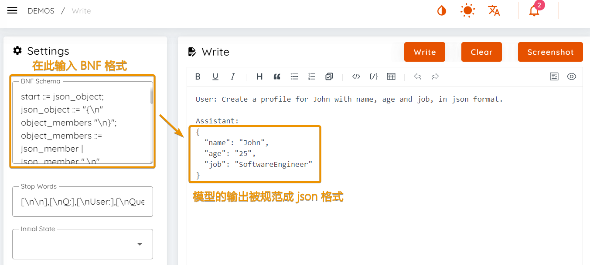

import { Callout } from 'nextra/components'
import { Steps } from 'nextra/components'

除了驱动 RWKV 模型进行对话、续写之外，Ai00 还有许多进阶功能，比如挂载 State 文件、LoRA 文件、BNF 等等。

你可以在 Ai00 发布新版本的时候回到本页面，以查看 Ai00 的最新功能。

## 视频教程

<div className="iframe-container">
 <iframe 
 src="https://player.bilibili.com/player.html?isOutside=true&aid=113718167865985&bvid=BV1vQCzYXEtb&cid=27541308447&poster=1&p=0&high_quality=1&autoplay=0"
 scrolling="no"
 frameBorder="0"
 allowfullscreen={true}
 sandbox="allow-top-navigation allow-same-origin allow-forms allow-scripts"
>
</iframe>
</div>
<Callout type="info" emoji="ℹ️">
高画质视频请[跳转到 B 站](https://www.bilibili.com/video/BV1vQCzYXEtb)观看。
</Callout>

## 挂载 State 文件 [版本 0.4.9]

挂载 State 文件可以强化模型在某一类任务的表现。以一个强化单轮问答 + emoji 的 State 为例，同样都是“东京到巴黎怎么走”这个问题，模型在挂载该 State 前后的回答画风完全不同：

**不挂载 State 文件：**


**挂载“强化单轮中文对话 + Emoji ”的 State 文件后：**


### 下载 State 文件

Ai00 Server 目前仅支持 `.state` 后缀的 State 文件，可以从 [HF 仓库](https://huggingface.co/shoumenchougou/RWKV-6-State-for-st/tree/main)下载 `.state` 文件。

如果你无法访问上面的网站，请访问 [HF 镜像站](https://hf-mirror.com/shoumenchougou/RWKV-6-State-for-st/tree/main)。

### 如何挂载 State 文件

在 `Config.toml` 配置文件中修改关于挂载 State 的参数：移除 `#` 注释符号，并修改对应的参数。

参考的配置信息如下：

``` bash copy
[[state]] # 是否挂载 state
# id = "fd7a60ed-7807-449f-8256-bccae3246222"   # 非开发环境一般不指定 UUID，可保留注释符
name = "x060-7B-Chinese"  # 为此 state 文件命名为“x060-7B-Chinese”
path = "rwkv-x060-chn_single_round_qa-7B-20240516-ctx2048.state" # state 文件的名称，存放在 `model` 文件夹
```

启动 RWKV 模型后，在 WebUI 界面的右上角可以切换 State 文件。

### 挂载 State 注意事项

<Callout type="warning" emoji="⚠️">
注意：挂载 state 文件时，必须使用与 State 文件参数一致的基底 RWKV 模型。
</Callout>

举个例子：这个 State 文件是基于 `RWKV-6-World-7B` 模型微调而来，那么你在 Ai00 中必须启动 `RWKV-6-World-7B` 模型，挂载的 State 文件才会生效。


<Callout type="info" emoji="ℹ️">
截至 Ai00 0.5.0 版本，支持在 WebUI-聊天模式右上方动态切换 State，但不支持同时挂载多个 State 。
</Callout>


---
## 挂载 LoRA 模型 [版本 0.4.9]

挂载 LoRA 模型和 State 的效果相似，也可以增强模型在某类任务上的表现。

### 如何挂载 LoRA 模型 ？

可以在 `Config.toml` 文件配置中修改挂载 LoRA 模型的参数：
``` bash copy
# [[lora]] # 是否默认启用 LoRA 
# alpha = 192 # alpha 值越大， LoRA 对模型输出的影响越大
# path = "assets/models/rwkv-x060-3b.lora" # LoRA 文件的路径
```
要启用 LoRA 挂载功能，请移除 `#` 注释符号，并修改对应的参数。参考如下：

``` bash copy
[[lora]] # 默认启用 LoRA 
# alpha = 192 # alpha 值越大， LoRA 对模型输出的影响越大
path = "assets/models/rwkv-x060-3b.lora" # LoRA 文件的路径
```

### 挂载 LoRA 文件的注意事项

<Callout type="warning" emoji="⚠️">
与挂载 state 相似，挂载 LoRA 文件时，必须使用与 LoRA 模型参数一致的基底 RWKV 模型。
</Callout>

举个例子：这个 LoRA 文件是基于 `RWKV-6-World-3B` 模型微调而来，那么你在 Ai00 中必须启动 `RWKV-6-World-3B` 模型，挂载的 LoRA 文件才会生效。


<Callout type="info" emoji="ℹ️">
截至 Ai00 0.5.0 版本，支持在 WebUI 中同时加载多个 LoRA ，但不支持在 WebUI 中动态切换 LoRA。

这意味着想要取消 LoRA ，必须重启 Ai00 服务。
</Callout>

---
## BNF (Backus-Naur Form) [版本 0.4.9]

BNF 可以强制模型以您想要的格式输出（例如，JSON、带有指定字段的 markdown）。

以下是一个 JSON 的 BNF 示例，其中包含字段 `name`、`age` 和 `job` ：

``` rust copy
start ::= json_object;
json_object ::= "{\n" object_members "\n}";
object_members ::= json_member | json_member ",\n" object_members;
json_member ::= "\t" json_key ": " json_value;
json_key ::= '"' "name" '"' | '"' "age" '"' | '"' "job" '"';
json_value ::= json_string | json_number;
json_string ::= '"'content'"';
content ::= #"\\w*";
json_number ::= positive_digit digits|'0';
digits ::= digit|digit digits;
digit ::= '0'|positive_digit;
positive_digit::="1"|"2"|"3"|"4"|"5"|"6"|"7"|"8"|"9";
```

使用此 prompt ，模型会以 JSON 格式输出文本：

```bash copy
User: Create a profile for John with name, age and job, in json format.

Assistant:
```



---
## 以 prefab 格式使用量化模型[版本 0.4.9]

<Callout type="info" emoji="ℹ️">
**什么是 prefab 格式？prefab 格式的 RWKV 模型有什么用？**

`.prefab` 预制件通常指游戏开发中使用的一种资源格式，允许开发者创建、保存和复用游戏对象（GameObject）及其组件的配置。

Ai00 支持导入和导出 `.prefab` 格式的 RWKV 模型，这种格式可以附带量化类型和量化层数，从而节省加载 RWKV 模型的在线量化时间。
</Callout>

在 Ai00 的 WebUI - Setting 界面，可以以 `.prefab` 格式导出当前加载的 RWKV 模型，并附带量化类型和量化层数。


在 `Config.toml` 配置文件中，可以通过修改模型路径参数使用 `.prefab` 格式的 RWKV 模型。

``` bash copy
# [[model]]
path = "rwkv-x060-3b.prefab" # 指定 prefab 格式的 RWKV 模型路径
```
<Callout type="info" emoji="ℹ️">
使用 `.prefab` 格式的 RWKV 模型时，无需指定量化类型和量化层数，模型会自动加载 prefab 文件中记录的量化信息。
</Callout>
