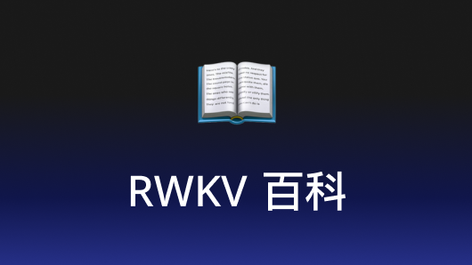
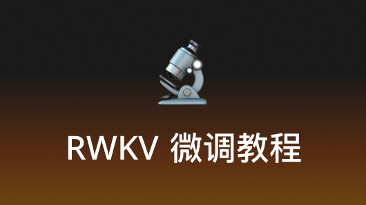
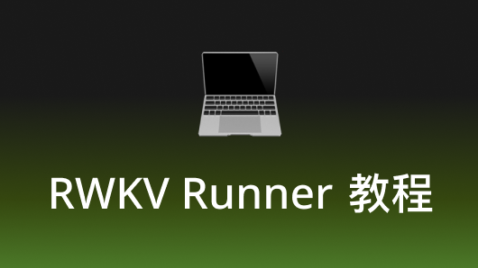
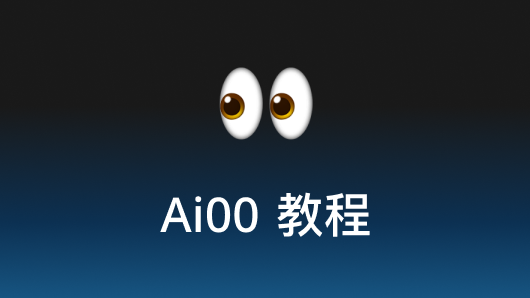

{/* ---
title: RWKV中文文档 - RWKV中国
description: 欢迎来到RWKV中文文档，这里提供RWKV百科、RWKV微调教程、RWKV Runner教程、Ai00 教程等内容。
keywords: RWKV文档,RWKV架构,RWKV中文文档,RWKV教程,RWKV官方文档
--- */}

import { Cards } from 'nextra/components'
import {CustomCard} from '/components/docs/card.tsx'

# RWKV中文文档
 
欢迎来到RWKV中文文档

## 你想查阅哪个文档?

开始查阅此文档，你需要选择一个类别：
{/* <Cards num={3}>

   <Cards.Card image arrow title="RWKV 百科" href="/RWKV-Wiki/Introduction">
    <></>
  </Cards.Card>

  <Cards.Card image arrow title="RWKV 提示词指南" href="/RWKV-Prompts/Chat-Prompts">
    <></>
  </Cards.Card>

  <Cards.Card image arrow title="RWKV 微调教程" href="/RWKV-Fine-Tuning/Introduction">
    <></>
  </Cards.Card>

  <Cards.Card image arrow title="RWKV Runner 教程" href="/RWKV-Runner/Introduction">
     <></>
  </Cards.Card>

   <Cards.Card image arrow title="Ai00 教程" href="/ai00/Introduction">
    <></>
  </Cards.Card>

</Cards> */}

<CustomCard />

## 遇到问题？

如果你遇到任何文档相关的问题，请在[这里](mailto:qilongluo@rwkvos.com)向我们反馈。